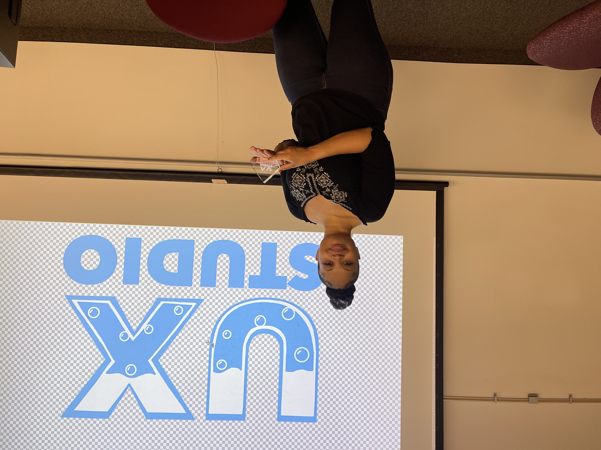

class: animated, fadeIn, middle
layout: true

```{r xaringan-themer, include=FALSE, warning=FALSE}
library(xaringanthemer)
style_solarized_light(
  text_font_google = google_font("Fira Sans", "300"),
  header_font_google = google_font("Fira Sans Condensed","600"),
  code_font_google = google_font("Fira Code")
)
```

```{r, load_refs, include=FALSE, cache=FALSE}
library(RefManageR)
BibOptions(check.entries = FALSE,
           bib.style = "authoryear",
           cite.style = "authoryear",
           style = "markdown",
           hyperlink = FALSE,
           dashed = FALSE)
myBib <- ReadBib("04studyUsers.bib")
```

<style type="text/css">

/* .remark-slide-content h1 {
  font-size: 600%;
}
*/

.remark-slide-number {
  position: inherit;
}

.remark-slide-number .progress-bar-container {
  position: absolute;
  bottom: 0;
  height: 4px;
  display: block;
  left: 0;
  right: 0;
}

.remark-slide-number .progress-bar {
  height: 100%;
  background-color: red;
}
.scale-30 img { width: 30%; height: 30%; }
.scale-40 img { width: 40%; height: 40%; }
.scale-45 img { width: 45%; height: 45%; }
.scale-50 img { width: 50%; height: 50%; }
.scale-60 img { width: 60%; height: 60%; }
.scale-70 img { width: 70%; height: 70%; }
.scale-75 img { width: 75%; height: 75%; }
.scale-80 img { width: 80%; height: 80%; }
.scale-85 img { width: 85%; height: 85%; }
.big { font-size: 200%; }
.bigger { font-size: 400%; }
.biggest { font-size: 600%; }
.footer {
  position: absolute;
  bottom: 10px;
}
</style>

```{r setup, include=FALSE}
options(htmltools.dir.version = FALSE)
knitr::opts_chunk$set(
  fig.width=9, fig.height=3.5, fig.retina=3,
  out.width = "100%",
  cache = FALSE,
  echo = TRUE,
  message = FALSE, 
  warning = FALSE,
  hiline = TRUE
)
xaringanExtra::use_tile_view()
xaringanExtra::use_extra_styles(
  hover_code_line = TRUE,         #<<
  mute_unhighlighted_code = TRUE  #<<
)
```
---
class: title-slide

# UXStudio 2022

### After Action Report

### slideshow by Mick McQuaid

.footer[This is a slideshow. Use the arrow keys to navigate.]

---
class: animated, fadeIn

.pull-left[
# Judges
]

.pull-right[
## Anne Haake
## Matt Huenerfauth
## Stephen Cady
## Melissa Warp (from CAD)
## clients from Rochester Childfirst Network
]

---

.pull-left[
# Participants
]

.pull-right[
### 11 Human Centered Computing
### 11 Human Computer Interaction
### 6 New Media Design
### 2 Visual Communication Design
### 1 Illustration
### 1 No major listed
]

---

.pull-left[
# Clients
]

.pull-right[
## Rochester Childfirst Network
## Rochester Greenovation
]

---

.pull-left[
# Behind the scenes
]

.pull-right[
### UXClub
### Isabella Totino
### Aaron Putterman
### Sucheer Rao
### Shwetha Subramanian
### Betty Hillman
### Yugo Iwamoto
]

---

.pull_left[
# Outcome last year
]

.pull_right[
.scale-50[]
]

---

.pull_left[
# Outcome last year
]

.pull_right[
.scale-50[]
]

---

.pull_left[
# Changes from last year
]

.pull_right[
### voluntary participation for hcc students (last year it was mandatory for hcc students)
### second week instead of first week
### full seven days instead of five
### two clients instead of three (and one didn't show up!)
### about half the participation rate among hcc students
### more participation from other majors
]

---

.pull-left[
# Commentary from Participants:
## What went well for you in UXStudio?
]

.pull-right[
- People actually wanted to be here this time, which was nice
- It was a fun learning experience
- It was a great exper
- It was a great experience working with a set of new team-members. It's nice to learn to develop good understanding of the different work procedures of new team-mates in just a week.
- I enjoyed working toward a common goal as a team
- Project selection favored for us. But there should be some fair way to select the project
- interesting experience
- Met me people, learned a lot about the ux process
- I think the experience I gained from being a part of a competition like this was great. I learnt about people handling and now know how to approach projects with unknown individuals as teammates in the future.
- Friday events was fun and interesting
- The process
- Working with people with varied backgrounds and skill level gave me the opportunity to learn about the UX design process.
]

---

.pull-left[
# Commentary from Participants:
## What didn't go well for you in UXStudio?
]

.pull-right[
- Week 2 isn’t any less hectic than Week 1, honestly
- I think it would have been good if it happened in person. I believe the outcome of the projects would also have been better if we worked in person.
- The majority of my group dropped out, and we were left with a duo instead of a team by the end
- Presentation time can be extended a little.
- pack of participation from team members
- It was hard to know exactly what we need to do
- didnt have time to meet team or to get comfortable quickly. All turn off camera so no "connecting" time
- Not able to give much time to UXStudio due to time crunch and load of multiple assignments from courses.
- Managing my regular coursework and with UX studio was a bit difficult for me.
- A lot. My team was unresponsive for the most part. Only one other person even contributed, but sadly this wasn't an area of expertise for them so they were only able to help a little. It was odd how everyone seemed to state that they were unwell or busy with assignments for the full course of the week.  I really did try so hard to get people to meet up and work on the project only for them to ignore my messages and contribute absolutely nothing. At the end, I tried to ensure it was atleast cohesive and complete for the presentation but it really did take a toll on my mental and physical health. To top it all off, our final presentation got ruined due to a teammate messing around with the project.  It's really upsetting that after all the effort I put in, that I had to resort to working on a version of the prototype I wasn't happy with. I know I've typed a lot at this point but I'm really so disappointed and mentally drained after going through this ordeal.
]

???

The one comment that got cut off is shown here in full:

A lot. My team was unresponsive for the most part. Only one other person even contributed, but sadly this wasn't an area of expertise for them so they were only able to help a little. It was odd how everyone seemed to state that they were unwell or busy with assignments for the full course of the week.  I really did try so hard to get people to meet up and work on the project only for them to ignore my messages and contribute absolutely nothing. At the end, I tried to ensure it was atleast cohesive and complete for the presentation but it really did take a toll on my mental and physical health. To top it all off, our final presentation got ruined due to a teammate messing around with the project.  It's really upsetting that after all the effort I put in, that I had to resort to working on a version of the prototype I wasn't happy with. I know I've typed a lot at this point but I'm really so disappointed and mentally drained after going through this ordeal.

---

.pull-left[
# Commentary from Participants:
## What should we keep the same about UXStudio next year?
]

.pull-right[
- Optional participation
- I think this was good. the process and work-flow given was great, it should be kept same.
- The entire structure was good and simple.
- I think apart from the suggestions I've mentioned in the next question, everything else was pretty good and could be kept the same for next year.
- timeline and event was good.  Great judges choices and the project
- Voluntary participation and opportunity for anyone to participate should be kept same for next year.
]

---

.pull-left[
# Commentary from Participants:
## What can we change to improve UXStudio next year?
]

.pull-right[
- Holding it over the summer - I just do not have the mental energy to burden myself with another project during the semester
- Making the teams more balanced. Some teams had more upperclassmen with more experience than others.
- If circumstances allow, try keeping it in person!
- In person meeting / presentation would be nice, but i understand the restrictions.
- Winners can be posted in LinkedIn so that they could get better recognition in their professional community.
- make the team more balanced
- More direction and help with the ux process
- more details on information of company's expection from both..  maybe outline for presentation to expect with timelime requirement.
- The time it is conducted like keeping it in Spring breaks
- The week was a bit exhaustive so I guess first week of the semester would be better as there is not much submissions or anything during that week which will give us time to work on the UX Studio for the entire week.
- I don't know if the others would agree to this, but I provide these suggestions solely based on my experience.  1) Students should be able to choose their own teammates  2) The jam should probably be over a weekend where everyone would be free. I do understand that the quality of the work wouldn't be as good as a 1 week jam but people usually tend to work closer to the deadline. Having a week long jam is like having 5 free days and 2 work days (I hope that makes sense).
]

???

The comment that got cut off is reprinted here in full:

I don't know if the others would agree to this, but I provide these suggestions solely based on my experience.  1) Students should be able to choose their own teammates  2) The jam should probably be over a weekend where everyone would be free. I do understand that the quality of the work wouldn't be as good as a 1 week jam but people usually tend to work closer to the deadline. Having a week long jam is like having 5 free days and 2 work days (I hope that makes sense).

---

.pull_left[
# Summary
]

.pull_right[
### We need to keep it voluntary, even though that decreases participation.
### We need to have a midweek communication beyond what we've had the first two years to ameliorate the dropout problem.
### There is no ideal week, but week one looks better than week two.
### If we keep it one week, Monday to Monday is better than Friday to Friday because it puts the weekend near the deadine.
]
