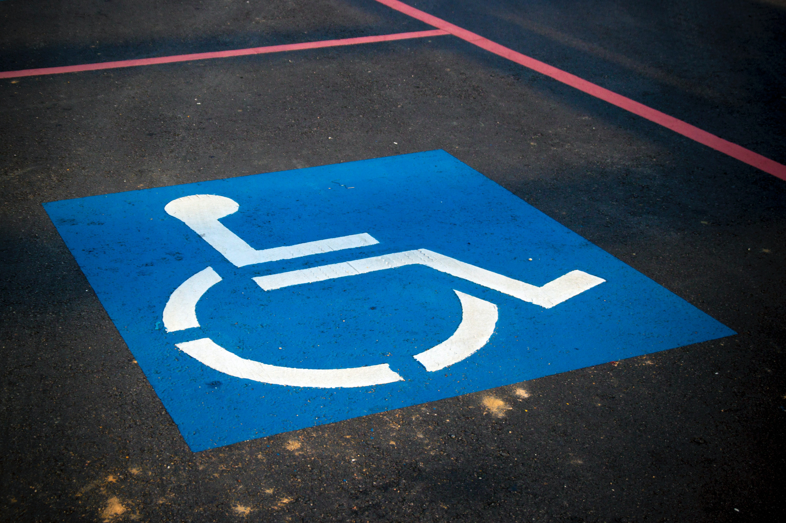
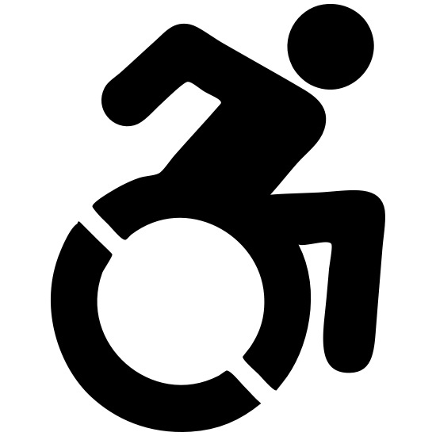
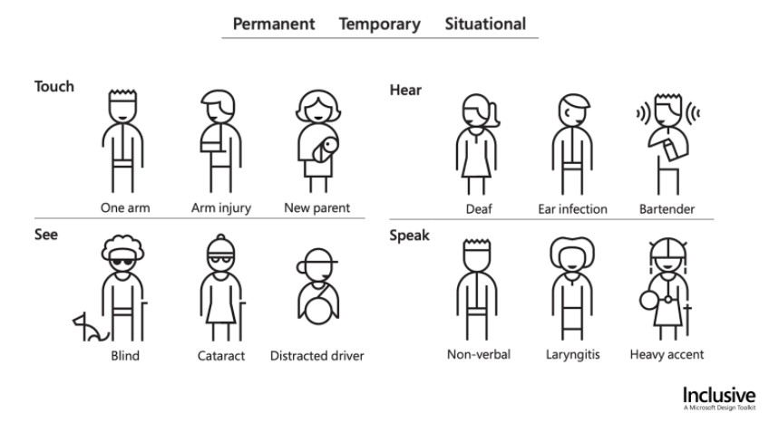
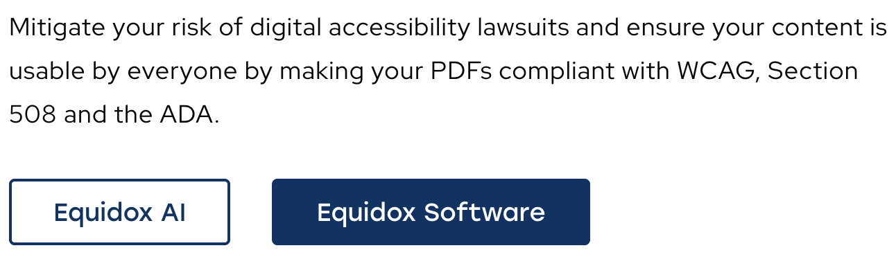

::: {.r-fit-text}
How to Start?
:::

::: {.notes}
- Should I introduce accessibility as if you know nohing about it?
- Should I remind you of the things you already know but are not in your mind's foreground?
- Should I talk about the state of the art in accessibility?
- On balance, I feel I should share thoughts on what you can and can't do right now to improve the accessibility of your designs
:::

# AI isn't helping (... much)

## Vendors tell you to kick back and let AI handle accessibility

::: {.incremental}
- Yet manual intervention is always required
- Even the best AI tools don't save you much time
- Yet your clients don't understand why you can't sprinkle [magic fairy dust]{.emph} on your designs to make them accessible
:::

## We're losing the struggle for accessibility
::: {.incremental}
- WCAG is too complicated to understand, let alone implement
- Clients have a compliance mindset, rather than an anti-ableist mindset
- Technological development outpaces design---new things appear at a faster rate than we can design for them
- Universal design is a double-edged sword
- Did I mention that AI isn't helping much?
:::

## What can you do?
:::{.incremental}
- You're a communicator above all
- You naturally spend more time communicating the design than you do designing
- Ask your client if they've ever had a conversation about disability with a disabled person
- (Have you?)
- Humanize the importance of accessibility
:::

## Examine yourself!
When you think of disability, do you see this or that?

::: {.container}
:::: {.col}
{fig-alt="A so-called handicapped parking space"}
::::
:::: {.col}
{fig-alt="A fast wheelchar icon"}
::::
:::

## Examine yourself!
When you see this, do you think of accessibility?

{fig-alt="Steps with no ramp" fig-align="center"}

## Examine yourself!
When you think of disability, do you think of a spectrum?

::: {.notes}
This picture of a spectrum of disabilities is not comprehensive. The neurodiversity community needs accessibility attention too.

Picture source: https://www.microsoft.com/design/inclusive/
:::

## Good news, everyone!

::: {.container}
:::: {.col}
{fig-alt="Professor Farnsworth mixing chemicals"}
::::
:::: {.col}
:::{.incremental}
- Title II of the ADA was released in April of this year (amended in June)
- Title II, Subpart H of the ADA means more clients
- Title II, Subpart H of the ADA means clients take accessibility more seriously and are more willing to budget for it
:::
::::
:::
::: {.notes}
Title II, Subpart H deals with web and mobile accessibility of public entities. Note that private enterprise is exempt, for now.

Also note that there are exceptions for preexisting content and content posted by noncontractual users, e.g., public comments posted on a policy webpage.
:::

## But the bad news is

::: {.container}
:::: {.col}

::::
:::: {.col}
:::{.incremental}
- Clients still have the compliance mindset, not the anti-ableist mindset
- You may need to communicate the difference to them
- You may need to recruit disabled people to design and test
- This is extra work on top of your current burdens
:::
::::
:::

# We're awakening to more challenges

## Neurodiverse communities
*genAI can be helpful!*

::: {.incremental}
- ADHD: use genAI for note taking, task management, budgeting and meal planning
- Dyslexia: use genAI as a writing support
- Autism: use genAI for communication, ensuring intended tone
- Biases are a problem
- Neurodiverse communities build their own inclusive tools
:::

# Takeaways

## How can you streamline your work?
::: {.incremental}
- If you must remediate pdfs, use CommonLook PDF in preference to Acrobat alone
- Think of accessibility as a design principle rather than a set of activities
- Teach developers with templates (borrowed from usability)
- Treat participants well in your user studies so they'll come back because disabled participants are hard to come by
:::

## Above all, talk about accessibility
::: {.incremental}
- to anyone who will listen
- remember the rarity of conversations with the disabled
- share shortcuts
- recruit disabled designers
- keep in mind that accessibility improves usability!
:::

# For more
- visit the folder where this slideshow is stored for introductory slides about accessibility
  - use the *s* key on your keyboard for speaker's notes and attributions
- attend ASSETS or review the work there
- have informal conversations with academics

# Please contact me!

email [mcq@utexas.edu](mailto:mcq@utexas.edu) to share further ideas and questions

visit [https://mickmcquaid.com](https://mickmcquaid.com) and click on Accessibility Slides

Thanks for listening!

---

::: {.r-fit-text}
END
:::

# Colophon

This slideshow was produced using `quarto`

Fonts are *League Gothic* and *Lato*

