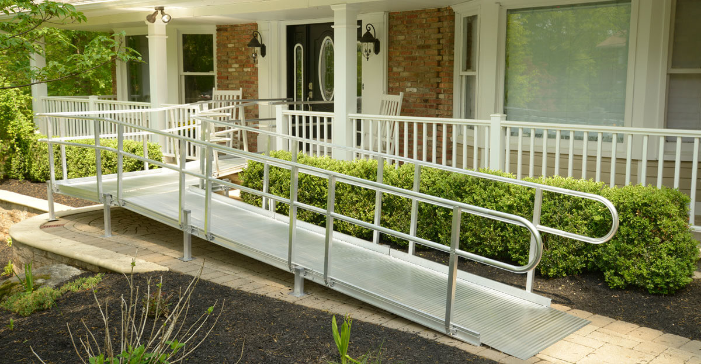
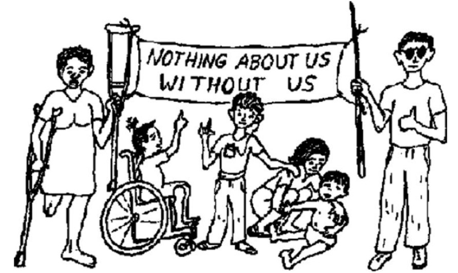

# Let's explore four things

- physical and sensory disabilities
- cognitive disabilities
- disability concepts
- disability experiences

But first, why do we care about these four things?

::: notes

- physical and sensory disabilities, including blind and low vision, deaf and hard of hearing, motor impairments, speech impairments, and other physical disabilities
- cognitive disabilities, including memory, problem solving, attention, thinking, reading, linguistic and verbal comprehension, math comprehension, visual comprehension, and digital affinity
- disability concepts, including temporary, permanent, and situational limitations, and the spectrum of ability
- disability experiences, including the need to watch videos and hold meetings with self-advocates and family members, videos or meetings with representatives of advocacy organizations, and videos or meetings with engineers and scientists who have worked on accessibility

Why do we care about these things? If we're practicing user-centered design, we need to understand something about our users. Of course, it's easier to understand your users if you understand yourself and understand the way you look at things outside of yourself.
:::

#

*How do we think of disability?*

{ width=60\% }

- Do we think of situations?
- Do we think of medicine?
- Do we think of social constructs?

::: notes

How do we think of disability? Do we think of it as arising in situations? For example, the tunnel illustrates a situation in which some people can use this passageway,  while others cannot.

Do we think of what is popularly called the *medical model* of disability, where disability is something to be cured? In this case, we wouldn't dream of altering the tunnel, instead dreaming of "curing" people who can't use it.

Or do we think of disability as a social construct, a mismatch between what society provides and what some people can use? This latter interpretation of disability is encouraged by the community of disability activists (or should I say advocates), whose work forms most of the basis for this lecture.

Image by Robin Schreiner on
[Unsplash](https://unsplash.com/photos/7y4858E8PfA?utm_source=unsplash&utm_medium=referral&utm_content=creditShareLink)

:::

#

*What viewpoint do we bring?*

  

::: notes

If we're a wheelchair user, this might be a very appealing sign. On the other hand, I've seen non-wheelchair users express resentment over these spaces. I've even seen a non-disabled person parking in one and a crowd gather to prevent him from leaving until the police arrived to give him a ticket.

Image by AbsolutVision on [Unsplash](https://unsplash.com/photos/7y4858E8PfA?utm_source=unsplash&utm_medium=referral&utm_content=creditShareLink)

:::

#

*Physical and sensory disabilities*

::: notes

This image shows an ATM keypad with braille on each key. This is a commonly provided accommodation since the passing of the Americans with Disabilities Act in 1990.

Physical and sensory disabilities include blind and low vision, deaf and hard of hearing, motor impairments, speech impairments, and other physical disabilities. Pictured is a Braille pinpad, allowing a blind user who understands Braile to enter pin number in an ATM. Braille literacy has declined in the US, by the way. In 1960, 50% of legally blind, school-age children in the US could read Braille. In 2015, this number may have been 8.6%, according to the annual report of the American Printing House for the Blind. Wikipedia's article on Braille reports that the reasons are varied, including constrained school budgets, technological advances, and different philosophical positions on educating blind children.

Image Source: [https://commons.wikimedia.org/wiki/File:ATM_keypad_with_braille.jpg](https://commons.wikimedia.org/wiki/File:ATM_keypad_with_braille.jpg)

:::

#

*Motor impairments*

::: notes

Motor impairments invite add-on assistive measures, such as this wheelchair ramp whose style is so forcibly at odds with that of the building to which it provides access.

Image source: [https://home.mobilityworks.com/blog/what-type-of-modular-wheelchair-ramp-is-right-for-you](/https://home.mobilityworks.com/blog/what-type-of-modular-wheelchair-ramp-is-right-for-you/)

:::

#

*Cognitive disabilities*

such as those giving rise to some Special Olympics events, some of whose participants are pictured at right

::: notes

Cognitive disabilities include memory, problem solving, attention, thinking, reading, linguistic and verbal comprehension, math comprehension, visual comprehension, and digital affinity. Digital affinity is a new concept championed by Gregg Vanderheiden at the University of Maryland. Briefly, it posits that some people lack talent for working with digital artifacts and that these people are severely disadvantaged in a world requiring digital interactions.

Image source: [https://dotorg.brightspotcdn.com/e6/03/9312b9e844d19ee8d24ac9a002c3/what-is-intellectual-disability.jpg](https://dotorg.brightspotcdn.com/e6/03/9312b9e844d19ee8d24ac9a002c3/what-is-intellectual-disability.jpg)

The Special Olympics was created in 1968 to provide sports and community to people with intellectual and physical disabilities. It is a separate organization from the Paralympics, which is held in tandem with the Olympics. 

:::

#

*Spectrum of abilities*

::: notes

Disability concepts include temporary, permanent, and situational limitations, and the spectrum of ability. Here we see different abilities concerning touching, hearing, seeing, and speaking.

Image source: [https://www.microsoft.com/design/inclusive/](https://www.microsoft.com/design/inclusive/)

:::

#

Disability experiences

::: notes

Disability experiences include the need to watch videos and hold meetings with self-advocates and family members, videos or meetings with representatives of advocacy organizations, and videos or meetings with engineers and scientists who have worked on accessibility.

Image source: [https://design-justice.pubpub.org/pub/cfohnud7/release/2](https://design-justice.pubpub.org/pub/cfohnud7/release/2)

We need to educate disabled designers, so that your design team includes them. The next best thing is for designers to communicate with disabled people and people who have thought a lot about disability. There's a spectrum of communication ranging from reading to video to direct experience, and a spectrum of people who have thought about disability in different professions.

"Nothing About Us Without Us" is a commonly used phrase by disability advocates. It was first popularized in the 1990s during the disability rights movement. It was created to explain that part of disability rights is including disabled people in legislature, media, and more, to provide more representation for the disabled community.

:::

# END {.r-fit-text}

# COLOPHON

This slideshow was produced with reveal.js using the moon theme.

pandoc was used to convert the source markdown to html.

The source can be found at the same URL as the presentation by substituting `index.md` for `index.html`
