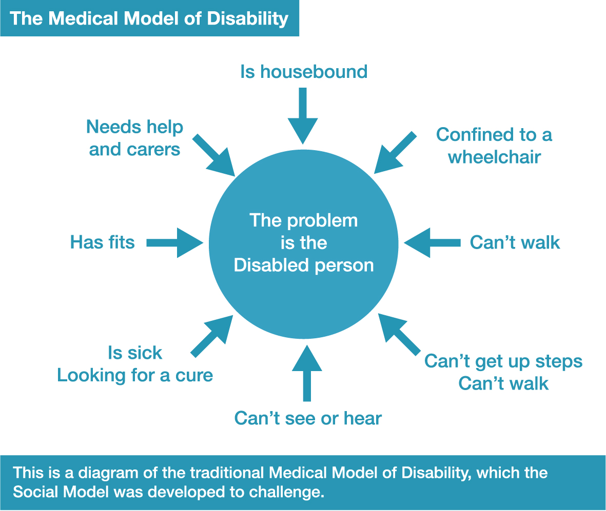
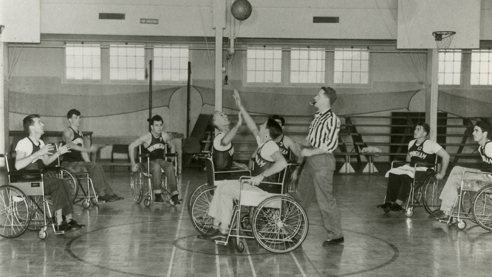
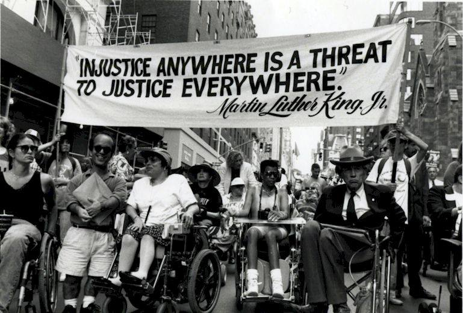
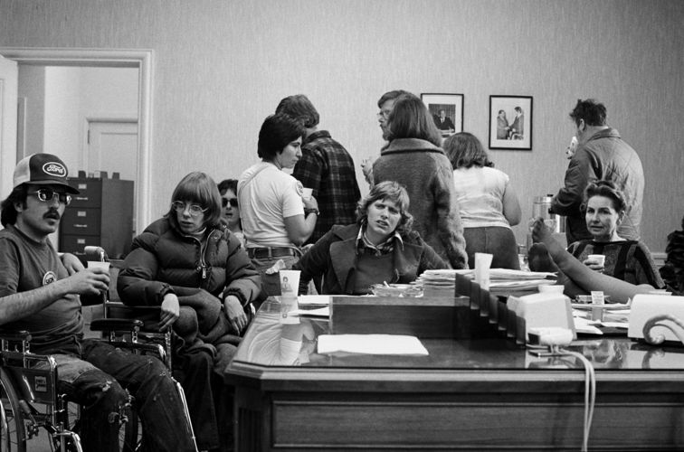
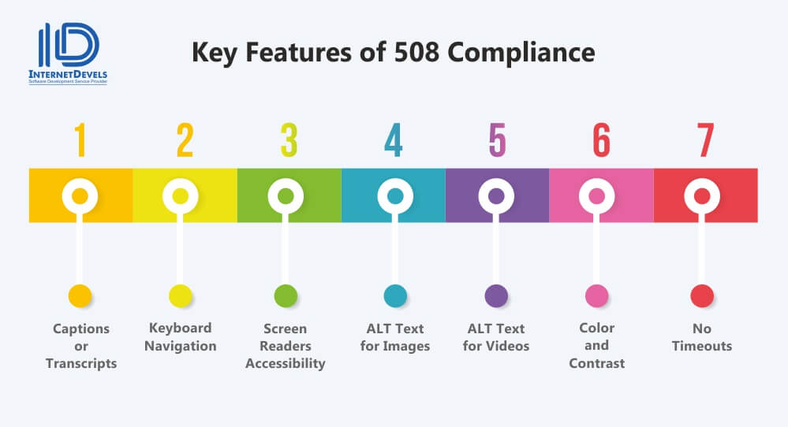
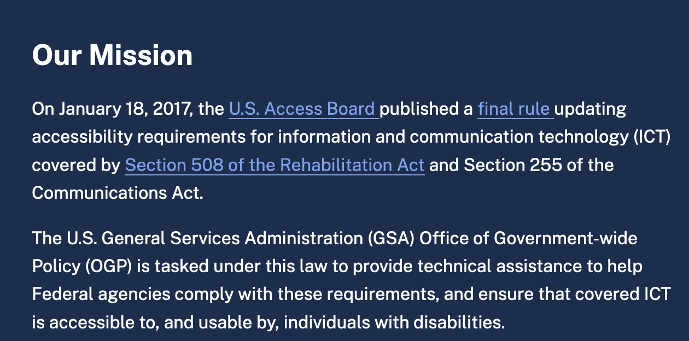
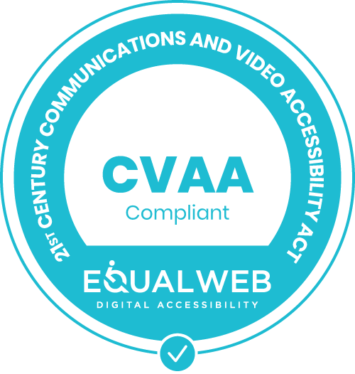

```{r, child="../rmdBoilerplate.Rmd"}
```

# Social Context and Historical Perspective

### identity and cultural norms; regulatory requirements and standards

### slideshow by Mick McQuaid

.footer[This is a slideshow. Use the arrow keys to navigate.]

---
class: animated, fadeIn

# Identity and Cultural Norms

---

.center[.scale-60[]]

???

Source: [https://www.inclusionlondon.org.uk/wp-content/uploads/2015/05/social-model-graphic_expanded-02.jpg](https://www.inclusionlondon.org.uk/wp-content/uploads/2015/05/social-model-graphic_expanded-02.jpg)

---

.center[.scale-60[ ]]

???


Source: [https://www.inclusionlondon.org.uk/wp-content/uploads/2015/05/social-model-graphic_expanded-01.jpg](https://www.inclusionlondon.org.uk/wp-content/uploads/2015/05/social-model-graphic_expanded-01.jpg)

---

.pull-left[

]

.pull-right[
## terminology

Thirty years ago, I was asked to make a logo for a group of lesbians who wanted to be called "Differently Pleasured" in response to some disabled activist women who called themselves "Differently Abled". Was it a joke? Were they trying to offend the others? I'll never know the point for certain but it raises an issue about speech and who gets to name themselves what.
]

---

# Establishment of Regulatory Requirements and Norms

---

.pull-left[

]

.pull-right[
## The role of WWII

Americans may have first awakened to their responsibilities for disabled people with the return of disabled veterans from WWII. Pictured here is one such veteran, Harold Russell, who starred in *The Best Years of Our Lives* (1946).
]

???

Harold Russell is pictured with Cathy O'Donnell in a still displayed at the IMDB. Russell portrayed a disabled serviceman struggling to reintegrate into American life in the celebrated war movie, *The Best Years of Our Lives* (1946).

---

.pull-left[

]

.pull-right[
### By 1947, President Truman established a committee to promote employment of the disabled
### Here is a 1951 poster from their annual campaign
]

???

This poster was circulated during "Employ the Handicapped" week in 1951. It was created by what is now called the President's Committee on Employment of People with Disabilities, formed by President Truman in 1947. The Smithsonian exhibits this poster, referring to the man's right hand as a "split-hook hand."

Source: [https://www.vocationaltraininghq.com/vocational-rehabilitation](/https://www.vocationaltraininghq.com/vocational-rehabilitation/)

---

.pull-left[

]

.pull-right[
An early wheelchair basketball game typifies activities once denied to persons with disabilities
]

???

Source: [https://img.tpt.cloud/nextavenue/uploads/2020/11/wheelchairbasketball.inside.1280x720.jpg](https://img.tpt.cloud/nextavenue/uploads/2020/11/wheelchairbasketball.inside.1280x720.jpg)

---

## Accessibility as a civil right

---

.pull-left[

]

.pull-right[
### During the civil rights movement of the 1960s, disabled people began to organize
### In 1973, Section 504 of the Rehabilitation Act was passed
]

???

... to provide rights to persons with disabilities in HUD-funded programs and activities. HUD is the US Department of Housing and Urban Development.

Picture Source: [https://www.zinnedproject.org/wp-content/uploads/2015/11/march_for_disabilityinclusion.jp](ghttps://www.zinnedproject.org/wp-content/uploads/2015/11/march_for_disabilityinclusion.jpg)

---

.pull-left[

]

.pull-right[
Sit-ins were one civil disobedience strategy used to secure Section 504 rights.
]

???

The illustration is a sit-in in the Federal Building in San Francisco in the early 1970s.

Source: [https://www.foundsf.org/images/thumb/5/54/Dailylife_by_HoiLynn_D%27Lil.jpg/756px-Dailylife_by_HoiLynn_D%27Lil.jpg](https://www.foundsf.org/images/thumb/5/54/Dailylife_by_HoiLynn_D%27Lil.jpg/756px-Dailylife_by_HoiLynn_D%27Lil.jpg)

---

.pull-left[

]

.pull-right[
Activist Judy Heumann speaking
]

???

Source: [https://static01.nyt.com/images/2020/03/26/arts/25cripcamp-qa1/25cripcamp-qa1-mediumSquareAt3X-v2.jpg](https://static01.nyt.com/images/2020/03/26/arts/25cripcamp-qa1/25cripcamp-qa1-mediumSquareAt3X-v2.jpg)

---

.center[.scale-70[]]

???

Source: [https://www.understood.org/articles/en/section-504-fact-sheet?utm_source=pinterest&utm_medium=social&utm_campaign=understoodorg](https://www.understood.org/articles/en/section-504-fact-sheet?utm_source=pinterest&utm_medium=social&utm_campaign=understoodorg)

---

.pull-left[

]

.pull-right[
Protesters crawling up the steps to the US Capitol
]

???

Source: [https://newmobility.com/wp-content/uploads/2021/06/Crawl_th-768x616.jpg](https://newmobility.com/wp-content/uploads/2021/06/Crawl_th-768x616.jpg)

---

.pull-left[

]

.pull-right[
Protesters crawling up the steps to the US Capitol
]

???

Source: [https://s.abcnews.com/images/Politics/disability-ap-er-200304_hpMain_2_1x1_992.jpg](https://s.abcnews.com/images/Politics/disability-ap-er-200304_hpMain_2_1x1_992.jpg)

---

ADA (The Americans with Disabilities Act) History and Basic Rules

---

.pull-left[
.scale-125[]
]

.pull-right[
The ADA logo
]

---

.center[.scale-125[]]

???

Source: [https://www.advocator.com/blog/the-americans-with-disabilities-act-turns-30/](https://www.advocator.com/blog/the-americans-with-disabilities-act-turns-30/)

---

.center[.scale-125[]]

---


???

Source: [https://www.w3.org/TR/WCAG21/](https://www.w3.org/TR/WCAG21/)

---

.pull-left[
# WCAG
]
.pull-right[
Web Content Accessibility Guidelines (WCAG) 2 is developed through the W3C (World Wide Web Consortium) process in cooperation with individuals and organizations around the world, with a goal of providing a single shared standard for web content accessibility that meets the needs of individuals, organizations, and governments internationally.

The WCAG documents explain how to make web content more accessible to people with disabilities. Web “content” generally refers to the information in a web page or web application, including:

- information such as text, images, and sounds
- or markup that defines structure, presentation, etc.
]

???

Source: [https://www.w3.org/WAI/standards-guidelines/wcag/](https://www.w3.org/WAI/standards-guidelines/wcag/)

---

.pull-left[
# Who WCAG is for
]
.pull-right[
WCAG is primarily intended for:

- content developers (page authors, site designers, etc.)
- authoring tool developers
- accessibility evaluation tool developers
- who want or need a standard for web accessibility, including for mobile accessibility
]

???

Source: [https://www.w3.org/WAI/standards-guidelines/wcag/](https://www.w3.org/WAI/standards-guidelines/wcag/)

---

.pull-left[
# What is *in* WCAG
]
.pull-right[
The WCAG standards have 12-13 guidelines. The guidelines are organized under 4 principles:

- perceivable,
- operable,
- understandable, and
- robust.

For each guideline, there are testable success criteria. The success criteria are at three levels: A, AA, and AAA.

The success criteria are what determine “conformance” to WCAG. That is, in order to meet WCAG, the content needs to meet the success criteria. Details are in the Conformance section of WCAG.
]

???

Source: [https://www.w3.org/WAI/standards-guidelines/wcag/](https://www.w3.org/WAI/standards-guidelines/wcag/)

---

.pull-left[
# Who is in charge of WCAG
]
.pull-right[
The WCAG technical documents are developed by the Accessibility Guidelines Working Group (AG WG) (formerly the Web Content Accessibility Guidelines Working Group), which is part of the World Wide Web Consortium (W3C) Web Accessibility Initiative (WAI).

WAI updates Techniques for WCAG 2 and Understanding WCAG 2 periodically. We welcome comments and submission of new techniques.

Opportunities for contributing to WCAG and other WAI work are introduced in Participating in WAI.
]

???

Source: [https://www.w3.org/WAI/standards-guidelines/wcag/](https://www.w3.org/WAI/standards-guidelines/wcag/)

---

.pull-left[
# Can you give an example?
]
.pull-right[
__Success Criterion 1.2.4 Captions (Live)__

(Level AA)

Captions are provided for all live audio content in synchronized media.
]

???

Sources:

[https://www.w3.org/TR/WCAG21/#captions-live](https://www.w3.org/TR/WCAG21/#captions-live)

captions: [https://www.w3.org/TR/WCAG21/#dfn-captions](https://www.w3.org/TR/WCAG21/#dfn-captions)

live: [https://www.w3.org/TR/WCAG21/#dfn-live](https://www.w3.org/TR/WCAG21/#dfn-live)

audio: [https://www.w3.org/TR/WCAG21/#dfn-audio](https://www.w3.org/TR/WCAG21/#dfn-audio)

synchronized media: [https://www.w3.org/TR/WCAG21/#dfn-synchronized-media](https://www.w3.org/TR/WCAG21/#dfn-synchronized-media)

---

.pull-left[
# Problems?
]
.pull-right[
- Complexity; time required to deliver results
- 38 guidelines to meet AA standard
- difficult to sue over it (but Winn-Dixie was successfully sued)
- standard keeps changing&mdash;requires continuing education
- practical difficulties, e.g., can't easily provide captions in Hebrew
- companies make exaggerated claims that they can easily automate the process for you
]

---

.center[]

---

.center[]

---

.center[]

---



???

Source: https://www.section508.gov

---

.center[]

???

Source: [https://vitac.com/looking-back-the-21st-century-communications-and-video-accessibility-act-turns-10/](https://vitac.com/looking-back-the-21st-century-communications-and-video-accessibility-act-turns-10/)

---

.pull-left[
# One company's CVAA compliance logo
]
.pull-right[

]

???

Source: [https://www.equalweb.com/html5/?_id=10415&did=1116&G=10409&SM=10415](https://www.equalweb.com/html5/?_id=10415&did=1116&G=10409&SM=10415)

---

.pull-left[
# CVAA Titles
]
.pull-right[
The Twenty-First Century Communications and Video Accessibility Act of 2010 (CVAA) updates federal communications law to increase the access of persons with disabilities to modern communications.

It has two Titles:

- Title 1, covering communication access, increases the scope of communications services that must be made accessible to users with disabilities
- Title 2, covering video programming, requires that video programming, services, and equipment, be made accessible to users with disabilities

It is framed as a technical law, as opposed to earlier acts that were framed as civil rights law. Hence, it tries to future-proof itself against new technologies.
]

???

Source: [https://www.equalweb.com/html5/?_id=10415&did=1116&G=10409&SM=10415](https://www.equalweb.com/html5/?_id=10415&did=1116&G=10409&SM=10415)

---

.pull-left[
## Can you give an example?
]
.pull-right[
From Section 102.(b):

Section 710(c) of the Communica- tions Act of 1934 (47 U.S.C. 610(c)) is amended by adding at the end the following: ‘‘A telephone or other customer premises equipment that is compliant with relevant technical standards developed through a public participation process and in consultation with interested consumer stakeholders (designated by the Commis- sion for the purposes of this section) will be considered hearing aid compatible for purposes of this section, until such time as the Commission may determine otherwise. The Commission shall consult with the public, including people with hearing loss, in establishing or approving such technical standards. The Commis- sion may delegate this authority to an employee pursuant to section 5(c). The Commission shall remain the final arbiter as to whether the standards meet the requirements of this section.’’.
]

???

Translation: A telephone is hearing-aid compatible until we say it is not.

Source: The actual CVAA, downloaded from the FCC

---

.scale-70[.center[]]

---


???

Source:
[https://www.autismeurope.org/what-we-do/areas-of-action/un-crpd/](https://www.autismeurope.org/what-we-do/areas-of-action/un-crpd/)

---

.pull-left[
# What is UNCRPD?
]
.pull-right[
The UN Convention on the Rights of People with Disabilities (UNCRPD) is an international human rights treaty that reaffirms that all persons with disabilities must enjoy all human rights and fundamental freedoms.

Its articles clarify that all disabled persons have the right to participate in civil, political, economic, social and cultural life of the community just as anyone else.

The Convention clearly stipulates what public and private authorities must do to ensure and promote the full enjoyment of these rights by all disabled people.
]

???

Source:
[https://www.autismeurope.org/what-we-do/areas-of-action/un-crpd/](https://www.autismeurope.org/what-we-do/areas-of-action/un-crpd/)

---

Not all frameworks are in law. For example, `r Citet(myBib, "Dogucu2021")` is a voluntary framework for accessibility in data science.

---

```{r, child="../endWrefs+colophon.Rmd"}
```

