# Most technologies ...

and interaction models require accessibility design thinking

Usability + Accessibility = user delight

::: notes

What's the difference between usability and accessibility?

It may be the difference between whether someone can use it (accessibility) vs how well someone can use it (usability)

:::

# GUIs
- Facilitator: Screen reader support
- Barrier: No screen reader support

---

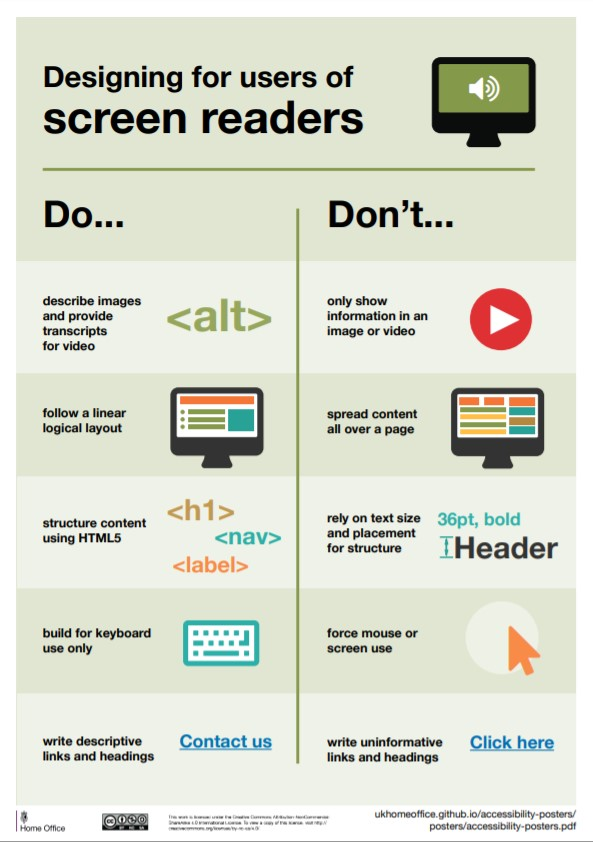{ width=50\% }

::: notes

Source: [https://accessibility.blog.gov.uk/2016/09/02/dos-and-donts-on-designing-for-accessibility/](https://accessibility.blog.gov.uk/2016/09/02/dos-and-donts-on-designing-for-accessibility/)

:::

---

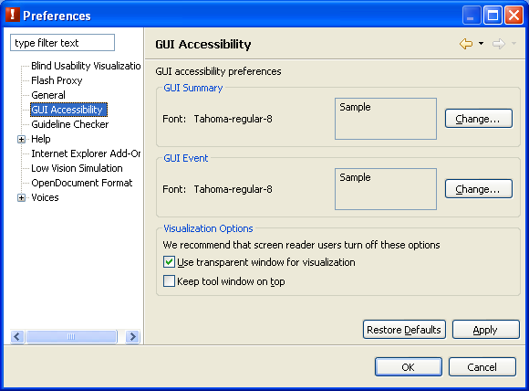

::: notes

Source: [https://www.eclipse.org/actf/docs/users/aDesigner/docs/images/gui/guiSettings.png](https://www.eclipse.org/actf/docs/users/aDesigner/docs/images/gui/guiSettings.png)

:::

# Touch/Tactile Screens
- Facilitator: Big touch targets
- Barrier: Small touch targets

---

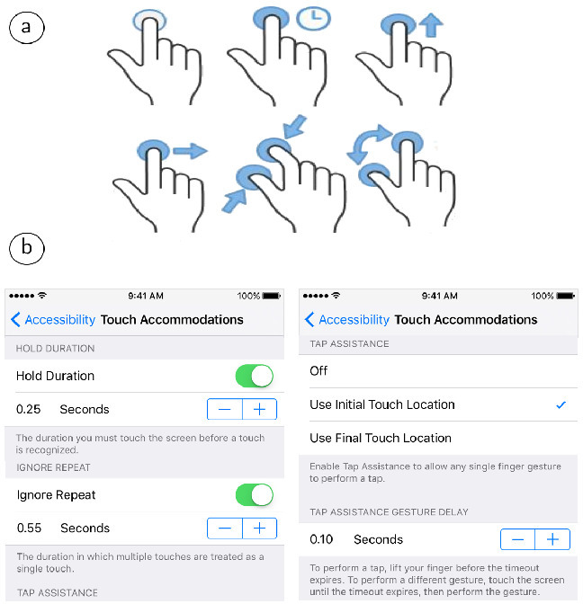

::: notes

Source: [https://dl.acm.org/cms/attachment/96de0755-64cc-446d-9391-674e737e6c3f/chi2019-683-fig1.jpg](https://dl.acm.org/cms/attachment/96de0755-64cc-446d-9391-674e737e6c3f/chi2019-683-fig1.jpg)

:::

# Gesture Input
- Facilitator: Intuitive interaction model for performing a task (pinch to zoom)
- Barrier: No alternative input mechanism for people with limited dexterity

---

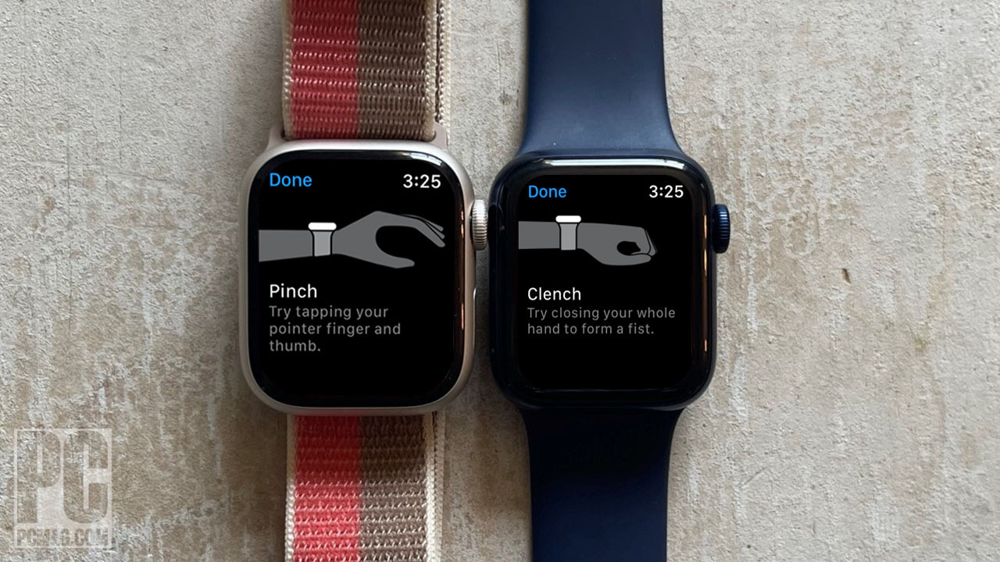

::: notes

Source: [https://www.pcmag.com/how-to/control-apple-watch-with-hand-gestures](https://www.pcmag.com/how-to/control-apple-watch-with-hand-gestures)

:::

# Video & Rich Media
- Facilitator: Rich storytelling medium
- Barrier: No closed captions

# Speech to Text / Speech Commands
- Facilitator: Ease of text input and hands-free interaction
- Barrier: Need alternative interaction model for speech and audio I/O

---

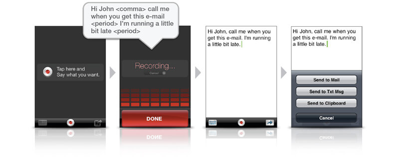

::: notes

Source: [https://singularityhub.com/wp-content/uploads/2009/12/dragon-dictation.jpg](https://singularityhub.com/wp-content/uploads/2009/12/dragon-dictation.jpg)

:::

# Help & Support Considerations
- Providing accessible instructions and support
- Training on AT and accessibility features

# Experiences
- Testimonials from people with disabilities
- Simulation tools/techniques for design and testing

---

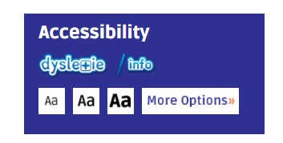{ width=80\% }

::: notes

Source: [https://autisticadvocacy.org/](https://autisticadvocacy.org/)

:::

---

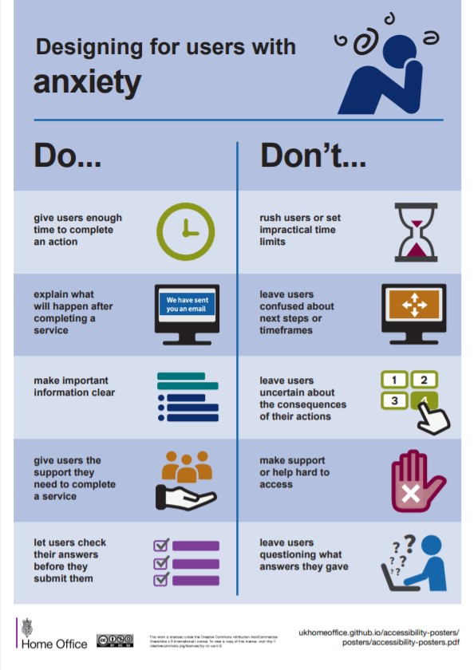{ width=50\% }

::: notes

This is the first in a series of posters produced by the government of the UK, obviously not meant to show on screen, but still very useful.

Notice that these are things that everyone wants. It's often the case that designing for accessibility turns out to be designing for everyone.

Source: [https://accessibility.blog.gov.uk/2016/09/02/dos-and-donts-on-designing-for-accessibility/](https://accessibility.blog.gov.uk/2016/09/02/dos-and-donts-on-designing-for-accessibility/)

:::

---

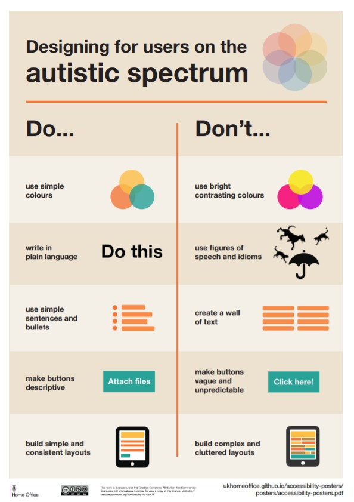{ width=50\% }

::: notes

Source: [https://accessibility.blog.gov.uk/2016/09/02/dos-and-donts-on-designing-for-accessibility/](https://accessibility.blog.gov.uk/2016/09/02/dos-and-donts-on-designing-for-accessibility/)

:::

---

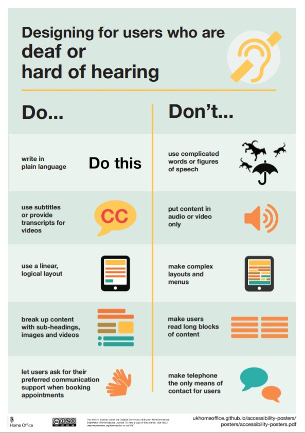{ width=50\% }

::: notes

Source: [https://accessibility.blog.gov.uk/2016/09/02/dos-and-donts-on-designing-for-accessibility/](https://accessibility.blog.gov.uk/2016/09/02/dos-and-donts-on-designing-for-accessibility/)

:::

---

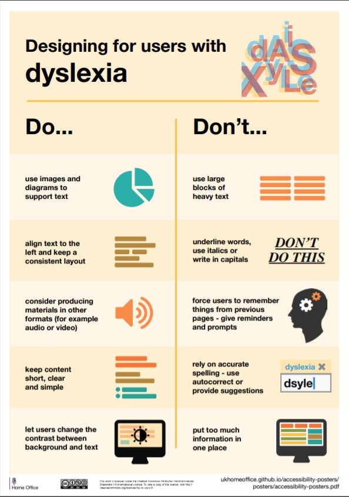{ width=50\% }

::: notes

Source: [https://accessibility.blog.gov.uk/2016/09/02/dos-and-donts-on-designing-for-accessibility/](https://accessibility.blog.gov.uk/2016/09/02/dos-and-donts-on-designing-for-accessibility/)

:::

---

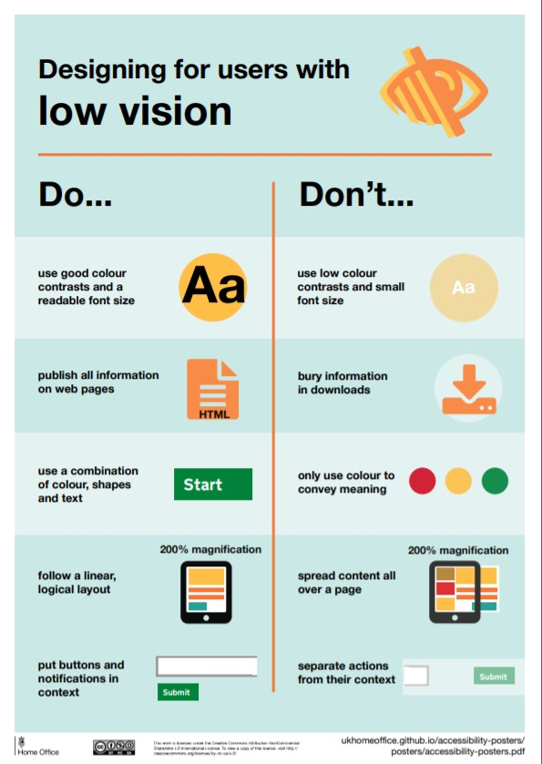{ width=50\% }

::: notes

Source: [https://accessibility.blog.gov.uk/2016/09/02/dos-and-donts-on-designing-for-accessibility/](https://accessibility.blog.gov.uk/2016/09/02/dos-and-donts-on-designing-for-accessibility/)

:::

---

{ width=50\% }

::: notes

Source: [https://accessibility.blog.gov.uk/2016/09/02/dos-and-donts-on-designing-for-accessibility/](https://accessibility.blog.gov.uk/2016/09/02/dos-and-donts-on-designing-for-accessibility/)

:::

---

# END {.r-fit-text}

---

# Colophon

This slideshow was produced using `pandoc` and `revealjs`

