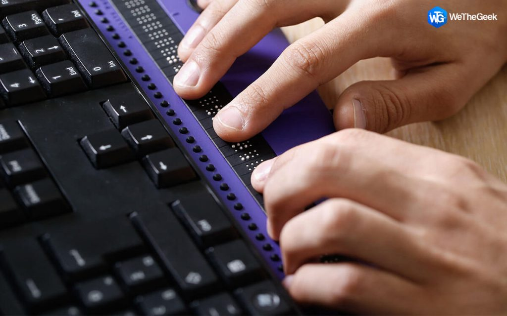
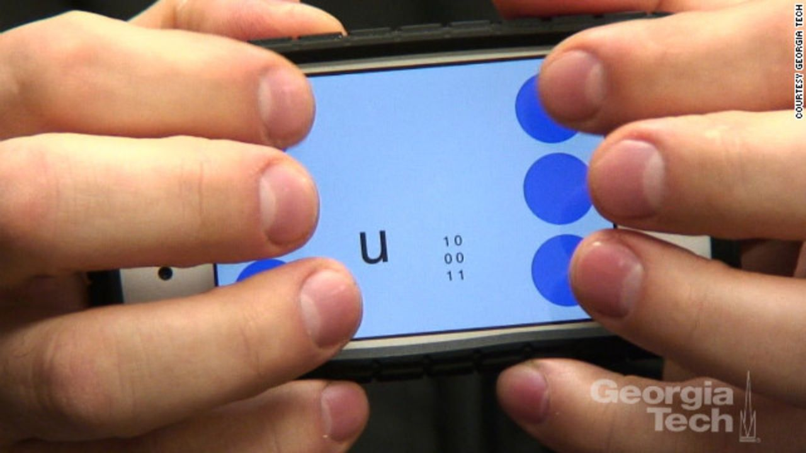
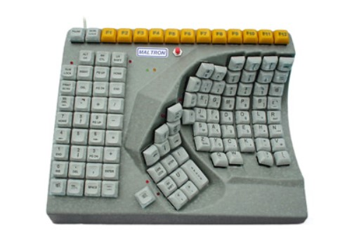

# Types of assistive technology
- screen readers (e.g., JAWS, VoiceOver)
- captioning
- switches
- magnifiers
- braille devices
- ... and more!

# Once only in specialty devices, now ...
- integrated into TVs
- integraded into PCs
- integrated into smartphones
- integrated into tablets
- integrated into OTT (set top) boxes
- ... and more!

# Assistive technology is used by people without disabilities
- autonomous cars
- speech recognition
- language translation tools
- ... and more!

# Pause to demo screen reader

::: notes

My class meets in a macOS lab, so screen readers are built into the machines. This may not be possible if you are on Windows. One alternative is, if the students have iPhones, to use VoiceOver there. Another alternative is to simulate a screen reader by having students pair up with one at the keyboard and one acting as the screen reader.

:::

# Examples

# Adaptive Driving

::: notes

Source: [https://newmobility.com/rocking-my-accessible-minivan/](https://newmobility.com/rocking-my-accessible-minivan/)

:::

# Braille Keyboard

::: notes

Source: [https://wethegeek.com/screen-reader-software-for-windows/](https://wethegeek.com/screen-reader-software-for-windows/)

:::

# Braille iPhone

::: notes

Source: [https://www.cnn.com/2012/02/20/tech/can-braille-be-faster-than-qwerty-app-developer-thinks-so/index.html](https://www.cnn.com/2012/02/20/tech/can-braille-be-faster-than-qwerty-app-developer-thinks-so/index.html)

:::

# Hands Free Mouse

::: notes

Source: [https://www.atandme.com/?p=2326](https://www.atandme.com/?p=2326)

:::

# One Hand Keyboard

::: notes

Source: [https://www.boundlessat.com/Keyboards-Mice/One-Hand-Keyboards/Maltron-Single-Hand-Keyboard](https://www.boundlessat.com/Keyboards-Mice/One-Hand-Keyboards/Maltron-Single-Hand-Keyboard)

:::

# Xbox Controller

::: notes

Source: [https://www.yourcpf.org/cpproduct/xbox-adaptive-controller/](https://www.yourcpf.org/cpproduct/xbox-adaptive-controller/)

:::

# Zoom

::: notes

Source: [https://answers.uillinois.edu/illinois/page.php?id=105310](https://answers.uillinois.edu/illinois/page.php?id=105310)

:::

# END {.r-fit-text}

# Colophon

This slideshow was produced using `pandoc` and `revealjs`

