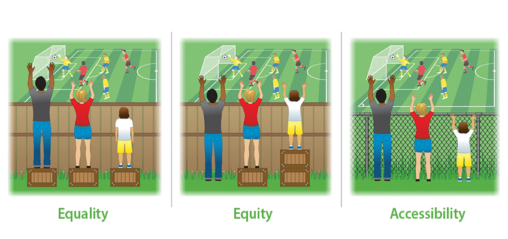

# Best Practices for Development

- accessibility as design principle
- universal design
- development cycle
- testing
- communicating

---

::: notes

Source: [https://www.wilsonlanguage.com/wp-content/uploads/2018/11/Equality-vs-Equity-vs-Accesibility.jpg](https://www.wilsonlanguage.com/wp-content/uploads/2018/11/Equality-vs-Equity-vs-Accesibility.jpg)

:::

# Design Principle
- Accessibility is a design principle, not a feature set
- Accessible Design as part of Universal Design
- User Research & Design Principles
  - Requirements gathering
  - Designing and conducting inclusive user studies
  - User feedback (beta, post-launch, etc)
  - Universal design (global audience) incorporating personalization (considerations of the individual)

# Development Cycle Integration
- Leadership
- Product Manager
- Design & Research
- Engineering & implementation
- QA (quality assurance)

---

::: notes

Source: [https://miro.medium.com/max/1400/0*qZ1JOnVpPokvnr69.jpg](https://miro.medium.com/max/1400/0*qZ1JOnVpPokvnr69.jpg)

:::

# Validation and user testing
(i.e., testing in screen readers & zoom)

# Communication out
(i.e., documentation, marketing and customer support)

# Communicating up
(i.e., ROI, impact analysis)

# Experiences
- Examples from companies/work groups on how they've integrated accessibility into their processes
- Empathy exercise around a challenging interaction

# END {.r-fit-text}

# COLOPHON

This slideshow was produced with reveal.js using the moon theme.

pandoc was used to convert the source markdown to html.

The source can be found at the same URL as the presentation by substituting `index.md` for `index.html`
