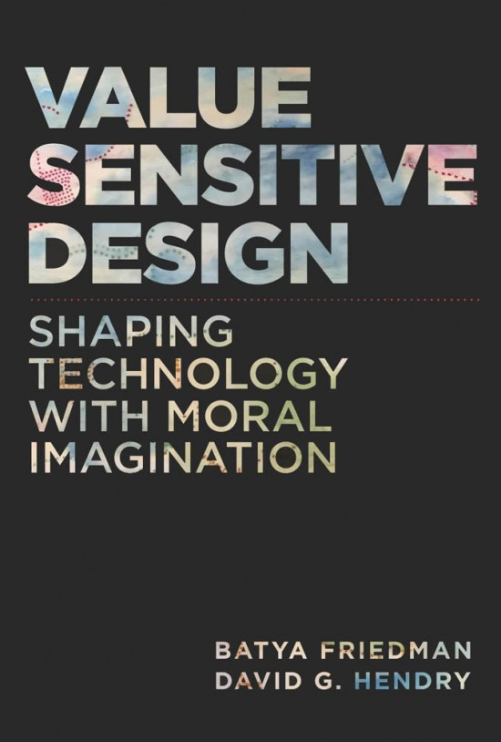
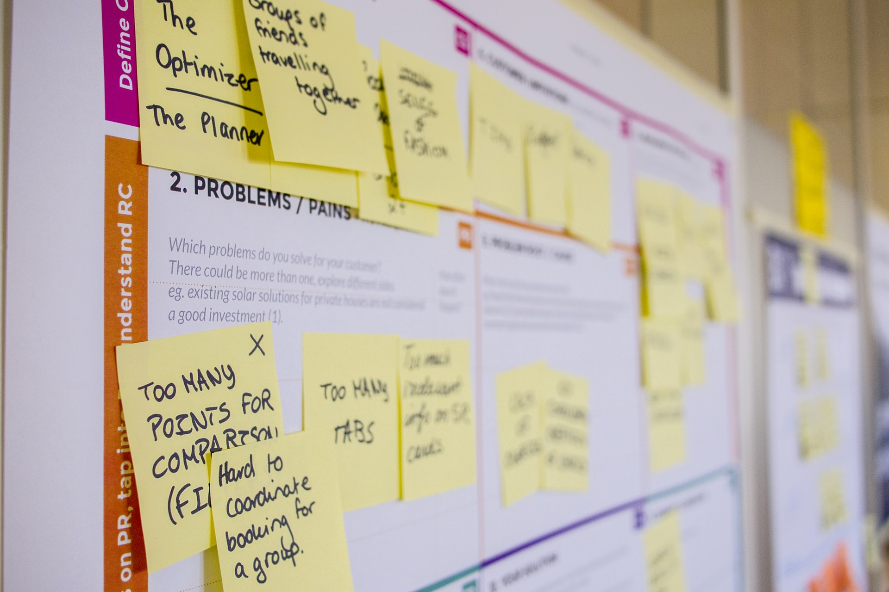

class: animated, fadeIn, middle
layout: true

```{r xaringan-themer, include=FALSE, warning=FALSE}
library(xaringanthemer)
style_solarized_light(
  text_font_google = google_font("Fira Sans", "300"),
  header_font_google = google_font("Fira Sans Condensed","600"),
  code_font_google = google_font("Fira Code")
)
```

<style type="text/css">

/* .remark-slide-content h1 {
  font-size: 600%;
}
*/

.remark-slide-number {
  position: inherit;
}

.remark-slide-number .progress-bar-container {
  position: absolute;
  bottom: 0;
  height: 4px;
  display: block;
  left: 0;
  right: 0;
}

.remark-slide-number .progress-bar {
  height: 100%;
  background-color: red;
}
.scale-30 img { width: 30%; height: 30%; }
.scale-40 img { width: 40%; height: 40%; }
.scale-45 img { width: 45%; height: 45%; }
.scale-60 img { width: 60%; height: 60%; }
.scale-70 img { width: 70%; height: 70%; }
.scale-75 img { width: 75%; height: 75%; }
.scale-80 img { width: 80%; height: 80%; }
.scale-85 img { width: 85%; height: 85%; }
.scale-125 img { width: 125%; height: 125%; }
.big { font-size: 200%; }
.bigger { font-size: 400%; }
.biggest { font-size: 600%; }
.footer {
  position: absolute;
  bottom: 10px;
}
</style>

```{r setup, include=FALSE}
options(htmltools.dir.version = FALSE)
knitr::opts_chunk$set(
  fig.width=9, fig.height=3.5, fig.retina=3,
  out.width = "100%",
  cache = FALSE,
  echo = TRUE,
  message = FALSE, 
  warning = FALSE,
  hiline = TRUE
)
xaringanExtra::use_tile_view()
xaringanExtra::use_extra_styles(
  hover_code_line = TRUE,         #<<
  mute_unhighlighted_code = TRUE  #<<
)
```
---
class: title-slide

# Design & Technology Selection

### slideshow by Mick McQuaid

.footer[This is a slideshow. Use the arrow keys to navigate.]

---
class: animated, fadeIn, middle

# What's the first thing to think about?

<br>
<br>
<br>
<br>

answer: Who you are and who's around you!

---

.pull-left[

]
.pull-right[
# The designer champions the user but talks to the manager and the developer
]

???

You may be the designer or someone who works with the designer. In either case, you need to know about the designer and the designer's environment. And the designer is always thinking about the user, but communicating with the developer or manager.

---

# Next: what are you doing?

???

You might be pursuing any of several design strategies

---

.left-column[
# iterative design
]
.right-column[

]

???

If you're pursuing iterative design, you'd better be able to do these stages fast!

You may find that you're expected to go through one cycle each week between weekly product meetings

---


???

If you pursue design thinking, you'd better know all these classical stages well, and know where you can cut corners on a given project

---

# Goal-directed design


???

You may pursue goal-directed design, which is a helpful process for meeting deadlines on a heterogeneous team

---

.pull-left[
.scale-75[]
]
.pull-right[
# Goal-directed design in excruciating detail
]

???

You have to understand all these details as a designer and also as a developer or manager

By the way, this image and a couple of the prior ones are from Cooper's 2014 book, About Face 4.0

---

.pull-left[
.scale-85[]
]
.pull-right[
# Universal design
]

???

You may pursue Universal design, particularly if you emphasize accessibility and inclusivity

photo by Ben Kolde on [Unsplash](https://unsplash.com/photos/bs2Ba7t69mM?utm_source=unsplash&utm_medium=referral&utm_content=creditShareLink)

---

.pull-left[
.scale-85[]
]
.pull-right[
# Value-sensitive design
]

???

Value-sensitive design emphasizes ethics and, while it's good for everybody, it's especially desirable in firms that are trying overcome past ethical lapses

---

# Back to who we're talking to:

### The developer doesn't know from personas! All the developer wants is a hifi prototype!

---

## As a developer, you should know what the designer is up to, but you don't need to be able to directly use the following artifacts

---

.pull-left[

]
.pull-right[
# sketches
]

???

The designer spends a lot of time producing sketches and may ask the developer to comment on them, but they are mostly for users and design testers to see

---

.pull-left[
.scale-85[]
]
.pull-right[
# storyboards
]

???

Storyboards are again mainly for users and design testers, to figure out the context around using the digital artifact, be it an app or website or kiosk

photo by dix sept on [Unsplash](https://unsplash.com/photos/idiRDLFPH6A?utm_source=unsplash&utm_medium=referral&utm_content=creditShareLink)

---

.left-column[
# personas
]
.right-column[
.scale-125[]
]

???

Personas represent a particular user of our digital artifact and are meant to help answer questions like "What would (in this example) Alexander Harris think of this feature?"

---

.left-column[
# scenarios
]
.right-column[

]

???

Scenarios are more specific than storyboards. They depict a successful use of the product.

photo by Daria Nepriakhina on [Unsplash](https://unsplash.com/photos/zoCDWPuiRuA?utm_source=unsplash&utm_medium=referral&utm_content=creditShareLink)

---

# These are all supports for the designer to have a conversation with the manager and developer&mdash;but the designer must *produce* a hifi prototype

---

# What do we mean by a hifi prototype?

---

## Transitions and animations: should they last 1.5 seconds or 2.0 seconds? The developer needs to know and a good hifi prototype can tell

## Should the interstitial enter from the top, bottom, sides? A good hifi can tell you

???

Here are two examples that illustrate the details we should see in hifi prototypes, animations and transitions with exact timings

---

# The best technology: paper and pencil

### (or marker and whiteboard)

???

so you may as well get used to it and you may as well get good at it

---

.pull-left[
.scale-125[]
]
.pull-right[
# Flavor of the month: Figma
]

???

Why? Because it's free and collaborative; and that matters in student and group projects; may not matter so much in the workplace, but, luckily, almost all hifi prototyping software has roughly the same interface nowadays

---

.pull-left[

]
.pull-right[
# Framer is an alternative that emits JavaScript
]

???

Framer is an alternative that emits JavaScript:
this will matter a lot more if the developer codes in JavaScript; you should probably learn this one too, given the popularity of JavaScript

In fact, you should not be too wedded to a single tool. Take the opportunities offered to learn new tools. The flavor of the month changes next month.

---

# Follow good designers and developers and see what they're up to

### (that's a really good way to learn about new technology choices)

---

# Example: Takuya Matsuyama, youtubing as DevAsLife

### He likes React Native for his iOS / Android app, Inkdrop, so I'm automatically interested in React Native

???

For example, I follow Takuya Matsuyama and you should find such designers and developers to follow. Since he likes some technology, I'm automatically curious about that technology

And by the way, don't discount the possibility that you are designing for three different platforms: everyone wants their desktop apps to run on all phones, believe it or not

---

# Links to industry design guidelines

???

Here are some links to industry design guidelines you should know

---

.biggest[[Material Design](https://material.io/design/)]

???

Material Design (including Material You) keeps changing since 2014! It's hard and important to keep up with their website and youtube videos

And don't worry, I'll give a link to this slideshow with links to these guidelines in case you can't google Material Design

---

.biggest[[Apple Human Interface Guidelines](https://developer.apple.com/design/human-interface-guidelines/)]

???

Apple Human Interface Guidelines (for iOS, macOS, watchOS, and tvOS)

---

.biggest[[Fluent Design](https://www.microsoft.com/design/fluent/)]

???

Fluent design is Microsoft's current design platform and includes a lot of useful code you can share with developers

---

.biggest[[Inclusive Design](https://www.microsoft.com/design/inclusive/)]

???

Inclusive design is Microsoft's accessibility effort

---

.biggest[[IBM Design language](https://www.ibm.com/design/language/)]

???

IBM Design Language is specific to IBM products but it is a great guide for general design, along with plenty of code. All designers should have at least a passing familiarity with it, as should developers.

---

# Be flexible about the platform! I'm even using GitHub on iOS via the Working Copy app!

???

You just can't believe how important multi-platform apps are for designers!

---

.left-column[
# Summary:

<br>
<br>

#  The Designer
]
.right-column[
## follows a process
may be iterative, design thinking, value-sensitive, universal

## talks to developer, manager about user
uses props like personas, sketches, and scenarios, and most of all, a hifi prootype

## uses technologies
paper and pencil, Figma, Framer, technologies that feed the developer
]

---

.biggest[END]

---
class: middle

# Colophon

This slideshow was produced using an R package called *Xaringan*

The theme is *Solarized Light*

The fonts are Fira Sans (body), Fira Sans Condensed (headings), and Fira Code

This presentation, along with presenter notes, is available online at 
[https://mickmcquaid.com/designAndTechSelect](https://mickmcquaid.com/designAndTechSelect)

Pressing `h` will give you the keyboard shortcut to get to presenter notes and more

For more info, email mickmcquaid@gmail.com
