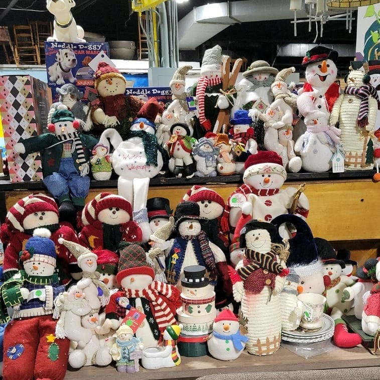
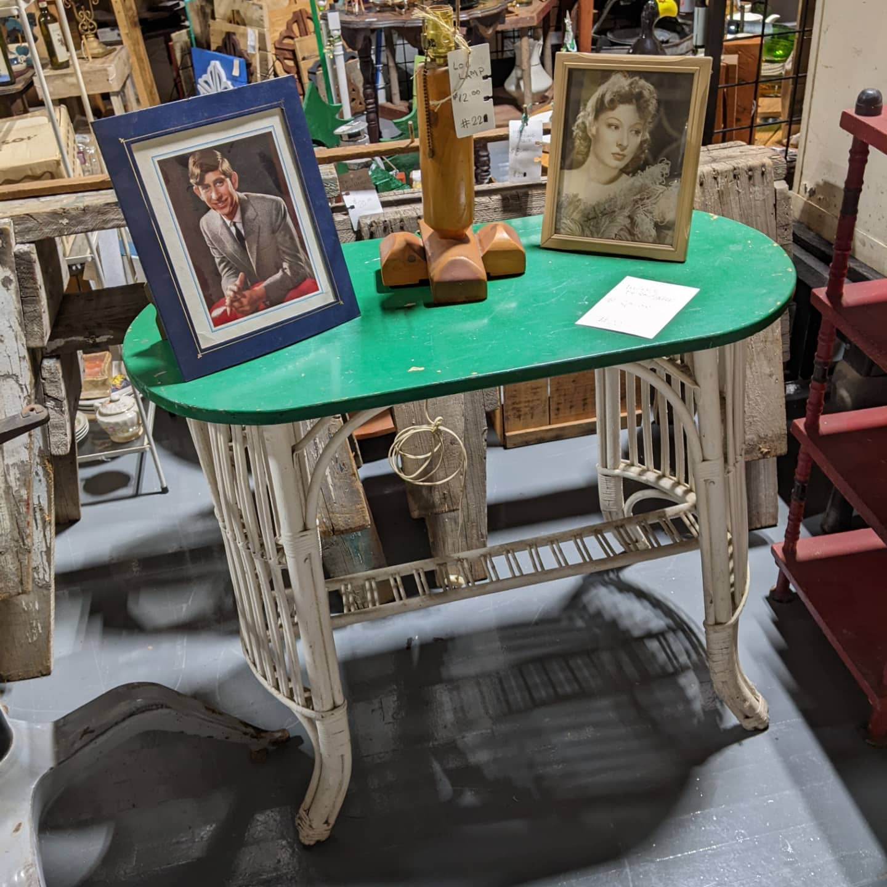
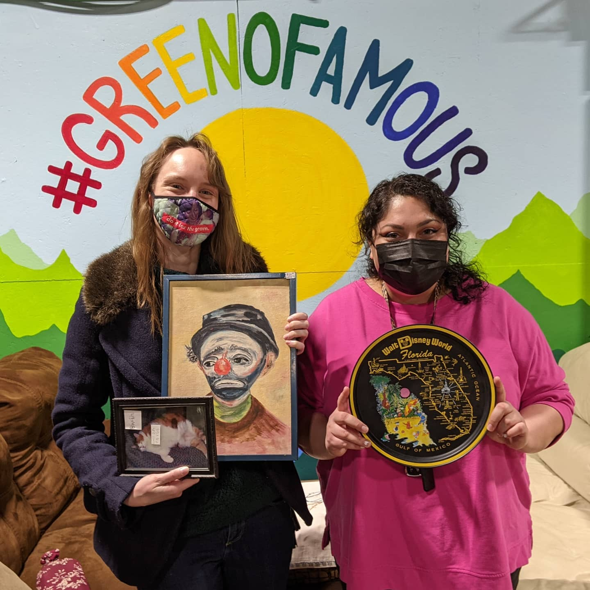

class: animated, fadeIn, middle
layout: true

<style type="text/css">
/* .remark-slide-content h1 {
  font-size: 600%;
}
*/

@import url('https://fonts.googleapis.com/css2?family=Fira%20Code:wght@300..700&display=swap');
.remark-code, .remark-inline-code { font-family: 'Fira Code'; }

.remark-slide-number {
  position: inherit;
}

.remark-slide-number .progress-bar-container {
  position: absolute;
  bottom: 0;
  height: 4px;
  display: block;
  left: 0;
  right: 0;
}

.remark-slide-number .progress-bar {
  height: 100%;
  background-color: red;
}
.scale-30 img { width: 30%; height: 30%; }
.scale-40 img { width: 40%; height: 40%; }
.scale-45 img { width: 45%; height: 45%; }
.scale-60 img { width: 60%; height: 60%; }
.scale-70 img { width: 70%; height: 70%; }
.scale-75 img { width: 75%; height: 75%; }
.scale-80 img { width: 80%; height: 80%; }
.scale-85 img { width: 85%; height: 85%; }
.big { font-size: 200%; }
.footer {
  position: absolute;
  bottom: 10px;
}
</style>
```{r setup, include=FALSE}
options(htmltools.dir.version = FALSE)
knitr::opts_chunk$set(
  fig.width=9, fig.height=3.5, fig.retina=3,
  out.width = "100%",
  cache = FALSE,
  echo = TRUE,
  message = FALSE, 
  warning = FALSE,
  hiline = TRUE
)
xaringanExtra::use_tile_view()
xaringanExtra::use_extra_styles(
  hover_code_line = TRUE,         #<<
  mute_unhighlighted_code = TRUE  #<<
)
```
```{r xaringan-themer, include=FALSE, warning=FALSE}
library(xaringanthemer)
style_solarized_light()
```

---
class: title-slide

# Rochester Greenovation

### ... needs an app or website designed by RIT students

### Slideshow by Mick McQuaid

.footer[This is a slideshow. Use the arrow keys to navigate.]

---
class: animated, fadeIn

.pull-left[
  
]
.pull-right[
# Rochester Greenovation
is a not-for-profit volunteer-run agency on a mission to make sure nothing useful goes to the landfill. Their motto is *Shop, Donate, Reimagine*.
]

---

.pull-left[
  .left[]
]
.pull-right[
  ## Greenovation's facility
  at 850 St Paul St downtown is an 18,000 sq ft second-hand store. They also have an eBay store and a Poshmark store, but these are run by volunteers with limited time and show only a few items.
]

---

.pull-left[
  
]
.pull-right[
  ## Greenovation's online presence
  is fragmented. Different volunteers run Facebook, Instagram, TikTok, and perhaps other social media outlets. Facebook is the first hit when I google *Rochester Greenovation*, while the website is seventh. Instagram and TikTok don't make the front page.

  They're first on the Yelp list that comes up first in googling *Rochester thrift store* but they don't appear on the first page of *Rochester secondhand*.
]

---

.pull-left[
  
]
.pull-right[
  ## Sources of traffic

|   %  | Source                                    |
| ---: | :---------------------------------------- |
|  30  | Facebook                                  |
|  15  | Instagram                                 |
|  15  | Walk-ins (no social media)                |
|  10  | Google, new to area, look up second-hand  |
| ~30  | Other / Unknown                           |

]

---

.pull-left[
  
]
.pull-right[
  ## A typical visit
  lasts from 30 minutes (needed to cover the space) to three hours!

  There are several kinds of visitors:

  - people just looking around
  - people who love thrifting
  - people trying to find something in particular, such as a desk or couch or table
  - slumlords, resellers, and flippers
  - people looking for deals
]

---

.pull-left[
  
]
.pull-right[
  ## Inventory
  is kept simply, with everything recorded as one of about fifty codes, including

  - housewares
  - books
  - tools
  - bed linens
  - knick knacks
  - miscellaneous

]

---

.pull-left[
  
]
.pull-right[
  ## Volunteers
  are always pressed for time. Most communicate through text and phone calls but a couple have no tech at all.

  Most have a set schedule but some pop in when they feel like it.

  Greenovation works with agencies that help mentally challenged adults find work&mdash;their clients volunteer at Greenovation to prep for paying jobs.

  If Greenovation has to close for any emergency, they make about 25 phone calls and texts to volunteers and agencies.
]

---

.pull-left[
  
]
.pull-right[
  ## Design Opportunities
  are many. An app may be more useful than a website, because most people physically in the store could easily access it.

  - Photos are a big deal for Greenovation. An app that encouraged people to post and review photos of merchandise and was usable by non-tech-savvy shoppers might work better than Instagram or TikTok.
  - Communication is a big deal for Greenovation. One place all volunteers and shoppers could trust for the latest updates or give their own updates might work better than Twitter.
  - Connection to Greenovation's many online incarnations may be helpful.

]
