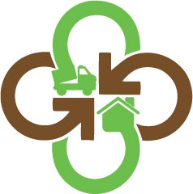
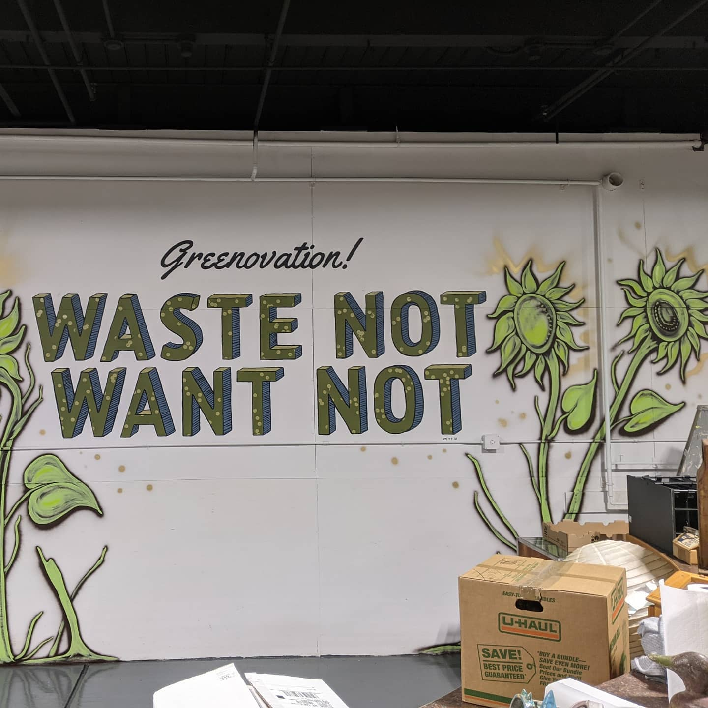

class: animated, fadeIn, middle
layout: true

<style type="text/css">
/* .remark-slide-content h1 {
  font-size: 600%;
}
*/

@import url('https://fonts.googleapis.com/css2?family=Fira%20Code:wght@300..700&display=swap');
.remark-code, .remark-inline-code { font-family: 'Fira Code'; }

.remark-slide-number {
  position: inherit;
}

.remark-slide-number .progress-bar-container {
  position: absolute;
  bottom: 0;
  height: 4px;
  display: block;
  left: 0;
  right: 0;
}

.remark-slide-number .progress-bar {
  height: 100%;
  background-color: red;
}
.scale-30 img { width: 30%; height: 30%; }
.scale-40 img { width: 40%; height: 40%; }
.scale-45 img { width: 45%; height: 45%; }
.scale-60 img { width: 60%; height: 60%; }
.scale-70 img { width: 70%; height: 70%; }
.scale-75 img { width: 75%; height: 75%; }
.scale-80 img { width: 80%; height: 80%; }
.scale-85 img { width: 85%; height: 85%; }
.big { font-size: 200%; }
.footer {
  position: absolute;
  bottom: 10px;
}
</style>
```{r setup, include=FALSE}
options(htmltools.dir.version = FALSE)
knitr::opts_chunk$set(
  fig.width=9, fig.height=3.5, fig.retina=3,
  out.width = "100%",
  cache = FALSE,
  echo = TRUE,
  message = FALSE, 
  warning = FALSE,
  hiline = TRUE
)
xaringanExtra::use_tile_view()
xaringanExtra::use_extra_styles(
  hover_code_line = TRUE,         #<<
  mute_unhighlighted_code = TRUE  #<<
)
```
```{r xaringan-themer, include=FALSE, warning=FALSE}
library(xaringanthemer)
style_solarized_light()
```

---
class: title-slide

# Rochester Greenovation

### ... needs an app or website designed by RIT students

### [note: this is a placeholder for a slideshow that will soon reside at this address]

.footer[This is a slideshow. Use the arrow keys to navigate.]

---
class: animated, fadeIn

.pull-left[
  .left[]
]
.pull-right[
# Rochester Greenovation
is a not-for-profit agency
]

---

.pull-left[
  .left[]
]
.pull-right[
  ## Greenovation's facility
]
