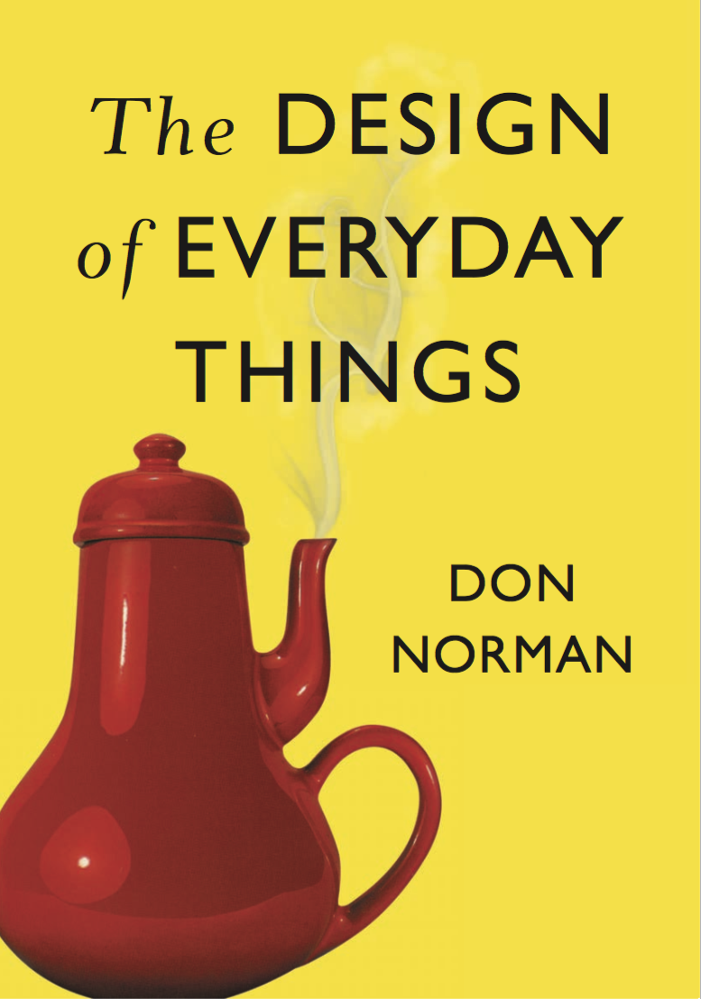
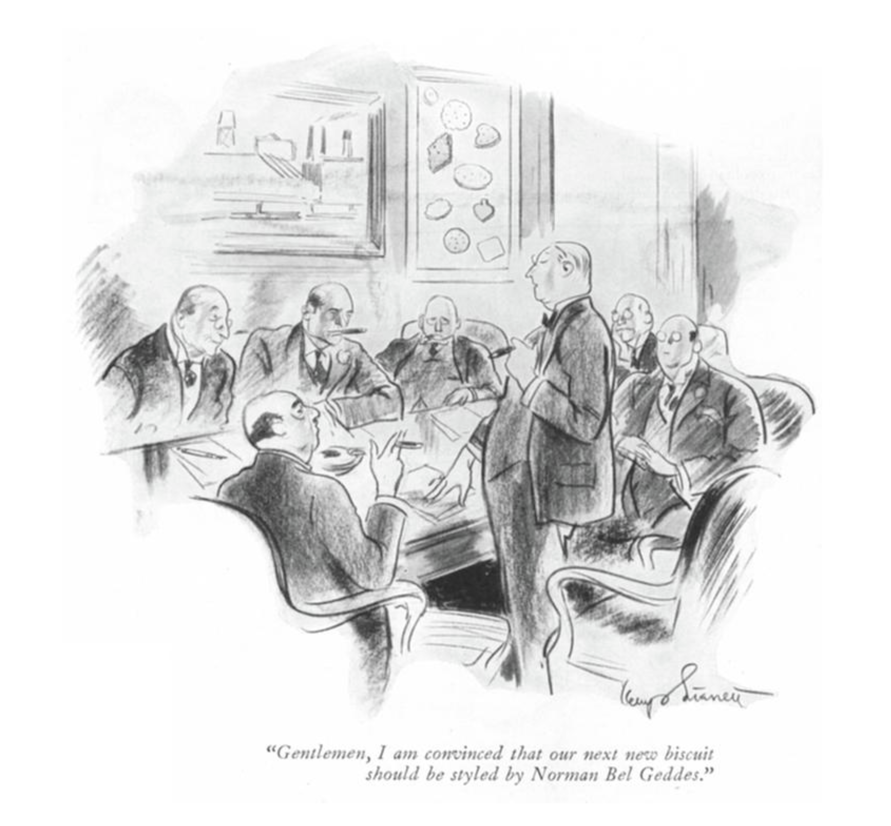
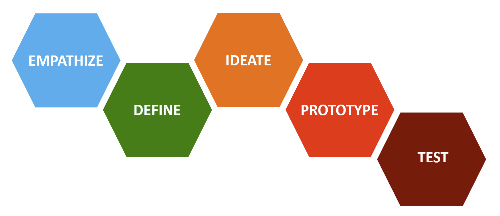
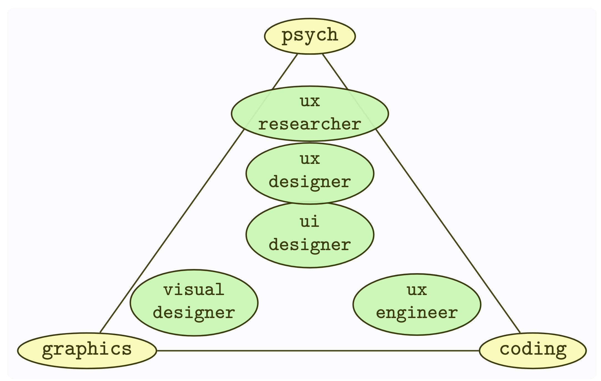
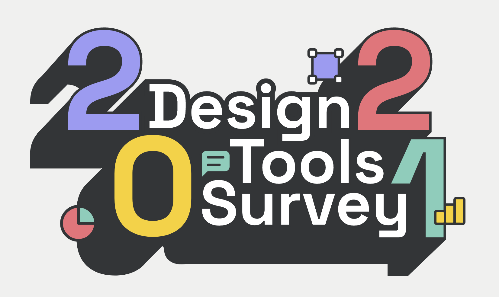
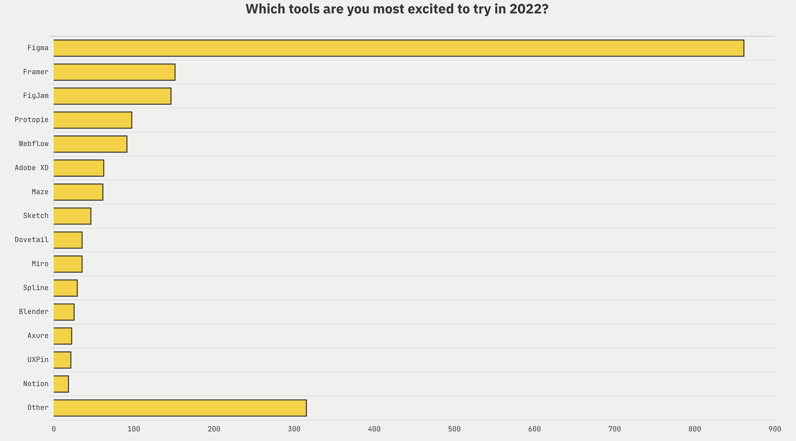

::: {.r-fit-text}
Day THREE
:::

# Background Radiation

This expression is borrowed from physics, where it refers to the radiation left over from the Big Bang. It is omnipresent and physicists have to take it into consideration when they get down to work on specific topics. Our background radiation in UX includes a bestselling book, design thinking, roles, influential people, the UX design community, and their tools and most frequently discussed issues.

## The Least Common Denominator

{fig-align="right" fig-alt="The cover of the book Design of Everyday Things, featuring an unusable teapot"}

::: {.notes}
The least common denominator for ux design is certainly this book. If design people refer to it in conversation and you don’t know what they’re talking about, they may look at you like you’re fresh in from Mars. Read this book. Read it again. Don’t wait.

It was originally published in the 1980s under a different title but became a best seller when the author was persuaded to replace the then-unpopular word *psychology* in the title with the much more popular word *design*. It is by far the best-selling book in HCI history. Its author is brilliant and can back up even the most casual assertion with volumes of peer-reviewed research.
:::

## Design Thinking through the Ages

{fig-align="center" fig-alt="A New Yorker cartoon from 1932 poking fun at the industrial design fad of the era"}

::: {.notes}
Wherever you go in the design world, you will be assailed with claims
that "we do design thinking". Obsession with design is nothing new,
though. I’d like to take you back to the Great Depression for a moment.

The most prominent US based designer of that era was Norman Bel Geddes. In 1932, the *New Yorker* ran this cartoon depicting the nationwide obsession with having more and more things designed by Norman Bel Geddes or his celebrity peers, such as Raymond Loewy, Donald Deskey, and Gilbert Rohde. So take it with a grain of salt when people tell you they are doing design thinking. They often remind me of the speaker in this cartoon, who is saying "Gentlemen, I am convinced that our next biscuit should be styled by Norman Bel Geddes".
:::

## Design Thinking Steps

::: {.notes}
When people who actually *do* practice design thinking talk about it,
they usually follow a series of well-defined steps. You should get to
know the steps I’m showing here off the top of your head.
:::

## Roles

{alt-fig="triangle with vertices: psych, coding, and graphics; internal nodes are occupation titles"}

::: {.notes}
Industry defines many roles for you, including interaction designer, interface designer, user experience designer, user experience researcher, and more. The bewildering variety of job titles for the same kinds of positions needs to be addressed even though no universally accepted dictionary exists for these terms.

Suppose we consider the *look and feel* of a digital artifact. Can we distinguish between *look* on the one hand and *feel* on the other hand? One distinction I have seen in practice is that *look* refers to interface and *feel* refers to experience. You can see this, for instance, in the Material Design guidelines from Google. Some guidelines refer to the look and some to the feel. We could say that the UI designer emphasizes the former guidelines and the UX designer emphasizes the latter.

A blogger variously named Min Ming Lo or Lo Min Ming has written a couple of articles trying to distinguish between these roles. These have appeared at 
\url{http://bold.pixelapse.com/minming/recruiting-a-designer-heres-what-you-should-know}
and
\url{https://www.fastcodesign.com/3032719/ui-ux-who-does-what-a-designers-guide-to-the-tech-industry}.
He's listed typical tools, typical remarks, typical job search descriptions, and industry quotes. My interpretation of these articles can be summarized in a triangle.

The vertices of the triangle represent emphases or influences. The job titles are positioned to reflect the strength of the emphases. For example, graphics is the strongest influence on a visual designer. The UI designer is positioned closest to the center because it is often the catch-all for all these positions. Note that there is no *information designer* in the picture nor in the Lo articles. If I were to place information designer on this graphic it would be midway between graphics and coding, just below UI designer. This is a rarely used job title, though. *Visual analytics specialist* might be what people think of instead of information designer. It also may be a synonym for information architect in some minds.
:::

# People

## Rudolph Arnheim
Major definer of artistic principles via his most famous book, *Art and visual perception*, @Arnheim1974.

## Chris Bangle
Influential automobile designer who points out each era has had a technology that defines what is possible and, therefore, what designers like to showcase. Bangle called the five-way milling machine the defining technology for automobiles in 2005, contrasting it to metal lathes as the defining technology of a century ago.

## Bill Buxton
A longtime mainstay of HCI at Microsoft Research, formerly a voice in the wilderness, now a Grand Old Man, author of @Buxton2007.

## Matias Duarte
Head of design for Android, spokesperson for Material Design.

## Jonathan Grudin
The self-appointed historian of academic HCI, one of his strengths is organizing his view of history in a synthetic way so that he generates insights rather than summarizing the past. His blog, for instance, is essential reading.

## Jony Ive
Former head of design for Apple, prefers flat design not skeuomorphism, allegedly ousted skeuomorphism proponent Scott Forestall after Steve Jobs's passing.

## Steve Krug
Noted for a popular book, @Krug2005, admonishing designers to not make him think, Krug's ideas form an excuse for designing to the least common denominator. His basic notion seems terribly flawed to me (Mick). It appears to saddle designers with the responsibility to make interactions seem natural to users so that they can think about what they are doing rather than the computerized tools enabling them to do things. Krug's influence may be waning since this core concept so rigidly contradicts flat design. Flat design celebrates the active examination of the interface and the pleasant discovery of features in the interface.

## Peter Morville
Popularized the term information architecture, in the first edition of @Rosenfeld2015, before moving on to various other interests---at the time of this writing, his major tagline seems to be *everything is connected*.

## Jakob Nielsen
Business partner of Don Norman, author of influential evaluation heuristics and controversial blog.

## Don Norman
Most popular figure in HCI world. His first popular book, *The Psychology of Everyday Things*, was retitled as *The Design of Everyday Things*, whereupon it became the biggest seller of any HCI-related book ever published. Norman has a detailed knowledge of vastly many subjects. Even when he writes in a popular accessible style, do not discount the vast scholarship underlying every word. See @Norman2013 and @Norman2005.

::: {.notes}
He popularized the word *affordance* which is the most identifying concept in HCI. Unfortunately, his interpretation of that word may differ from that of his mentor, J.J. Gibson, who coined the term. Norman's interpretation may have overshadowed the original meaning in a way that the HCI world can only reevaluate in the twenty-first century, in light of advances in neurology unavailable to the cognitive psychologists of Gibson's era.
:::

## Dieter Rams
Popular industrial designer in 1960s, idol of Jony Ives, described in the documentaries *Objectified* and *Helvetica*, both of which are required viewing for aspiring UX people.

## Jeff Raskin
Frequently referred to as the inventor of the Macintosh, author of *The Humane Interface*, @Raskin2000.

## Aza Raskin
Son of Jeff, has participated in high-profile startups and is a popular speaker. I was especially impressed by an application he once created that took advantage of insights about Google search terms. People in the past decade have become used to thinking about getting what they want by remembering short sequences of keywords. This is much like the ancient command line interfaces except that it is forgiving and provides you with *some* result for each attempt. Command line errors used to just evoke the response *bad command or filename* without any further help.

::: {.notes}
Of course, Google has the advantage that you send every single search string to google and that you typically either reformulate it or click on one of the results, all of which options provides Google with more information about whether you made a mistake. Command lines could historically be executed without anyone but the end user knowing their contents or their aftermath. So Raskin's interface faced a stiff barrier unless it could incorporate some kind of feedback loop. But it seemed like an insightful idea whatever its limitations.
:::

## Edward Tufte
Popular for a series of beautiful books whose distinctive style has been widely imitated, e.g., @Tufte2001.

# URLs

I have sometimes listed URLs of importance to UX people. Link rot has attacked each such list with a relentlessness that has left me relying more and more on Google and Wikipedia, as well as pdf captures.

::: {.notes}
There is a vast amount of scholarship on link rot as of 2015, some of it in the legal arena because of its impact on reading US Supreme Court opinions. Schemes to overcome link rot such as doi and URI have been proposed, developed, and ignored since the beginning of the web.
There are vastly many services designed to defeat link rot, from Pinboard to the Internet Archive's Wayback Machine, to URL shorteners, but link rot appears to be winning.

Take the people listed above. Some of them have a blog for a while, then abandon it and start a blog with a different title to reflect their current interests. They may use Twitter or Instagram or other means to convey their ideas, yet it is the people themselves who remain important over time, not the different addresses of their various activities.

The same can be said of institutions. Many institutions have *shadow* websites to their official websites, since official websites require administrative oversite and may operate at a slower pace than productive workers.
:::

## Institutions

HCI academic programs in North America include Berkeley, Carnegie-Mellon, U Colorado - Boulder, Georgia Tech, U Indiana, U Iowa, U Maryland, U Michigan, MIT, U Toronto

The *New York Times* has adapted amazingly to its online home in the past ten years. The rapidity with which the *Times* updates its view of information design is exemplary and at this time, you should certainly be studying it as an information artifact as much as you may use it.

# Technologies

JavaScript is the language of the web. It's bad news not to understand this ubiquitous language

CSS is another required technology. You should understand enough about the use of CSS to at least provide different views of the same content, either for different audiences or platforms.

JSON is one of the most important ways of organizing information online, another being XML. You should be able to manipulate structures in at least these two containers.

::: {.notes}
You may use any language to manipulate JSON, including JavaScript, but understanding JSON and XML requires study separate from that of JavaScript.
:::

## Design Guidelines from Vendors

Much of the design action in the world today is taking place in the battle between Android and iOS for market share and mind share. Some other firms, primarily Samsung and Microsoft, have published meaningful design guidelines. Most interaction designers today, whether or not they work in the mobile space, are familiar with the following four

[Material Design](https://material.io/design/)

[Apple Human Interface Guidelines](https://developer.apple.com/design/human-interface-guidelines/)

[Fluent Design](https://www.microsoft.com/design/fluent/)

[Inclusive Design](https://www.microsoft.com/design/inclusive/)

::: {.notes}
Formerly, I gave the following URL for Microsoft. It still exists, although the Fluent Design URL above is probably better.
[Windows Guidelines](https://docs.microsoft.com/en-us/windows/desktop/uxguide/guidelines)
:::

## Misc

Watch the documentaries *Helvetica* and *Objectified* as well as the videos by Bill Moggridge that accompany his textbook on HCI.

*Hacker News* is my preferred news source. You should try to at least skim it weekly to improve your picture of information technology in general.

::: {.notes}
*Krebs On Security* is the only information security blog you should read. Again, check it at least weekly or whenever anyone asks you about information security issues. Bear in mind when you read about security that it represents a terrific opportunity for con artists. Some IT security people thrive on producing no measurable output and are often smooth talkers, able to answer any argument decisively but without imparting any understanding. IT security will typically demand all kinds of knowledge about every aspect of an organization and is in a position to use that to improve its power position within an organization.
:::

## Commentators

*Whose work do you read and where?*

::: {.notes}
Blogs and bloggers exemplify resources that are
underdocumented in the academic literature.  Many
designers look to *A List Apart* or
*Alertbox* for ideas and inspiration.  A very
long list of "celebrities" maintain an online presence
with a remarkable influence on contemporary designers.
They include
danah boyd,
Jesse James Garrett,
Joi Ito,
Mimi Ito,
Aza Raskin,
Jared Spool,
and many more.
Unfortunately, some of these people are more famous for being famous than for anything else. You have to read critically to separate what is important from what is only viscerally appealing. As a straw man, look at a speech by President Snow in the *Hunger Games* and imagine you know nothing else of the plot. What he says may *feel* reasonable taken out of the context of the movie, which identifies him as a villain for your convenience. Now, imagine you hear this speech in real life, where there may be no behind-the-scenes view. It can be harder to analyze public pronouncements than it looks.
:::

## Tools

{fig-alt="Logo of Design Tools Survey 2021"}

::: {.notes}
Plenty of online tools are part of a typical designer's
workday, such as
*kuler* for color palettes.
Some platform specific tools like
*Sketch*,
*Principal for Mac*,
*Adobe XD*,
*Figma*,
*Axure*,
*Balsamiq*, 
and
*Invision Studio*, 
have big
followings.
Some students have also mentioned Framer JS, Framer Studio, Tumult Hype, Invision Classic, Visio, Flash Catalyst, Dreamweaver, and coding in straight Actionscript. If you google prototyping tools you will find reviews of Justinmind, Marvel, and more.

During Fall 2015, we discussed the survey at
[http://tools.subtraction.com/index.html](http://tools.subtraction.com/index.html). (That page has vanished but its message remains relevant.) This survey examined six categories of tools used by designers: brainstorming, wireframing, interface design, prototyping, project management, and version control / file management. The most popular tools, one per category among the five thousand designers self-reporting, were:
pencil and paper (brainstorming),
Sketch by Bohemian Coding (wireframing),
Sketch by Bohemian Coding (interface design),
HTML / CSS (prototyping),
Slack (project management),
and Dropbox (version control / file management).

The survey received a lot of media attention because of the first result---few non-designers would have guessed that pencil and paper still hold a preeminent position. It is this preeminence among the practicing designers I query that leads me to keep the paper and pencil sketchbook every semester, a choice that frequently puzzles non-designers. Another noteworthy aspect of the survey is the presentation of results. If you explore the above site, you may be pleasantly surprised by the amount of interactive exploration of results made possible by ... wonderful design!

One kind of prototyping tool you may have thought too rudimentary to mention would be any graphics package with layering, such as Photoshop or Sketchbook Pro. You can use different layers in the same file to represent transitions from one app state to another. The advantage of using a tool like this is that you may already know the tool and won't waste time on it, instead spending your time on developing your ideas.

A more recent survey can be found at
[https://uxtools.co/survey-2018](https://uxtools.co/survey-2018) where you will see that paper and pencil still dominates brainstorming.

A still more recent survey is at [https://uxtools.co/survey-2020/](https://uxtools.co/survey-2020/) where they specifically only ask about software tools.

[https://uxtools.co/blog/7-takeaways-from-2020-ux-tools-survey/](https://uxtools.co/blog/7-takeaways-from-2020-ux-tools-survey/) has takeaways from the above survey.

[https://uxtools.co/survey-2021](https://uxtools.co/survey-2021) has a still more recent survey.
:::

## Trends in Design Tools

{fig-alt="barchart of most exciting tools of 2022, with Figma the main favorite"}

## Wikipedia

I use Wikipedia as a reference for many topics.  For instance, the Wikipedia entry on HSV color space provides a good introduction to terms about color.  Wikipedia URLs have a format so that if I refer to the entry on HSV color space, you may assume that the URL (for the English language version) is [HSV_color_space](http://en.wikipedia.org/wiki/HSV_color_space). Wikipedia remains controversial among many academicians.

A resource for HCI literature may be found at [hcibib](http://www.hcibib.org).  You may find it helpful for much of your work.

# Being the center of the universe

## Indian Bus Example

{fig-alt="Ticket taker on crowded Indian bus"}

::: {.notes}
Before we get too far into the semester, I have to tell you a very long story. Understand that this story is told to help you avoid embarrassing yourself ... at least as much as you would if I did not tell the story. Inevitably, the early part of the semester includes some discussions that begin with one person saying that "Everyone does X" or, more often, "No one does X".

Here I mean X as a placeholder for some kind of software (or hardware, for that matter), but it can be a software-related practice. Sometimes the discussion will heat up when someone says "Oh, so you're one of the two or so people left in the world who uses X."

This kind of conversation has led me into the field of HCI. Here is one semi-legitimate academic discipline where I can smack someone who says "No one uses X." Everywhere else, computer users can put on a set of blinders and insist that, if they don't do it, no one else does either. Of course, I am leading up to the fact that HCI people, though they supposedly know better, are terrible offenders.

My favorite story to illustrate this pot-kettle phenomenon comes from a contest at CHI to develop an app to improve public transit. One of the contestants developed a hardware device to support the conductors on buses in India. The conductor would hold this device in one hand and click on icons on it with the other hand, all while conversing (yelling) with bus passengers.

I should interrupt this anecdote with two facts: buses in much of India have conductors. The CHI contest was in California. There was some communication difficulty from the audience as to whether the 1.1 billion people of India were total idiots for not running their buses in the same manner as the buses within five square blocks of the auditorium. Oh, well.

Back to my anecdote ... The intrepid developer of the Conductor Assistance Device, hereafter CAD, fielded a lot of "questions" about whether conductors should be eliminated from all Indian buses based on the sage advice of CHI attendees. Then he received the showstopper.

The showstopper, in any presentation, is dreaded by the presenter because the contest is effectively lost after the showstopper question is asked. There is no recovery from the showstopper. The developer may have put in a year of work and the project may have considerable merit but it does no good in the face of the showstopper.

Sometimes, it's not clear whether a question is a showstopper. Most questions in CHI presentations are variations of these three timeless questions.

1. "Have you seen my important work in this area?"

2. "Isn't this really just a minor revision to some project from a previous decade and, since you know nothing about that project, we can't really discuss it but you should know that you're wrong?" (What, you don't think that is a question? How little you know!)

3. "You have done a thing. Why didn't you do this other thing which I just thought of and will now describe at some length while everyone waits for me to finish and for you to reply that it is an interesting prospect for further work?"

These three questions are the bulwark of any academic community and, if you think I am saying that from personal bitterness, then, no I do not have tenure.

Anyway, back once again to the anecdote and now to the showstopper. An observant audience member asked, "Why not just develop a system that allows passengers to use their cell phones rather than communicate with the conductor?"

The presenter, as so often happens, did not realize that the showstopper had just been asked. He patiently explained that Indians are too poor to have cell phones and that, therefore, we can't have a system that would rely on cell phones the way we would in the wealthy, elitist environments of the West. He pointed out that we need compassion for the poor, who are the most prevalent users of buses anyway.

The presenter blathered on about poverty for quite some time, finally slowing as he realized something strange was going on in the audience. He petered out altogether as he realized that many in the audience were pointing at the screen behind him, where he was displaying a mosaic of photographs of Indians on buses, with a conductor prominently displayed in many of the photos.

After he turned to examine his own photos, it finally began to dawn on him that many, if not most of the bus passengers visible were holding cell phones. His hopes of winning the contest wafted away like smoke on the wind as he very quietly acknowledged that in these particular cases everyone had a cell phone and tried to quickly think of some reason why these cell phones might not be adequate to the task of communicating extremely simple information about bus stops. He rambled for a while and even tried out a phrase like "Most people don't have cell phones" to see how it would sound but it didn't sound too good in the face of his own photos.

Let me underscore two things about this anecdote. First, the audience was very dismissive of the notion of conductors on buses, violating the principle that not everyone is like you. Second, the presenter was very dismissive of the notion of poor people having cell phones, another violation of the same principle. Sure, the presenter was the one who suffered that day but everyone was guilty. The scuttlebutt was "Wow, he really screwed up!" but the larger truth was that he committed an infraction no different from that of many vocal members of the HCI community.

Does that mean that these people all suck and are cultural imperialists? No, it means that it is hard to put yourself into the shoes of another. Every day I read in the blogs that Samsung or Google or Apple is a complete idiot because of some UI feature that someone doesn't like. Really? *Really?* No, they are not idiots. They have a hard job.
:::

# References

::: {#refs}
:::

---

::: {.r-fit-text}
END
:::

# Colophon

This slideshow was produced using `quarto`

Fonts are *League Gothic* and *Lato*

