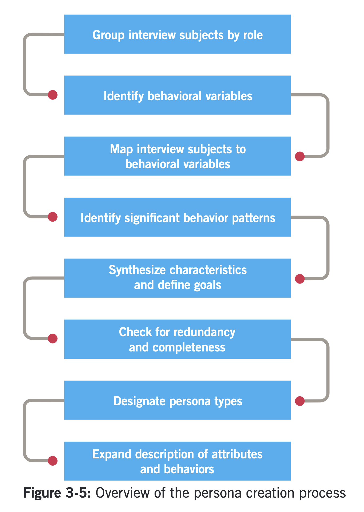

::: {.r-fit-text}
Week FIVE
:::

# But first ... The Elephant in the Room

## Figma acquisition by Adobe
- Should we keep using Figma?
- Should we switch to Framer or Penpot or go back to Sketch?
- [Should we try to develop multiple escape routes?]{.emph}

## What's the problem?
- Adobe has a long history of buying companies and ruining / destroying their products
- Adobe has a direct competitor to Figma
- Acquisitions in big tech are usually disastrous for the consumer
- There's even a tumblr devoted to publishing optimistic statements by acquired CEOs followed by later announcements of closure ([https://ourincrediblejourney.tumblr.com/](https://ourincrediblejourney.tumblr.com/))

## Where is more info about this?

::: {.incremental}
- Hacker News: [https://news.ycombinator.com/item?id=32850178](https://news.ycombinator.com/item?id=32850178)
- [https://hunterwalk.com/2022/09/19/why-figma-is-worth-20b-and-other-observations-from-the-adobe-acquisition/](https://hunterwalk.com/2022/09/19/why-figma-is-worth-20b-and-other-observations-from-the-adobe-acquisition/)
- [https://adamnash.blog/2022/09/16/figma-a-random-walk-in-palo-alto/](https://adamnash.blog/2022/09/16/figma-a-random-walk-in-palo-alto/)
- [https://finance.yahoo.com/video/adobe-figma-deal-ive-never-193650708.html](https://finance.yahoo.com/video/adobe-figma-deal-ive-never-193650708.html)
- [https://www.cnbc.com/2022/08/25/figma-growing-inside-microsoft-testing-longtime-deal-with-adobe.html](https://www.cnbc.com/2022/08/25/figma-growing-inside-microsoft-testing-longtime-deal-with-adobe.html)
:::

## Questions
- Everybody hates Adobe. Why? (Subscriptions?)
- Isn't it possible that this acquisition will fail? (Yes)
- Might the FTC block the deal? (Unlikely)
- The co-inventor of Figma has already moved on. Why? [https://madebyevan.com/](https://madebyevan.com/) (That's what they do)
- What will Adobe do? (retire XD? retire Figma? ruin both?)

::: {.notes}
Will Adobe get the Figma team? No. Evan Wallace has already moved on. Dylan Field has just been given a billion dollars and asked to choose between sitting in a lot of meetings with empty suits explaining to him why they won't change their business to suit him OR go pursue his passions. Which would you choose?

Plus, Adobe doesn't need the team. If they get patents to Figma's technology, they are set to move Creative Cloud to the cloud for real. Figma runs well on any machine. Does Creative Cloud? It will, soon. I'd buy Adobe stock in a heartbeat right now. No dividend this year, though.
:::

## Why do we care?
- Reliance on Figma
- Pace of innovation at Figma
- Sketch is mac-only (for now)

# Recap, Previously on Info & Interaction Design

- Contextual Inquiry
- Mood boards
- Triangles
- Picking up a key

# Protocol and verbal analysis

::: {.notes}
Let us contrast two ways to find out about tasks through the words of people doing those tasks, protocol analysis
described by @Ericsson1984
vs.
verbal analysis
described by @Chi1997.
:::

##
protocol analysis $\rightarrow$ *think-aloud process*

::: {.notes}
The main idea in Ericsson (1984) is to elicit
information from a person *while* they accomplish
a task by asking them to think aloud about the
information they attend to while solving problems, but
not to describe or explain.
:::

##
verbal analysis $\rightarrow$ *knowledge representation*

::: {.notes}
@Chi1997 contrasts protocol analysis with an
approach designed to elicit the structure of knowledge
of the problem solver, rather than the problem solving
process.
:::

## Outputs

The output of protocol analysis $\rightarrow$
 *process map*

The output of verbal analysis $\rightarrow$
 *knowledge map*

# Personas

- Use @Cooper2014
- Cooper invented personas at Microsoft

::: {.notes}
For the personas milestone, let me make the very strong suggestion that you use @Cooper2014. You may obtain this electronically from the library, searching for *About face the essentials of interaction design*. Chapters 3 and 4 outline the processes. You should pay special attention to Figure 3-5, Overview of the persona creation process to develop personas. (We'll talk about Chapter 4 next time.) This figure outlines eight steps to take. When I look at the milestone output, I should believe that you really followed or at least considered these steps in some detail.
:::

## Reading Cooper

::: {.notes}
How should you read @Cooper2014? I'm glad you asked. This is a very good example of why you don't need slide shows. The book is organized in a way that brings out its main points. Let's briefly review some items that identify structure and guide your assimilation of the information therein.
:::

## Structuring your reading

::: {.container}
:::: {.col}
- Table of contents
- Orange headings
- Black headings
- Boldface terms
- Italicized emphasis
- Figures with sequences
::::
:::: {.col}
- Figures with comparisons
- Examples
- Justifications
- Answering objections
- References
- Order of presentation
::::
:::

::: {.notes}
Most of the items in the list are self-explanatory. The last one, though, needs a little explanation. The order in which Chapter 3 is presented could be called a series of steps, including think, do, and reflect. First, the authors present the idea of personas, then tell you how to do them, then reflect on some of the thoughts you might have as a result of experience with personas or with alternative methods. This organizing principle might remind you of the plan-do-check-act cycle that is a foundation of quality improvement work. You could think of learning a new approach to interaction design as an example of quality improvement work. If you do, then you might think about integrating aspects of the persona approach into your larger toolbox, the lifelong toolbox you will carry with you outside of school.
:::

## Personas are models
- Why model?
  - Only care about salient features
  - Only care about relevant behavior patterns
- Composite archetypes
  - Not stereotypes
  - Arises from research, e.g., contextual inquiry

## Designing for many constituencies
- Increases cognitive load
- Increases navigational overhead
- Instead, identify specific individuals with specific needs

## Example for cars
- Alesandro wants to go fast and have fun
- Marge wants to be safe and be comfortable
- Dale wants to haul big loads and be reliable
- Is there one car for all three?

## What personas help the designer do
- Determine what a product should do
- Communicate with stakeholders
- Build consensus and commitment
- Measure the design's effectiveness
- Contribute to other product-related efforts

## Design pitfalls that personas avoid
- Elastic user (license to build what you please)
- Self-referential design (developer as user)
- Edge cases (shouldn't be focus, even when designed for)

## Why personas are effective
- Personification engages empathy
- Research basis grounds personas in measured reality
- They are context-specific: one persona for one product
- Their motivations are explored

## Cognitive processing levels, from @Norman2005
- Visceral
- Behavioral
- Reflective

## Goals corresponding to the three levels
- Experience goals
- End goals
- Life goals

## Motivations corresponding to the three goals
- The user wants to feel
- The user wants to do
- The user wants to be

##

# PDCA

## The PDCA cycle
{fig-align="center"}

## The stations of the cycle

The PDCA cycle can be traversed over and over, indefinitely. There are four main stations of the cycle.

- Plan investigations to understand the current situation
- Do implement short term fixes and long term plans to overcome root causes of problems
- Check to see the effects of implementing fixes and plans
- Act to standardize fixes and plans that succeed

Also see @Pruitt2003.

# Up next, Framer and (maybe) Penpot tutorials

# References

::: {#refs}
:::

---

::: {.r-fit-text}
END
:::

# Colophon

This slideshow was produced using `quarto`

Fonts are *League Gothic* and *Lato*

