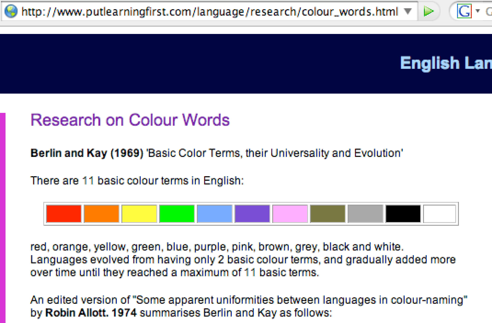
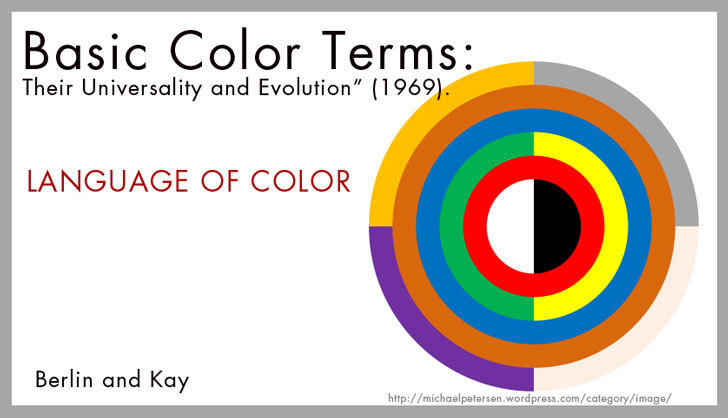
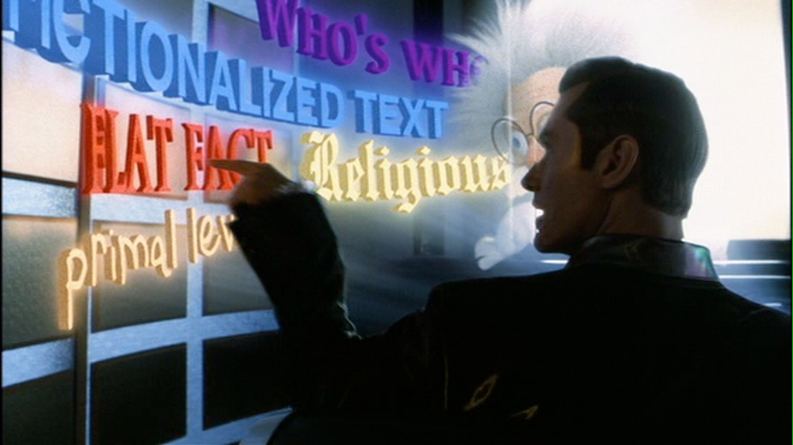
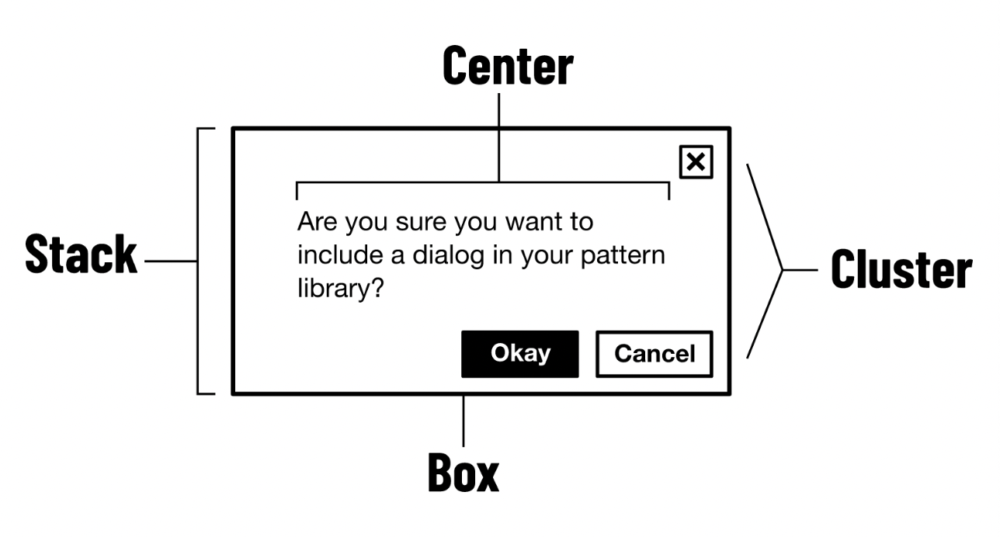
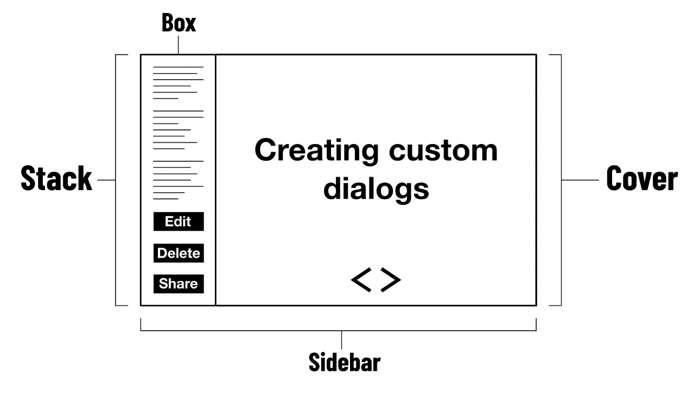

::: {.r-fit-text}
Week SEVEN
:::

# lofi

## All you need is here


## lofi from @Buxton2007


::: {.notes}
The “conversation” between the sketch (right bubble) and the mind (left
bubble). A sketch is created from current knowledge (top arrow). Reading,
or interpreting the resulting representation (bottom arrow), creates new
knowledge. The creation results from what @Goldschmidt1991 calls “seeing
that” reasoning, and the extraction of new knowledge results from what
she calls “seeing as.”
:::

##

*My drawings have been described as pre-intentionalist, meaning that they were finished before the
ideas for them had occurred to me. I shall not argue the point.*

::: {style="text-align: right"}
--- James Thurber
:::

## Sketching capabilities from @Buxton2007


## lofi and hifi from @Buxton2007


##


::: {.notes}
Sketchbook pages exhibited in  @Buxton2007, pp 194--5
:::

## Special challenge: Animation in lofi

## Animation User Input Symbols


## Animation Action Symbols


## Animation Quality Symbols


# hifi

## Elements
- Color
- Typography
- Layout
- Animation

# Color

##

::: {.r-fit-text}
〈pause for color video〉
:::

## Problem: App in video ceased to exist!
- Taken off App store
- Replaced with a paid website
- Seems to invalidate much of the reason for making it an iPad-only app
- I've written to the developers with no response

##

Color is an enormous concept, recently explored in the CHI community by @Shugrina2019. It can be the subject of entire semester-long courses in several disciplines, including psychology, neurology, biology, and optical science.

I would like to limit my further discussion to two issues among the very many that should be of interest to you as designers. The first is education about color and the second is color words.

## Education about color

Josef Albers was without peer in educating art students about color in the twentieth century. His kit, often referred to as a book, is called *Interaction of Color*. Its most important sentence is perhaps "Color is the most relative medium."

::: {.notes}
I had read a popular paperback edition of the book years before I ever saw the actual kit, which consisted of a box full of colors on various kinds of paper, cardstock, and other materials, along with a guide book, a version of the paperback I had read.

Albers conceived of education about color as putting different color cards together in different configurations and examining the effects of these configurations on the student's perceptions of color. This kind of education can not be conveyed in a book alone. It is difficult not only to rearrange the colors but also to control the actual printed colors. Believe it or not, it is quite expensive to reproduce intended colors with any kind of precision in a mass printing. No wonder William Blake preferred to produce his books by hand! (Okay, he had other reasons, including the desire to master all the related arts and the desire to ensure that the final product would have a luminous quality achievable only with the use of watercolor.)

There is now at least one version and perhaps more versions of *Interaction of Color* available electronically.
For years it was a daunting task because only the most expensive monitors could reproduce colors well. Now it seems that at least someone believes in the color fidelity of the iPad enough to release the rights to produce a version in that medium.
:::

## Color word research

##

Following are quotations from
[color word research](http://www.putlearningfirst.com/language/research/colour_words.html)
contributed by a previous student.

<!--  -->


##

The website mentioned on the previous slide continued as follows:

*A prominent doctrine in linguistics and anthropology holds
that each language and culture expresses a unique world view
by its particular way of slicing up reality into named
categories. (See Sapir-Whorf hypothesis).*

::: {.notes}
This says that it is difficult to make exact translations
between languages because hearers see the world in a way
governed by their own language.

Colour vocabulary is a possible example of this.

According to accepted doctrine, basic colour words are not
translatable across languages.

Analysing ninety-eight languages Berlin and Kay (1969) found
that eleven colour words act as focal points of all the
basic colour words in all the languages of the world. This
set of eleven seems therefore to be a semantic universal.
Basic colour words *are* translatable.

They also found that words for the basic colours arose in different
languages in a regular sequence:

- all languages with only two basic colour words have words for black and white;

- languages with exactly three basic colour words have words for black, white and red.
:::

## Not everyone agrees


## Color names in computing

[arstechnica on color name history](http://arstechnica.com/information-technology/2015/10/tomato-versus-ff6347-the-tragicomic-history-of-css-color-names/) ran a sad and funny article in Fall 2015 on the names of colors as used in computing, from the X Window System project in the eighties through contemporary CSS3.

::: {.notes}
Read this article for a lesson in knowledge representation, inertia, standards bodies, rapid technical progress, and computer history. One important detail that is passed over too lightly is that people remember words like tomato better than hexadecimal codes like FF6347. Memory for words and the underlying phenomenon of spreading activation of neurons that leads to well-formed searches are among the great drivers for Google. I would love to be able to search for hexadecimal representations of color by word. Oh, wait! I can! Check what google returns for *tomato color*! The very second hit when I tried it was for *coloreminder*, a wonderful service whose name I can not remember but which will appear for some of the less obvious color names mentioned in the above article. For colors that men can stereotypically not appreciate, like fuschia or puce, there is a Wikipedia entry as the first result. By the way, a recent survey of differences between men and women in naming colors found, contrary to stereotype, that men and women seem to be able to appreciate almost exactly as many colors as each other. Searching for it, I found a 2012 study that seems to say exactly the opposite. The devil may be in the details.
:::

# Typography

::: {.incremental}
- You're experiencing it right now!
- I'm using default typefaces!
- People have prejudices, e.g., Comic Sans, Papyrus
- It's not just fonts!
- LaTeX and Adobe InDesign do the best spacing and line breaking
:::

::: {.notes}
Some authors give very definite advice when space is constrained: use this or that typeface, use only serif or only sans serif type, set only ragged right or only justified. This seems like banal advice to me. It is predicated on the fact that you may not have much time to devote to typography, certainly not as much as someone who majors in typography!

Despite your limited time spent practicing typography, you probably do spend a *lot* of time consuming typography. So, just like my advice about color is that you sharpen your eye, so too is my advice about typography: sharpen your eye.

It would be nice if you had time to read and reread the two books I'm depending on, Robert Bringhurst's *Elements of Typographic Style* (2004) and Rutter's *Web Typography* (2017), but there is a good chance that you will at most browse these texts and perhaps visit a few websites like [https://ikern.com](https://ikern.com).

So what are the most important things to say about typography? Well, I can start by commenting on the above-mentioned resources and some of the concepts they stress.

Perhaps the most important concept is Bringhurst's assertion that typography should serve its content. Bringhurst gives the example that you would probably not set a nineteenth century English text in a seventeenth century French typeface unless you were trying to make a point, and perhaps a point that would overshadow rather than serve the text. Now what happens if you don't know the difference between the above-mentioned typefaces? This problem raises two points. First, that you can and should sharpen your eye. You make statements with your typography whether you know it or not. You may be saying "I am smugly above caring about typography." Compare that assertion to Bringhurst's admonition to serve the text. Do you serve the text by purposeful ignorance? I think not, but I don't have time to devote much to typography, so I gradually try to sharpen my eye by periodically studying a little about typography.

The second point raised by the problem of the two typefaces is that typography is referential. Typography is an art and craft of its time and, as a servant of messages embedded in time, it is sensitive to the content of those messages. Typography has changed, both because of changes in technology and changes in ideas about reading and writing. Some typography prizes hand writing, especially at the dawn of typesetting. Some typography prizes exquisite use of the available technology. For example, some typefaces use extremely thin and extremely thick strokes, stressing out the machines that produce the typeset page, as well as the paper and ink applied to it. Other typefaces are designed to degrade gracefully as the components of the machine age and friction takes its toll or poorer quality paper or ink is employed, perhaps in times of hardship.

At the heart of typography is the individual letterform and a series of letterforms, constituting a text. One characteristic of type is *legibility*, the extent to which one letterform can be distinguished from another. Another characteristic is *readability*, the extent to which a series of letterforms can be perceived smoothly and easily. These two concepts are, to some extent, in conflict. To see why this is so, consider a simple example, the lowercase r and n in a sans serif font. Imagine these two letters coming slowly together. At some point as they approach each other, they will resemble a lowercase m more than they represent themselves. How close together should they be? The farther they are apart, the more legible they will be, but the closer together they are, the more readable they will be. A compromise is needed.

Another characteristic of text is *color*. The typographic concept of color is defined as the density of ink on the page (or screen for that matter), not the general meaning of color. The color of a page (or screen) is darker or lighter, depending on the density of the ink (or pixels) overall. Typographers try to control the color of a text, although with a lower priority than the legibility or readability of the text.

There are two major sources for knowledge about typography, typographers themselves and the nascent field of reading psychology. When you see studies asserting that serif typefaces are better than sans serif, or the reverse, they come from the field of reading psychology. I'd like you to look at an article by Kevin Larson and Rosalind Picard from 2005, called *The aesthetics of reading*. In that article they make the point that the results of studies supporting one or another characteristic are unstable, difficult to reproduce on different samples of readers. They posit that our human vision system is robust to all sorts of difficulties bad typography creates. I had the good fortune to meet the authors and asked one of them about this. He (Larson) responded that he was interested in the received wisdom of typographers even if it couldn't be supported by repeatable studies. In the article, they provide a measure that may be better than those used by other studies, the perception of time passing. They claim that, when a reading task is enjoyable, less time seems to be passing. This might be a valuable measure for future studies of typography.
:::

## How do people experience typography?
- Books
- Magazines
- Browser
- Apps
- [All different!]{.emph} Yet much of typography is the same---defaults!

## Where does type come from?
- Typographers and their traditions
- Designers with little typography education
- Software developers with no typography education
- Reading psychologists who do research

## Who can you rely on for advice?
::: {.container}
:::: {.col}
@Bringhurst2004
::::
:::: {.col}
{width=60%}
::::
:::

## Early history, according to Bringhurst


::: {.notes}
I can't pretend to substitute for reading Bringhurst, but I can make a few comments about his treatment. First, he begins with a brief historical overview of eight periods in typographic history, emphasizing the axis of the "pen" forming the letters, the modulation of the stroke, the style of serifs and terminals, the aperture (the openings in letters like o and p), and the relationship of italic to roman type. Examining his diagrams will help to sharpen your eye.
:::

## Early Latin typography
::: {.container}
:::: {.col}
Here is an example of type cut by Nicolas Jenson, a French typographer working in Venice, in 1469.
::::
:::: {.col}
{width=60%}
::::
:::

::: {.notes}
Second, Bringhurst gives examples from many languages and alphabets, reminding you that many aspects of your typograhy must change with an international audience. His examples are mostly Western, but still show a great variety to an American familiar only with English language customs.
:::

## Grand design
Third, Bringhurst begins with a *Grand Design* including some first principles that he summarizes as the services typography provides for the reader:

- invite the reader into the text
- reveal the tenor and meaning of the text
- clarify the structure and order of the text
- link the text with other existing elements
- induce a state of energetic repose, which is the ideal condition for reading

::: {.notes}
Beginning with the second chapter, Bringhurst becomes quite technical and it may be difficult to follow his advice when you design an app or a website because of constraints that are not directly addressed in the book. In general, his advice is not hard to understand but it may be difficult to relate to tools available to you, such as CSS. For example, Bringhurst describes the em. This is a measure of horizontal spacing equal to the type size in points. It may seem alien to you to measure your type size this way or to introduce spaces of exactly the number of points as the type size. It may further seem difficult to set minimum and maximum spaces between words according to the measurements Bringhurst provides.

Still, you should read this advice and realize that the core of it is independent of technology. For example, Bringhurst says to "Choose a comfortable measure" where measure is a typographic term meaning the length of a line, counted in characters (both letters and spaces). Bringhurst gives an ideal measure of 66 and that can be translated to any technology quite easily. Of course, the ideal measure may vary based on things like the x-height (the distance from the baseline to the top of a lowercase x) of the typeface being used, and the amount of leading (pronounced ledding and referring to vertical space between lines) employed. The next frame shows an example of x-height.
:::

## An example of x-heightt


## Three concerns of typographers
- legibility: ability to read an individual letterform
- readability: ability to read across a series of letterforms
- color: density / pattern of ink on the page

::: {.notes}
Sites like [typomil](http://typomil.com/anatomy/index.html)
detail the parts of a letterform that concern typographers.
Changing these parts changes legibility (ability to distinguish
each letterform), but also affects readability and color.
For instance, serif brackets shaped like arrows can help the
eye move from right to left or left to right, depending on
the language, but make each letter look more like the other.
:::

## conflict between legibility and readability


::: {.notes}
From left to right, you can read this as decreasing in legibility and increasing in readability, demonstrating that a compromise must be reached.
:::

## typographic color


::: {.notes}
The left-hand column shows good color, while the right-hand column shows some deficiencies in color. Bear in mind that the traditional typographer was concerned with putting ink on paper and typographic color has many variable characteristics besides these that affect the relationship of the ink to the page.
:::

##


::: {.notes}
Richard Rutter maintains a website that strives to transfer Bringhurst's principles to the web. The website's nice-looking source is available on GitHub.
:::

##


::: {.notes}
To get a more web-focused and perhaps more app-focused look at typography, I'll ask you to look at @Rutter2017 and the website that preceded it, \url{http://webtypography.net}.

Rutter's website is paired well with Bringhurst's book. It omits the first chapter of general advice and gives CSS techniques for following Bringhurst's advice of the second and third chapters. The table of contents alone is a good refresher of advice about typography.

Rutter's book is far more extensive than his website. It contains a sort of cheatsheet near the end called *If you read nothing else, read this*. I agree that you should read this and dip into the chapters where you need specifics or have forgotten or are unclear on some point.
:::

##
::: {.container}
:::: {.col}
The start of Rutter's last chapter!
::::
:::: {.col}

::::
:::

## Changes in type over time
Typography began in earnest in the 1450s. (There had been typesetting in China 200 years before this but the art invented there was never communicated outside a small community and was not widely known until archeologists in the 20th century rediscovered the long-lost artifacts.)

## Emulating handwriting

::: {.notes}
The earliest use of type was to emulate handwriting. The earliest type founders (people who made type) imagined that the human hand represented the zenith of writing and that the best a typographer could do would be to emulate human handwriting or calligraphy. This pattern is repeated in many art forms such as filmmaking where some early filmmakers attempted to emulate theater rather than recognizing film as a distinct medium.
:::

## The first famous type founders

::: {.notes}
The first famous type founders are those who recognized the technical characteristics of type that distinguish it from handwriting. For example,
prior to the contemporary era, type was realized on elements that would wear out after being used a number of times.

It was expensive for printers to purchase sets of type. Benjamin Franklin, for instance, purchased a couple of sets of type made by William Caslon in England, had them shipped to him in Pennsylvania, and produced most of the early copies of the circulated documents of the United States using them.
So a printer would keep using one set of type through various stages of image degradation. A great type founder was, in part, one who could create type that would degrade gracefully. It was desirable to printers to have type that performed similarly when new as after extended usage. William Caslon was especially good at this and, to this day, typefaces bearing his name are used to produce documents that connote historical importance.
:::

## Materials

::: {.notes}
Another aspect of typography has to do with the materials used. Prior to computing the relationship between paper, ink, metal or wood surfaces, and machines to blend them were highly variable. The ability to work with various tools was important and difficult. For example, type founders like Firmin Didot and Giambattista Bodoni, developed type with hair thin lines and extremely broad lines. it is quite difficult to apply ink evenly to cover both kinds of line.
It is also problematic to make the type degrade gracefully and requires a more extensive understanding of tools and materials to create durable type.
:::

## Bodoni stressed out the machine


::: {.notes}
A facsimile of lines from Dante's "La Vita Nuova" offers a contemporary interpretation of Bodoni's ideas,
available as
"Bodoni vita nuova facsimile sepia" by James Arboghast - Own work. Licensed under CC BY-SA 3.0 via [Wikipedia.](http://en.wikipedia.org/wiki/File:Bodoni_vita_nuova_facsimile_sepia.png#/media/File:Bodoni_vita_nuova_facsimile_sepia.png)

That document was first published with Bodoni types by the Officina Bodoni in 1925. The actual font in the figure is the digital Bodoni Monotype published in 1999. A key change in the last century has been the opportunity to precisely reproduce a given typeface. Now typefaces are named and somewhat uniform. The typefaces named after Bodoni, Garamond, Baskerville, Goudy, and other past masters, represent contemporary interpretations with considerable less variability than the originals on which they are based. The masters of the 1700s and 1800s had no way to reliably reproduce their own type.
:::

## Reading psychology
This a sub-discipline of cognitive psychology that is the source for many studies of reading comprehension and comparisons of various contributors to reading comprehension, including typography.

::: {.notes}
Studies in psychology today face an important credibility challenge connected to the recent popular interest in statistics. Books like @Reinhart2015 highlight some of the issues, such as the
[base rate fallacy](http://www.statisticsdonewrong.com/p-value.html).
You can not use the research in psychology that underpins much of HCI without understanding the issues raised in @Reinhart2015. I should add that a review of that book, @Wass2015, points out that the book *raises* the issues. You have to do a lot of further study after reading the book (which can be done in one sitting) to employ the ideas.

I once had the opportunity to speak to a major figure in this field who had his own lab at Microsoft Research.
I asked him why so many studies in his field seemed to directly contradict each other. As an example, for every study claiming serif types to be superior to sans serif types for reading, another could be found making the opposite claim.

He responded that he believed that the human brain can generally overpower bad design by an order of magnitude, such that many effects found in reading studies are not stable and not reproducible in future studies. He added that he was quite interested in the traditional beliefs of typographers, typesetters, book designers, and printers. He suspected that their accumulated wisdom was worthwhile even if not uniformly reproducible in controlled studies.

This researcher told me that there were some reproducible effects, but fewer than might be popularly supposed. He felt that his field was in its infancy and just finding its way and that it might be misleading to rely too much on any individual study.

If what this researcher said is true, should we keep an open mind about research findings or simply denounce them all? The popular media has, of course, chosen the latter approach and the blogosphere is filled with fatheads telling you that this typeface is better than that typeface and that you should use this or that typeface. I suggest that you run away from such blowhards as fast as you can and instead try to identify mechanisms at work in the use of type. Once the words *better* and *should* come into play, you may as well start playing dice games.
:::

## Type in a menu

In the film *AI* (2001), the character portrayed by Jude Law is invited to choose from a context sensitive menu by the holographic cartoon Dr. Know, as voiced by Robin Williams. When the Jude Law character asks about a concept, Dr. Know asks for the context in which he asks, since the concept has different meanings in different contexts.

##


::: {.notes}
The menu provided for context includes fairy tales as among the contexts and portrays the words *fairy tale* in an Art Nouveau typeface. Why is this? Fairy tales were a preferred theme in Art Nouveau, with its fantastic colors, landscapes, and supernatural figures.
:::

##


::: {.notes}
The word *primal* may mean many things but is likely here to refer to the psychological definition, here given by Google: *of, relating to, or denoting the needs, fears, or behavior that are postulated (especially in Freudian theory) to form the origins of emotional life.* The most basic writing associated with early learning of writing may suggest the same period in development.
:::

##


::: {.notes}
Believe it or not, small caps differ from other capital letters. In a full type family, you should not be able to find an exact match for a small cap among the standard uppercase letters. They are an exaggerated form of uppercase letters and contain features somewhat large in proportion to letter height. In the era of printed materials, typographers eschewed the use of boldface type in favor of small caps and italics. The reason for this has to do with the disparity in ink laid down by boldface type with others. This is both technically difficult and disturbs the color (in the typographic sense) of a page. Hence, many encyclopedias, dictionaries, legal books, and other artifacts of officialdom make extensive use of small caps.

It is the disturbance of page color that has forced me to use boldface type in these lecture notes. I used to use only small caps and italics for emphasis or headings. Students insisted that headings using these devices were invisible and that, for instance, they did not know how much to read before an exam because they could not tell where one chapter ended and another began. The boldface headings here are my way of compromising with such students, whose rejected demands included Helvetica, endless white space, callouts repeating the important points, underlining of important vocabulary, and fewer words overall. On the other hand, I also had a student claim she missed answering questions on the last page of an exam because she was confused by the staple being on the right side when all other teachers put the staple on the left side. I have not compromised on staples. I just don't know how to control the printer.
:::

##


::: {.notes}
Because of the early liturgical emphasis of typography, there are vastly many variations of type for religious texts. The most general term for these typefaces is blackletter.
:::

##


::: {.notes}
Die Neue Typographie

You can google *tschichold posters* to see examples of this movement of the early twentieth century, spearhead by Jewish artists working in Germany like Jan Tschichold. Like the Gestalt psychologists and the artists of the Bauhaus, they were driven out of Germany in the nineteen thirties. The Nazis banned the use of what they called the *Schwabacher Jew letters* used in books such as prayer books and missals, as well as much *decadent* artwork, including posters using the Neue Typographie. After the war, Tschichold rejected Die Neue Typographie, saying that the severity of its pronouncements reminded him of the severity of the Nazi pronouncements about typography. This example suggests that typography may be intertwined with social and political upheavals as much as any other art form.
:::

## Chunking words, especially in menus

Hick’s law predicts the
time it will take for a user to make a choice, given the
number of choices. Hick’s law can be expressed similarly to
Fitts's Law as

$$t = b \log_2 (n + 1)$$

Here, $t$ is reaction time, $b$ is a constant to be found
empirically, and $n$ is the number of choices with which the
user is confronted. The extra $1$ represents the concept *none
of the above*.

## The magic number seven ± 2

An important publication, @Miller1956, influenced thinking about
appropriate chunk size forever after.

*First, the span of absolute judgment and the span of
immediate memory impose severe limitations on the amount of
information that we are able to receive, process, and
remember. By organizing the stimulus input simultaneously
into several dimensions and successively into a sequence of
chunks, we manage to break (or at least stretch) this
informational bottleneck.*

::: {.notes}
Above is a quote from @Miller1956, a milestone article that
has led many people to chunk choices into groups of seven,
plus or minus two. I attended a talk by the author once in
which he said that this article made more modest claims than
its adherents. Miller said he was appalled at how popular
literature has twisted the original article to shoehorn all
kinds of choices into groups of seven, plus or minus two. He
said that he had studied a limited number of cases and was
modest in his conclusions.
:::

# Layout

## Past advice

::: {.incremental}
- Layout on a twelve column grid
- Easy to reduce to 9,6 or 8,4 for responsiveness
- But @Pickering2022 advises against this
- They claim it's too rigid
- Instead, they urge you to learn a dozen reusable components and endlessly combine them
:::

## CSS

Let's look at @Pickering2022 for layout advice, all web-based

---

::: {.r-fit-text}
*Everything in web design is a box*
:::

::: {.notes}
Here they quote Rachel Andrew. Notice that not everything looks like a box but, on the web, everything takes up a boxlike space.
:::

## The box model


## Chrome paragraphs

```css
p {
  display: block;
  list-style-type: disc;
  margin-block-start: 1em;
  margin-block-end: 1em;
  margin-inline-start: 0px;
  margin-inline-end: 0px;
  padding-inline-start: 40px;
}
```

## Chrome unordered lists

```css
ul {
  display: block;
  list-style-type: disc;
  margin-block-start: 1em;
  margin-block-end: 1em;
  margin-inline-start: 0px;
  margin-inline-end: 0px;
  padding-inline-start: 40px;
}
```

## Display property

Block elements $\sim$ paragraph (takes all space)

Inline elements $\sim$ word (takes only content space)

:::{.notes}
Notice that this doesn't say if the space is horizontal or vertical
:::

## Logical properties

Eschew terms like "left" and "right" instead using start and end, e.g.,

```css
.icon {
  margin-inline-end: 0.5em;
}
```

## Formatting contexts

`display: flex`{.css} or `display: grid`{.css} causes a `<div>`{.css} to continue to behave like a `block`{.css}, but changes its child elements' behavior. Now the flow direction changes from vertical to horizontal, as the child elements distribute themselves horizontally. Composite layouts consist of nested formatting contexts.

## Content in boxes
The web is responsive by default! Content makes `inline`{.css} elements grow horizontally and `block`{.css} elements grow vertically. Static representations are misleading!

## Box sizing

```css
* {
  box-sizing: border-box;
}
```

makes calculating and anticipating box dimensions easier.

## Exception

```css
* {
  box-sizing: border-box;
}
center-l {
  box-sizing: content-box;
}
```

## Lesson:

"Dimensions of elements should be largely derived from their inner content and outer context.
When we try to prescribe dimensions, things tend to go amiss.
All we should be doing as visual designers is making suggestions as to how the layout should take shape. We might, for instance, apply a `min-height`{.css} or proffer a `flex-basis`{.css}.

The CSS of suggestion is at the heart of algorithmic layout design. Instead of telling browsers what to do, we allow browsers to make their own calculations, and draw their own conclusions, to best suit the user, their screen, and device. Nobody should experience obscured content under any circumstances."

## Composition over inheritance
Combining simple independent parts gives you more flexibility and leads to more efficiency than connecting everything through interitance to a shared origin.

## Illustration: how to make this?


## The wrong way: inherited properties

```css
.dialog {
  /* ... */
}

.dialog_header {
  /* ... */
}

.dialog_body {
  /* ... */
}

.dialog_foot {
  /* ... */
}
```

## The right way: layout primitives


## Why?
Because with the `.dialog` classes, you'll have a lot of repeated code---CSS bloat.

But with the same layout primitives, you can build other structures.

## Registration form


## Slide Layout


## Layouts: intrinsically responsive
::: {.container}
:::: {.col}
- The stack
- The box
- The center
- The cluster
- The sidebar
- The switcher
::::
:::: {.col}
- The cover
- The grid
- The frame
- The reel
- The imposter
- The icon
::::
:::

## Example: The stack

Problem

```css
p {
  margin-bottom: 1.5rem;
}
```

Solution

```css
.stack > * + * {
  margin-block-start: 1.5rem;
}
```

::: {.notes}
The problem is that, if the paragraph is followed by another element, this property is desirable. In the case of a last paragraph, it is not.

The solution is to style the context rather than the elements. The stack layout primitive injects margin between elements via their common parent. The $+$ is the adjacent sibling combinator and the $*$ or wildcard ensures that any separating elements are connected. The property is only applied if an element is preceded by another element. The $* + *$ construct is called an owl.

The $>$ selector is the child selector. It only selects children of the parent element.
:::

# Animation

##


## Twelve Principles of Animation

::: {.container}
:::: {.col}
1. Squash and stretch
2. Anticipation
3. Staging
4. Straight ahead action and pose to pose
5. Follow through and overlapping action
6. Slow in and slow out
::::
:::: {.col}
7. Arc
8. Secondary action
9. Timing
10. Exaggeration
11. Solid drawing
12. Appeal
::::
:::

::: {.notes}
The principles are well described on a Wikipedia page devoted to them: [https://en.wikipedia.org/wiki/Twelve_basic_principles_of_animation](https://en.wikipedia.org/wiki/Twelve_basic_principles_of_animation)

Squash and stretch

   The squash and stretch principle:
   rigid, non-dynamic movement of a ball is compared to a "squash" at
   impact and a "stretch" during the fall and after the bounce. Also, the
   ball moves less in the beginning and end (the "slow in and slow out"
   principle).

   The purpose of squash and stretch is to give a sense of
   weight and flexibility to drawn or computer animated objects. It can be
   applied to simple objects, like a bouncing ball, or more complex
   constructions, like the musculature of a human face.
   Taken to an extreme, a figure stretched or squashed to an exaggerated
   degree can have a comical effect. In realistic animation,
   however, the most important aspect of this principle is that an
   object's volume does not change when squashed or stretched. If the
   length of a ball is stretched vertically, its width (in three
   dimensions, also its depth) needs to contract correspondingly
   horizontally.

Anticipation

   Anticipation: a baseball player making a pitch prepares for the
   action by winding his arm back.

   Anticipation is used to prepare the audience for an action, and to
   make the action appear more realistic. A dancer jumping off the
   floor has to bend the knees first; a golfer making a swing has to swing
   the club back first. The technique can also be used for less physical
   actions, such as a character looking off-screen to anticipate someone's
   arrival, or attention focusing on an object that a character is about
   to pick up.

Staging

   This principle is akin to staging, as it is known in theatre and
   film. Its purpose is to direct the audience's attention, and
   make it clear what is of greatest importance in a scene;
   Johnston and Thomas defined it as "the presentation of any idea so that
   it is completely and unmistakably clear", whether that idea is an
   action, a personality, an expression, or a mood. This can be
   done by various means, such as the placement of a character in the
   frame, the use of light and shadow, or the angle and position of the
   camera. The essence of this principle is keeping focus on what
   is relevant, and avoiding unnecessary detail.

Straight ahead action and pose to pose

   These are two different approaches to the drawing process. Straight
   ahead action scenes are animated frame by frame from beginning to end,
   while "pose to pose" involves starting with drawing key frames, and
   then filling in the intervals later. "Straight ahead action"
   creates a more fluid, dynamic illusion of movement, and is better for
   producing realistic action sequences. On the other hand, it is hard to
   maintain proportions and to create exact, convincing poses along the
   way. "Pose to pose" works better for dramatic or emotional scenes,
   where composition and relation to the surroundings are of greater
   importance. A combination of the two techniques is often
   used.

In computer animation

   Computer animation removes the problems of proportion related to
   "straight ahead action" drawing; however, "pose to pose" is still used
   for computer animation, because of the advantages it brings in
   composition. The use of computers facilitates this method and
   can fill in the missing sequences in between poses automatically. It is
   still important to oversee this process and apply the other
   principles.

Follow through and overlapping action

   Follow through and overlapping action: the galloping race horse's mane
   and tail follow the body. Sequence of photos taken by Eadweard
   Muybridge.

   Follow through and overlapping action is a general heading for two
   closely related techniques which help to render movement more
   realistically, and help to give the impression that characters follow
   the laws of physics, including the principle of inertia.
   "Follow through" means that loosely tied parts of a body should
   continue moving after the character has stopped and the parts should
   keep moving beyond the point where the character stopped only to be
   subsequently "pulled back" towards the center of mass or exhibiting
   various degrees of oscillation damping. "Overlapping action" is
   the tendency for parts of the body to move at different rates (an arm
   will move on different timing of the head and so on). A third, related
   technique is "drag", where a character starts to move and parts of them
   take a few frames to catch up. These parts can be inanimate
   objects like clothing or the antenna on a car, or parts of the body,
   such as arms or hair. On the human body, the torso is the core, with
   arms, legs, head and hair appendices that normally follow the torso's
   movement. Body parts with much tissue, such as large stomachs and
   breasts, or the loose skin on a dog, are more prone to independent
   movement than bonier body parts. Again, exaggerated use of the
   technique can produce a comical effect, while more realistic animation
   must time the actions exactly, to produce a convincing result.

   The "moving hold" animates between two very similar positions; even
   characters sitting still, or hardly moving, can display some sort of
   movement, such as breathing, or very slightly changing position. This
   prevents the drawing from becoming "dead".

Slow in and slow out

   The movement of objects in the real world, such as the human body,
   animals, vehicles, etc. needs time to accelerate and slow down. For
   this reason, more pictures are drawn near the beginning and end of an
   action, creating a slow in and slow out effect in order to achieve more
   realistic movements. This concept emphasizes the object's extreme
   poses. Inversely, fewer pictures are drawn within the middle of the
   animation to emphasize faster action. This principle applies
   to characters moving between two extreme poses, such as sitting down
   and standing up, but also for inanimate, moving objects, like the
   bouncing ball in the above illustration.

Arc

   Most natural action tends to follow an arched trajectory, and
   animation should adhere to this principle by following implied "arcs"
   for greater realism. This technique can be applied to a moving limb by
   rotating a joint, or a thrown object moving along a parabolic
   trajectory. The exception is mechanical movement, which typically moves
   in straight lines.

   As an object's speed or momentum increases, arcs tend to flatten out in
   moving ahead and broaden in turns. In baseball, a fastball would tend
   to move in a straighter line than other pitches; while a figure skater
   moving at top speed would be unable to turn as sharply as a slower
   skater, and would need to cover more ground to complete the turn.

   An object in motion that moves out of its natural arc for no apparent
   reason will appear erratic rather than fluid. For example, when
   animating a pointing finger, the animator should be certain that in all
   drawings in between the two extreme poses, the fingertip follows a
   logical arc from one extreme to the next. Traditional animators tend to
   draw the arc in lightly on the paper for reference, to be erased later.

Secondary action

   Adding secondary actions to the main action gives a scene more life,
   and can help to support the main action. A person walking can
   simultaneously swing their arms or keep them in their pockets, speak or
   whistle, or express emotions through facial expressions. The
   important thing about secondary actions is that they emphasize, rather
   than take attention away from the main action. If the latter is the
   case, those actions are better left out. For example, during a
   dramatic movement, facial expressions will often go unnoticed. In these
   cases, it is better to include them at the beginning and the end of the
   movement, rather than during.

Timing

   "Timing (animation)" redirects here. For the animation technique, see
   Blocking (animation). For sheet timing, see Exposure sheet.

   Timing refers to the number of drawings or frames for a given action,
   which translates to the speed of the action on film. On a
   purely physical level, correct timing makes objects appear to obey the
   laws of physics. For instance, an object's weight determines how it
   reacts to an impetus, like a push; as a lightweight object will react
   faster than a heavy one. Timing is critical for establishing
   a character's mood, emotion, and reaction. It can also be a
   device to communicate aspects of a character's personality.

Exaggeration

   Exaggeration is an effect especially useful for animation, as
   animated motions that strive for a perfect imitation of reality can
   look static and dull. The level of exaggeration depends on
   whether one seeks realism or a particular style, like a caricature or
   the style of a specific artist. The classical definition of
   exaggeration, employed by Disney, was to remain true to reality, just
   presenting it in a wilder, more extreme form. Other forms of
   exaggeration can involve the supernatural or surreal, alterations in
   the physical features of a character; or elements in the storyline
   itself. It is important to employ a certain level of
   restraint when using exaggeration. If a scene contains several
   elements, there should be a balance in how those elements are
   exaggerated in relation to each other, to avoid confusing or overawing
   the viewer.

Solid drawing

   The principle of ]solid drawing means taking into account forms in
   three-dimensional space, or giving them volume and weight.
   The animator needs to be a skilled artist and has to understand the
   basics of three-dimensional shapes, anatomy, weight, balance, light and
   shadow, etc. For the classical animator, this involved taking
   art classes and doing sketches from life. One thing in
   particular that Johnston and Thomas warned against was creating
   "twins": characters whose left and right sides mirrored each other, and
   looked lifeless.

In computer animation

   Modern-day computer animators draw less because of the facilities
   computers give them, yet their work benefits greatly from a
   basic understanding of animation principles, and their additions to
   basic computer animation.

Appeal

   Appeal in a cartoon character corresponds to what would be called
   charisma in an actor. A character who is appealing is
   not necessarily sympathetic; villains or monsters can also be
   appealing. The important thing is that the viewer feels the character
   is real and interesting. There are several tricks for making
   a character connect better with the audience; for likable characters, a
   symmetrical or particularly baby-like face tends to be
   effective. A complicated or hard to read face will lack
   appeal or 'captivation' in the composition of the pose or character
   design.
:::

##

::: {.r-fit-text}
〈pause for illusion of life video〉
:::

## Things you can animate
- Position
- Scale
- Rotate
- Origin
- Opacity

::: {.notes}
From [https://markgeyer.com/pres/the-art-of-ui-animations](https://markgeyer.com/pres/the-art-of-ui-animations)
:::

##

::: {.container}
:::: {.col}
It's all done with curves!
::::
:::: {.col}
{width=70%}
::::
:::

## Problem: Animate this!


::: {.notes}
You could hand this to the developer and say "Animate this transition!" Instead, Val Head illustrates a motion comp of the transition in her video at [https://youtu.be/Itsg48crOjM](https://youtu.be/Itsg48crOjM).
:::

# References

::: {#refs}
:::

---

::: {.r-fit-text}
END
:::

# Colophon

This slideshow was produced using `quarto`

Fonts are *League Gothic* and *Lato*

