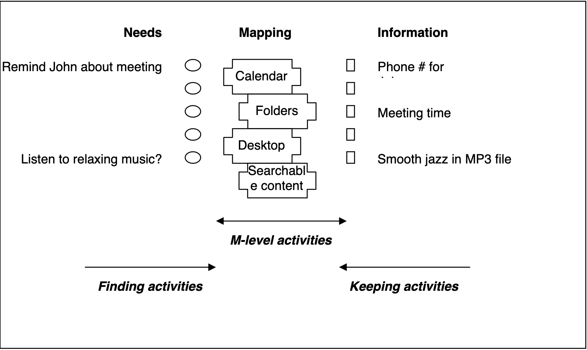

::: {.r-fit-text}
Week EIGHT
:::

# Personal information
Information can be controversial to define. Widespread agreement exists, though, about some properties and uses of information.

## What is personal information?
Discuss!

::: {.incremental}
- With whom it is shared
- Scope of sharing (doctor, spouse, heirs)
- Importance of information (passwords)
- Time value of information (living will, power of attorney)
- Are the URLs you bookmark personal information?
:::

## Definitions from NSF
- In 2005, the National Science Foundation sponsored a workshop on Personal Information Management, attended by many scholars publishing in that field
- Information from it (and several subsequent workshsops) was saved at
  [PIM Resources](http://pim.ischool.washington.edu/index.htm)
- It was two years before the iPhone irrevocably changed the landscape of personal information environments
- Much of the discussion, though, was technology independent and has lasting value
- The next few frames contain definitions from that workshop

## Some definitions
- Information (they punted on this one!) (remember our definitions from day one)
- Information item - a packaging of information, such as an email or webpage
- Information form - classification of information items by the tools used to manipulate them

## More definitions
- Personal information
  - information kept for personal use
  - information about a person but possibly kept by others
  - information experienced by a person

## Yet more definitions
- PSI $\Rightarrow$ Personal Space of Information: all the personal information of one person
- PIE $\Rightarrow$ Personal Information Environment: a collection of personal information and the tools to manipulate it, such as an office or a smartphone
- PIM (Lansdale 1988) the methods and procedures by which we handle, categorize, and retrieve information on a day-to-day basis
- PIM (Barreau 1995) system developed by or created for an individual for personal use in a work environment

## PIM Activities
- Keeping
- Finding and Re-finding
- M-level activities, where M stands for either meta or mapping or maintenance plus organization

## Information and needs

## History
- Physical compartments for scrolls and parchments
- Benjamin Franklin wrote about his struggles with it
- Vanevar Bush wrote "As we may think" in 1945
- Lansdale coined the term in 1988

# Personal information systems

Extensive research over the past thirty years, some of it by [Tom Malone](https://cci.mit.edu/malone/) at MIT and [Susan Dumais](http://susandumais.com/) at Microsoft Research, as well as our own [Jacek Gwizdka](https://jacekg.ischool.utexas.edu/), has explored how people organize personal information.

# Two aspects of personal info
- The knife analogy
- Filers and pilers

::: {.notes}
One example that helps people understand the problem of
personal information is the knife analogy, described
below.

One important finding about personal information
management has been that people are prone to do one or
some combination of these two things: filing and piling.

After reviewing the following topics, conclude the
study of personal information systems by doing the
*share best practices* exercise.
:::

## Knives in the home
- You've just won a complete set of knives
- WHere to put them?
  - One cabinet for knives?
  - Distribute them throughout the home
- Raises question of task context

::: {.notes}
Suppose you have just won a complete set of knives for
your home. Where should you put them? You could have a
single cabinet to store all knives, but it is more
likely that you will distribute the knives to different
rooms, placing them near where they will be used: steak
knives in a buffet in the dining room, cooking knives in
the kitchen, handyman knives in a garage workshop.

When you need a particular knife, it will be in the
context of a current task, such as preparing food,
setting a table, or cutting a length of rope for a
clothesline. In each room, there is some place where the 
tools appropriate to the tasks performed in that room 
are stored.
:::

## Filing: using hierarchies to organize information
Filing refers to organizing items according to
categories or classifications or clusters.
(Researchers define these three words differently.)

::: {.notes}
If a filer looks for information, it is found in a
place where like information is found. That information 
may be in a nested structure containing more general 
information at the higher levels and more specific 
information at the lower levels.

For example, information relevant to your work as a
student may be kept in files on a usb drive in a folder 
called schoolwork. Within that folder may be a separate 
folder for each course, as well as a separate folder for 
administrative documents not related to any given 
course. There might be a folder for each term containing 
a schedule for that term, grades for that term, and 
more. On the other hand, you may divide such folders 
differently: into group work and individual work. Or you 
may organize according the types of files, with videos
in one folder, music in another, and text documents in 
another.
:::

## Piling: using tags to organize information

Piling refers to dumping information where it is most 
convenient. The piler makes no effort to move 
information around. Instead, the piler usually uses tags 
of some kind to find information. The piler may create 
these tags or take advantage of existing tags.

::: {.notes}
For example, Mac users employ Spotlight, a local search 
engine to find files using (mostly) words in the files.  
Those words are automatically indexed by Spotlight into 
a tagging system, especially while the computer is 
otherwise idle. As another example, the IMDB has a file 
containing keywords for each movie recorded---if someone 
cares enough about that movie to type in keywords. You 
can search for a movie by entering any of these 
keywords.

What's problematic about such a system? One issue is 
that a given user does not necessarily know what 
keywords are available to describe a given concept. The 
IMDB tries to overcome this be presenting a display of 
all the keywords that appear in movies that share the 
keyword being searched. How else could you try to 
overcome this limitation?

Another limitation of tags is that words have different 
*senses* so that searches for words like net and rock 
return results that may not be of interest depending on 
whether the search is for tennis or the web or music or 
geology. How can you try to overcome this limitation?  
One way is to use context. For instance, your browser by 
default saves the most recent URL you visited as a 
*referrer* and makes it possible for the administrator 
of the next URL to identify it. If my referrer has the 
string *wimbledon* in it, am I more likely to be looking 
for tennis or the web?

A typical business use of tags can be found in Adwords, 
the main way Google earns revenue. An adword is a tag 
associated with an advertisement. A business can pay to 
be advertised when an adword appears in the Google 
search window.
:::

# Best Practices

## Exercise: share best practices

1. Form an ad hoc group of about four.
2. Share a google doc between you four and me.
3. Each member of the group writes three paragraphs describing your personal information process: (1) what you do, (2) what works well about it, and (3) what does not work well about it.
4. Discuss the resulting paragraphs
5. Write two paragraphs as a group describing (1) what strengths you agree on, and (2) what weaknesses you agree on. An optional third paragraph describes your disagreements.

## Readings

[Wikipedia article](https://en.wikipedia.org/wiki/Personal_information_management)

[FilersVsPilersForbes](http://www.forbes.com/sites/bwoo/2013/02/20/are-you-a-filer-or-piler/)

[FilersVsPilersEconomist](http://www.economist.com/node/1489224)

[Jones2011](http://books.google.com/books?id=byN4SPUt6RgC&pg=PA212&lpg=PA212&dq=filers+vs+pilers&source=bl&ots=d_4Bm_sAaG&sig=78Fkf46OjWKAbNb56L3sUKQfULY&hl=en&sa=X&ei=M5PVUu-eNoLmoAS-kYII&ved=0CEkQ6AEwBDgU#v=onepage&q=filers vs pilers&f=false)

::: {.notes}
Some valuable readings can be found at the above URLs. These were all obtained (except the Wikipedia article) by googling the expression *pilers-vs-filers* and appeared in the first three pages of results.

Note that each of these readings has a different form of
credibility, to be discussed in a later section of the
course. When you use a search engine to discover
information about a topic, you must be sensitive to
issues related to the search engine and to the
information sources linked. Here, I will just give a
brief blurb about each source.

Forbes was a US magazine for decades before it created
an online presence. It cultivates an image as a maverick
business publication, espousing values favoring
considerable social and economic freedom for
individuals, and a blunt style, connecting business
success to individuals rather than organizations.

The Economist is a conservative British weekly magazine.
A policy advisor to US President Clinton once told me
that The Economist is the most widely read publicly
available weekly publication among presidents and prime
ministers of nations worldwide.

The Google Books result is a page from a book
 called *Personal Information
Management*, edited by William P Jones and Jaime Teevan.
This book is a collection of chapters by scholars who
write about information systems. This book
introduces the mainstream academic thinking about
personal information management. It introduces what
scholars who do studies about personal information
management have concluded over the past thirty years of
study.
:::

# Wikipedia does a great job on PIM!

## Wikipedia documents the following
- Senses of personal information
- Personality, mood, and emotion
- Related activities and areas

## Six senses of personal
1. Owned by me
2. About me
3. Directed toward me
4. Sent / posted by me
5. Experienced by me
6. Relevant to me

## Personality, mood, and emotion
- Studies are divided on whether personality predicts personal information management
- Operating system is argued by one study as more predictive
- Personal information management affects mood and is affected by it
- Anxiety is typically expressed with respect to PIM

## Related activitie and areas
- Cog psych and cognitive science
- HCI and human information interaction
- Group information management
- Data, information, and knowledge management
- Time and task management
- Personal network management

# Personal knowledge management
[Hacker News](https://news.ycombinator.com/item?id=17892731) has repeatedly visited the issue of *personal knowledge management* (PKM) with discussions of advice on how to accomplish it. It is instructive to read several of these discussions to see what changes and what remains the same over time.

::: {.notes}
Many posts prescribe particular software packages for PKM. Others suggest practices the authors find useful, such as using the filesystem to organize artifacts. Alarmingly, some authors claim to have practiced their preferred method for as little as a few days! Consequently, it is harder to view these as prescriptions as much as they are viewpoints.

One major issue raised by many of these posters is the problem of link rot. Saving bookmarks to websites may be less effective than copying the entire website.

Bloat can be a severe problem as one poster claims to have a OneNote file of over 8GB that can no longer be synchronized and can not be easily exported. The OneNote user also touches on the problem that proprietary formats bring lock-in. The problem of lock-in may not be apparent until a large investment of time and energy has been made that would be expensive to replicate.

One credible suggestion is to submit bookmarks to public archive sites to overcome link rot and take advantage of distributed storage as well as to avoid proprietary formats and participate in creating a public good.
Distributing storage to the web may reduce bloat but also reduces privacy and increases reliance on an uninterrupted network connection.
:::

## Example: nb
- [nb](https://github.com/xwmx/nb) is on github
- Described there as "a command line and local web note‑taking, bookmarking, archiving, and knowledge base application"
- Discussed on [Hacker News](https://news.ycombinator.com/item?id=33130060) yesterday
- Features: open source, plain text data storage, encryption, filtering, pinning, tagging, search, Git-backed versioning and syncing, Pandoc-based conversion, wiki-style linking, terminal and gui web browing, inline images, todos with tasks, notebooks, folders, color themes, plugins

## Example: nb (continued)
- May need smartphone companion (or may be able to use existing smartphone apps, such as Working Copy or Box)
- Not yet widely discussed on Hacker News
- Is popularity important?
- Is maintenance important?

## Exercise: PKM investigation
1. Divide into groups of about four.
2. Identify an online discussion of PKM.
3. Find the most popular examples of PKM.
4. Post the list to a google doc created by me.
5. Investigate them and report to the class, unless your list conflicts with someone else's, in which case, choose different PKMs.

# Personal Information Curation

## @Whittaker2011
This review of prior research in information science addresses the paucity of work on curation as opposed to consumption.

Whittaker asserts that people seek new information, but that information science is largely silent on what they then do with it.

Whittaker describes a few studies showing that people spend an inordinate amount of time and energy curating personal information.

## @Whittaker2011 (continued)
Personal information considered includes documents, email, photos, and web pages.

Many people spend a long time managing it, even though they rarely exploit it.

The curation lifecycle proposed consists of keeping, managing, and exploiting personal information.

Exploitation is conducted via search or navigation, usually navigation.

Exploitation depends, in part, on information uniqueness and the spectrum from informative vs action-oriented items.

# References

::: {#refs}
:::

---

::: {.r-fit-text}
END
:::

# Colophon

This slideshow was produced using `quarto`

Fonts are *League Gothic* and *Lato*

