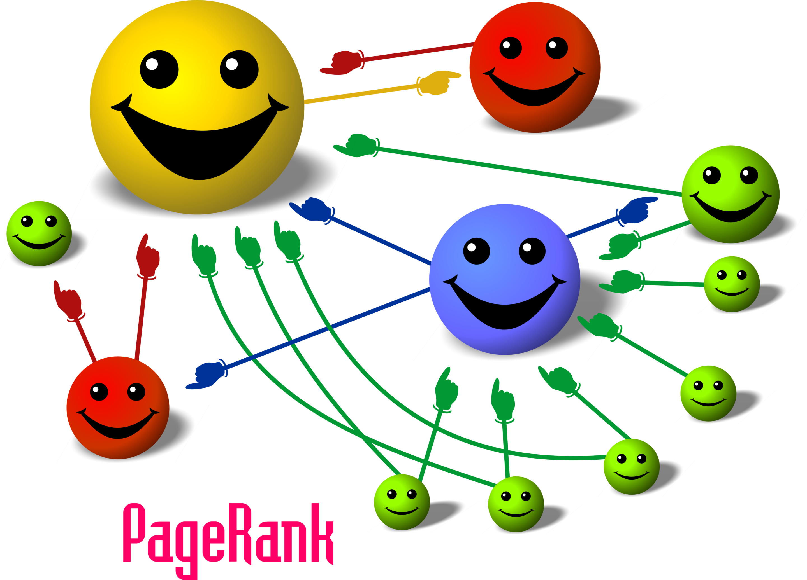
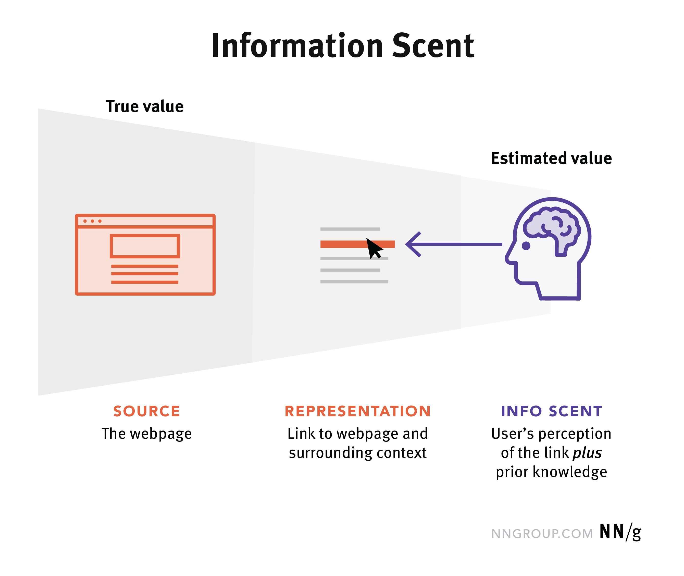
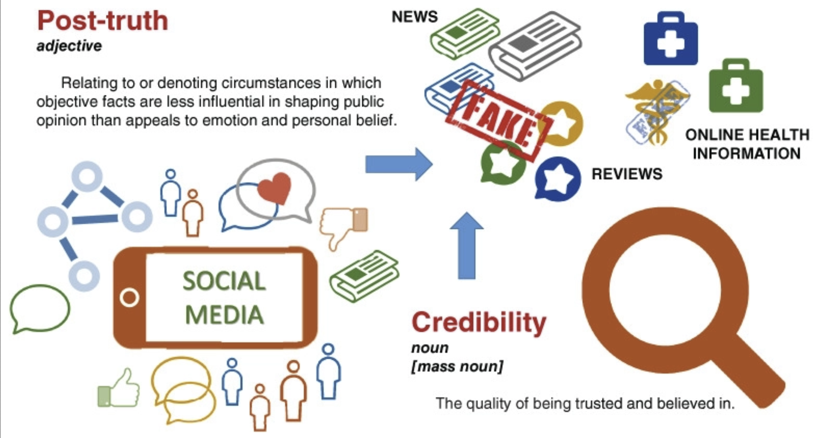
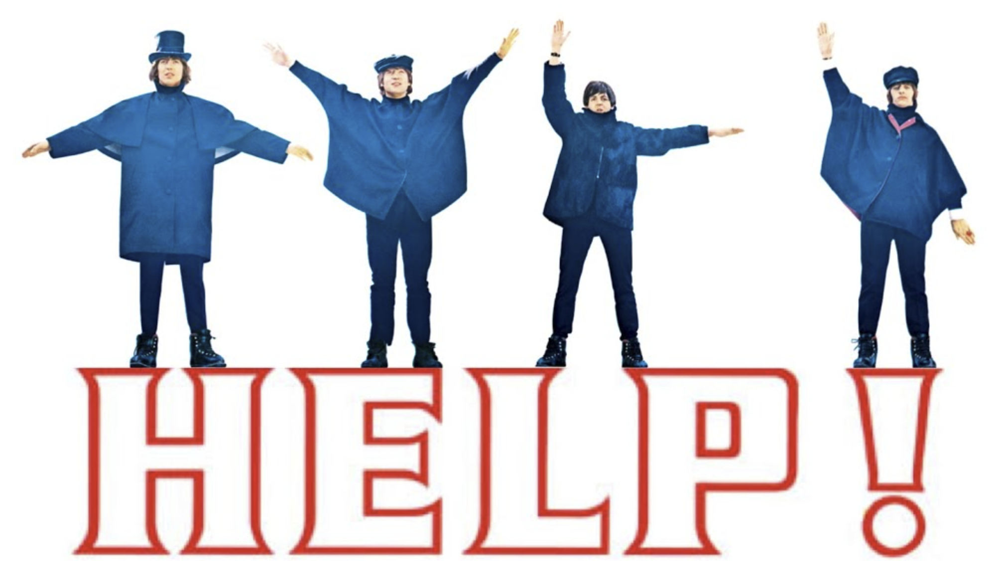
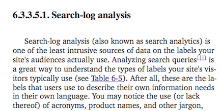
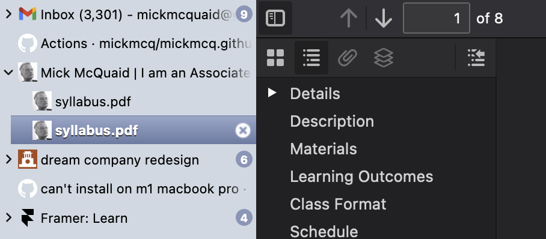
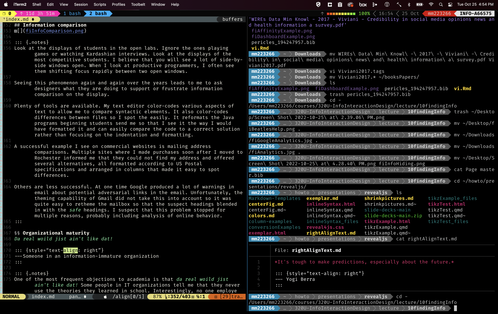

::: {.r-fit-text}
Week TEN
:::

# Finding Information

*In the future, attention will be our most precious resource.*

::: {.notes}
Nearly half a century ago, Nobel Prize winner
Herbert Simon is alleged (the origin of the quote has 
been the subject of some controversy) to have said that 
*in the future, attention will be our most precious 
resource*. He may have meant that so much information 
will be available that we will only be able to pay 
attention to a small fraction of it and that the problem 
of deciding what to pay attention to will become the 
prominent problem of the information-intensive era.

Relationships between businesses and between businesses 
and customers have been transformed by the ease with 
which information can be found online. This 
transformation is ongoing. As an example of current 
change, some retail stores in the mid teens still forbade the use 
of smartphone cameras because they fear the use of 
search engines to make price comparisons. This was 
clearly not sustainable behavior. (To see why this is 
not sustainable, consider the point of view of the 
smartphone user making price comparisons. Is it more 
likely that the smartphone user will eliminate this 
particular store from the selection set or abandon the 
use of their smartphone?)
If behavior is not sustainable, then we have to ask 
whether a steady state will be achieved and, if so, how 
it will differ.
:::

## Search engines
- Revelation of personal information when you search
- What do you think? Should you be compensated?
- Read @Page1999 and Wikipedia on PageRank

::: {.notes}
A person using a search engine reveals a great deal of 
personal information that has value for various stakeholders including business and government.
Some activists believe that individuals should be 
compensated for the personal information they share with 
search engines. They believe that the contribution made 
by users to search engines can be quantified. Others 
claim users are compensated by search results and 
should quit complaining about search engines getting 
rich. But if the value of search results can be 
quantified and the value of user contributions can be 
quantified, policy makers may be convinced that 
consumers are being exploited and may seek to regulate 
search engines. This is one way the search engine 
industry may change in the near future.

Reading: Page and Brin, 1998. The
PageRank Citation Ranking:  Bringing Order to the Web.
[stanford IL pub](http://ilpubs.stanford.edu:8090/422/1/1999-66.pdf)

Also, the Wikipedia entry on PageRank has some wonderful
graphics illustrating the basic concept.
:::

##

##

::: {.notes}
The term *information scent* may be a little confusing 
because it is borrowed from anthropology. It refers to 
the expectation of finding information along a given 
path. The strongest scents represent some balance of the 
easiest catches and the most nutritious meals.

The root concept comes from our primitive ancestors 
foraging for food and using scent to choose paths. When 
the scent stops getting stronger, a given path is 
abandoned.

Similarly, psychologists have found that when the 
expectation of finding information stops growing along a 
given information path, the path is abandoned.
@Pirolli1999 developed a theory of information foraging on this foundation.
The phenomenon drives the propensity of content providers to make themselves easy quarry for information hunters.

The omnipresence of Google as a way for products and services to be 
found has led their providers to focus on providing an 
appropriate information scent online. The result is that 
the web presence for successful enterprises fits into a 
predictable pattern where, to continue the food analogy, 
visitors can get a quick snack, the menu changes 
frequently and predictably, and the dishes are easy to 
find, understand, and digest.

Reading: Tracking the Scent of
Information, APA Monitor, V 43, N 3, P 44.
[Tracking the scent of information](http://www.apa.org/monitor/2012/03/information.aspx)

Further reading:
[Information scent](https://www.nngroup.com/articles/information-scent/)
:::

## Information credibility

::: {.notes}
Further reading and the source of the image is @Viviani2017, online at
[Credibility in Social Media](https://wires.onlinelibrary.wiley.com/doi/10.1002/widm.1209)

Currently, information available online can come from 
obscured or relatively anonymous sources.

Currently, there are low barriers to presenting 
information online. For many reasons, information 
obtained online may not be credible. Using information 
obtained online requires consideration of credibility, a 
concept which has been defined differently by various
communities. Some of the concepts used in describing 
credibility include the following.
:::

## Information credibility concepts

<small>

1. Technical knowledge, skill or expertise
2. Consistency of actions, values, meathods, 
   measures, principles, expectations, and 
   outcomes (definition of journalistic integrity 
   from Wikipedia)
3. Objectivity
4. Pecuniary Interest
5. Agreement with ideas and values held by the 
   recipient
6. Community membership
7. Precision (variance)
8. Accuracy (bias)
9. Falsifiability (using scientific method)

</small>

::: {.notes}
Some of these concepts are discussed in @Rieh2008, where the authors found that college students are mainly interested in whether information is related to a topic and whether it is new, interesting, and convenient. The observed students were less interested in authority, readability, and recency when forming credibility judgments. This contrasts with previous studies of adults where adults were concerned with whether they found information to be accurate, current, novel, objective, reliable, authoritative, trustworthy, understandable, well-written, comprehensive, easy to obtain, and on topic.
:::

## Getting help

::: {.notes}
In a previous era, selection of computer applications 
was contingent in part on the availability of help for 
usage of the applications. Vendors providing 
applications had to determine optimal expenditure of 
resources on help facilities to be viable in the market.

Today, in contrast, the most prevalent forms of help for 
the use of computer applications are Youtube videos and 
user communities.  At this writing I am specifically 
referring to the Youtube service rather than videos 
services in general, based on a 2013 study of online 
video traffic, identifying Youtube's dominance as increasing.

Youtube has created a low-barrier marketplace for help, 
allowing individuals with relatively few resources to 
assess the best opportunities for profiting from the 
provision of help for computer applications. This means 
that institutional adopters of computer applications can 
use the level of available Youtube help as a proxy for 
the *health* of a given computer application, replacing 
possibly tedious and expensive primary research.

User communities spring up around successful computer 
applications and can be used as a cheap and convenient 
way to evaluate those applications in much the same way 
as Youtube videos. Unlike individual videos, user 
communities may transcend individual products or 
individual vendors. An online help community such as 
Stack Overflow thrives on a reputation that transcends 
that of any individual product. The relative attention 
Stack Overflow pays to a given product may serve as an 
index of that product's health.
:::

## Exercise: comparing help for two browsers

<small>

Form an ad hoc group. Identify two browsers, such as Chrome, Firefox, Safari, or others. (Firefox and Chrome are easiest to study because they are heavily programmable and offer a lot of customization possibilities that may require help, such as skinning, global or domain-specific CSS add-ons, and other plugins.)  Contrast the Youtube videos and user communities offering help for the two browsers.

Compare the health of the browsers in terms of instructional videos.
Identify features of videos that alter your perception of the video. This could include things like the presence of ads before the videos (what does that tell you?), logos on videos, tenor of discussions, propensity of video maker to reply in discussions, number and range of videos by maker, presence of features like channels to organize videos, and more.

Compare the communities supporting the two browsers and 
identify differences in focus, emphasis, direction, and 
mission. Be specific about numbers of posts, recency of posts, topics of posts, and other salient features in community forums. What is the attitude of moderators? Do the moderators express an attitude? How transparent are moderation features?

</small>

# Navigating Information

Knowing what's going on is a lifelong occupation. You can not expect to use knowledge you acquired years ago without at least some adjustment today. I wanted to devote a talk to information architecture but the received wisdom on information architecture is outdated. The most frequently cited book on information architecture, Peter Morville's book of 2006, seems in 2015 like a prehistoric fossil. Just now, while checking its date of publication I discovered that it is still a bestseller and that Morville released a new edition in August 2015. Nevertheless, the oft-cited 2006 edition contains the extract in the following frame.

##

A sub-sub-sub-sub-section

::: {.notes}
Yes, search analysis, the most popular tool to shape the structure of information artifacts in 2015 when I wrote this, was little more than a footnote in the principle information architecture book. Moreover, what he says in the first sentence about intrusiveness could not be taken seriously in a post-Snowden world.

This is not to criticize Morville. Other than the new edition of his book, he seems to have put the term information architecture into the background, dwelling instead on the interconnectedness of things.

If we look at other texts on information architecture, the situation is no better. For example, we reviewed information architecture *design patterns* from Donna Spencer. These are not design patterns at all in the sense that Christopher Alexander coined the term, nor in the sense that the Gang of Four (Gamma, Johnson, Helm, and Vlissides) popularized the term.

So, what can we do to improve our understanding and use of the few insights that have been gained in the world of information architecture?

Most easily, we can look at the problems we need to solve. Beyond that, we can examine available tools, both conceptual tools and commercial tools to see what problems are being addressed. But a comprehensive account of information architecture will have to wait, and may only ever appear under a different label.
:::

## Analytics

Pictures accompanying analytics articles always feature a magnifying glass

::: {.notes}
It should be well known that commercial and governmental interests track your behavior in detail. It's nothing new.  Only your awareness of it is new. I knew a prosecutor's assistant in the eighties who pieced together a suspect's day by obtaining (often with the legal right to) access to credit card records, phone records, atm records, and more. She claimed she could locate a suspect to within a few meters any time of the day. Stores used to ask for zip codes of customers paying cash and claimed that they could estimate customer income and other market segmentation information with *scary* precision with just that number, a number customers were only too willing to share in an era when they did not understand the extent to which commercial interests could analyze public census data.

You may even be subject to tracking right now of which you are unaware. For example, you may believe that your computer does not store cookies because you have checked a *don't store cookies* box in a browser. Flash-based commercial sites have figured out a way around this, though. They place LSOs (locally stored objects) on your machine when you visit them (assuming you have Flash enabled) and these LSOs perform, among other functions, the work of cookies. Moreover, most commercial interests are able to examine and decode the LSOs that rivals or partners have left on your system. Since they are not stored in the location of *cookies* and are not defined by the vendors as cookies, your browser's *don't store cookies* box has no effect on them.

I have investigated obscure files and readable strings in obscure files on my own system and am satisfied that I would need to pour sulphuric acid on my disk drive to ensure that no one can see that I've visited `terrorists-r-us` or *Al Jazeera* or `sabotage-yr-employer` or whatever it is that you wish Google or the NSA or your boss did not know about.

The study of online behavior through clickstreams is mature. The study of *conversion*, turning website visits into successful commercial transactions, is mature. The business of brokering information about online behavior is mature, well-documented, and difficult to regulate because of the extreme complexities of business relationships in the field. I have lectured about this extensively in another kind of course, but here I just want to emphasize the ubiquity of the analysis of online behavior.

Understand that widespread analytics tools analyze all your computer behavior. A former student working for Microsoft Office complained to me that he has too much data on Office users. He said he could prove anything he wanted to to advocate for a feature or adjustment by simply selecting the *right* 50 million records to support his case. He was troubled by the fact that the data did not help him decide what he *should* do. Instead, the data were best suited to help him justify whatever he already believed he should do.

Different firms have different approaches to analytics. For example, Yahoo! used to pride itself on the privileged position it accords to individual human judgment in its systems. One reflection of this was that Yahoo! would secretly select a different set of users each day to determine what constitutes spam. If these users treated mail as spam, the system would treat it as spam for all other users. Yahoo! would alter the selection each day according to impenetrable rules, allegedly to prevent spammers from opening junk accounts to game the system.
:::

## Google analytics

The logo for Google Analytics in focus

::: {.notes}
Google uses your work with Google drive to upgrade its word processor every day. If nobody clicks on a menu item, it goes away. If everyone performs a series of clicks that demonstrate confusion, the guidance is changed to minimize the clicks.

Google aspires to store all your personal information. It watches your use of the files for this class and adjusts its navigation features daily. There is no question that it must face the same problem as my former student at Microsoft. I illustrated this in class with the anecdote about the dispute over *Reply* and *Reply-all* in Gmail. There are millions of users representing each side in any argument and sometimes intuition leads us astray.

It surprises some students to discover how easy it is
(A) to obtain analytics tools for free, and (B) to do roll-yr-own analysis of samples of data using conceptual tools rather than commercial tools.
Google provides free tools and will provide a private google engine for your office's network storage for very little money.

Of course, while Google helps you they will also be helping themselves by understanding better how you use their tools, even if you have an agreement that prevents them from examining the contents of data. They often don't need contents to infer important details. I once heard a researcher specializing in communication networks claim that he could easily distinguish between bin Laden planning a family wedding and a bombing campaign from features of the email traffic without any access to the contents of the emails. And I mean traffic, not the identities of recipients. Information has characteristics beyond semantic content and many of these characteristics are exploited in the design of information artifacts.
:::

## Gaming the system

::: {.notes}
You probably know that people try to game google every day. People try to interfere with every major online system. Just this week, a case was publicized where a hacker exploited twitter's ad payments and policies to achieve a social (actually anti-social) end that twitter could not have foreseen by modeling all its advertisers as wanting to make customers happy. See
[gaming twitter to troll](http://arstechnica.com/business/2015/05/how-someone-spent-pennies-to-troll-women-people-of-color-via-promoted-tweets/)

There are fields of study joining computer science and economics called reputation systems and recommendation system and incentive-centered design seeking to minimize the damage from exploits like the twitter troll. Yet, more important than the work of these fields is the simple fact that they exist and that their leaders are sought by eBay, Amazon, and other major players to improve their systems. The results of exposing systems to adversarial use is that they can be made stronger than they could ever be by *a priori* planning.

A key issue for information architecture is that it is possible, though not always advisable, to change information architecture in the face of behavior. This fact means that some planning mistakes may be immediately correctable so there may be some limit to the value of planning. There may be diminishing returns to additional planning beyond some point.

Unfortunately, what I said in the previous paragraph is sometimes used as an excuse to avoid planning due to impatience. If smooth processes are not in place to take advantage of the flexibility of contemporary information artifacts, then the sacrifice of planning is meaningless. I'll say more about this under the heading of organizational maturity.
:::

## Metadata
data about data

::: {.notes}
As we've discussed, metadata is data about data. If you have a customer list that has headings for name, address, and phone, then the words name, address, and phone are metadata, as are any other headings or descriptions of the contents of the lists. There is all kinds of metadata to use in building an information artifact. The exercise in which you sketched artifacts involved contained metadata. For instance, the concept of a receipt is metadata, while the receipts themselves contain data. Even the labels on the receipts like *total* are metadata.

A surrealistic experience in my past was a programming job where extensive metadata was developed, maintained, and hoarded. Guess which of three surprised me the most! Well, it is very hard to develop and maintain metadata so I was really surprised that they were able to find the resources to do that. But when I discovered that metadata was inaccessible to customers, I was more deeply puzzled. How can you justify charging high prices to people so that you have the resources to work with metadata? The only way is to make use of that metadata in a way the customer can appreciate.
:::

## Information Architecture

<small>

The Information Architecture Institute offers the following definition of information architecture in their pdf, referenced in the Wikipedia article on Information Architecture.

We define information architecture as

- The structural design of shared information environments.
- The art and science of organizing and labeling web sites, intranets, online communities, and software to support usability and findability.
- An emerging community of practice focused on bringing principles of design and architecture to the digital landscape.

</small>

::: {.notes}
This definition troubles me for several reasons. Part 1 is too vague and part 3 is too self-serving. Part 2 seems the best except that there is not a demonstrable art or science to information architecture and usability is the province of all designers. Really the only word in the definition that makes sense to me is *findability*. This is the key contribution of information architecture as far as I can tell. I would therefore define information architecture as the collection of techniques used by the builders of information artifacts to improve the findability of information.
:::

## Information architecture tools
- conceptual
- commercial

::: {.notes}
One way to classify tools is to divide them into two kinds, conceptual and commercial. A flowchart is an example of a conceptual tool. Balsamiq is an example of a commercial tool. I claim that conceptual tools are vastly more important than commercial tools, although I can rarely convince students of that. Perhaps I should claim that durable tools are more important and point out that you can not be sure which commercial tools are durable. The most popular commercial tool of yesteryear is largely forgotten today.
:::

##

::: {.notes}
If you look at the tools on the Information Architecture Institute website, they remind me of Baby Busy Box, available on Amazon and offering hours of absorbing activity! They are commercial tools and templates, slide shows and checklists. They tell us about the needs of people building information artifacts but they can not fulfill those needs. They are worth examining to help focus a discussion but there is no clear evidence that they solve problems. Take for instance the so-called design patterns product. Like the Spencer book, it does not show anything that we can truthfully call a design pattern. Instead, it contains examples of screen elements, such as menus.

So we can identify some needs, such as information hiding, information comparison, and information mapping from this website.
:::

## Information hiding

::: {.notes}
We need to focus. We suffer from distraction. We want to expose only the information we need right now. And when I say us, I include others living in the privileged world of connected information. I just heard a BBC radio program that began with Bansuri flute music from India. The host asked the panelists how it made them feel. Every single one of them began by praising the music as a respite from their busy lives, then each one sharply veered into a critique of the Internet, contemporary technology, 24/7 connectivity, and devices in general. Wow! Well, at least they made it clear that anxiety may be produced by information availability.

You may notice that, when I display a browser window in class, there is usually a tab list on the left side. You may have noticed that the tabs are grouped and that only the top tab in each group is visible if my browser is focused on a page from a different group. That is an example of information hiding.

I use a folding text editor, another example of information hiding. A folding editor allows me to hide part of the file I'm editing under a *fold*. It is conceptually like folding a letter to expose, say, the salutation and signature while keeping the body hidden. One way I use it is to show all the boldface headings in this document and only show the body text of one heading at a time. This helps me see my place in the overall structure.

Menus are examples of information hiding. The design of a menu represents choices about which information to hide at a moment when other information is exposed.

All this suggests you need to know which information to hide and when before you think about specific tools for information hiding. You need to know which information matters when and why. Within the past 72 hours I as a consumer have undertaken an online transaction that went through several steps, represented in part by a numbered list at the top of the display and separate pages shaded to focus on each step of the display---and some of the information needed on one panel was trapped on another panel, while irrelevant information was available on the panel I could not complete. What is the problem? Do they not see from clickstreams that their users have to go back and forth between these panels to convert? Do they not do walkthroughs with their wireframes? Is management so brittle that they can not easily fix things they notice? Or have thay not considered information hiding? I, as the customer, can not see inside the black box. All I know is that there are a number of ways any complicated commercial experience can go wrong.
:::

## Information comparison

::: {.notes}
Look at the displays of students in the open labs. Ignore the ones playing games or watching Kardashian interviews. Look at the displays of the most competitive students. I believe that you will see a lot of side-by-side windows open. When I look at productive programmers, I often see them shifting focus rapidly between two open windows.

Seeing this phenomenon again and again over the years leads to me to ask designers what they are doing to support or frustrate information comparison on the display.

Plenty of tools are available. My text editor color-codes various aspects of text to allow me to compare syntactic elements. It also color-codes differences between files so I spot the easily. It reformats the Java programs beginning students send me so that I see it the way I would have formatted it and can easily compare the code to a correct solution rather than focusing on the indentation and formatting.

A successful example I see on commercial websites is mailing address comparisons. Multiple sites where I made purchases soon after I moved to Rochester informed me that they could not find my address and offered several alternatives, all formatted according to US Postal specifications and arranged in columns that made it easy to spot differences.

Others are less successful. At one time Google produced a lot of warnings in email about potential adversarial links in the email. Unfortunately, the theming capability of Gmail did not take this into account so it was quite easy to retheme the mailbox so that the suspect headings blended in with the *safe* headings. I suspect that this problem stopped for multiple reasons, probably including analysis of online behavior.
:::

## Organizational information maturity
*Da real woild jist ain't like dat!*

::: {style="text-align: right"}
---Someone in an information-immature organization
:::

::: {.notes}
One of the most frequent objections to academia is that *da real woild jist ain't like dat!* Some people in IT organizations tell me that they never use the theories they learned in school. Interestingly, no one employed at Google or Apple or Microsoft or Adobe tells me that. Instead, people at the most competitive firms often ask extremely probing questions at the limits of academic knowledge. So I must suggest that you consider the maturity of an organization before labeling its place in the real world. There are maturity metrics in all brances of information technology. I recently came across one described by Brian Krebs, the person whose blog you should read regularly if you read nothing else about information security. See
[security maturity](http://krebsonsecurity.com/2015/04/whats-your-security-maturity-level/) and note that this model is easy to understand and verify, having three levels.

@Proenca2016 surveys twenty-two information systems maturity models. These models have an average of about five levels of maturity described and contain definitions for maturity of management of the information resource, as well as prescriptions for attaining higher levels of maturity or at least characteristics of organizations having varying levels of maturity.

One example is found in @Spruit2015, which surveys models of master data (this is data used as a reference by an organization about persistent objects, such as employees and customers) and arrives at a five-level model: initial, repeatable, defined process, managed and measurable, and optimized. An example of an optimized organization might be Amazon, where each business unit is required to have an \textsc{api} allowing other business units to access its information services.

No matter what a prospective employer tells you, the telltale signs in a maturity metric table speak clearly to organizational maturity with respect to information. You have to identify the relevant signs for the way information is treated in the enterprise. For example, you should ask about metadata and not be satisfied by vague answers like *we should do a better job on metadata*. The same is true for tools, both conceptual and commercial. If an organization uses deskilling tools and outsources critical skills, its information maturity level must be low.

You may, however, wish to work in a low maturity organization if you are being brought in as an educator and have the latitude within your job description to improve the information maturity of the organization. A high information maturity organization might be better suited to a junior employee, interested in learning from an optimized environment.
:::

# References

::: {#refs}
:::

---

::: {.r-fit-text}
END
:::

# Colophon

This slideshow was produced using `quarto`

Fonts are *League Gothic* and *Lato*

