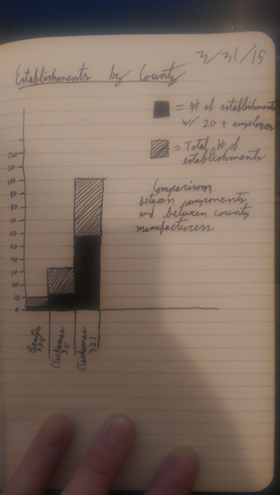

::: {.r-fit-text}
Weeks ELEVEN and TWELVE
:::

# Visual Information

## Bertin

〈 Pause for Bertin slideshow 〉

## Visual information example

Thanks to the two students who worked with me on this study of one student's solution to the Bertin exercise. This study is more detailed than what I expected you to do in class but serves to illustrate the process.



## The Invariant

The invariant is represented by the title

::: {.notes}
The invariant should be reflected in the title of the information graphic. If it is not included, or if it can be improved, it is appropriate for the critique to include a suggestion. In this case, the invariant seems to me to be *Number of establishments by Size, County, and NAICS*. Both the content and the order of this invariant matter, as will become clear in the following paragraphs. This invariant appropriately summarizes the information graphic.

Having critiqued the invariant and suggested a solution, I am in a position to answer the first of the three questions I ask you to consider for every exercise, whether the student has tackled a worthy problem. Certainly I believe that this is the case here because it is of interest to a great many people to summarize economic activity of a state by number of establishments, size of establishments, specific county of establishments, and kind of establishments. (The NAICS, which stands for North American Industry Classification System, is a standard for describing kinds of businesses). This is not a controversial claim because a great deal of policy and economic activity depends on such summaries.
:::

## The components

The components are the things that vary in the graphic

::: {.notes}
The components are represented in the information graphic and one way to identify them is to see what is displayed. The $x$ and $y$ axes are frequently used to explore the most important components. Here, the $y$ axis displays the number of establishments, an integer ranging from 0 to 700. The $x$ axis displays bars representing combinations of counties and NAICS codes.

I have mentioned that each component should have a legend. The above components don't really have a complete legend, although Bertin would consider the axis labels to be part of a legend.

There is one legend. That legend depicts two categories of size, so size is the remaining component. We could make different claims about the characteristics of the retinal variables involved in this component and we will do so later.

For now, let us list the components along with their orders, lengths, and levels. Remember that order refers to raw numbers or percentages (usually based on population or area), length refers to the number of objects being represented, and level refers to nominal, ordinal, or quantitative measurements.

Number of establishments is an integer, evidently ranging from 1--700. Its order is raw, its length is either 700, the total number of establishments in a county/NAICS combination or the total number of establishments overall. Its level is quantitative because we can easily say that twenty establishments is twice as many as ten establishments. In other words, we can form a meaningful ratio between measures of the component.

Size has the order raw because it refers to number of employees rather than number of employees as a percentage of available working age population, for instance. Size has length 2 because we can only distinguish between establishments with fewer or more than twenty employees. Size is of ordinal level because we can say that an establishment in the 20 and over category is larger than an establishment in the under 20 category but we can't say how much larger given this information.

County is of raw order, of length either 7 (represented) or 36 (available in the entire state), and of level nominal because one county is not countier than another. Note that an attribute of county like name is ordinal in an alphabetical sense and an attribute of county like area is quantitative. All this component does, though, is to identify counties.

NAICS is a little trickier. I will call its order raw because of the way we use it here, but each code represents a location in a hierarchy of specialization so another interpretation might be arguable. Its length could be construed as the number of different codes represented in the graphic or in the state or in the entire catalog. Its level is also tricky because of the hierarchical ordering of the codes. I will call it nominal for our purposes because I have seen no evidence that it is meant to be used in another way.

To critique the components alone is simply to say whether they make sense as components of this graphic. More important is to critique their representation by retinal variables and to see if they are well matched to their retinal variables and whether better use could be made of the retinal variables *used up* by each component.
:::

## Retinal Variables

The retinal variables are the things that form an image on our retinas

::: {.notes}
Bertin describes the retinal variables in a dense, 438 page book, originally published in French in 1967 but widely discussed in other languages and recently printed in English as @Bertin2011. There is a lot to say. Nevertheless, we will consider the retinal variables depicted in the slide show at a very basic level. The retinal variables include size, value, texture, color, orientation, and shape.

Three of the retinal variables here are described on the axes by bars. Bar height is very well matched to an integer ranging from 0 to 700, so I regard the use of the *y* axis to describe number of firms as successful. There is no other component as well suited to representation by bar height in the data.

County and NAICS are both described on the *x* axis by the bar names. A tractable number of combinations has been shown. One shortcoming of this graphic is that there are not instructions to the assistant mentioned in the assignment spec. Recall that you were contributing a sketch and instructions to someone polishing the graphic. There is not enough to go on. This, among other issues, has led me to rethink the picture / word ratio constraint on sketchbooks. Instead, I would like to use picture amount and let words appear as needed without penalty.

One question about the components County and NAICS, is whether they should be considered as one component or separately. That will remain an open question for now.

Finally, we come to the Size component. The representation of this component allows a number of interpretations.
We could refer to the choice of solid black and diagonal hatching as values, since one can be interpreted as black and the other as gray. We could also regard them as colors gray and black. We could also regard them as having orientation in the case of the hatching versus no orientation in the case of the black. Finally, we could consider them has having texture since we could call the black smooth and the hatching ridged.

One point Bertin makes about using more than one retinal variable to depict a component is that retinal variables may reinforce each other or be in conflict with each other. In the latter case, cognitive dissonance may be produced in the mind of the viewer. From Bertin's perspective, cognitive dissonance is always bad. Many people who produce information graphics seek to produce cognitive dissonance for reasons involving persuasion. For example, the information graphics produced by opponents of the health care plans of two recent US presidents have been designed explicitly to create cognitive dissonance in the minds of viewers. This usage stands outside Bertin's system which seeks only to support immediate answers to simple questions about information.

In this case, my reading is that the various retinal variables work together, reinforcing a consistent reading. It is not surprising that diagrams of this style may be seen in many publications. They serve an informative purpose.
:::

## Bertin's Theory

It should not be surprising that information design owes so much to a cartographer. This is one of two fields, the other being social network analysis, with the most influence on building information containers today. The remaining sections of this chapter explore Bertin's theory of information graphics.

## Theories

The word theory is used to mean many things. To obtain a useful definition,
it might be helpful to consider what Stephen Hawking
says about theory in *A Brief History of Time* on page 7.

\begin{quotation}
A theory is a good theory if it satisfies two
requirements. It must accurately describe a large class
of observations on the basis of a model that contains
only a few arbitrary elements, and it must make definite
predictions about the results of future observations.
For example, Aristotle believed Empedocles's theory that
everything was made out of four elements, earth, air,
fire, and water. This was simple enough, but did not
make any definite predictions. On the other hand,
Newton's theory of gravity was based on an even simpler
model, in which bodies attracted each other with a force
that was proportional to a quantity called their mass
and inversely proportional to the square of the distance
between them. Yet it predicts the motions of the sun,
the moon, and the planets to a high degree of accuracy.
\end{quotation}

Note that Hawking is giving what we might call a
normative definition, telling us what a theory
*should* be.  There might be plenty of things
parading around under the theory banner that could be
classed as bad theory.  Note also that Hawking requires
that a theory both describe and predict. Bertin does both of these
things, with a detailed description of graphical information and using
a concept called efficiency to predict outcomes.

## Efficiency
Bertin defines efficiency as a measure of how quickly the process of reading a graphic can be completed and defines the process in some detail under the influence of (then) contemporary philosophy.
Let's read some information graphics now to get an idea of what this might entail.

::: {.notes}
It is important to understand that the above definition and review of information graphics is meant as scaffolding on the way to understanding efficiency. The precise definition of efficiency,
quoted from Bertin, is *If, in order to obtain a correct and complete answer to a given question, all other things being equal, one construction requires a shorter observation time than another construction, we can say that it is more efficient for this question.*
This is a measurable, precise definition. Bertin characterizes it as implementing Zipf's notion of mental cost.

Efficiency alone could be abused, so Bertin augments with some additional concepts. How do you think efficiency could be abused? What processes could be described to augment efficiency? (See Semiology of Graphics, p. 166 for an example.)
:::

## Categories of information graphics
Bertin describes four categories of graphics: diagrams, networks, maps, and symbols.
It is the use of the last three categories, coupled with the detail in Bertin's theory, that persuade me that here is a good foundation for describing information architecture.

## Symbols


::: {.notes}
Symbols establish a correspondence between a single element on the graphic plane and something external to the graphic, through immediate recognition. Symbols are used extensively in information architecture and Unicode offers a flexible way to represent 113,000 currently defined symbols in type, along with a plan for annual additions with a limit of about 1.1 million symbols using the current international agreements.

Here I am using the word flexible to mean that typographic glyphs are represented by curves that can be completely described by a short series of numbers in a specified order. If you have used Bezier curves in Photoshop, you know how to determine very complex shapes by specifying the location of a few *control points*. This same principle allows for device independence, arbitrary scaling of size, advanced algorithms for micro-kerning and other processes that depend on the relative locations of glyphs.
Thus, typographic symbols are ideal vehicles for multimodal information representation in handheld, wrist worn, or desktop display.
:::

## Diagrams


::: {.notes}
Briefly, Bertin calls diagrams the constructions on a plane where correspondences occur between one component and another. I don't want to say more here because diagrams are more the domain of information content than navigation.
:::

## Networks


::: {.notes}
Bertin describes networks as the correspondence on the graphic plane between the divisions of one component. The underlying component is usually people in a social network but is usually represented as emails, texts, phone calls, links, or anything else that points from one object of a certain kind to another object of that kind.

Bertin's advice about the representation of networks dates from the 1960s, before the dawn of social network analysis. Nevertheless, he specifies the process of portraying a network that highlights the problem that still vexes practitioners today. First, establish the correspondences and second, identify the representation of the correspondences with the fewest intersections. In Bertin's book, he displays networks with only a dozen or a few dozen nodes. Most of the network representations of today suffer from the production, in the first step, of correspondences numbering in the billions between divisions (people or websites) numbering in the hundreds of millions.

Plenty of algorithms have been developed to accomplish step two of the above process. Many are inventoried at
[graph drawing](http://en.wikipedia.org/wiki/Graph_drawing).

Bertin claims that any network may be converted to a diagram by the addition of one or more components. He gives the example of speakers and listeners as two components and demonstrates their portrayal with a bipartite graph and an incidence matrix.
:::

## Maps


::: {.notes}
Maps are exactly like networks except that a geographic order is imposed. The process for creating a map requires the reproduction of the geographic order first, and recording the correspondences second.

Although the network may be easily converted to a diagram, the map introduces a geographic ordering to the graphic plane that is disturbed by the addition of another component. Thus, I suspect that Bertin would call the graphical constructions based on the famous NYC subway maps diagrams rather than maps. In most cases, these constructions only superficially resemble a map in the sense that no geographic ordering occurs. Nevertheless, the notion of a map and the rules of cartography are deeply appealing to people, perhaps because of our hunter-gatherer past.

The lack of flexibility in maps is a key feature. The fact that additional components disturb the geographic ordering renders maps useful for navigation but diminishes their navigational usefulness if they are transformed into diagrams. This characteristic explains both the advantage and limitation of map-like navigational aids in information artifacts. If you map your information architecture as a flow chart, for instance, do you impose a geographic ordering on the 2D plane? If you do, you drastically limit the flexibility of the flow chart to represent abstract concepts but may enhance its use in describing flow.

Do you regard bread-crumb trails as maps or networks? Every single bread-crumb trail I have ever seen on a website follows a horizontal left older right newer path. Every single one I have ever seen in a menu follows a vertical down older up newer path. Each crumb offers only a click to return to it or perhaps a tooltip to provide a more complete name. The bread crumb trail has defied HCI researchers trying to evaluate its effects. Might Bertin's theory help us to understand what user studies have not?
:::

## Simplification

Recall my earlier question about adjuncts to efficiency. The main adjunct in my opinion is an exhaustive depiction of what it means to simplify information using retinal variables at the most detailed level possible.

::: {.notes}
By far, the greatest value in *Semiology of Graphics* is, in my view, its scope. Much of the book contains the tools to describe the mechanisms of simplifying information. These are the retinal variables and their operation in a 2D plane. It is only by working extensively with these variables that you can build information artifacts that are more than randomly navigable.
:::

##


A Picasso nude exemplifies simplicity

## Example: Swim lane diagrams


::: {.notes}
Swim lane diagrams are used as a project management tool
in IT. At a minimum, they portray roles, tasks, and handoffs.
The name *swim lane* arises because they look
like a swimming pool divided into lanes with a start and
finish. Each role has a lane in the pool. Each task is
rectangle inside a lane. Each handoff is an arrow from
one lane to another.

Here is an example from
[processmodeling.info](http://www.processmodeling.info/posts/swimlane-lane-or-pool-learn-to-swim-first/)
containing additional symbols specific to Unified
Modeling Language.

This diagram shows three roles: accounting, hiring
manager, and human resources, as well as five tasks:
create job requisition, conduct interviews, setup
payroll, and give first day briefing. The diagram has a
beginning and an end and is read from left to right. A
top to bottom version would work just as well but there
must always be the sense that the diagram shows some
process that has a definite start and stop and a sense
of time precedence among the tasks.

The swim lane diagram is one of many project management
tools. It's so successful that you can image google it
and find many versions of it. You may be subjected to
refinements of it in the workplace, but here let's just
consider what they all have in common.

*How can you produce a swim lane diagram?*

The basic swim lane diagram should be easily understood
by any worker in one of the roles displayed. The diagram
may be drawn by asking someone in each role what they do
and where their handoffs are. To construct a swim lane
diagram, therefore, requires some skill in eliciting
information from people about what they do. People find
it notoriously difficult to describe what they do unless
they are doing it. Interviewing someone about their job
usually leaves critical gaps.

When visiting a worker to get help with a swim lane
diagram, it's a good idea to construct a diagram before
you visit them. It is easier to correct a wrong diagram
than to start from scratch. It also conveys to the
person that you have been trying and need their help,
rather than that you are trying to slough work off onto
them.

The diagram you present to someone should not look
polished. If possible, do it in ballpoint pen on cheap
notebook paper. The reason to do this is to make it
clear that you don't believe the diagram is finished. If
you produce a pretty diagram with fancy software and
print it in color, the worker you interview may be more
reluctant to change it than if it looks like something
you did not intend as a finished product. Decorations
are not helpful in eliciting information that would
cause the decorations to have to be redone.

There should be a lot of room on the page that you
present to a worker and you should hand them a pen or
pencil of a different color than what you've already
drawn so that afterward, you can distinguish between
what they've added and what you've added.

It may be better to visit alone or with another team
mate. If you're interviewing a less experienced worker,
they may be more intimidated by multiple visitors. On
the other hand, a more experienced worker may have so
much information to share that you need one team member to
talk to them while another takes notes.

Recording an interview may reduce the candor of the
worker being interviewed. If you must record, 
put the recorder within easy reach of the worker and
invite them to turn it off if they want to say something
off the record. Be aware that, if they turn it off at
some point, they are unlikely to turn it back on for the
rest of the interview. I take it as a signal that the
recording makes them uncomfortable and I don't ask to
turn it back on later.

Be prepared with extra paper if the interviewee wants to
start over from scratch and be sure to have a camera or
time to copy in case they prefer to work on a
whiteboard.

One skill that's hard to teach is to know when to
interrupt. If you don't understand something, you should
ask about it as soon as possible but, if you disturb the
flow of the interviewee's thinking, you risk never
getting the info that would have flowed just after the
interruption. Before you interrupt, you should have a
good idea of how to proceed after the interruption is
finished.

One luxury you may not have is to revisit the same
worker after some other interviewee has modified what
they've said. I have had this experience where two
people involved in a single process have conflicting
views of their roles. This presents an opportunity for
process improvement that is beyond the scope of this
discussion but a likely application of this tool in the
workplace.

An exemplary swim lane diagram

Hanna Jung, a brilliant designer, shows an impressive example of
a swim lane diagram at
[tracking civic theater volunteers](http://www.hannajun.com/aa1.jpg)
where she also includes some additional symbols related
to *pain points* in the process. Since I worked
with Hanna Jung in the past, I should add something you
can learn from her. Although she excels in many, many
ways, one thing that you can see within a few minutes of
watching her work is that
she begins solving problems as soon
as they present themselves and organizes her time and
that of others to maximize impact. I've met many
students who work hard, but can only think of two other
students out of a thousand who can do as much in as
little time as Hanna Jung. When others are still getting
started, she is close to finishing. And when she's
finished, she reviews her work and that of others to
decide whether to polish it or move on to the next
problem. She never wastes time overthinking a problem.

I believe that she achieves this success through
polishing her problem solving process. She determines
how much time is available to solve a problem and
divides the time into steps so that she won't get so
bogged down in one step and fail to make it to the end.
She writes or draws her initial plan clearly and invites
others to join her, thinking about what she knows of
their skills and how they could contribute. Then she
ruthlessly sticks to the plan, moving on to step two
even if she's not satisfied with step one. This way,
there's still time to go back to the beginning if there
has been a false start. If she goes back to the
beginning, she replans all the steps with the remaining
available time. All her planning seems to take less than
a couple of minutes for the length of assignments that
are given in school, but that is because she refines the
planning from course to course.
:::

# Visual Design of Information

## Different perspectives drive different views

When we analyze what people see, we bring a perspective, in part based on where we are and what we do. Think about some bases for your perspective on the visible variables in presenting information, such as professional, cultural and biological.

## An important perspective
*When art critics get together they talk about Form and
Structure and Meaning. When artists get together they
talk about where you can buy cheap turpentine.*

::: {style="text-align: right;"}
--- Pablo
Picasso

quoted
by Steve McConnell,
*Code Complete* (1993)
:::

## Another perspective

*Modern philosophers have had little to say
about the nature of aesthetic interest; ... The
concentration has been on the philosophy of art, and in
particular on puzzles created by boring impostors like
Duchamp: is this signed urinal a work of art? etc.  This
makes for an exceedingly dull literature, devoted to
questions which can be answered in any way while leaving
everything important exactly as it is.*

::: {style="text-align: right;"}
---Roger Scruton, *Modern Philosophy* (1994), p. 589
:::

## Essence

Several famous pictures in the twentieth century illustrate the quest to depict the essence of things. The difficulty of doing so and the effort required to see the essence before depicting it can be found in a series of lithographs created by Picasso in a short period of time. There are essays about this series available online and many versions of pictures of them. This particular version is chronologically read first from left to right then top to bottom.

##


## More on Essence

There are many ways to interpret the word essence in the above series and I leave that to the essays mentioned above, that discuss the bull as the essence of masculinity or of Spain itself. Let me just add this proposed Olympics poster, undoubtedly influenced by Picasso in particular and Cubism in general.


## Gestalt principles

<small>

- proximity: proximate images form a group
- similarity: similar images form a group
- closure: perception completes images that appear to have missing parts
- symmetry: perception links unconnected symmetric images
- common fate: images perceived to have common fate (follow a path) form a group
- continuity: continuous images form a group
- prägnanz: images that seem to work well together form a group

</small>

::: {.notes}
In 1923, Max Wertheimer published principles of visual grouping (in German) as follows. These principles were later widely translated and influenced people in a wide range of professions and cultures. The Gestalt psychologists themselves made extensive contacts among artists and scientists the world over. They were dispersed from Germany and never re-coalesced into a group in their lifetimes so the magnitude of their influence on others is not always clear in history books. In addition to the following short list, they formulated many other principles they shared with artists of the Bauhaus and famous scientists in various disciplines.
:::

##


##


##


## Dieter Rams

<small>

- Good design is innovative.
- Good design makes a product useful.
- Good design is aesthetic.
- Good design helps us to understand a product.
- Good design is unobtrusive.
- Good design is honest.
- Good design is durable.
- Good design is consequent to the last detail.
- Good design is concerned with the environment.
- Good design is as little design as possible.

</small>

::: {.notes}
An industrial designer often cited as the
primary design influence on 
contemporary Apple products, Rams articulated the following
design principles, often quoted in popular media.
:::

## Edward Tufte

- Comparisons--Show comparisons, contrasts, differences
- Causality, Mechanism, Structure, Explanation
- Multivariate Analysis---Show more than 1 or 2 variables
- Integration of Evidence---Integrate words, numbers, images,
      diagrams
- Documentation---label what data you have and measurements,
       etc.
- Content Counts Most of All---depend on quality, relevance,
       and integrity

::: {.notes}
Formerly a public policy scholar, Tufte has carved out a
career publishing coffee-table quality books, such as @Tufte2001,
about quantitative graphics. For years, he promoted a
principle called *data ink ratio maximization*. The
principle sought to evaluate graphics by comparing the
ink expended on portraying data and the ink expended on
other purposes, such as meaningless decoration. This
turned out to be a problematic principle. What do you
suppose could possibly go wrong with it?

More recently, Tufte has promoted the above list of
principles, found in the chapter
"Fundamental Principles of Analytic
Design" *Beautiful Evidence*, pp 123--155.

Tufte's work is characterized in part on a reliance on
high-resolution print media. His books are published by
a fine art press and he advocates against
powerlesspoint-type slide shows, claiming that their
information density is too low to match the cognitive
capabilities of humans. He suggests instead that
speakers produce high-resolution pictures to be printed
and provided to audiences to accompany talks instead of
what he calls pee pee pfluff.

Tufte's advocacy began when slide shows were being
projected using lcd technology, capable of about
$640\times 480$ pixel resolution and a brightness of a
few hundred
lumens, displayed on makeshift screens
(often no more than white walls) at sizes of perhaps a
hundred inches diagonal. As I write in 2017, there are
mainstream phones with a
3,820 $\times$ 2,160 pixel resolution on a
daylight-readable screen of about a 5.7 inch diagonal
(specs of Sony's Xperia Z5 Premium). Do you think this rapid
advance in display technology affects or should affect
Tufte's advice?
:::

## Contemporary Perspectives on Design Principles

::: {.notes}
One set of contemporary perspectives on design principles can be found in a recent seven-part series on *Smashing Magazine*. I provide these ephemeral links not so much as an endorsement of the views expressed as much because you need to know what others are thinking. As much as I am loath to share links due to link rot, it is vastly easier to find work of this kind than contemporary books (although I believe the author of this series of posts is extracting from his own book), especially with the conversation that takes place in the comments.

\url{https://www.smashingmagazine.com/2014/03/28/design-principles-visual-perception-and-the-principles-of-gestalt/}

\url{https://www.smashingmagazine.com/2014/05/16/design-principles-space-figure-ground-relationship/}

\url{https://www.smashingmagazine.com/2014/09/22/design-principles-connecting-and-separating-elements-through-contrast-and-similarity/}

\url{https://www.smashingmagazine.com/2014/12/12/design-principles-visual-weight-direction/}

\url{https://www.smashingmagazine.com/2015/02/27/design-principles-dominance-focal-points-hierarchy/}

\url{https://www.smashingmagazine.com/2015/04/29/design-principles-compositional-flow-and-rhythm/}

\url{https://www.smashingmagazine.com/2015/06/design-principles-compositional-balance-symmetry-asymmetry/}
:::

## Get a GRIP and forget about CRAP

- grouping: group like elements together; separate disparate elements
- restatement: clarify meaning by repetition
- implied lines: align objects to minimize visual distraction
- popout: make some objects appear more prominently than others

::: {.notes}
Practitioners sometimes use the unfortunate acronym
CRAP, standing for contrast, repetition, alignment, and proximity. As far as I am concerned, CRAP is crap and I will
deduct points from any assignment that uses it. If you
say you did not see this I will deduct additional points
for failure to read required materials. If you require
an acronym for the concepts covered by that poorly
conceived acronym, I will accept GRIP:
:::

# Visual Information Components
- Color
- Typography
- Layout
- Animation

# Color

##

::: {.r-fit-text}
〈pause for color video〉
:::

## Problem: App in video ceased to exist!
- Taken off App store
- Replaced with a paid website
- Seems to invalidate much of the reason for making it an iPad-only app
- I've written to the developers with no response

##

Color is an enormous concept, recently explored in the CHI community by @Shugrina2019. It can be the subject of entire semester-long courses in several disciplines, including psychology, neurology, biology, and optical science.

I would like to limit my further discussion to two issues among the very many that should be of interest to you as designers. The first is education about color and the second is color words.

## Education about color

Josef Albers was without peer in educating art students about color in the twentieth century. His kit, often referred to as a book, is called *Interaction of Color*. Its most important sentence is perhaps "Color is the most relative medium."

::: {.notes}
I had read a popular paperback edition of the book years before I ever saw the actual kit, which consisted of a box full of colors on various kinds of paper, cardstock, and other materials, along with a guide book, a version of the paperback I had read.

Albers conceived of education about color as putting different color cards together in different configurations and examining the effects of these configurations on the student's perceptions of color. This kind of education can not be conveyed in a book alone. It is difficult not only to rearrange the colors but also to control the actual printed colors. Believe it or not, it is quite expensive to reproduce intended colors with any kind of precision in a mass printing. No wonder William Blake preferred to produce his books by hand! (Okay, he had other reasons, including the desire to master all the related arts and the desire to ensure that the final product would have a luminous quality achievable only with the use of watercolor.)

There is now at least one version and perhaps more versions of *Interaction of Color* available electronically.
For years it was a daunting task because only the most expensive monitors could reproduce colors well. Now it seems that at least someone believes in the color fidelity of the iPad enough to release the rights to produce a version in that medium.
:::

## Color word research

##

Following are quotations from
[color word research](http://www.putlearningfirst.com/language/research/colour_words.html)
contributed by a previous student.

<!--  -->


##

The website mentioned on the previous slide continued as follows:

*A prominent doctrine in linguistics and anthropology holds
that each language and culture expresses a unique world view
by its particular way of slicing up reality into named
categories. (See Sapir-Whorf hypothesis).*

::: {.notes}
This says that it is difficult to make exact translations
between languages because hearers see the world in a way
governed by their own language.

Colour vocabulary is a possible example of this.

According to accepted doctrine, basic colour words are not
translatable across languages.

Analysing ninety-eight languages Berlin and Kay (1969) found
that eleven colour words act as focal points of all the
basic colour words in all the languages of the world. This
set of eleven seems therefore to be a semantic universal.
Basic colour words *are* translatable.

They also found that words for the basic colours arose in different
languages in a regular sequence:

- all languages with only two basic colour words have words for black and white;

- languages with exactly three basic colour words have words for black, white and red.
:::

## Not everyone agrees


## Color names in computing

[arstechnica on color name history](http://arstechnica.com/information-technology/2015/10/tomato-versus-ff6347-the-tragicomic-history-of-css-color-names/) ran a sad and funny article in Fall 2015 on the names of colors as used in computing, from the X Window System project in the eighties through contemporary CSS3.

::: {.notes}
Read this article for a lesson in knowledge representation, inertia, standards bodies, rapid technical progress, and computer history. One important detail that is passed over too lightly is that people remember words like tomato better than hexadecimal codes like FF6347. Memory for words and the underlying phenomenon of spreading activation of neurons that leads to well-formed searches are among the great drivers for Google. I would love to be able to search for hexadecimal representations of color by word. Oh, wait! I can! Check what google returns for *tomato color*! The very second hit when I tried it was for *coloreminder*, a wonderful service whose name I can not remember but which will appear for some of the less obvious color names mentioned in the above article. For colors that men can stereotypically not appreciate, like fuschia or puce, there is a Wikipedia entry as the first result. By the way, a recent survey of differences between men and women in naming colors found, contrary to stereotype, that men and women seem to be able to appreciate almost exactly as many colors as each other. Searching for it, I found a 2012 study that seems to say exactly the opposite. The devil may be in the details.
:::

# Typography

::: {.incremental}
- You're experiencing it right now!
- I'm using default typefaces!
- People have prejudices, e.g., Comic Sans, Papyrus
- It's not just fonts!
- LaTeX and Adobe InDesign do the best spacing and line breaking
:::

::: {.notes}
Some authors give very definite advice when space is constrained: use this or that typeface, use only serif or only sans serif type, set only ragged right or only justified. This seems like banal advice to me. It is predicated on the fact that you may not have much time to devote to typography, certainly not as much as someone who majors in typography!

Despite your limited time spent practicing typography, you probably do spend a *lot* of time consuming typography. So, just like my advice about color is that you sharpen your eye, so too is my advice about typography: sharpen your eye.

It would be nice if you had time to read and reread the two books I'm depending on, Robert Bringhurst's *Elements of Typographic Style* (2004) and Rutter's *Web Typography* (2017), but there is a good chance that you will at most browse these texts and perhaps visit a few websites like [https://ikern.com](https://ikern.com).

So what are the most important things to say about typography? Well, I can start by commenting on the above-mentioned resources and some of the concepts they stress.

Perhaps the most important concept is Bringhurst's assertion that typography should serve its content. Bringhurst gives the example that you would probably not set a nineteenth century English text in a seventeenth century French typeface unless you were trying to make a point, and perhaps a point that would overshadow rather than serve the text. Now what happens if you don't know the difference between the above-mentioned typefaces? This problem raises two points. First, that you can and should sharpen your eye. You make statements with your typography whether you know it or not. You may be saying "I am smugly above caring about typography." Compare that assertion to Bringhurst's admonition to serve the text. Do you serve the text by purposeful ignorance? I think not, but I don't have time to devote much to typography, so I gradually try to sharpen my eye by periodically studying a little about typography.

The second point raised by the problem of the two typefaces is that typography is referential. Typography is an art and craft of its time and, as a servant of messages embedded in time, it is sensitive to the content of those messages. Typography has changed, both because of changes in technology and changes in ideas about reading and writing. Some typography prizes hand writing, especially at the dawn of typesetting. Some typography prizes exquisite use of the available technology. For example, some typefaces use extremely thin and extremely thick strokes, stressing out the machines that produce the typeset page, as well as the paper and ink applied to it. Other typefaces are designed to degrade gracefully as the components of the machine age and friction takes its toll or poorer quality paper or ink is employed, perhaps in times of hardship.

At the heart of typography is the individual letterform and a series of letterforms, constituting a text. One characteristic of type is *legibility*, the extent to which one letterform can be distinguished from another. Another characteristic is *readability*, the extent to which a series of letterforms can be perceived smoothly and easily. These two concepts are, to some extent, in conflict. To see why this is so, consider a simple example, the lowercase r and n in a sans serif font. Imagine these two letters coming slowly together. At some point as they approach each other, they will resemble a lowercase m more than they represent themselves. How close together should they be? The farther they are apart, the more legible they will be, but the closer together they are, the more readable they will be. A compromise is needed.

Another characteristic of text is *color*. The typographic concept of color is defined as the density of ink on the page (or screen for that matter), not the general meaning of color. The color of a page (or screen) is darker or lighter, depending on the density of the ink (or pixels) overall. Typographers try to control the color of a text, although with a lower priority than the legibility or readability of the text.

There are two major sources for knowledge about typography, typographers themselves and the nascent field of reading psychology. When you see studies asserting that serif typefaces are better than sans serif, or the reverse, they come from the field of reading psychology. I'd like you to look at an article by Kevin Larson and Rosalind Picard from 2005, called *The aesthetics of reading*. In that article they make the point that the results of studies supporting one or another characteristic are unstable, difficult to reproduce on different samples of readers. They posit that our human vision system is robust to all sorts of difficulties bad typography creates. I had the good fortune to meet the authors and asked one of them about this. He (Larson) responded that he was interested in the received wisdom of typographers even if it couldn't be supported by repeatable studies. In the article, they provide a measure that may be better than those used by other studies, the perception of time passing. They claim that, when a reading task is enjoyable, less time seems to be passing. This might be a valuable measure for future studies of typography.
:::

## How do people experience typography?
- Books
- Magazines
- Browser
- Apps
- [All different!]{.emph} Yet much of typography is the same---defaults!

## Where does type come from?
- Typographers and their traditions
- Designers with little typography education
- Software developers with no typography education
- Reading psychologists who do research

## Who can you rely on for advice?
- Robert Bringhurst, @Bringhurst2004

##


::: {.notes}
I can't pretend to substitute for reading Bringhurst, but I can make a few comments about his treatment. First, he begins with a brief historical overview of eight periods in typographic history, emphasizing the axis of the "pen" forming the letters, the modulation of the stroke, the style of serifs and terminals, the aperture (the openings in letters like o and p), and the relationship of italic to roman type. Examining his diagrams will help to sharpen your eye.

Second, Bringhurst gives examples from many languages and alphabets, reminding you that many aspects of your typograhy must change with an international audience. His examples are mostly Western, but still show a great variety to an American familiar only with English language customs.

Third, Bringhurst begins with a *Grand Design* including some first principles that he summarizes as the services typography provides for the reader:

- invite the reader into the text
- reveal the tenor and meaning of the text
- clarify the structure and order of the text
- link the text with other existing elements
- induce a state of energetic repose, which is the ideal condition for reading

Beginning with the second chapter, Bringhurst becomes quite technical and it may be difficult to follow his advice when you design an app or a website because of constraints that are not directly addressed in the book. In general, his advice is not hard to understand but it may be difficult to relate to tools available to you, such as CSS. For example, Bringhurst describes the em. This is a measure of horizontal spacing equal to the type size in points. It may seem alien to you to measure your type size this way or to introduce spaces of exactly the number of points as the type size. It may further seem difficult to set minimum and maximum spaces between words according to the measurements Bringhurst provides.

Still, you should read this advice and realize that the core of it is independent of technology. For example, Bringhurst says to "Choose a comfortable measure" where measure is a typographic term meaning the length of a line, counted in characters (both letters and spaces). Bringhurst gives an ideal measure of 66 and that can be translated to any technology quite easily. Of course, the ideal measure may vary based on things like the x-height (the distance from the baseline to the top of a lowercase x) of the typeface being used, and the amount of leading (pronounced ledding and referring to vertical space between lines) employed.
:::

##


##


::: {.notes}
To get a more web-focused and perhaps more app-focused look at typography, I'll ask you to look at Richard Rutter's *Web Typography* (2017) and the website that preceded it, \url{http://webtypography.net}.

Rutter's website is paired well with Bringhurst's book. It omits the first chapter of general advice and gives CSS techniques for following Bringhurst's advice of the second and third chapters. The table of contents alone is a good refresher of advice about typography.

Rutter's book is far more extensive than his website. It contains a sort of cheatsheet near the end called *If you read nothing else, read this*. I agree that you should read this and dip into the chapters where you need specifics or have forgotten or are unclear on some point.
:::

## Changes in type over time
Typography began in earnest in the 1450s. (There had been typesetting in China 200 years before this but the art invented there was never communicated outside a small community and was not widely known until archeologists in the 20th century rediscovered the long-lost artifacts.)

## Emulating handwriting

::: {.notes}
The earliest use of type was to emulate handwriting. The earliest type founders (people who made type) imagined that the human hand represented the zenith of writing and that the best a typographer could do would be to emulate human handwriting or calligraphy. This pattern is repeated in many art forms such as filmmaking where some early filmmakers attempted to emulate theater rather than recognizing film as a distinct medium.
:::

## The first famous type founders

::: {.notes}
The first famous type founders are those who recognized the technical characteristics of type that distinguish it from handwriting. For example,
prior to the contemporary era, type was realized on elements that would wear out after being used a number of times.

It was expensive for printers to purchase sets of type. Benjamin Franklin, for instance, purchased a couple of sets of type made by William Caslon in England, had them shipped to him in Pennsylvania, and produced most of the early copies of the circulated documents of the United States using them.
So a printer would keep using one set of type through various stages of image degradation. A great type founder was, in part, one who could create type that would degrade gracefully. It was desirable to printers to have type that performed similarly when new as after extended usage. William Caslon was especially good at this and, to this day, typefaces bearing his name are used to produce documents that connote historical importance.
:::

## Materials

::: {.notes}
Another aspect of typography has to do with the materials used. Prior to computing the relationship between paper, ink, metal or wood surfaces, and machines to blend them were highly variable. The ability to work with various tools was important and difficult. For example, type founders like Firmin Didot and Giambattista Bodoni, developed type with hair thin lines and extremely broad lines. it is quite difficult to apply ink evenly to cover both kinds of line.
It is also problematic to make the type degrade gracefully and requires a more extensive understanding of tools and materials to create durable type.
:::

## Bodoni stressed out the machine


::: {.notes}
A facsimile of lines from Dante's "La Vita Nuova" offers a contemporary interpretation of Bodoni's ideas,
available as
"Bodoni vita nuova facsimile sepia" by James Arboghast - Own work. Licensed under CC BY-SA 3.0 via [Wikipedia.](http://en.wikipedia.org/wiki/File:Bodoni_vita_nuova_facsimile_sepia.png#/media/File:Bodoni_vita_nuova_facsimile_sepia.png)

That document was first published with Bodoni types by the Officina Bodoni in 1925. The actual font in the figure is the digital Bodoni Monotype published in 1999. A key change in the last century has been the opportunity to precisely reproduce a given typeface. Now typefaces are named and somewhat uniform. The typefaces named after Bodoni, Garamond, Baskerville, Goudy, and other past masters, represent contemporary interpretations with considerable less variability than the originals on which they are based. The masters of the 1700s and 1800s had no way to reliably reproduce their own type.
:::

## Challenges for type
Traditional typography for a given page of a book represents
three widely recognized challenges, legibility
(ability to distinguish each letterform), readability (of the
entire page), and color (technical term used to mean ink
density). 

::: {.notes}
Sites like [typomil](http://typomil.com/anatomy/index.html)
detail the parts of a letterform that concern typographers.
Changing these parts changes legibility (ability to distinguish
each letterform), but also affects readability and color.
For instance, serif brackets shaped like arrows can help the
eye move from right to left or left to right, depending on
the language, but make each letter look more like the other. 
:::

## Reading psychology
This a sub-discipline of cognitive psychology that is the source for many studies of reading comprehension and comparisons of various contributors to reading comprehension, including typography.

::: {.notes}
Studies in psychology today face an important credibility challenge connected to the recent popular interest in statistics. Books like @Reinhart2015 highlight some of the issues, such as the
[base rate fallacy](http://www.statisticsdonewrong.com/p-value.html).
You can not use the research in psychology that underpins much of HCI without understanding the issues raised in @Reinhart2015. I should add that a review of that book, @Wass2015, points out that the book *raises* the issues. You have to do a lot of further study after reading the book (which can be done in one sitting) to employ the ideas.

I once had the opportunity to speak to a major figure in this field who had his own lab at Microsoft Research.
I asked him why so many studies in his field seemed to directly contradict each other. As an example, for every study claiming serif types to be superior to sans serif types for reading, another could be found making the opposite claim.

He responded that he believed that the human brain can generally overpower bad design by an order of magnitude, such that many effects found in reading studies are not stable and not reproducible in future studies. He added that he was quite interested in the traditional beliefs of typographers, typesetters, book designers, and printers. He suspected that their accumulated wisdom was worthwhile even if not uniformly reproducible in controlled studies.

This researcher told me that there were some reproducible effects, but fewer than might be popularly supposed. He felt that his field was in its infancy and just finding its way and that it might be misleading to rely too much on any individual study.

If what this researcher said is true, should we keep an open mind about research findings or simply denounce them all? The popular media has, of course, chosen the latter approach and the blogosphere is filled with fatheads telling you that this typeface is better than that typeface and that you should use this or that typeface. I suggest that you run away from such blowhards as fast as you can and instead try to identify mechanisms at work in the use of type. Once the words *better* and *should* come into play, you may as well start playing dice games.
:::

## Type in a menu

In the film *AI* (2001), the character portrayed by Jude Law is invited to choose from a context sensitive menu by the holographic cartoon Dr. Know, as voiced by Robin Williams. When the Jude Law character asks about a concept, Dr. Know asks for the context in which he asks, since the concept has different meanings in different contexts.

##


::: {.notes}
The menu provided for context includes fairy tales as among the contexts and portrays the words *fairy tale* in an Art Nouveau typeface. Why is this? Fairy tales were a preferred theme in Art Nouveau, with its fantastic colors, landscapes, and supernatural figures.
:::

##


::: {.notes}
The word *primal* may mean many things but is likely here to refer to the psychological definition, here given by Google: *of, relating to, or denoting the needs, fears, or behavior that are postulated (especially in Freudian theory) to form the origins of emotional life.* The most basic writing associated with early learning of writing may suggest the same period in development.
:::

##


::: {.notes}
Believe it or not, small caps differ from other capital letters. In a full type family, you should not be able to find an exact match for a small cap among the standard uppercase letters. They are an exaggerated form of uppercase letters and contain features somewhat large in proportion to letter height. In the era of printed materials, typographers eschewed the use of boldface type in favor of small caps and italics. The reason for this has to do with the disparity in ink laid down by boldface type with others. This is both technically difficult and disturbs the color (in the typographic sense) of a page. Hence, many encyclopedias, dictionaries, legal books, and other artifacts of officialdom make extensive use of small caps.

It is the disturbance of page color that has forced me to use boldface type in these lecture notes. I used to use only small caps and italics for emphasis or headings. Students insisted that headings using these devices were invisible and that, for instance, they did not know how much to read before an exam because they could not tell where one chapter ended and another began. The boldface headings here are my way of compromising with such students, whose rejected demands included Helvetica, endless white space, callouts repeating the important points, underlining of important vocabulary, and fewer words overall. On the other hand, I also had a student claim she missed answering questions on the last page of an exam because she was confused by the staple being on the right side when all other teachers put the staple on the left side. I have not compromised on staples. I just don't know how to control the printer.
:::

##


::: {.notes}
Because of the early liturgical emphasis of typography, there are vastly many variations of type for religious texts. The most general term for these typefaces is blackletter.
:::

##


::: {.notes}
Die Neue Typographie

You can google *tschichold posters* to see examples of this movement of the early twentieth century, spearhead by Jewish artists working in Germany like Jan Tschichold. Like the Gestalt psychologists and the artists of the Bauhaus, they were driven out of Germany in the nineteen thirties. The Nazis banned the use of what they called the *Schwabacher Jew letters* used in books such as prayer books and missals, as well as much *decadent* artwork, including posters using the Neue Typographie. After the war, Tschichold rejected Die Neue Typographie, saying that the severity of its pronouncements reminded him of the severity of the Nazi pronouncements about typography. This example suggests that typography may be intertwined with social and political upheavals as much as any other art form.
:::

## Chunking words, especially in menus

Hick’s law predicts the
time it will take for a user to make a choice, given the
number of choices. Hick’s law can be expressed similarly to
Fitts's Law as

$$t = b \log_2 (n + 1)$$

Here, $t$ is reaction time, $b$ is a constant to be found
empirically, and $n$ is the number of choices with which the
user is confronted. The extra $1$ represents the concept *none
of the above*.

## The magic number seven ± 2

An important publication, @Miller1956, influenced thinking about
appropriate chunk size forever after.

*First, the span of absolute judgment and the span of
immediate memory impose severe limitations on the amount of
information that we are able to receive, process, and
remember. By organizing the stimulus input simultaneously
into several dimensions and successively into a sequence of
chunks, we manage to break (or at least stretch) this
informational bottleneck.*

::: {.notes}
Above is a quote from @Miller1956, a milestone article that
has led many people to chunk choices into groups of seven,
plus or minus two. I attended a talk by the author once in
which he said that this article made more modest claims than
its adherents. Miller said he was appalled at how popular
literature has twisted the original article to shoehorn all
kinds of choices into groups of seven, plus or minus two. He
said that he had studied a limited number of cases and was
modest in his conclusions.
:::

##


##


##


# Layout

## Past advice

::: {.incremental}
- Layout on a twelve column grid
- Easy to reduce to 9,6 or 8,4 for responsiveness
- But @Pickering2022 advises against this
- They claim it's too rigid
- Instead, they urge you to learn a dozen reusable components and endlessly combine them
:::

## CSS

Let's look at @Pickering2022 for layout advice, all web-based

---

::: {.r-fit-text}
*Everything in web design is a box*
:::

::: {.notes}
Here they quote Rachel Andrew. Notice that not everything looks like a box but, on the web, everything takes up a boxlike space.
:::

## The box model


## Chrome paragraphs

```css
p {
  display: block;
  list-style-type: disc;
  margin-block-start: 1em;
  margin-block-end: 1em;
  margin-inline-start: 0px;
  margin-inline-end: 0px;
  padding-inline-start: 40px;
}
```

## Chrome unordered lists

```css
ul {
  display: block;
  list-style-type: disc;
  margin-block-start: 1em;
  margin-block-end: 1em;
  margin-inline-start: 0px;
  margin-inline-end: 0px;
  padding-inline-start: 40px;
}
```

## Display property

Block elements $\sim$ paragraph (takes all space)

Inline elements $\sim$ word (takes only content space)

:::{.notes}
Notice that this doesn't say if the space is horizontal or vertical
:::

## Logical properties

Eschew terms like "left" and "right" instead using start and end, e.g.,

```css
.icon {
  margin-inline-end: 0.5em;
}
```

## Formatting contexts

`display: flex`{.css} or `display: grid`{.css} causes a `<div>`{.css} to continue to behave like a `block`{.css}, but changes its child elements' behavior. Now the flow direction changes from vertical to horizontal, as the child elements distribute themselves horizontally. Composite layouts consist of nested formatting contexts.

## Content in boxes
The web is responsive by default! Content makes `inline`{.css} elements grow horizontally and `block`{.css} elements grow vertically. Static representations are misleading!

## Box sizing

```css
* {
  box-sizing: border-box;
}
```

makes calculating and anticipating box dimensions easier.

## Exception

```css
* {
  box-sizing: border-box;
}
center-l {
  box-sizing: content-box;
}
```

## Lesson:

"Dimensions of elements should be largely derived from their inner content and outer context.
When we try to prescribe dimensions, things tend to go amiss.
All we should be doing as visual designers is making suggestions as to how the layout should take shape. We might, for instance, apply a `min-height`{.css} or proffer a `flex-basis`{.css}.

The CSS of suggestion is at the heart of algorithmic layout design. Instead of telling browsers what to do, we allow browsers to make their own calculations, and draw their own conclusions, to best suit the user, their screen, and device. Nobody should experience obscured content under any circumstances."

## Composition over inheritance
Combining simple independent parts gives you more flexibility and leads to more efficiency than connecting everything through interitance to a shared origin.

## Illustration: how to make this?


## The wrong way: inherited properties

```css
.dialog {
  /* ... */
}

.dialog_header {
  /* ... */
}

.dialog_body {
  /* ... */
}

.dialog_foot {
  /* ... */
}
```

## The right way: layout primitives


## Why?
Because with the `.dialog` classes, you'll have a lot of repeated code---CSS bloat.

But with the same layout primitives, you can build other structures.

## Registration form


## Slide Layout


## Layouts: intrinsically responsive
::: {.container}
:::: {.col}
- The stack
- The box
- The center
- The cluster
- The sidebar
- The switcher
::::
:::: {.col}
- The cover
- The grid
- The frame
- The reel
- The imposter
- The icon
::::
:::

## Example: The stack

Problem

```css
p {
  margin-bottom: 1.5rem;
}
```

Solution

```css
.stack > * + * {
  margin-block-start: 1.5rem;
}
```

::: {.notes}
The problem is that, if the paragraph is followed by another element, this property is desirable. In the case of a last paragraph, it is not.

The solution is to style the context rather than the elements. The stack layout primitive injects margin between elements via their common parent. The $+$ is the adjacent sibling combinator and the $*$ or wildcard ensures that any separating elements are connected. The property is only applied if an element is preceded by another element. The $* + *$ construct is called an owl.

The $>$ selector is the child selector. It only selects children of the parent element.
:::

# Animation

##


## Twelve Principles of Animation

::: {.container}
:::: {.col}
1. Squash and stretch
2. Anticipation
3. Staging
4. Straight ahead action and pose to pose
5. Follow through and overlapping action
6. Slow in and slow out
::::
:::: {.col}
7. Arc
8. Secondary action
9. Timing
10. Exaggeration
11. Solid drawing
12. Appeal
::::
:::

::: {.notes}
The principles are well described on a Wikipedia page devoted to them: [https://en.wikipedia.org/wiki/Twelve_basic_principles_of_animation](https://en.wikipedia.org/wiki/Twelve_basic_principles_of_animation)

Squash and stretch

   The squash and stretch principle:
   rigid, non-dynamic movement of a ball is compared to a "squash" at
   impact and a "stretch" during the fall and after the bounce. Also, the
   ball moves less in the beginning and end (the "slow in and slow out"
   principle).

   The purpose of squash and stretch is to give a sense of
   weight and flexibility to drawn or computer animated objects. It can be
   applied to simple objects, like a bouncing ball, or more complex
   constructions, like the musculature of a human face.
   Taken to an extreme, a figure stretched or squashed to an exaggerated
   degree can have a comical effect. In realistic animation,
   however, the most important aspect of this principle is that an
   object's volume does not change when squashed or stretched. If the
   length of a ball is stretched vertically, its width (in three
   dimensions, also its depth) needs to contract correspondingly
   horizontally.

Anticipation

   Anticipation: a baseball player making a pitch prepares for the
   action by winding his arm back.

   Anticipation is used to prepare the audience for an action, and to
   make the action appear more realistic. A dancer jumping off the
   floor has to bend the knees first; a golfer making a swing has to swing
   the club back first. The technique can also be used for less physical
   actions, such as a character looking off-screen to anticipate someone's
   arrival, or attention focusing on an object that a character is about
   to pick up.

Staging

   This principle is akin to staging, as it is known in theatre and
   film. Its purpose is to direct the audience's attention, and
   make it clear what is of greatest importance in a scene;
   Johnston and Thomas defined it as "the presentation of any idea so that
   it is completely and unmistakably clear", whether that idea is an
   action, a personality, an expression, or a mood. This can be
   done by various means, such as the placement of a character in the
   frame, the use of light and shadow, or the angle and position of the
   camera. The essence of this principle is keeping focus on what
   is relevant, and avoiding unnecessary detail.

Straight ahead action and pose to pose

   These are two different approaches to the drawing process. Straight
   ahead action scenes are animated frame by frame from beginning to end,
   while "pose to pose" involves starting with drawing key frames, and
   then filling in the intervals later. "Straight ahead action"
   creates a more fluid, dynamic illusion of movement, and is better for
   producing realistic action sequences. On the other hand, it is hard to
   maintain proportions and to create exact, convincing poses along the
   way. "Pose to pose" works better for dramatic or emotional scenes,
   where composition and relation to the surroundings are of greater
   importance. A combination of the two techniques is often
   used.

In computer animation

   Computer animation removes the problems of proportion related to
   "straight ahead action" drawing; however, "pose to pose" is still used
   for computer animation, because of the advantages it brings in
   composition. The use of computers facilitates this method and
   can fill in the missing sequences in between poses automatically. It is
   still important to oversee this process and apply the other
   principles.

Follow through and overlapping action

   Follow through and overlapping action: the galloping race horse's mane
   and tail follow the body. Sequence of photos taken by Eadweard
   Muybridge.

   Follow through and overlapping action is a general heading for two
   closely related techniques which help to render movement more
   realistically, and help to give the impression that characters follow
   the laws of physics, including the principle of inertia.
   "Follow through" means that loosely tied parts of a body should
   continue moving after the character has stopped and the parts should
   keep moving beyond the point where the character stopped only to be
   subsequently "pulled back" towards the center of mass or exhibiting
   various degrees of oscillation damping. "Overlapping action" is
   the tendency for parts of the body to move at different rates (an arm
   will move on different timing of the head and so on). A third, related
   technique is "drag", where a character starts to move and parts of them
   take a few frames to catch up. These parts can be inanimate
   objects like clothing or the antenna on a car, or parts of the body,
   such as arms or hair. On the human body, the torso is the core, with
   arms, legs, head and hair appendices that normally follow the torso's
   movement. Body parts with much tissue, such as large stomachs and
   breasts, or the loose skin on a dog, are more prone to independent
   movement than bonier body parts. Again, exaggerated use of the
   technique can produce a comical effect, while more realistic animation
   must time the actions exactly, to produce a convincing result.

   The "moving hold" animates between two very similar positions; even
   characters sitting still, or hardly moving, can display some sort of
   movement, such as breathing, or very slightly changing position. This
   prevents the drawing from becoming "dead".

Slow in and slow out

   The movement of objects in the real world, such as the human body,
   animals, vehicles, etc. needs time to accelerate and slow down. For
   this reason, more pictures are drawn near the beginning and end of an
   action, creating a slow in and slow out effect in order to achieve more
   realistic movements. This concept emphasizes the object's extreme
   poses. Inversely, fewer pictures are drawn within the middle of the
   animation to emphasize faster action. This principle applies
   to characters moving between two extreme poses, such as sitting down
   and standing up, but also for inanimate, moving objects, like the
   bouncing ball in the above illustration.

Arc

   Most natural action tends to follow an arched trajectory, and
   animation should adhere to this principle by following implied "arcs"
   for greater realism. This technique can be applied to a moving limb by
   rotating a joint, or a thrown object moving along a parabolic
   trajectory. The exception is mechanical movement, which typically moves
   in straight lines.

   As an object's speed or momentum increases, arcs tend to flatten out in
   moving ahead and broaden in turns. In baseball, a fastball would tend
   to move in a straighter line than other pitches; while a figure skater
   moving at top speed would be unable to turn as sharply as a slower
   skater, and would need to cover more ground to complete the turn.

   An object in motion that moves out of its natural arc for no apparent
   reason will appear erratic rather than fluid. For example, when
   animating a pointing finger, the animator should be certain that in all
   drawings in between the two extreme poses, the fingertip follows a
   logical arc from one extreme to the next. Traditional animators tend to
   draw the arc in lightly on the paper for reference, to be erased later.

Secondary action

   Adding secondary actions to the main action gives a scene more life,
   and can help to support the main action. A person walking can
   simultaneously swing their arms or keep them in their pockets, speak or
   whistle, or express emotions through facial expressions. The
   important thing about secondary actions is that they emphasize, rather
   than take attention away from the main action. If the latter is the
   case, those actions are better left out. For example, during a
   dramatic movement, facial expressions will often go unnoticed. In these
   cases, it is better to include them at the beginning and the end of the
   movement, rather than during.

Timing

   "Timing (animation)" redirects here. For the animation technique, see
   Blocking (animation). For sheet timing, see Exposure sheet.

   Timing refers to the number of drawings or frames for a given action,
   which translates to the speed of the action on film. On a
   purely physical level, correct timing makes objects appear to obey the
   laws of physics. For instance, an object's weight determines how it
   reacts to an impetus, like a push; as a lightweight object will react
   faster than a heavy one. Timing is critical for establishing
   a character's mood, emotion, and reaction. It can also be a
   device to communicate aspects of a character's personality.

Exaggeration

   Exaggeration is an effect especially useful for animation, as
   animated motions that strive for a perfect imitation of reality can
   look static and dull. The level of exaggeration depends on
   whether one seeks realism or a particular style, like a caricature or
   the style of a specific artist. The classical definition of
   exaggeration, employed by Disney, was to remain true to reality, just
   presenting it in a wilder, more extreme form. Other forms of
   exaggeration can involve the supernatural or surreal, alterations in
   the physical features of a character; or elements in the storyline
   itself. It is important to employ a certain level of
   restraint when using exaggeration. If a scene contains several
   elements, there should be a balance in how those elements are
   exaggerated in relation to each other, to avoid confusing or overawing
   the viewer.

Solid drawing

   The principle of solid drawing means taking into account forms in
   three-dimensional space, or giving them volume and weight.
   The animator needs to be a skilled artist and has to understand the
   basics of three-dimensional shapes, anatomy, weight, balance, light and
   shadow, etc. For the classical animator, this involved taking
   art classes and doing sketches from life. One thing in
   particular that Johnston and Thomas warned against was creating
   "twins": characters whose left and right sides mirrored each other, and
   looked lifeless.

In computer animation

   Modern-day computer animators draw less because of the facilities
   computers give them, yet their work benefits greatly from a
   basic understanding of animation principles, and their additions to
   basic computer animation.

Appeal

   Appeal in a cartoon character corresponds to what would be called
   charisma in an actor. A character who is appealing is
   not necessarily sympathetic; villains or monsters can also be
   appealing. The important thing is that the viewer feels the character
   is real and interesting. There are several tricks for making
   a character connect better with the audience; for likable characters, a
   symmetrical or particularly baby-like face tends to be
   effective. A complicated or hard to read face will lack
   appeal or 'captivation' in the composition of the pose or character
   design.
:::

##

::: {.r-fit-text}
〈pause for illusion of life video〉
:::

## Things you can animate
- Position
- Scale
- Rotate
- Origin
- Opacity

::: {.notes}
From [https://markgeyer.com/pres/the-art-of-ui-animations](https://markgeyer.com/pres/the-art-of-ui-animations)
:::

##

::: {.container}
:::: {.col}
It's all done with curves!
::::
:::: {.col}
{width=70%}
::::
:::

# References

::: {#refs}
:::

---

::: {.r-fit-text}
END
:::

# Colophon

This slideshow was produced using `quarto`

Fonts are *League Gothic* and *Lato*

