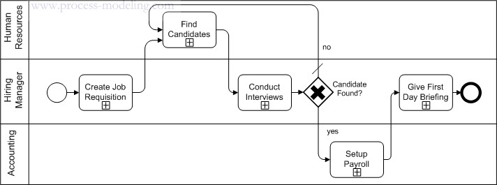

::: {.r-fit-text}
Week ELEVEN
:::

# Visual Information

## Bertin

〈 Pause for Bertin slideshow 〉

## Visual information example

Thanks to the two students who worked with me on this study of one student's solution to the Bertin exercise. This study is more detailed than what I expected you to do in class but serves to illustrate the process.

## The Invariant

The invariant is represented by the title

::: {.notes}
The invariant should be reflected in the title of the information graphic. If it is not included, or if it can be improved, it is appropriate for the critique to include a suggestion. In this case, the invariant seems to me to be *Number of establishments by Size, County, and NAICS*. Both the content and the order of this invariant matter, as will become clear in the following paragraphs. This invariant appropriately summarizes the information graphic.

Having critiqued the invariant and suggested a solution, I am in a position to answer the first of the three questions I ask you to consider for every exercise, whether the student has tackled a worthy problem. Certainly I believe that this is the case here because it is of interest to a great many people to summarize economic activity of a state by number of establishments, size of establishments, specific county of establishments, and kind of establishments. (The NAICS, which stands for North American Industry Classification System, is a standard for describing kinds of businesses). This is not a controversial claim because a great deal of policy and economic activity depends on such summaries.
:::

## The components

The components are the things that vary in the graphic

::: {.notes}
The components are represented in the information graphic and one way to identify them is to see what is displayed. The $x$ and $y$ axes are frequently used to explore the most important components. Here, the $y$ axis displays the number of establishments, an integer ranging from 0 to 700. The $x$ axis displays bars representing combinations of counties and NAICS codes.

I have mentioned that each component should have a legend. The above components don't really have a complete legend, although Bertin would consider the axis labels to be part of a legend.

There is one legend. That legend depicts two categories of size, so size is the remaining component. We could make different claims about the characteristics of the retinal variables involved in this component and we will do so later.

For now, let us list the components along with their orders, lengths, and levels. Remember that order refers to raw numbers or percentages (usually based on population or area), length refers to the number of objects being represented, and level refers to nominal, ordinal, or quantitative measurements.

Number of establishments is an integer, evidently ranging from 1--700. Its order is raw, its length is either 700, the total number of establishments in a county/NAICS combination or the total number of establishments overall. Its level is quantitative because we can easily say that twenty establishments is twice as many as ten establishments. In other words, we can form a meaningful ratio between measures of the component.

Size has the order raw because it refers to number of employees rather than number of employees as a percentage of available working age population, for instance. Size has length 2 because we can only distinguish between establishments with fewer or more than twenty employees. Size is of ordinal level because we can say that an establishment in the 20 and over category is larger than an establishment in the under 20 category but we can't say how much larger given this information.

County is of raw order, of length either 7 (represented) or 36 (available in the entire state), and of level nominal because one county is not countier than another. Note that an attribute of county like name is ordinal in an alphabetical sense and an attribute of county like area is quantitative. All this component does, though, is to identify counties.

NAICS is a little trickier. I will call its order raw because of the way we use it here, but each code represents a location in a hierarchy of specialization so another interpretation might be arguable. Its length could be construed as the number of different codes represented in the graphic or in the state or in the entire catalog. Its level is also tricky because of the hierarchical ordering of the codes. I will call it nominal for our purposes because I have seen no evidence that it is meant to be used in another way.

To critique the components alone is simply to say whether they make sense as components of this graphic. More important is to critique their representation by retinal variables and to see if they are well matched to their retinal variables and whether better use could be made of the retinal variables *used up* by each component.
:::

## Retinal Variables

The retinal variables are the things that form an image on our retinas

::: {.notes}
Bertin describes the retinal variables in a dense, 438 page book, originally published in French in 1967 but widely discussed in other languages and recently printed in English as @Bertin2011. There is a lot to say. Nevertheless, we will consider the retinal variables depicted in the slide show at a very basic level. The retinal variables include size, value, texture, color, orientation, and shape.

Three of the retinal variables here are described on the axes by bars. Bar height is very well matched to an integer ranging from 0 to 700, so I regard the use of the *y* axis to describe number of firms as successful. There is no other component as well suited to representation by bar height in the data.

County and NAICS are both described on the *x* axis by the bar names. A tractable number of combinations has been shown. One shortcoming of this graphic is that there are not instructions to the assistant mentioned in the assignment spec. Recall that you were contributing a sketch and instructions to someone polishing the graphic. There is not enough to go on. This, among other issues, has led me to rethink the picture / word ratio constraint on sketchbooks. Instead, I would like to use picture amount and let words appear as needed without penalty.

One question about the components County and NAICS, is whether they should be considered as one component or separately. That will remain an open question for now.

Finally, we come to the Size component. The representation of this component allows a number of interpretations.
We could refer to the choice of solid black and diagonal hatching as values, since one can be interpreted as black and the other as gray. We could also regard them as colors gray and black. We could also regard them as having orientation in the case of the hatching versus no orientation in the case of the black. Finally, we could consider them has having texture since we could call the black smooth and the hatching ridged.

One point Bertin makes about using more than one retinal variable to depict a component is that retinal variables may reinforce each other or be in conflict with each other. In the latter case, cognitive dissonance may be produced in the mind of the viewer. From Bertin's perspective, cognitive dissonance is always bad. Many people who produce information graphics seek to produce cognitive dissonance for reasons involving persuasion. For example, the information graphics produced by opponents of the health care plans of two recent US presidents have been designed explicitly to create cognitive dissonance in the minds of viewers. This usage stands outside Bertin's system which seeks only to support immediate answers to simple questions about information.

In this case, my reading is that the various retinal variables work together, reinforcing a consistent reading. It is not surprising that diagrams of this style may be seen in many publications. They serve an informative purpose.
:::

## Bertin's Theory

It should not be surprising that information design owes so much to a cartographer. This is one of two fields, the other being social network analysis, with the most influence on building information containers today. The remaining sections of this chapter explore Bertin's theory of information graphics.

## Theories

The word theory is used to mean many things. To obtain a useful definition,
it might be helpful to consider what Stephen Hawking
says about theory in *A Brief History of Time* on page 7.

\begin{quotation}
A theory is a good theory if it satisfies two
requirements. It must accurately describe a large class
of observations on the basis of a model that contains
only a few arbitrary elements, and it must make definite
predictions about the results of future observations.
For example, Aristotle believed Empedocles's theory that
everything was made out of four elements, earth, air,
fire, and water. This was simple enough, but did not
make any definite predictions. On the other hand,
Newton's theory of gravity was based on an even simpler
model, in which bodies attracted each other with a force
that was proportional to a quantity called their mass
and inversely proportional to the square of the distance
between them. Yet it predicts the motions of the sun,
the moon, and the planets to a high degree of accuracy.
\end{quotation}

Note that Hawking is giving what we might call a
normative definition, telling us what a theory
*should* be.  There might be plenty of things
parading around under the theory banner that could be
classed as bad theory.  Note also that Hawking requires
that a theory both describe and predict. Bertin does both of these
things, with a detailed description of graphical information and using
a concept called efficiency to predict outcomes.

## Efficiency
Bertin defines efficiency as a measure of how quickly the process of reading a graphic can be completed and defines the process in some detail under the influence of (then) contemporary philosophy.
Let's read some information graphics now to get an idea of what this might entail.

::: {.notes}
It is important to understand that the above definition and review of information graphics is meant as scaffolding on the way to understanding efficiency. The precise definition of efficiency,
quoted from Bertin, is *If, in order to obtain a correct and complete answer to a given question, all other things being equal, one construction requires a shorter observation time than another construction, we can say that it is more efficient for this question.*
This is a measurable, precise definition. Bertin characterizes it as implementing Zipf's notion of mental cost.

Efficiency alone could be abused, so Bertin augments with some additional concepts. How do you think efficiency could be abused? What processes could be described to augment efficiency? (See Semiology of Graphics, p. 166 for an example.)
:::

## Categories of information graphics
Bertin describes four categories of graphics: diagrams, networks, maps, and symbols.
It is the use of the last three categories, coupled with the detail in Bertin's theory, that persuade me that here is a good foundation for describing information architecture.

## Symbols

::: {.notes}
Symbols establish a correspondence between a single element on the graphic plane and something external to the graphic, through immediate recognition. Symbols are used extensively in information architecture and Unicode offers a flexible way to represent 113,000 currently defined symbols in type, along with a plan for annual additions with a limit of about 1.1 million symbols using the current international agreements.

Here I am using the word flexible to mean that typographic glyphs are represented by curves that can be completely described by a short series of numbers in a specified order. If you have used Bezier curves in Photoshop, you know how to determine very complex shapes by specifying the location of a few *control points*. This same principle allows for device independence, arbitrary scaling of size, advanced algorithms for micro-kerning and other processes that depend on the relative locations of glyphs.
Thus, typographic symbols are ideal vehicles for multimodal information representation in handheld, wrist worn, or desktop display.
:::

## Diagrams

::: {.notes}
Briefly, Bertin calls diagrams the constructions on a plane where correspondences occur between one component and another. I don't want to say more here because diagrams are more the domain of information content than navigation.
:::

## Networks

::: {.notes}
Bertin describes networks as the correspondence on the graphic plane between the divisions of one component. The underlying component is usually people in a social network but is usually represented as emails, texts, phone calls, links, or anything else that points from one object of a certain kind to another object of that kind.

Bertin's advice about the representation of networks dates from the 1960s, before the dawn of social network analysis. Nevertheless, he specifies the process of portraying a network that highlights the problem that still vexes practitioners today. First, establish the correspondences and second, identify the representation of the correspondences with the fewest intersections. In Bertin's book, he displays networks with only a dozen or a few dozen nodes. Most of the network representations of today suffer from the production, in the first step, of correspondences numbering in the billions between divisions (people or websites) numbering in the hundreds of millions.

Plenty of algorithms have been developed to accomplish step two of the above process. Many are inventoried at
[graph drawing](http://en.wikipedia.org/wiki/Graph_drawing).

Bertin claims that any network may be converted to a diagram by the addition of one or more components. He gives the example of speakers and listeners as two components and demonstrates their portrayal with a bipartite graph and an incidence matrix.
:::

## Maps

::: {.notes}
Maps are exactly like networks except that a geographic order is imposed. The process for creating a map requires the reproduction of the geographic order first, and recording the correspondences second.

Although the network may be easily converted to a diagram, the map introduces a geographic ordering to the graphic plane that is disturbed by the addition of another component. Thus, I suspect that Bertin would call the graphical constructions based on the famous NYC subway maps diagrams rather than maps. In most cases, these constructions only superficially resemble a map in the sense that no geographic ordering occurs. Nevertheless, the notion of a map and the rules of cartography are deeply appealing to people, perhaps because of our hunter-gatherer past.

The lack of flexibility in maps is a key feature. The fact that additional components disturb the geographic ordering renders maps useful for navigation but diminishes their navigational usefulness if they are transformed into diagrams. This characteristic explains both the advantage and limitation of map-like navigational aids in information artifacts. If you map your information architecture as a flow chart, for instance, do you impose a geographic ordering on the 2D plane? If you do, you drastically limit the flexibility of the flow chart to represent abstract concepts but may enhance its use in describing flow.

Do you regard bread-crumb trails as maps or networks? Every single bread-crumb trail I have ever seen on a website follows a horizontal left older right newer path. Every single one I have ever seen in a menu follows a vertical down older up newer path. Each crumb offers only a click to return to it or perhaps a tooltip to provide a more complete name. The bread crumb trail has defied HCI researchers trying to evaluate its effects. Might Bertin's theory help us to understand what user studies have not?
:::

## Simplification

Recall my earlier question about adjuncts to efficiency. The main adjunct in my opinion is an exhaustive depiction of what it means to simplify information using retinal variables at the most detailed level possible.

::: {.notes}
By far, the greatest value in *Semiology of Graphics* is, in my view, its scope. Much of the book contains the tools to describe the mechanisms of simplifying information. These are the retinal variables and their operation in a 2D plane. It is only by working extensively with these variables that you can build information artifacts that are more than randomly navigable.
:::

##

A Picasso nude exemplifies simplicity

## Example: Swim lane diagrams

::: {.notes}
Swim lane diagrams are used as a project management tool
in IT. At a minimum, they portray roles, tasks, and handoffs.
The name *swim lane* arises because they look
like a swimming pool divided into lanes with a start and
finish. Each role has a lane in the pool. Each task is
rectangle inside a lane. Each handoff is an arrow from
one lane to another.

Here is an example from
[processmodeling.info](http://www.processmodeling.info/posts/swimlane-lane-or-pool-learn-to-swim-first/)
containing additional symbols specific to Unified
Modeling Language.

This diagram shows three roles: accounting, hiring
manager, and human resources, as well as five tasks:
create job requisition, conduct interviews, setup
payroll, and give first day briefing. The diagram has a
beginning and an end and is read from left to right. A
top to bottom version would work just as well but there
must always be the sense that the diagram shows some
process that has a definite start and stop and a sense
of time precedence among the tasks.

The swim lane diagram is one of many project management
tools. It's so successful that you can image google it
and find many versions of it. You may be subjected to
refinements of it in the workplace, but here let's just
consider what they all have in common.

*How can you produce a swim lane diagram?*

The basic swim lane diagram should be easily understood
by any worker in one of the roles displayed. The diagram
may be drawn by asking someone in each role what they do
and where their handoffs are. To construct a swim lane
diagram, therefore, requires some skill in eliciting
information from people about what they do. People find
it notoriously difficult to describe what they do unless
they are doing it. Interviewing someone about their job
usually leaves critical gaps.

When visiting a worker to get help with a swim lane
diagram, it's a good idea to construct a diagram before
you visit them. It is easier to correct a wrong diagram
than to start from scratch. It also conveys to the
person that you have been trying and need their help,
rather than that you are trying to slough work off onto
them.

The diagram you present to someone should not look
polished. If possible, do it in ballpoint pen on cheap
notebook paper. The reason to do this is to make it
clear that you don't believe the diagram is finished. If
you produce a pretty diagram with fancy software and
print it in color, the worker you interview may be more
reluctant to change it than if it looks like something
you did not intend as a finished product. Decorations
are not helpful in eliciting information that would
cause the decorations to have to be redone.

There should be a lot of room on the page that you
present to a worker and you should hand them a pen or
pencil of a different color than what you've already
drawn so that afterward, you can distinguish between
what they've added and what you've added.

It may be better to visit alone or with another team
mate. If you're interviewing a less experienced worker,
they may be more intimidated by multiple visitors. On
the other hand, a more experienced worker may have so
much information to share that you need one team member to
talk to them while another takes notes.

Recording an interview may reduce the candor of the
worker being interviewed. If you must record, 
put the recorder within easy reach of the worker and
invite them to turn it off if they want to say something
off the record. Be aware that, if they turn it off at
some point, they are unlikely to turn it back on for the
rest of the interview. I take it as a signal that the
recording makes them uncomfortable and I don't ask to
turn it back on later.

Be prepared with extra paper if the interviewee wants to
start over from scratch and be sure to have a camera or
time to copy in case they prefer to work on a
whiteboard.

One skill that's hard to teach is to know when to
interrupt. If you don't understand something, you should
ask about it as soon as possible but, if you disturb the
flow of the interviewee's thinking, you risk never
getting the info that would have flowed just after the
interruption. Before you interrupt, you should have a
good idea of how to proceed after the interruption is
finished.

One luxury you may not have is to revisit the same
worker after some other interviewee has modified what
they've said. I have had this experience where two
people involved in a single process have conflicting
views of their roles. This presents an opportunity for
process improvement that is beyond the scope of this
discussion but a likely application of this tool in the
workplace.

An exemplary swim lane diagram

Hanna Jung, a brilliant designer, shows an impressive example of
a swim lane diagram at
[tracking civic theater volunteers](http://www.hannajun.com/aa1.jpg)
where she also includes some additional symbols related
to *pain points* in the process. Since I worked
with Hanna Jung in the past, I should add something you
can learn from her. Although she excels in many, many
ways, one thing that you can see within a few minutes of
watching her work is that
she begins solving problems as soon
as they present themselves and organizes her time and
that of others to maximize impact. I've met many
students who work hard, but can only think of two other
students out of a thousand who can do as much in as
little time as Hanna Jung. When others are still getting
started, she is close to finishing. And when she's
finished, she reviews her work and that of others to
decide whether to polish it or move on to the next
problem. She never wastes time overthinking a problem.

I believe that she achieves this success through
polishing her problem solving process. She determines
how much time is available to solve a problem and
divides the time into steps so that she won't get so
bogged down in one step and fail to make it to the end.
She writes or draws her initial plan clearly and invites
others to join her, thinking about what she knows of
their skills and how they could contribute. Then she
ruthlessly sticks to the plan, moving on to step two
even if she's not satisfied with step one. This way,
there's still time to go back to the beginning if there
has been a false start. If she goes back to the
beginning, she replans all the steps with the remaining
available time. All her planning seems to take less than
a couple of minutes for the length of assignments that
are given in school, but that is because she refines the
planning from course to course.
:::

# References

::: {#refs}
:::

---

::: {.r-fit-text}
END
:::

# Colophon

This slideshow was produced using `quarto`

Fonts are *League Gothic* and *Lato*

