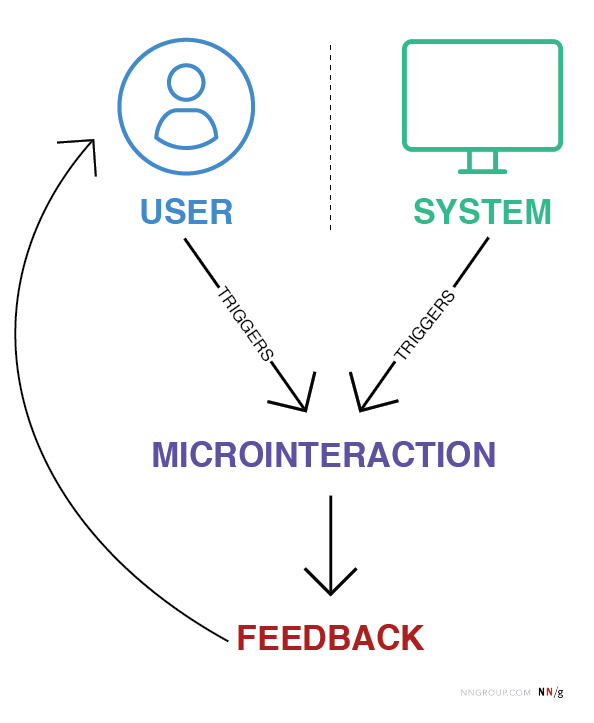
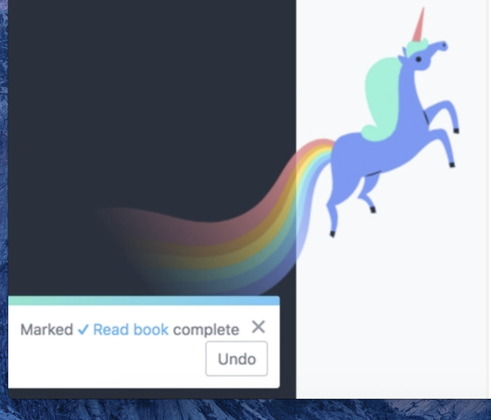
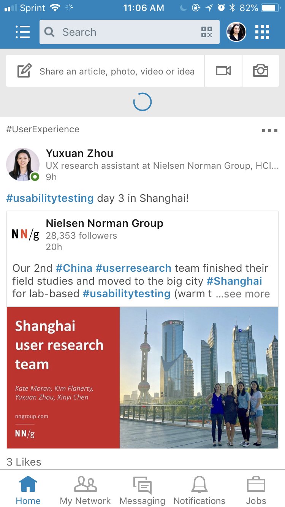
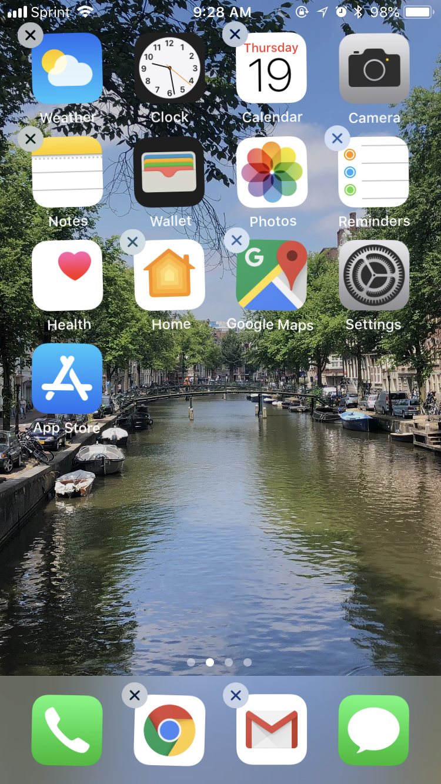
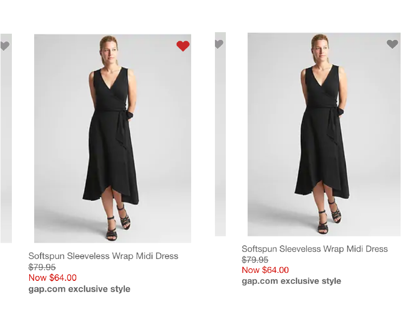
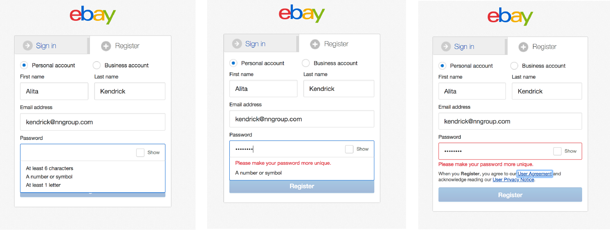
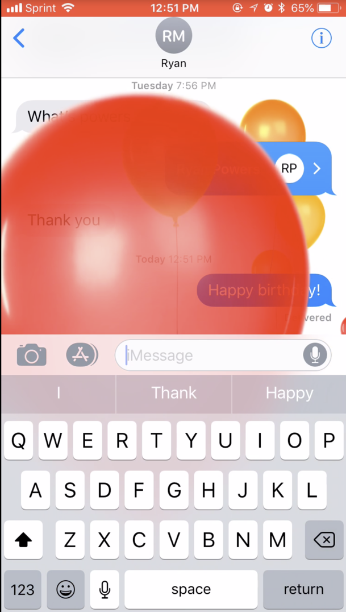
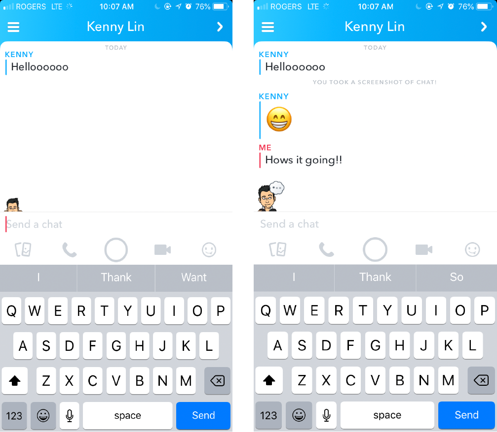

::: {.r-fit-text}
Week THIRTEEN
:::

# Demoing Static Visual Design

## Robert Johnson Page
This is a two part exercise.

1. Create a style sheet
2. Use the style sheet to create an actual webpage about the song "Hellhound on my Trail" by Robert Johnson

## Style sheet
The style sheet can be a png, a pdf, or a jpg file containing the following elements.

1. A color palette with about four or five colors
2. A type guide, with at least two typefaces in several sizes
3. A layout guide, such as a grid

## Using the style sheet
1. Create an actual webpage, not a Figjam
2. Display the following information
   a. A picture of your choice
   b. The lyrics to "Hellhound on my Trail" (recorded 1937)
   c. Some biographical information about Robert Johnson (1911--1938)

## Turning it in
In the Robert Johnson Page assignment box, provide the stylesheet and a link to the webpage. If you don't have a place to host the webpage, put all the assets (the html file, a css file, and the picture file) in the assignment box so that they display there.

# Demoing dynamic visual design

## Design a microinteraction

## What are microinteractions?
Definition from NNgroup: Microinteractions are trigger-feedback pairs in which (1) the trigger can be a user action or an alteration in the system's state; (2) the feedback is a narrowly targeted response to the trigger and is communicated through small, highly contextual (usually visual) changes in the user interface.

## Microinteraction flow

##

## Some are, some aren't

<small>

-------------------------------------------------------------------
*Digital element*   *Is it a microinteraction?*
-----------------   -----------------------------------------------
Scrollbar           Yes: User triggered; visual feedback to
                    user changing location within a page

Digital alarm       Yes: System triggered; auditory (and visual)
                    feedback to time condition being met

Button              It depends: If there is no feedback when a user
                    clicks the button, there is no microinteraction

Pull-to-refresh
animation           Yes: User triggered; visual feedback to a user
                      action

GIFs                No: Not triggered by the system or a user

Video player        No: It's a feature, not a microinteraction;
                    volume control would be a microinteraction
---------------     -----------------------------------------------

</small>

## Why?
Microinteractions can improve a product’s user experience by:

- Encouraging engagement
- Displaying system status
- Providing error prevention
- Communicating brand

## Encouraging engagement

##

## Displaying system status

##

## Providing error prevention

##

## Communicating brand

##

## Error prevention

##

## Prevent rework

##

## Communicate brand

##

## Encouraging engagement

##

## Auditory microinteraction

##

## Exercise
Design and share a microinteraction.

## More about microinteractions
Read @Saffer2013!

# References

::: {#refs}
:::

---

::: {.r-fit-text}
END
:::

# Colophon

This slideshow was produced using `quarto`

Fonts are *League Gothic* and *Lato*

