::: {.r-fit-text}
Week FOURTEEN
:::

# Summary

## Two things
- interaction design
- information design

## Interaction design
- design thinking
- iterative design cycle

##
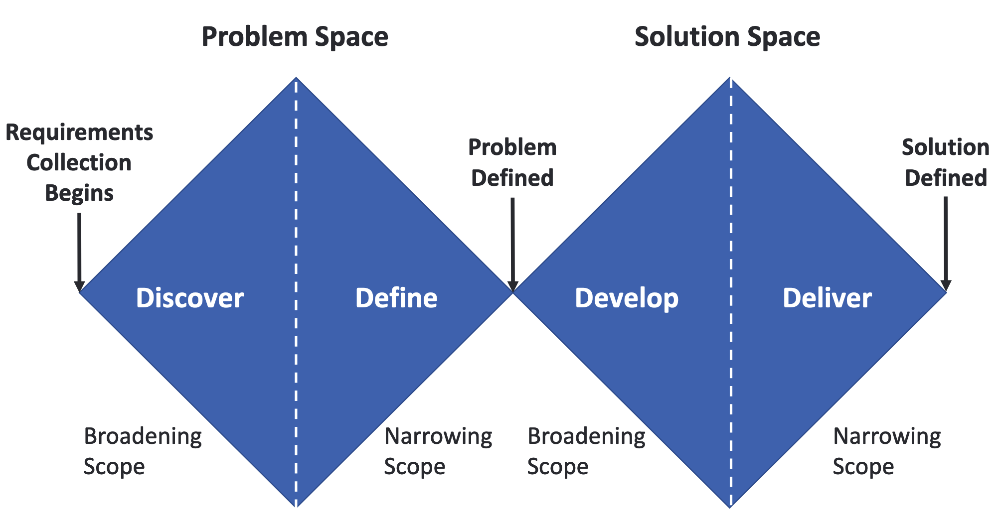

##

## Sketching
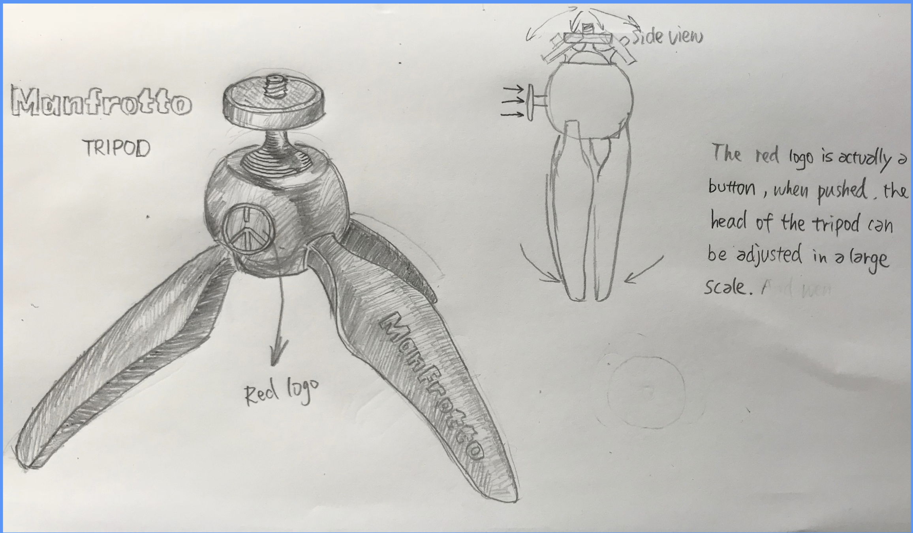

## Positioning
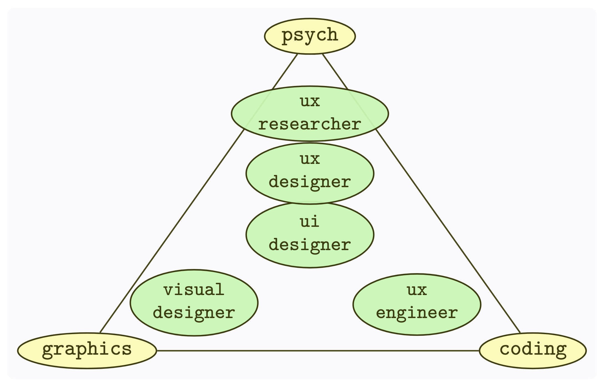

## Audiences
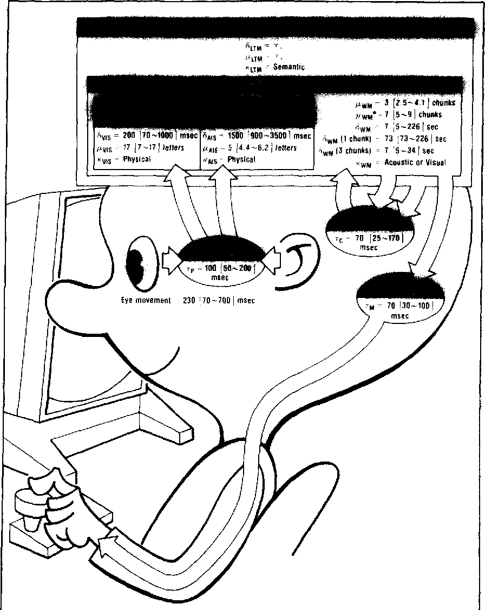

## Interaction Design
- Contextual Inquiry
- Personas
- Scenarios
- Prototypes
- User Testing

## Contextual Inquiry
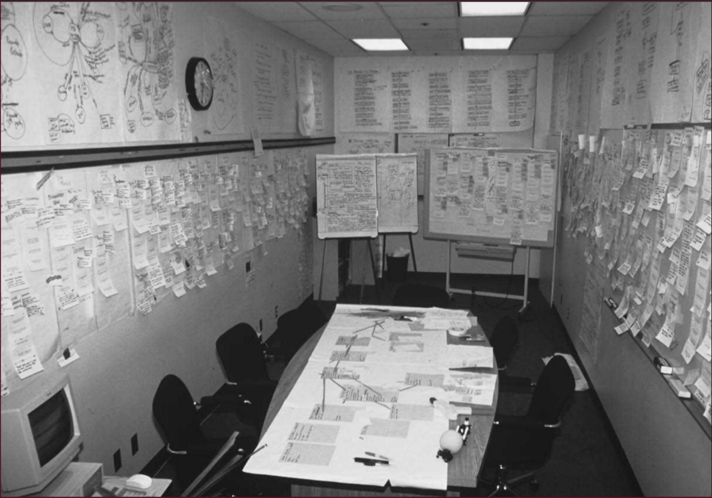

## Personas
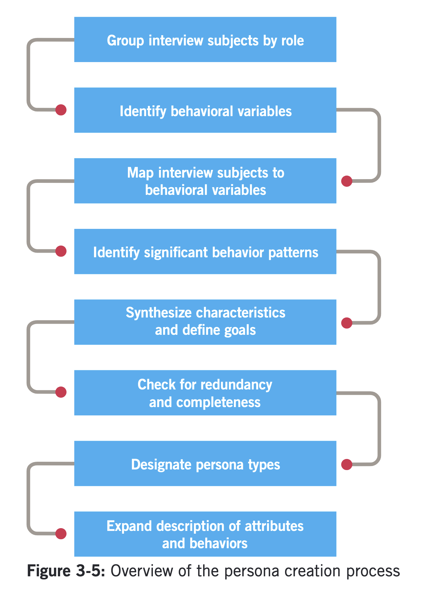

## Scenarios
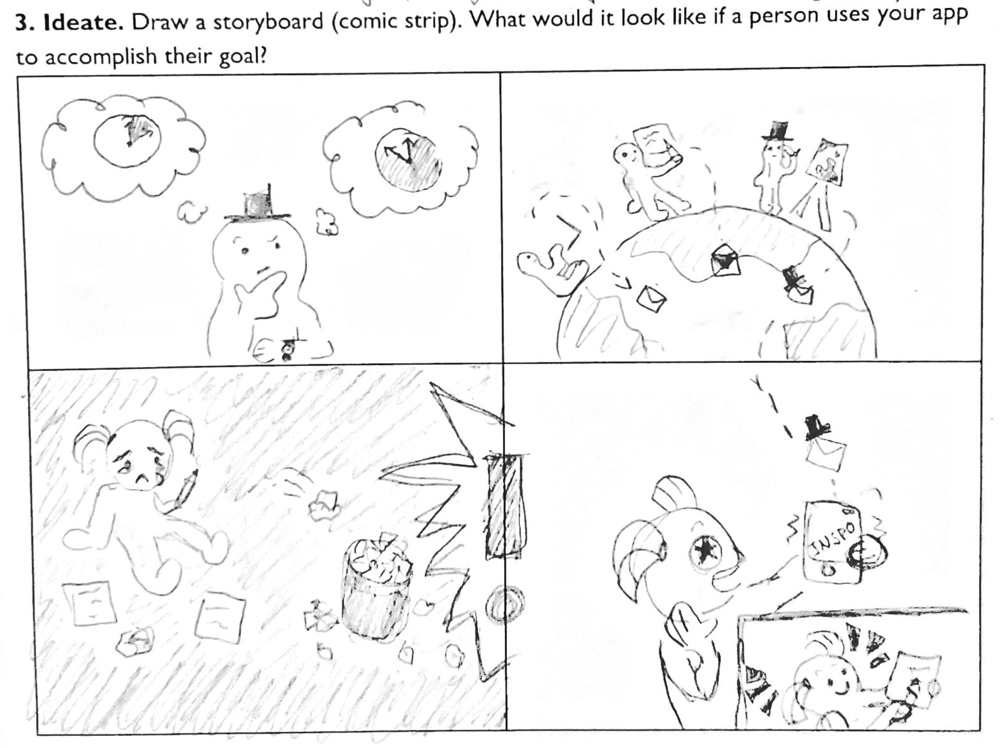

## Prototypes
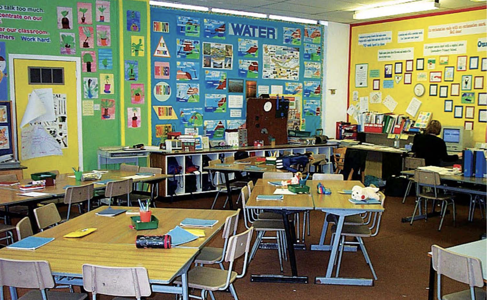

## Prototypes - Lofi vs Hifi

## Prototype Components - Layout

## Prototype Components - Type

## Prototype Components - Color
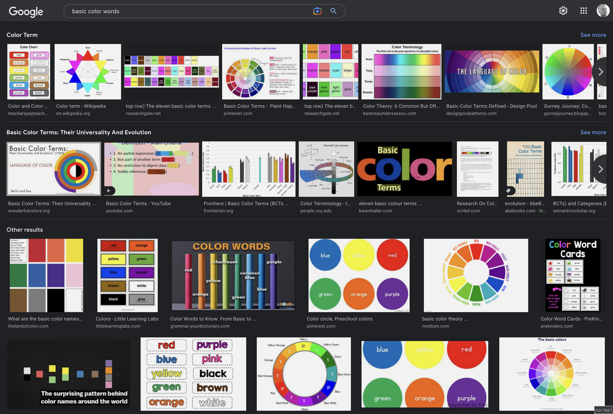

## Prototype Components - Microinteractions
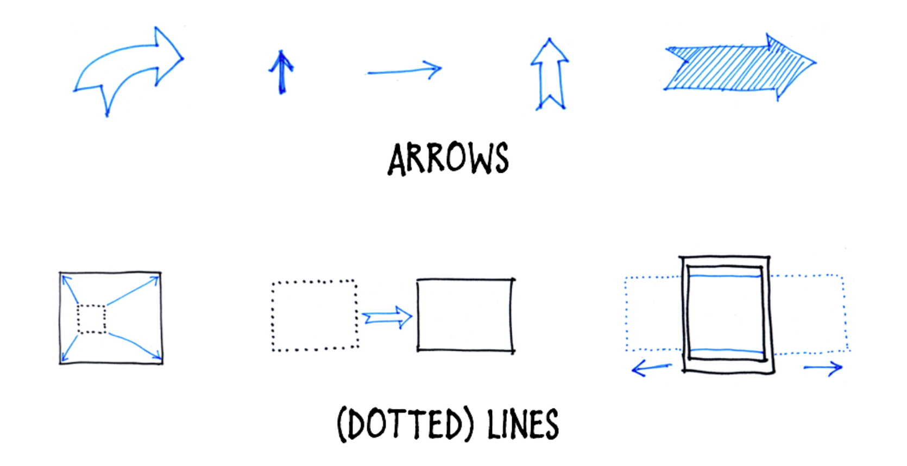

## Prototype Components - Animation

## Information
- Personal Information
- Finding Information
- Navigating Information

## Personal Information
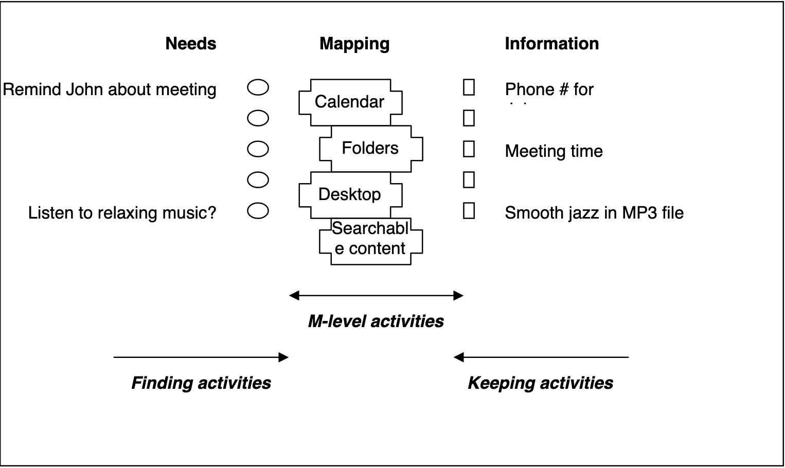

## Finding Information

## Navigating Information
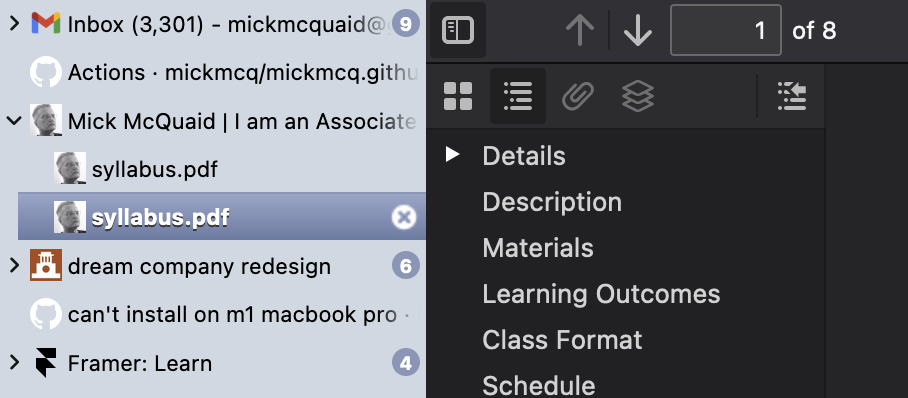

## Information Design
- Visual Information
- Theory
- Practice

## Visual Information

## Theory

## Practice

# [END]{.r-fit-text}

# References

::: {#refs}
:::

# Colophon

This slideshow was produced using `quarto`

Fonts are *Roboto*, *Roboto Light*, and *Victor Mono Nerd Font*

