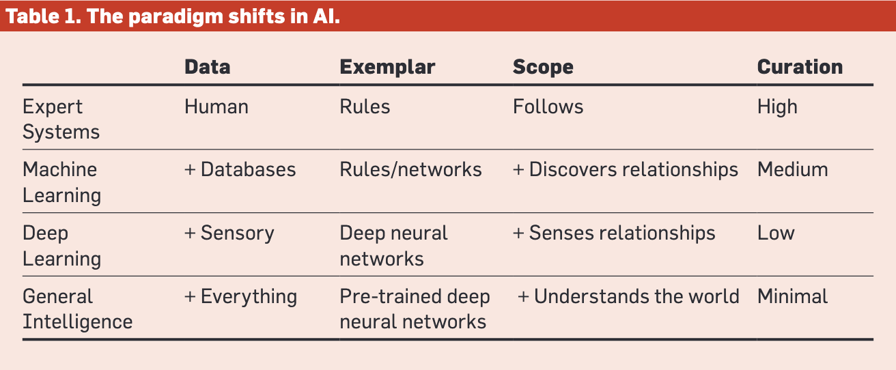

::: {style="position: fixed; font-size: 5em; color: gray;"}
Welcome!
:::

# Setting the stage

## Let me set the stage for our adventure
::: {.incremental}
- This is all new, this course, this topic
- There are no models for how it should be run
- We're pioneering new ground
- Congratulations! You can call yourself a pioneer but you could also call yourself a guinea pig!
:::

## Pioneering is good and bad
::: {.incremental}
- You can probably guess the good aspects of being a pioneer, but what about the bad?
- We may have to change course often.
- We may go down blind alleys.
- We *will* face a lot of uncertainty.
- If this kind of thing bothers you, you should drop the course and wait until we have done all the pioneering work and you can follow.
- $\langle$ Pause to let the room clear $\rangle$
:::

## Constraint
::: {.incremental}
- There are no prereqs. You may not even know how to spell AI
- $\langle$ Pause for laughter $\rangle$
- $\langle$ If no laughter, tell mother-in-law joke $\rangle$
- Since there are no prereqs, we have to start before the beginning.
- I need to tell you a little bit of history, so you get the context.
:::

## Today's plan
::: {.incremental}
- We'll do an exercise.
- Then we'll review @Dhar2024 for a bit of history.
- Finally, we'll do another exercise.
- In fact, the general format of the class will usually be some lecture followed by some exercises.
:::

# But first, TANSTAAFL

That stands for "There ain't no such thing as a free lunch"

Many people think AI will provide a free lunch. I don't.

##

You will have to work (think) to make AI work (think) for you

::: {.notes}
This cartoon may become controversial soon. We are still in a situation where the computer does what we tell it to but the level at which we tell it what to do is becoming more and more abstract.
:::

$\langle$ Pause to let the room clear $\rangle$

# Exercise: What I already know
- There is a google doc referenced in Canvas (on the course's home page) that I want you to edit
- There are some starter text for you to add to
- Please also add your own sections but *please* use appropriate section headings and subheadings rather than jury-rigging text attributes as headings

# Paradigm shifts in AI

@Dhar2024 covers four periods in AI history and the paradigm shifts between them.

This isn't all of AI history but is a simplified picture that will help us understand the task we face in making AI work for us.

## Expert Systems
::: {.incremental}
- Work in well-circumscribed domains where expertise is identifiable and definable
- Perform well at specific tasks where expertise can be extracted from humans
- Represent problems as relationships between situations and outcomes
- Considered intelligent if performing like human experts
- Example: *high pallor* $\Rightarrow$ *excess bilirubin*
:::

## Machine Learning
::: {.incremental}
- Learn models from curated examples
- Driven by database technology, Internet, abundance of data
- Grew in parallel with neural networks
- Rely on loss functions measuring difference between predictions and empirical reality
- Influenced by philosopher Karl Popper
- Example: Predicting pneumonia from historical medical records of people with and without pneumonia
:::

## Deep Learning
::: {.incremental}
- Usually conducted via deep neural networks
- Takes raw input (images, language, sound) instead of human description
- Acts as a *universal function approximator*
- Learns features implicitly associated with raw input
- Example: Vision system sees lines, colors, curves and, through successive layers of neurons, combines them into doors, windows, street signs
:::

## General Intelligence
::: {.incremental}
- Pre-trained models integrate a large corpus of general and specialized models *not* optimized for a single task
- Language is a critical carrier of knowledge, powering large language models (LLMs)
- Pre-trained models learn through self-supervision on uncurated data, e.g., WWW
:::

## Paradigm Shifts
::: {.incremental}
- Draws on the work of philosopher Thomas Kuhn
- Perceives history of science as punctuated by upheavals displacing dominant paradigms
- Identifies bottlenecks that lead to paradigm shifts
:::

##

# Current Paradigm in Science

## AI as general-purpose technology

General-purpose technology, such as electricity or the Internet, is defined by economists as a new method for producing and inventing that is important enough to have a protracted aggregate economic impact across the economy

## Characteristics of General-Purpose Technologies
::: {.incremental}
- pervasiveness
- inherent potential for technical improvements
- innovational complementarities
:::

## Challenging characteristics of the current paradigm
::: {.incremental}
- opacity to humans, i.e., AI can't explain itself well (yet)
- explanation and transparency are important to humans
- legal questions of ownership and control of uncurated data, weights, and outputs
- nature of uncurated data as biased, rife with falsehood and noise
- AI is not designed to be truthful and is noisy and inconsistent
:::

## State of the world is a factor
::: {.incremental}
- Alignment problem: are our subgoals aligned with our goals?
- and are the goals and subgoals aligned with those of AI?
- Example: Goal *Save the planet* might cause the AI to infer subgoal *eliminate humans*
- Scalability simplifies the work of bad actors
:::

## Human nature
::: {.incremental}
- deepfake porn of hundreds of thousands of ordinary women was overlooked, but policy action was taken when a celebrity was the victim
- policy action is generally slow compared to technological advances
- policy action tends to favor the very rich and well-connected
- this has implications for all the legal and policy questions of AI
:::

# Conversation

## Collaboration
::: {.quotation}
All of us know more than any of us.
:::
::: {.attribution}
--- Robert O. Briggs
:::

::: {.quotation}
The intelligence of that creature known as a crowd is the square root of the number of people in it.
:::
::: {.attribution}
--- Terry Pratchett
:::

# Another exercise

## Write a short Python program
::: {.incremental}
- generate a random order for students to make presentations in this class
- everyone must present once
- no more than four may present on a given day
- no fewer than three may present on a given day
- there are twelve days on which students may present
- if no program works by the end of today's class, I need three volunteers for next week
:::

## Approaching this exercise
::: {.incremental}
- You can make this very simple by doing some manual labor
- You need to break the problem down into parts
- You need to iterate
- You need to document what you do
- As with all exercises, I ask you to turn in a Quarto qmd file and an html file (both are required for credit)
:::

## Why Quarto?
::: {.incremental}
- Quarto is a tool that helps you do *reproducible research*
- Quarto helps you document the steps you took
- Quarto encapsulates the code (in this case, Python code) and your commentary about what you did, including any pictures, equations, videos, or anything else that a word processor can include
- Quarto provides a text that is readable by any text editor of your preference
- Quarto documents and slideshows can be rendered to html or any of about a dozen other formats
:::

## How to use Quarto
::: {.incremental}
- Note that you don't have to follow these instructions if you already know how to use Quarto
- Be sure you have Python on your computer (how you do that is up to you; I use `pyenv`)
- Download R; then download R Studio (the order is important)
- Download the file `eA.qmd` from Canvas
- Open R studio; choose Open File from the menu; open `eA.qmd`
- `eA.qmd` is a template for exercise A
- Fill in your name
- Do the exercise in this file, documenting what you do as you go
- Intersperse code and commentary, including prompts you use
:::

## Problem?

---

::: {style="text-align: right; font-size: 300px; font-weight: bold;"}
END
:::

# References

::: {#refs}
:::

# Colophon

This slideshow was produced using `quarto`

Fonts are *Robot Light*, *Roboto Bold*, and *JetBrains Mono Nerd Font*

