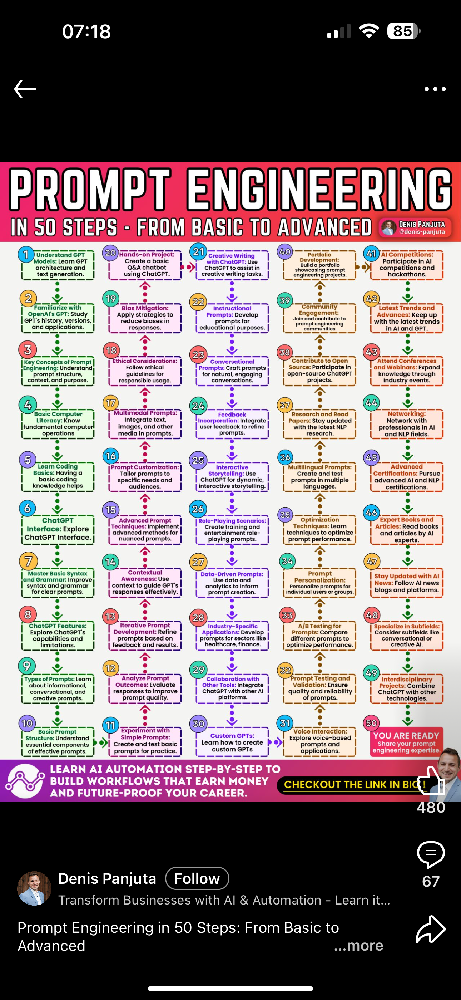
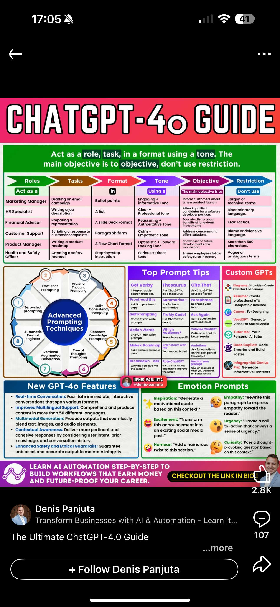
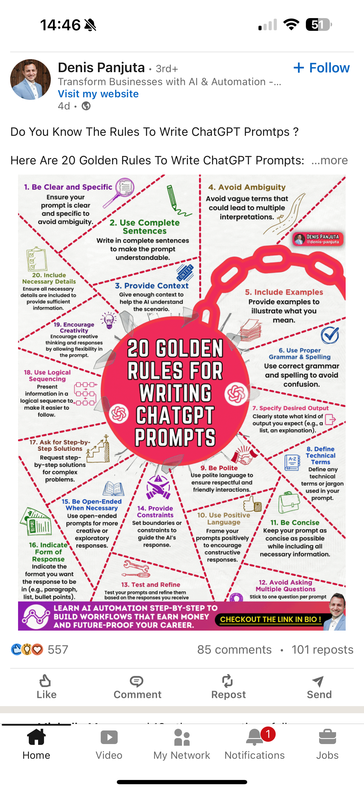
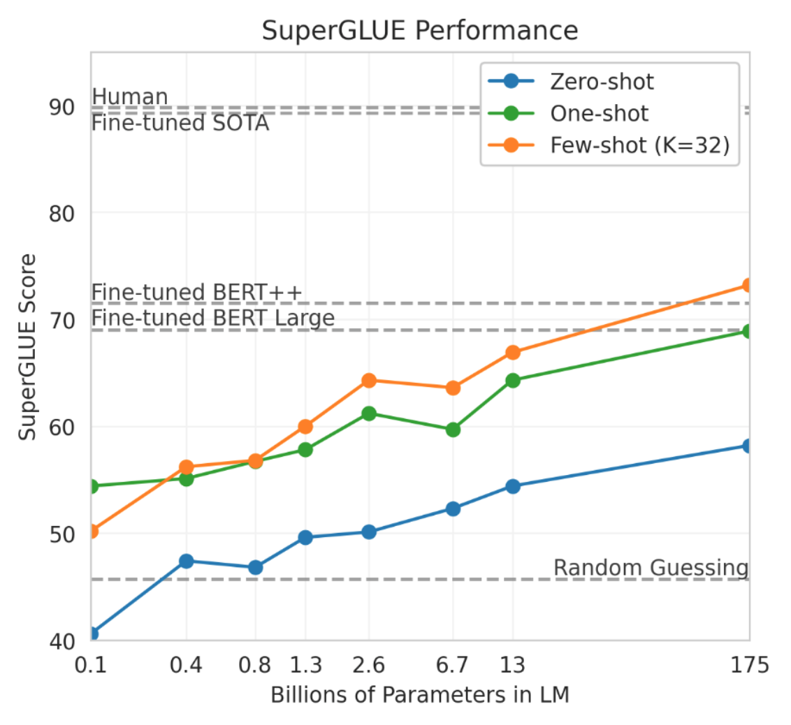

::: {style="position: fixed; font-size: 5em; color: gray;"}
Welcome back!
:::

# Review

## What we already know

## Python Exercise (and choosing presentation order)

# Principles

## Good News, Everyone!
People want to help you! Here's the whole course on one slide!
(Don't worry that it's too small to read, it's pretty much useless)

## Another One

## Yet Another One

## Best of All!

## Introduction
::: {.incremental}
- One person's principles are another person's opinions
- Many of the books I consulted offer principles that boil down to one thing
- *Be an experienced coach to a naive, but talented, energetic, player*
- That is, provide inspiration and guidance (which takes skill!)
- What could possibly go wrong with that?
- $\langle$ Discuss $\rangle$
- A lot, as it turns out! What if you don't know how to provide inspiration and guidance?
:::

## Principles as Techniques
::: {.incremental}
- Most of what pass for principles are techniques
- There are at least thirty catalogued techniques according to @Sahoo2024
- These include Zero-shot Prompting, Few-shot Prompting, Chain-of-Thought Prompting, Self-Consistency, Retrieval Augmented Generation, Automatic Reasoning, ... and many more
- For the most part, we will study techniques and extract principles from them
:::

## Principles as advice
::: {.incremental}
- Other sets of principles, such as some given in @Mizrahi2024, consist of advice to give the genAI tool (in this case for engagement)
  - AIDA (attention, interest, desire, and action)
  - PAS (problem, agitate, solve)
  - FOMO (fear of missing out) (created through exclusivity, timing, social proof, call to action)
  - SMILE (storytelling, metaphor, inspirational, language, and emotion)
  - POWER (promise, objection, why, evidence, and reward)
- What they have in common is that you've been told to use these in your own writing and, like the techniques, we can extract principles from them
:::

## Actual Principles Derive from Tradeoffs

## Tradeoffs often come from parameters, e.g., @Mizrahi2024, p 29
::: {.incremental}
- Model size (number of neurons or parameters)
- Temperature (stochastic---high vs deterministic---low)
  - temperature can be thought of as controlling creativity and diversity vs coherence or consistency
- Top-*k* (only consider the *k* most likely tokens in a sequence (smaller---deterministic vs larger---stochastic)
- Max tokens (length of response: short and concise vs lengthy and detailed)
- Prompt length (not a parameter but influences performance: longer improves accuracy but may truncate output length when combined with a small max token value)
:::

## Principles from @Tibdewal2024
::: {.incremental}
- Help users explore generative variability; 
- Help users build trust; 
- Give users control over generated responses (present multiple responses); 
- Improve results through user feedback.
:::

---

::: {style="text-align: right; font-size: 300px; font-weight: bold;"}
END
:::

# References

::: {#refs}
:::

# Colophon

This slideshow was produced using `quarto`

Fonts are *Roboto Light*, *Roboto Bold*, and *JetBrains Mono Nerd Font*

