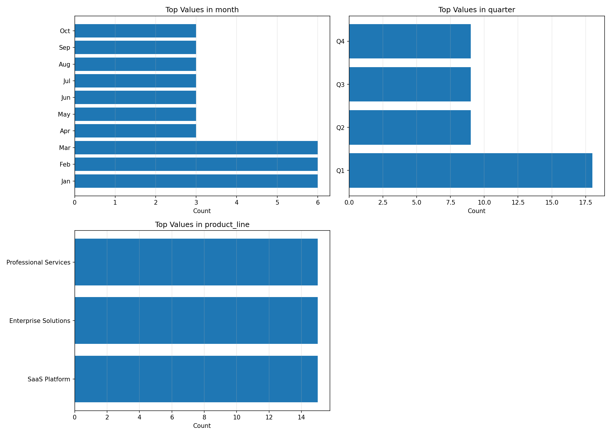
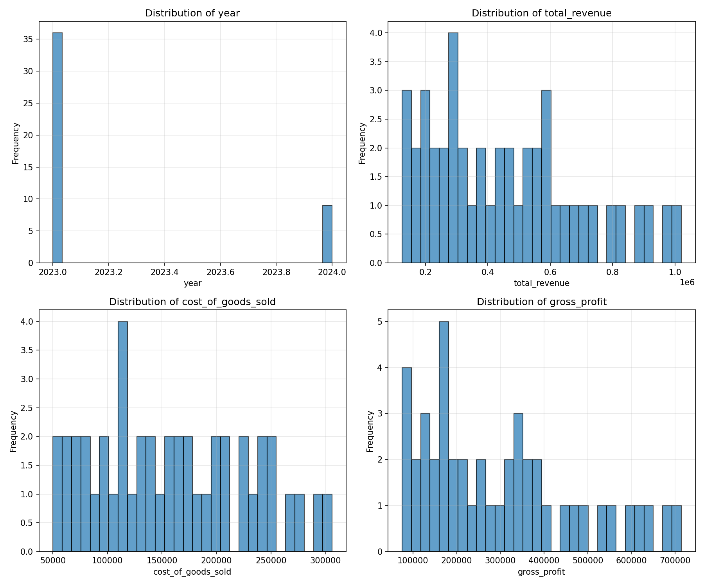
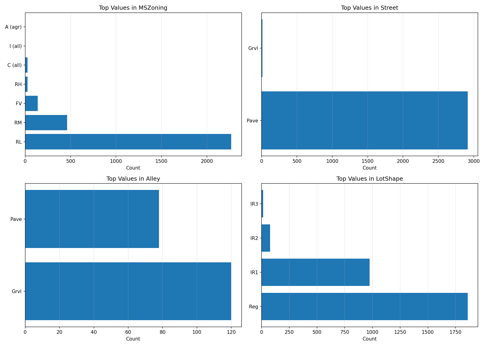
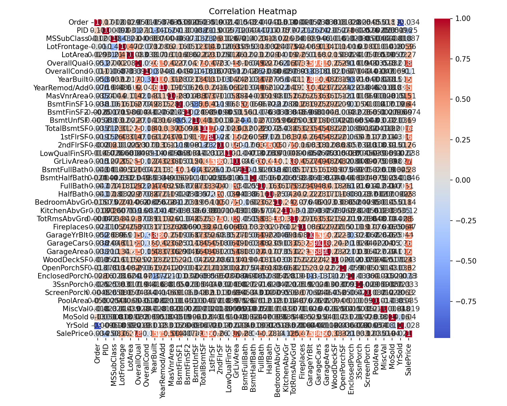
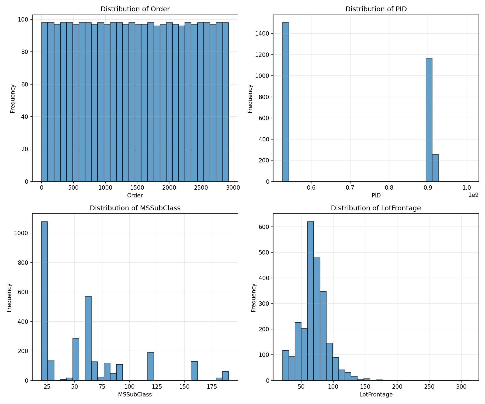

# [Week ELEVEN]{.r-fit-text}

# What are skills an example of?

*Context engineering*

# Why use skills?

- Easy to set up
- *progressive disclosure*
  - Saves tokens
  - Attenuates *context rot* [https://research.trychroma.com/context-rot](https://research.trychroma.com/context-rot)
- Likely to be adopted by all frontier models

# What are skills?

A skill is a package, fed to Claude as a zip file containing a folder structure. At a minimum, it contains a folder named for the skill with a file inside that folder called `SKILL.md`. Everything else is optional. Note that the `SKILL.md` file must be properly formatted as a markdown file with YAML frontmatter containing the fields *name* and *description*.

# Skill structure

For example, it might contain a subfolder called *scripts* with Python or Bash scripts. It might contain additional context in a markdown file. It might contain data in a `.csv` file. None of this is read unless the prompt and the *name* or *description* field triggers it, saving tokens.

- name-of-skill/
	- SKILL.md
	- scripts/
		- validate.py
	- additional_context.md
	- data.csv

# What skills are built in to Claude?

```bash
curl "https://api.anthropic.com/v1/skills" \
     -H "x-api-key: $ANTHROPIC_API_KEY" \
     -H "anthropic-version: 2023-06-01" \
     -H "anthropic-beta: skills-2025-10-02"
```

# Prepackaged skills

[https://github.com/anthropics/skills](https://github.com/anthropics/skills)
I wanted more prepackaged skills to try, so I cloned the Anthropic Skills Repo

I asked Claude where to put it and it suggested `~/.anthropic/skills/`

It offered to make the directory and put the files there, by the way. This raises a typical problem for LLMs: it is typically faster to do a one-off task yourself rather than ask the LLM. The LLM (and Skills in particular) excel at automating repeated tasks.

# Which skill to try?
Skill Creator is perhaps the most popular of Anthropic's packaged skills, but I wanted something related to homework D, so I found a different repo through the following directory.

[https://github.com/ComposioHQ/awesome-claude-skills?tab=readme-ov-file](https://github.com/ComposioHQ/awesome-claude-skills?tab=readme-ov-file)
A list of some (allegedly) curated skills can be found here

I selected the CSV skill to try, since the data for hw D is in CSV format.

First I tried a built in example but it was a bit difficult to assess the results because I didn't know the data.

The graphics it generated looked ridiculous on the face of it, but I needed to look at the data to be sure.

## A ridiculous graphic


## Another ridiculous graphic


## Yet another ridiculous graphic


# Visidata
Next, I tried looking at the data with `Visidata`, a cli tool I typically use for examining CSV files. Claude was helpful here, because it just had a three-letter month and four digit year in separate columns. Claude wrote a Python script to convert those into standard dates (the first of each month).

##
$\langle$ Pause to view Visidata $\rangle$

# Ames example

Next I tried the Ames data

It called a fairly good Python script to analyze the data but again produced ridiculous graphics.

$\langle$ Pause to view Ames analysis $\rangle$

##


##


##


##
Can we fix these? Yes, if we know some Python, we can tell it what graphics to use. Even without knowing Python, we could limit the correlation heatmap to, say, the four most and least correlated variables.

On the other hand, if we know Python, it may be better (not faster as a one-off but better for routine use) to create our own Skill and Python script.

# [END]{.r-fit-text}

# References

::: {#refs}
:::

# Colophon

This slideshow was produced using `quarto`

Fonts are *Roboto*, *Roboto Light*, and *Victor Mono Nerd Font*

