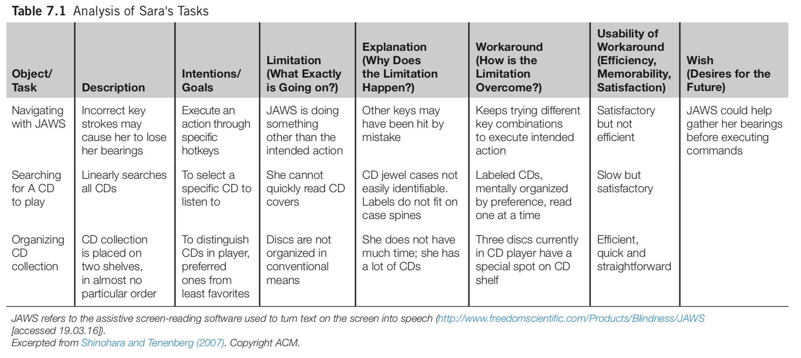

class: animated, fadeIn, middle
layout: true

```{r xaringan-themer, include=FALSE, warning=FALSE}
library(xaringanthemer)
style_solarized_light(
  text_font_google = google_font("Fira Sans", "300"),
  header_font_google = google_font("Fira Sans Condensed","600"),
  code_font_google = google_font("Fira Code")
)
```

```{r, load_refs, include=FALSE, cache=FALSE}
library(RefManageR)
BibOptions(check.entries = FALSE,
           bib.style = "authoryear",
           cite.style = "authoryear",
           style = "markdown",
           hyperlink = FALSE,
           dashed = FALSE)
myBib <- ReadBib("04studyUsers.bib")
```

<style type="text/css">

/* .remark-slide-content h1 {
  font-size: 600%;
}
*/

.remark-slide-number {
  position: inherit;
}

.remark-slide-number .progress-bar-container {
  position: absolute;
  bottom: 0;
  height: 4px;
  display: block;
  left: 0;
  right: 0;
}

.remark-slide-number .progress-bar {
  height: 100%;
  background-color: red;
}
.scale-30 img { width: 30%; height: 30%; }
.scale-40 img { width: 40%; height: 40%; }
.scale-45 img { width: 45%; height: 45%; }
.scale-60 img { width: 60%; height: 60%; }
.scale-70 img { width: 70%; height: 70%; }
.scale-75 img { width: 75%; height: 75%; }
.scale-80 img { width: 80%; height: 80%; }
.scale-85 img { width: 85%; height: 85%; }
.big { font-size: 200%; }
.bigger { font-size: 400%; }
.biggest { font-size: 600%; }
.footer {
  position: absolute;
  bottom: 10px;
}
</style>

```{r setup, include=FALSE}
options(htmltools.dir.version = FALSE)
knitr::opts_chunk$set(
  fig.width=9, fig.height=3.5, fig.retina=3,
  out.width = "100%",
  cache = FALSE,
  echo = TRUE,
  message = FALSE, 
  warning = FALSE,
  hiline = TRUE
)
xaringanExtra::use_tile_view()
xaringanExtra::use_extra_styles(
  hover_code_line = TRUE,         #<<
  mute_unhighlighted_code = TRUE  #<<
)
```
---
class: title-slide

# Ways to study users (people)

### ISTE264, Prototyping and Usability Testing

### slideshow by Mick McQuaid

.footer[This is a slideshow. Use the arrow keys to navigate.]

---
class: animated, fadeIn

.pull-left[
## research as it is described
.scale-70[]
]

.pull-right[
## research as it is practiced

]

???

What is research? There's a big difference between the idea of research as a linear, logical process, and the very chaotic reality of research as it is practiced.

The image on the left is by Derek Lee on
[Unsplash](https://unsplash.com/photos/C031beKcwdQ?utm_source=unsplash&utm_medium=referral&utm_content=creditShareLink)

The image on the right is a famous photograph of a very rare snowstorm in the South. In this case it was Raleigh, NC in 2014. This photograph was part of a popular meme about how Southerners deal with snow.

---

# empirical research

???

What do we mean by the word empirical? Empirical research uses the evidence of direct observation or experience.

---

## empirical ways of studying people (users)
- experiments
- surveys 
- diaries
- case studies
- interviews
- ethnography
- automated data collection
- biometric study

---

## the preceding is not an exhaustive list

For example, see `r Citet(myBib, "Olson2014")` for a different list of ways hci professionals and scholars study the interactions of people and computers. The above list is based on `r Citet(myBib, "Lazar2017")`.

---

## experiments

Wikipedia tells us that an experiment is a procedure used to support or refute a hypothesis, model, or theory.

For example, suppose we hypothesize that programmers can complete a specific task faster using one IDE (integrated development environment) than in another IDE.

You can imagine an experiment to support or refute this hypothesis.

???

How would you set up this experiment? Jacob Wobbrock did such an experiment, both with two IDEs and with three IDEs. He randomly assigned IDEs to programmers who had not used them before and gave them all the same task with the same instructions. The analysis of this experiment can be found in a file at MyCourses > Content > resources > Load More > courseNotes.pdf, along with a bunch of other experimental studies.

---

## experiment characteristics

It is a hallmark of experiments that the experimenter tries to control as many variables as possible. For the IDE experiment, what could you control? Task lighting, machine and peripherals, chair, desk and ambient noise all come to mind as possible confounds.

Experiments focus on dependent and independent variables, also referred to as *y* and *x*, response and treatment, regressand and regressor, predicted and predictor, unknown and known,  output and input.

Experiments randomly allocate subjects to treatments.

---

## quasi-experimentation

Cook and Campbell wrote an interesting book called *Quasi-Experimentation* about the possibilities for observation of nature that would be similar to experimentation except that the researcher can't control the variables and instead tries to collect as much information as possible so that all factors are accounted for.

---

## surveys 

Surveys allow you to gather information from many more people than would be practical in other methods. Their main drawback is that the researcher can not react to the survey subject. This raises a lot of problems.

You have to pilot surveys with a small group to gain confidence that the questions have construct validity. In other words, you want to gain confidence that the questions are asking what you think they are asking.

Many validated survey instruments exist, including some in HCI. Researchers try to validate instruments by asking many similar questions and phrasing some positively and others negatively to see how people answer them.

---

## diaries

Some researchers ask people to keep a diary while using an application over a period of weeks or months. The key problem here is getting people to maintain a habit of diary entries.

???

Williamm Gaver completed a famous diary study in which each participant was given a box of goodies to stimulate them, including a disposable camera that was to be returned at the end of the study.

---

## case studies

Case studies are in-depth studies of specific instances within specific real-life context, according to `r Citet(myBib, "Lazar2017")`. They may concern a single specific instance or a small set of instances.

Case studies typically have small sample sizes so sample selection is a key challenge.

---

*Observing Sara* is a well-known case study conducted by RIT faculty member Kristen Shinohara. She conducted 6 two-hour sessions in which Sara demonstrated her use of assistive technologies for the blind. The generated material included notes, audio recordings, interviewer reactions, and photographs. Analysis included task tables and detailed descriptions. The result of the study was a set of design guidelines.

---

## task table from `r Citet(myBib,"Shinohara2007")`



---

## goals of case studies

According to `r Citet(myBib,"Lazar2017")`, the following goals apply to HCI case studies.

- exploration: understanding novel problems or situations, often in hopes of informing new designs
- explanation: developing models to understand a context of technology use
- description: documenting a system, a context of technology use, or a process leading to a proposed design
- demonstration: showing how a new tool was successfully used

---

## interviews

Interviewing is an open-ended, exploratory technique. It affords the flexibility to react to what the interviewee says as well as to the interviewe's unspoken signals.

Interviewing requires practice to develop skill. You are unlikely to be a good interviewer in your first few, perhaps many, interviews.

Analysis of interviews is likewise challenging and time-consuming. One hour of interviewing may lead to ten hours of analysis, according to `r Citet(myBib,"Lazar2017")`.

Both interviews and surveys require the participant to remember something from the past, not an easy task.

???

Steinar Kvale wrote an interesting book called *InterViews* (1996) on using interviews as a research tool. After his death, Svend Brinkmann carried on the work and published two subsequent editions of the book, as well as a condensed version, called *Doing interviews*.

---

## contextual inquiry

Contextual inquiry is an interview-oriented technique that requires the interview to occur in the workplace during work. An important tenet of contextual inquiry is that the interviewer not examine her notes until an interpretation session, which is then conducted under strict rules.

The interpretation session involves transcribing the interview notes to affinity notes (post-it notes or their digital equivalent) and arranging the notes on an affinity diagram constructed in a bottom-up manner. One rule for the affinity notes is that they be written in the first person as the interviewee. After the notes have been clustered, labels are added at different hierarchical levels. The process is described in detail in `r Citet(myBib,"Holtzblatt2005")`.

---

## ethnography
Ethnography is a challenging combination of observation, interviews, and participation in a community. It originated with anthropologists and has been adopted in other fields, including sociology and HCI.

The ethnographer immerses herself in the environment of the people being studied. One famous ethnographer in information systems earned a medical degree while studying radiologists intensively over a period of seven years.

Researchers rarely have the opportunity to conduct ethnographic research because of time and money limitations but, when they are able to, a remarkably deep understanding of user needs results.

---

## automated data collection
Online traffic is a rich source of data, for better or worse. Google Flu Trends exemplifies the former. Facebook's Emotions study of 2014 may exemplify the latter. (Facebook altered the news feeds of half a million people to see if they could alter their moods.)

A/B testing, where visitors are served one of two versions of a web artifact, is the most common method for HCI professionals.

---

## biometric study
Eye tracking was the most well-known form of biometric study until the advent of smart watches. Other types of physiological data used in HCI research includes electrodermal activity, cardiovascular data, respiration, muscular and skeletal positioning, muscle tension, and brain activity.

???

Rosalind Picard, a professor at MIT, developed a kit for researchers to use to track a bunch of physiological data at once. At the time I saw it demoed she was considering trying to commercialize it but I don't know if that ever happened. It might be worth googling her name to see what she's up to in this area.

---

# now it is your turn

---

## pick one of the methods

... or another one used in hci if you wish.

When we next meet, we'll have an online discussion in which you'll identify a study you might conduct (doesn't need to be original) and tell what you think would be needed to make it a good study. Tell what you think might be the pitfalls and how to avoid them. You'll be free to use any online sources to figure this out. Your first discussion contribution should say

- who you are studying
- under what circumstances
- the idea, model, or hypothesis you want to study
- the method you would like to use
- dangers in using this method
- how to overcome these dangers

---

## references

```{r refs, echo=FALSE, results="asis"}
PrintBibliography(myBib)
```
