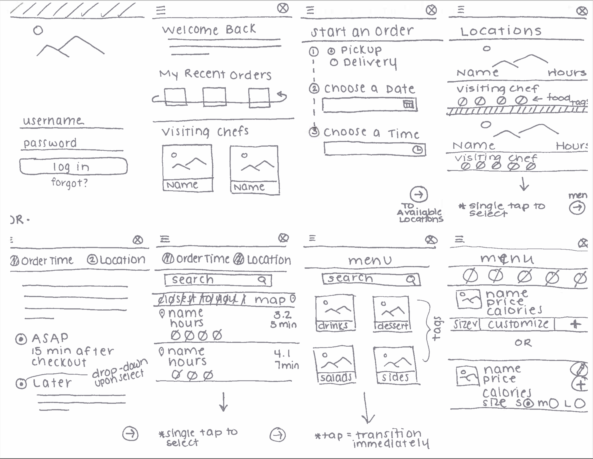
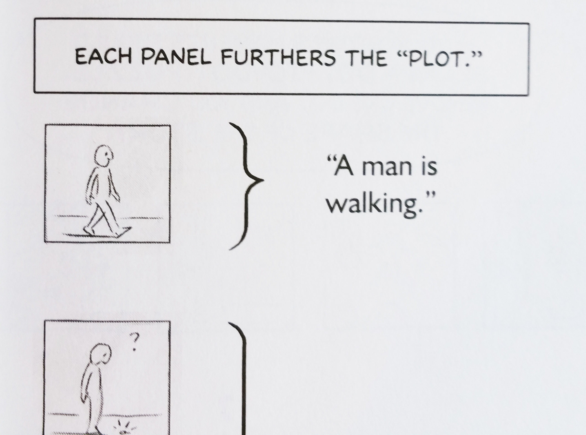
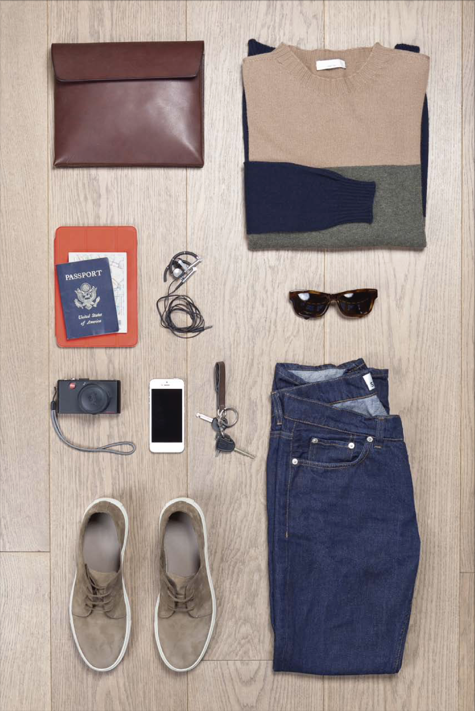
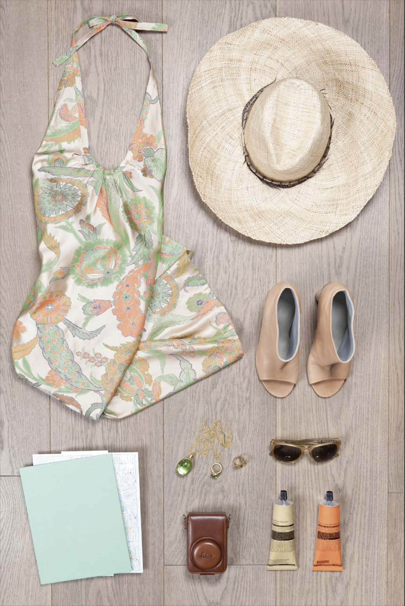
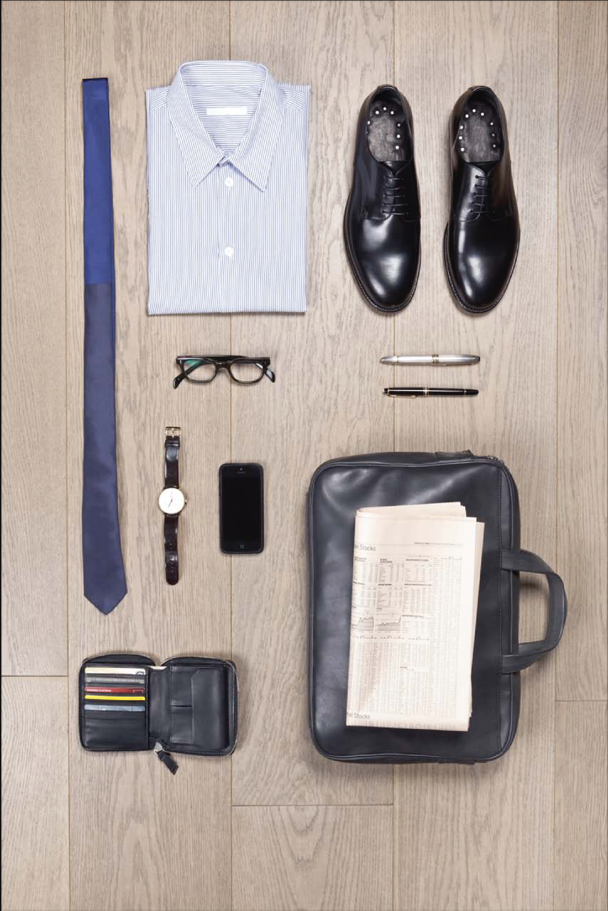
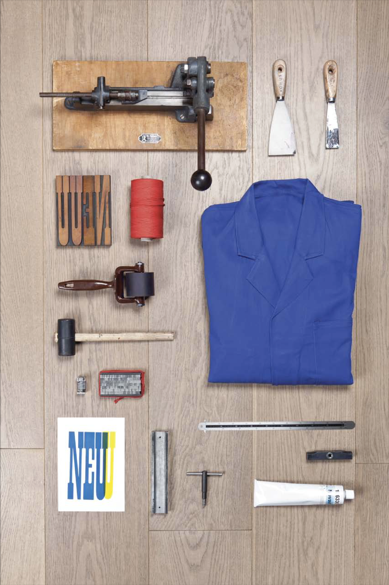
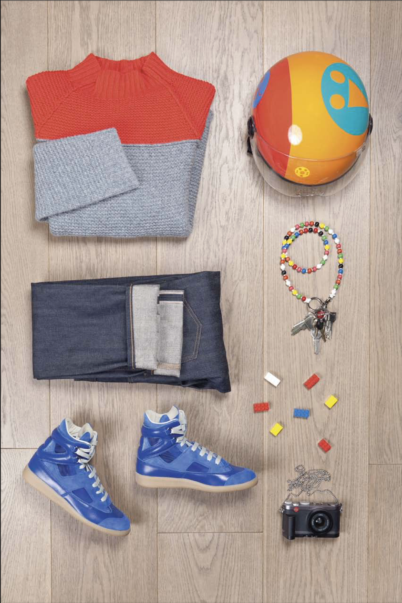

class: animated, fadeIn, middle
layout: true

<style type="text/css">
/* .remark-slide-content h1 {
  font-size: 600%;
}
*/

@import url('https://fonts.googleapis.com/css2?family=Fira%20Code:wght@300..700&display=swap');
.remark-code, .remark-inline-code { font-family: 'Fira Code'; }

.remark-slide-number {
  position: inherit;
}

.remark-slide-number .progress-bar-container {
  position: absolute;
  bottom: 0;
  height: 4px;
  display: block;
  left: 0;
  right: 0;
}

.remark-slide-number .progress-bar {
  height: 100%;
  background-color: red;
}
.scale-30 img { width: 30%; height: 30%; }
.scale-40 img { width: 40%; height: 40%; }
.scale-45 img { width: 45%; height: 45%; }
.scale-60 img { width: 60%; height: 60%; }
.scale-70 img { width: 70%; height: 70%; }
.scale-75 img { width: 75%; height: 75%; }
.scale-80 img { width: 80%; height: 80%; }
.scale-85 img { width: 85%; height: 85%; }
.big { font-size: 200%; }
.footer {
  position: absolute;
  bottom: 10px;
}
</style>
```{r setup, include=FALSE}
options(htmltools.dir.version = FALSE)
knitr::opts_chunk$set(
  fig.width=9, fig.height=3.5, fig.retina=3,
  out.width = "100%",
  cache = FALSE,
  echo = TRUE,
  message = FALSE, 
  warning = FALSE,
  hiline = TRUE
)
xaringanExtra::use_tile_view()
xaringanExtra::use_extra_styles(
  hover_code_line = TRUE,         #<<
  mute_unhighlighted_code = TRUE  #<<
)
```
```{r xaringan-themer, include=FALSE, warning=FALSE}
library(xaringanthemer)
style_solarized_light()
```

---
class: title-slide

# Prototyping and Usability Exercises

### ... evolving as the semester progresses

### Mick McQuaid

.footer[This is a slideshow. Use the arrow keys to navigate.]

---
class: animated, fadeIn

.pull-left[
  
]
.pull-right[
# Crazy Eights
divide an 11&times;17 page into eight squares and draw a lofi sketch in each square. For an app idea, use either the slideshow at [RCN](https://mickmcquaid.com/rcn) or the one at  [Greenovation](https://mickmcquaid.com/greenovation) as a source.

Use the back of the page for rough sketches and the front for your final sketches, which should *not* indicate typeface or color, just layout and information. Upload what you do to the *Crazy Eights* dropbox.
]

???

The purpose of this exercise is to speed up your lofi prototyping cycle by giving you a repeatable method to come up with lofi sketches. The basic idea is to do it fast and throw it away when you're done, although we will be scrutinizing these examples. Being able to do this fast helps to get your creative juices flowing on demand, rather than just when inspiration strikes you, which may not happen at the right moment.

---

.pull-left[
  
]
.pull-right[
# Picking Up a Key
Produce a comic strip of 7 to 9 panels based on a five sentence story, where you alter the last of the five sentences and the identity of the main character. The exercise comes from McCloud (2006). Page 13 has a five-sentence story, told in 8 panels. The character is a man. Change the character to a woman or creature or a different man. Change the last sentence (about the lion) to a different ending. Choose your own number of panels, anywhere from 7 to 9 panels. Tell the story your own way. The five sentences are (1) A man is walking. (2) He finds a key on the ground. (3) He takes it with him, then he comes to a locked door. (4) He unlocks the door. (5) Then a hungry lion jumps out.

Upload your comic to the *Picking Up A Key* dropbox on MyCourses.
]

???

The purpose of this exercise is to give you practice creating a storyboard. You will often need to create storyboards of how your users or personas will use your prototypes. You will want to take the environment into account in these storyboards.

---

.pull-left[
  
]
.pull-right[
## Create a design style guide
Your task is to create a style guide for the personal web site of the person whose belongings are shown on the next screen. The style guide could be as simple as the sheet shown on the left, or it could include information about the layout: the grid and spacing parameters, and more. It could be a series of pages or panels. See, for example, the stylesheet examples at [dribbble](https://dribbble.com/tags/stylesheet).

You may want to use Google Fonts to identify a font you can use for free. You may want to make this into a reusable template because a style guide will be part of your hifi prototype, HW 4.
]

???

The purpose of this and the following exercises is to sharpen your eye for fonts, colors, and layouts. The only way to become sophisticated in your use of these elements is to look at a lot of them critically in context of real use cases.

You may want to look at some sophisticated style guides, such as

- [https://design-system.service.gov.uk/](https://design-system.service.gov.uk/)
- [http://urbaninstitute.github.io/graphics-styleguide/](http://urbaninstitute.github.io/graphics-styleguide/)
- [https://designsystem.digital.gov/](https://designsystem.digital.gov/)
- [https://designsystem.digital.gov/design-tokens/](https://designsystem.digital.gov/design-tokens/) (This is a subset of the previous one and is the most important part)

---

.pull-left[
  .scale-75[]
]
.pull-right[
## Create a design style guide
Your task is to create a style guide for the personal web site of the person whose belongings are shown on the left. The style guide could be as simple as colors and fonts, or it could include information about the layout: the grid and spacing parameters, and more. It could be a series of pages or panels. See, for example, the stylesheet examples at [dribbble](https://dribbble.com/tags/stylesheet).

The picture at left, like those on the following pages, is from Spiekermann (2014), mentioned in the syllabus.

Note that we will repeat this exercise for several weeks with different sets of belongings. Your style guide should become better and more reusable with each attempt.
]

???

The purpose of this and the following exercises is to sharpen your eye for fonts, colors, and layouts. The only way to become sophisticated in your use of these elements is to look at a lot of them critically in context of real use cases.

---

.pull-left[
  .scale-75[]
]
.pull-right[
## Create a design style guide
Your task is to create a style guide for the personal web site of the person whose belongings are shown on the left. The style guide could be as simple as colors and fonts, or it could include information about the layout: the grid and spacing parameters, and more. It could be a series of pages or panels. See, for example, the stylesheet examples at [dribbble](https://dribbble.com/tags/stylesheet).

You may want to use Google Fonts to identify a font you can use for free. You may want to make this into a reusable template because a style guide will be part of your hifi prototype, HW 3.

Note that we will repeat this exercise for several weeks with different sets of belongings. Your style guide should become better and more reusable with each attempt.
]

???

The purpose of this and the following exercises is to sharpen your eye for fonts, colors, and layouts. The only way to become sophisticated in your use of these elements is to look at a lot of them critically in context of real use cases.

---

.pull-left[
  .scale-75[]
]
.pull-right[
## Create a design style guide
Your task is to create a style guide for the personal web site of the person whose belongings are shown on the left. The style guide could be as simple as colors and fonts, or it could include information about the layout: the grid and spacing parameters, and more. It could be a series of pages or panels. See, for example, the stylesheet examples at [dribbble](https://dribbble.com/tags/stylesheet).

You may want to use Google Fonts to identify a font you can use for free. You may want to make this into a reusable template because a style guide will be part of your hifi prototype, HW 3.

Note that we will repeat this exercise for several weeks with different sets of belongings. Your style guide should become better and more reusable with each attempt.
]

???

The purpose of this and the following exercises is to sharpen your eye for fonts, colors, and layouts. The only way to become sophisticated in your use of these elements is to look at a lot of them critically in context of real use cases.

---

.pull-left[
  .scale-75[]
]
.pull-right[
## Create a design style guide
Your task is to create a style guide for the personal web site of the person whose belongings are shown on the left. The style guide could be as simple as colors and fonts, or it could include information about the layout: the grid and spacing parameters, and more. It could be a series of pages or panels. See, for example, the stylesheet examples at [dribbble](https://dribbble.com/tags/stylesheet).

Please note that the tools depicted at left are used in the operation of an oldstyle printing press and the garment is a printer's smock.
]

???

The purpose of this and the following exercises is to sharpen your eye for fonts, colors, and layouts. The only way to become sophisticated in your use of these elements is to look at a lot of them critically in context of real use cases.

---

.pull-left[
  .scale-75[]
]
.pull-right[
## Create a design style guide
Your task is to create a style guide for the personal web site of the person whose belongings are shown on the left. The style guide could be as simple as colors and fonts, or it could include information about the layout: the grid and spacing parameters, and more. It could be a series of pages or panels. See, for example, the stylesheet examples at [dribbble](https://dribbble.com/tags/stylesheet).

Please note that the tiny binoculars in the picture at left are commonly called opera glasses.
]

???

The purpose of this and the following exercises is to sharpen your eye for fonts, colors, and layouts. The only way to become sophisticated in your use of these elements is to look at a lot of them critically in context of real use cases.

---

.pull-left[
  .scale-75[]
]
.pull-right[
## Create a design style guide
Your task is to create a style guide for the personal web site of the person whose belongings are shown on the left. The style guide could be as simple as colors and fonts, or it could include information about the layout: the grid and spacing parameters, and more. It could be a series of pages or panels. See, for example, the stylesheet examples at [dribbble](https://dribbble.com/tags/stylesheet).

Put the six style guides you have created together into a single pdf for comparison, to see how your work has grown. Your eye should be getting sharper.

Put the resulting pdf in the *style guides* dropbox on MyCourses.
]

???

The purpose of this exercise is to sharpen your eye for fonts, colors, and layouts. The only way to become sophisticated in your use of these elements is to look at a lot of them critically in context of real use cases.

---

.pull-left[
  .scale-75[]
]
.pull-right[
## Record a usability test using OBS
Create a recording of a desktop usability test using OBS.

Put the recording into the *OBS Recording* dropbox on MyCourses.
]

???

The purpose of this exercise is to make you comfortable using OBS. There is so much to do in a usability test that you can't be fretting over the software. You should play with the software and practice with it so there are no surprises when you have a live test participant.
