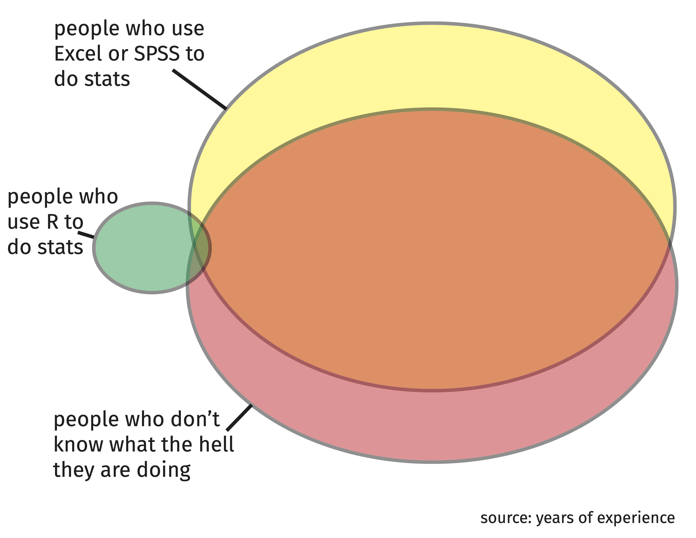

```{r, child="rmdBoilerplateNorefs.Rmd"}
```

# Why R?

### slideshow by Mick McQuaid

.footer[This is a slideshow. Use the arrow keys to navigate.]

---
class: animated, fadeIn

.pull-left[
# Oops!
]

.pull-right[
- On Friday, someone asked at the end if I cared whether you used the software I had just spent a half hour describing!
- In a moment of frustration and sarcasm, I unfortunately answered "No"
- But I do care, I care very much
- Evidence includes the time I took to prepare that lesson
- I'm going to take a few minutes to tell you why I care
]

---

.left-column[
<br>
<br>
<br>
<br>
<br>
### A Venn diagram of stats users
]

.right-column[
.center[.scale-85[]]
]

???

On top, you see the large group of people who use Excel or SPSS to do stats.

In the middle, is the much smaller group of people who use R for stats. This group includes most experts on stats, as well as some others.

At the bottom, is a group that unfortunately shares a very large overlap with the top group: the people who don't know what the hell they are doing.

What is my source for this Venn diagram? Years of experience teaching stats and struggling with students who don't know and don't want to know. The latter problem is the worst. Many students want to avoid stats as much as they can, so it makes sense to them to take the easy path. If all else were equal, the easy path *would* make sense. But all else is not equal, as I shall try to demonstrate on the next few slides.

---

.pull-left[
# Why R?
]

.pull-right[
## It's free
## Reproducible research
## Literate programming
]

???

These are all very important and valid reasons and I would like to take a minute to explore each.

---

.pull-left[
# It's free
]

.pull-right[
- This is more important than you realize
- No administrative overhead
- No purchase orders
- No bookkeeping about license upgrades
- No IT people need to monitor your machine
- No upgrade restrictions&mdash;always use the latest
]

???

Students often think that *free* only matters because they lack money. Or they are attracted to things that are free for students but cost money for everyone else. Both are traps. There are plenty of reasons to care about software being free besides the fact that you don't have money. (Read the list on the slide.)  And it makes a lot of sense to question why payware is given free to students. Is it because they want to do you a favor? Probably not. More likely they are hoping to lock you into their product so you'll buy it when you graduate. Therefore, a product like R, that has been free for over twenty years to everyone and is sustained by a healthy community of developers and scholars, has great value.

---

.pull-left[
# Reproducible Research
]

.pull-right[
- Provides evidence that your results are correct
- Allows other to use your methods and results
- Allows you to reuse your methods if you forget how you did it
- Google 'reproducibility crisis' to find out more about how important this is in the scientific world
]

---

.pull-left[
# Types of Reproducibility
]

.pull-right[
- _Computational reproducibility_ provides info about
  - code, software, hardware, implementation details
- _Empirical reproducibility_ provides info about
  - non-computational empirical scientific experiments and observations
- _Statistical reproducibility_ provides info about
  - the choice of statistical tests, model parameters, threshold values, and more
]

---

.pull-left[
# Literate Programming
]

.pull-right[
- Provides a method for reproducible research
- Puts your code and narrative together in one file
- Makes it easier to understand why you did what you did
- Enables a think-say-act cycle that improves your work
- Google 'literate programming' to find out more about how important this is in the scientific world
]

???

Literate programming is a technique that enables reproducible research.

```{r, child="endWcolophon.Rmd"}
```

