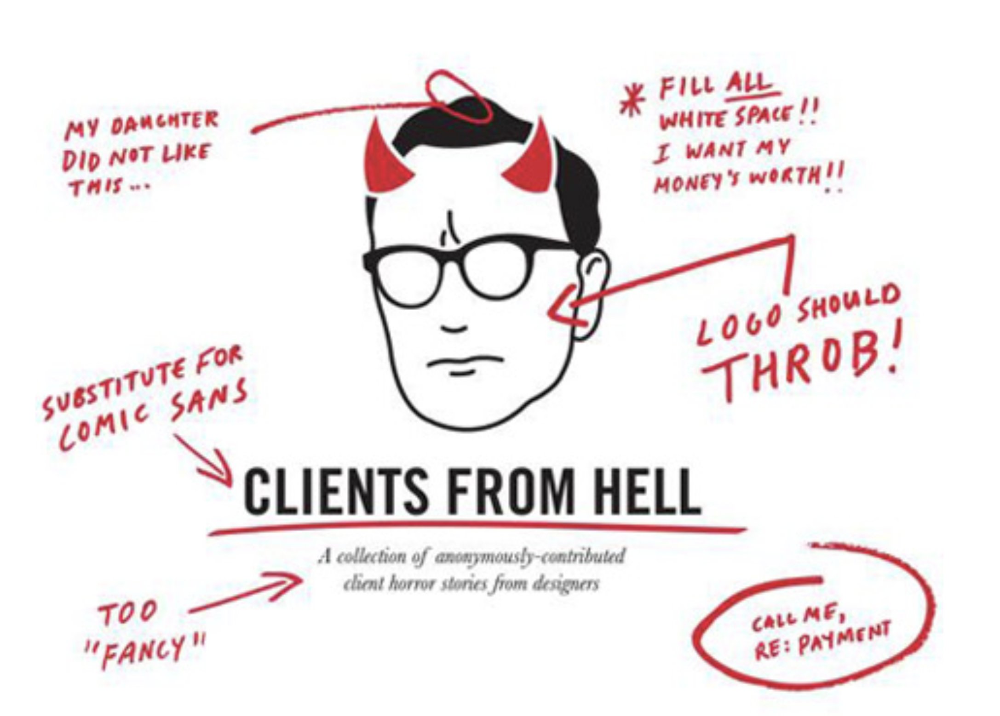
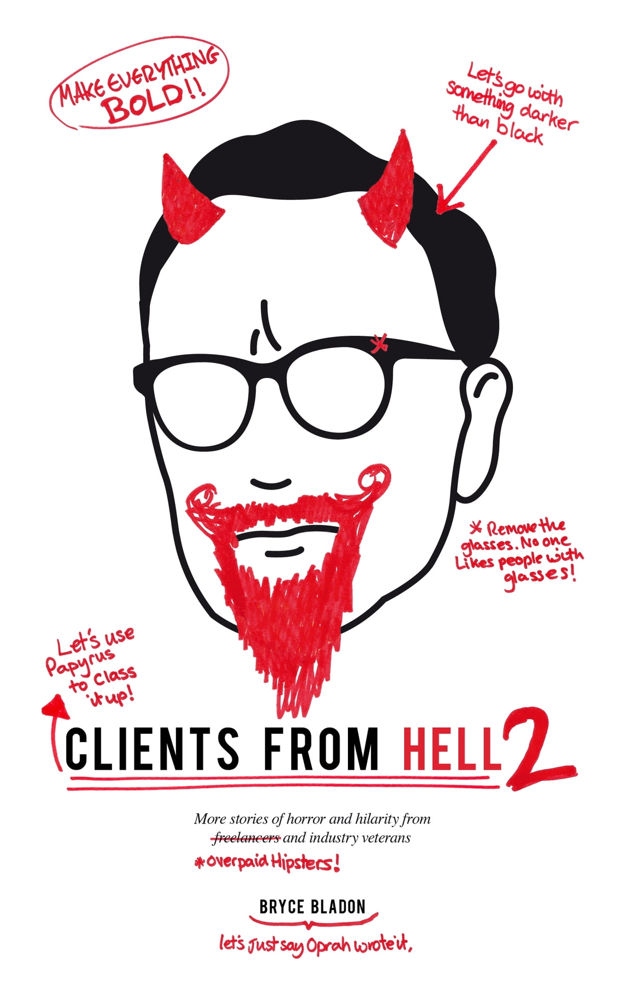
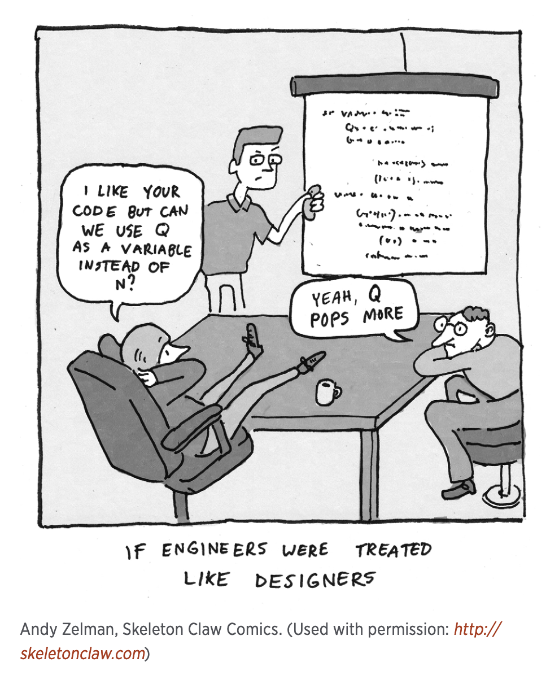
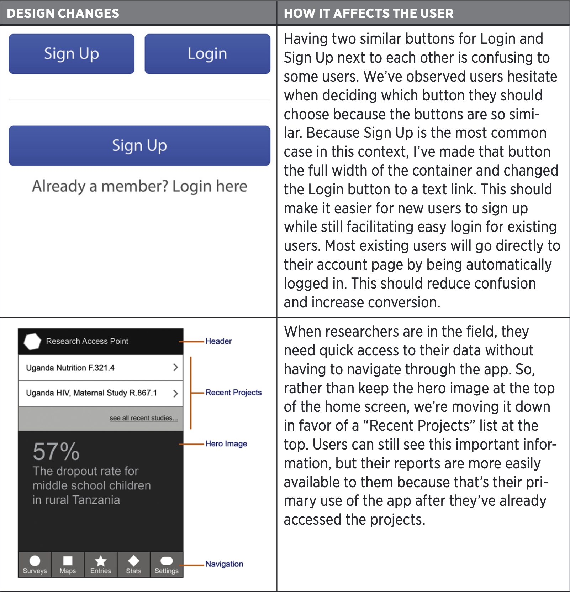
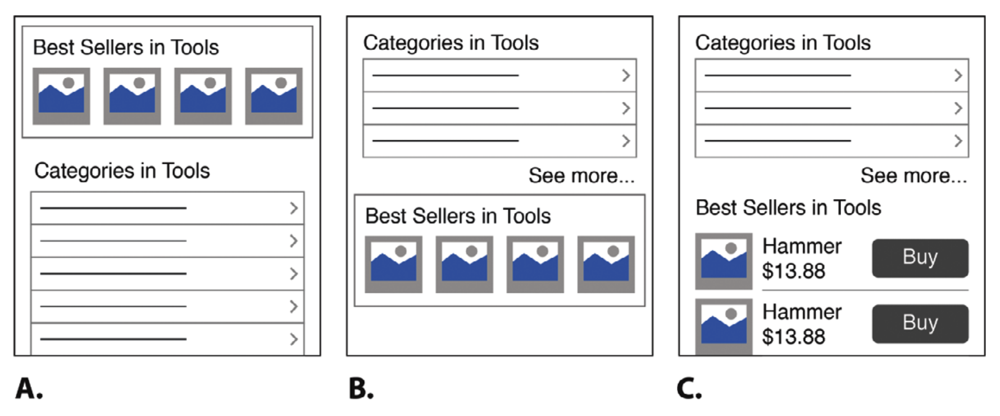

::: {.r-fit-text}
Week FOUR
:::

---

::: {.r-fit-text}
Recap
:::

::: {.notes}
- Group 6's work from last time
- Mood boards
- Crazy Eights
:::

# design challenge 3

## pause for group 3's eval

::: {.notes}
1. Group 2's presentation
2. Q&A
3. My evaluation of Group 2's evaluation
:::

# Clients

##

::: {.notes}
Clients can be difficult! Let's look at all the ways we see here.

- "My daughter did not like this" means that the client has done user research, but with only one user! This could be an opportunity to educate the client about user research! How would you do that?
- "Substitute for Comic Sans" is, of course, a joke since Comic Sans is the most frequently deprecated typeface. But did you know that Comic Sans is actually good for dyslexics? Despite all the jokes about Comic Sans, there may be a good reason to use it!
- What does *Too "Fancy"* mean? In this context, it is meant to suggest that the client is inarticulate about what he (I'm choosing male pronouns because of the picture) wants. Therefore the designer has to help. How can you, as a designer, help the client be more articulate here?
- Continuing down the right side, we have "Fill all white space!! I want my money's worth!!" This suggests that the client equates quantity of verbiage with effort and hasn't heard Dieter Rams edict that design is about trying to take everything away. How can you help the client see what viewers see?
- "Logo should THROB!" is another example of the client being inarticulate. What might the client mean here? Is it worthwhile to pursue or are there some points on which the designer should remain silent?
- "Call me, re: payment" is another joke, because many clients are notorious for having issues about payment---a really tough subject to handle.
:::

##
{fig-align="center"}

::: {.notes}
The previous book was popular enough to spawn a sequel and it's cover is similarly an opportunity for designers to sharpen their communication skills.

- "Make everything bold!!" reminds us that, when everything is emphasized, nothing is. How do we convey that message to the client? Should we convey that message to the client?
- "Let's go with something darker than black" seems like a non sequitur, but is there something behind it that we should try to understand? Remember, color theory tells us that the appearance of colors is relative to the appearance of proximal colors. The previous book recounts an incident in which a designer was able to pass off the same color choice as an improved color choice by surrounding it with a different background.
- "Let's use Papyrus to class it up!" is another joke about a deprecated font, the second most frequently deprecated font after Comic Sans. I know of no redeeming feature of Papyrus like I do with Comic Sans, but I suspect it has its place.
- "Remove the glasses! No one likes people with glasses!" is funniest if it's said by someone wearing glasses. Like the use of the daughter as user research on the previous cover, this imputes user study that never happened. How can you help the purveyor of this unfortunate generalization?
- "Overpaid hipsters" reflects the dehumanizing picture some people have of designers. How can they be humanized and how can their modest incomes be put into perspective?
- "Let's just say Oprah wrote it" conveys an unfortunate fact about the effect of marketing in the publishing industry at the same time it makes a joke about the duplicity of that industry. I'm not sure I can find any nugget of knowledge in this one!
:::

# @Greever2020 on Clients

## The big meeting
- For the pitch meeting, communicating the designs was more important than the designs!
- Time spent designing was small compared to time spent preparing the pitches
- Client could have derailed the months-long effort in a minute

## What makes a good design good?
- Is it good use of space?
- Is it simplicity?
- Is it when you can't remove anything?
- What do you think?

## None of these!
- Greever claims that these are internal to the designer and don't respect the need to communicate
- Everyone is a designer in their own mind, just as everyone is a music critic even if they can't play
- Good design is, to some degree, subjective (but there are design features like symmetry and tension that play across cultures and epochs)

##

::: {.notes}
Greever makes the point that we don't treat everyone the way we treat designers. Everyone thinks they can design. When they put together a design, though, what most people do is tragically comedic.
:::

## The power to say no
- Clients are not monolithic
- Many people may have the power to say no for different reasons
- They're all stakeholders

## And yet, design by committee doesn't work
- People disagree
- People get defensive when they disagree
- People fail to focus on the issues when they get defensive
- Grumbling compromise results

## Home page syndrome
- Home screens or pages become a catchall
- Different stakeholders believe *their* thing will work if it's more prominent

## Communication is the job
- Most stakeholder issues can be explained as miscommunication or misunderstanding
- Designers must be communicators
  - Setting expectations
  - Following instructions
  - Articulating product and process

## What is "articulate"?
Understand your message *and* understand the desired response

## Being articulate includes
- Imparting intelligence $\Rightarrow$ trustworthiness
- Demonstrating intentionality $\Rightarrow$ purpose and focus
- Expressing confidence $\Rightarrow$ you mean what you say
- Showing respect $\Rightarrow$ plays well with others

## Greever's definition of good design
- Solves a problem
- Easy for the users
- Supported by everyone

::: {.notes}
What do you think of this? Do you believe it? Let's unpack it a bit by considering each of the three components in turn.
:::

## By the way, my definition of good design is

When the client and users have no regrets, that is good design!

::: {.notes}
What do you think of this? In other words, you don't know if the discarded ideas were good or not, you can only judge the implemented designs and you can only do it reliably retrospectively. There's a famous example of CmdrTaco deprecating the introduction of the iPod as doomed, and I'm sure there are many other such critiques of untested design.
:::

## Solving a problem
- Metrics matter
- What matters most to stakeholders?
- Introspection helps intuition
- Constantly ask how what you're doing solves the problem
- Keep writing about the problem and solution

## Make it easy
- Ask how each thing you do affects the user (can't always be sure)
- Write (and revise) a user story

##

## Usability $=$ common sense $+$ research

::: {.notes}
Research is needed because not everyone has the same idea of what common sense means.

Research can be analytics or usability study. Remember analytics only tells us what a user did, not why. Usability studies may answer *why* questions.
:::

## Get everyone's support
- Not getting support means going over the same ground over and over
- Getting support is Greever's primary focus
- Support $\neq$ agreement
- Get forward momentum, not consensus

## Ask over and over why this beats alternatives
- This means thinking of and thinking through alternatives
- This means anticipating how stakeholders will react
- It's worth listing alternatives and problems they face
- Maybe wireframe alternatives

##

::: {.notes}
Here are some examples of wireframed alternatives. Do any stand out to you?
:::

## Answer these questions
- What problem does it solve?
- How does it affect the user?
- Why is it better than the alternative?

::: {.notes}
You have to understand your choices.
:::

# @Greever2020 on Stakeholders

## What you must do
- Improve stakeholder relationships
- Earn stakeholder trust
- Establish stakeholder rapport

## Apply UX principles to stakeholders
- Study stakeholders just as you study users
- Empathy for stakeholder
- Perspective of stakeholder

## Building the relationship
- See stakeholders as human
- Create shared experiences with stakeholders
- Develop empathy for stakeholders
- Ask good questions of stakeholders

# Mock client time

::: {.container}
:::: {.col}
- Break into pairs
- One of you is the client
- Client conveys desire for shopping app to designer
- Designer tries to understand the client
- Client doesn't have to make it easy!
- Switch roles
::::
:::: {.col}
1. Take five minutes to prepare
2. During that time, client thinks about what they want in a shopping app
3. During that time, designer thinks about how they can elicit info
4. Come together for the interview
5. Repeat Steps 1--4
::::
:::

# design challenge 4

## Pause for Group 4's intro

## Q&A

# References

::: {#refs}
:::

---

::: {.r-fit-text}
END
:::

# Colophon

This slideshow was produced using `quarto`

Fonts are *League Gothic* and *Lato*

