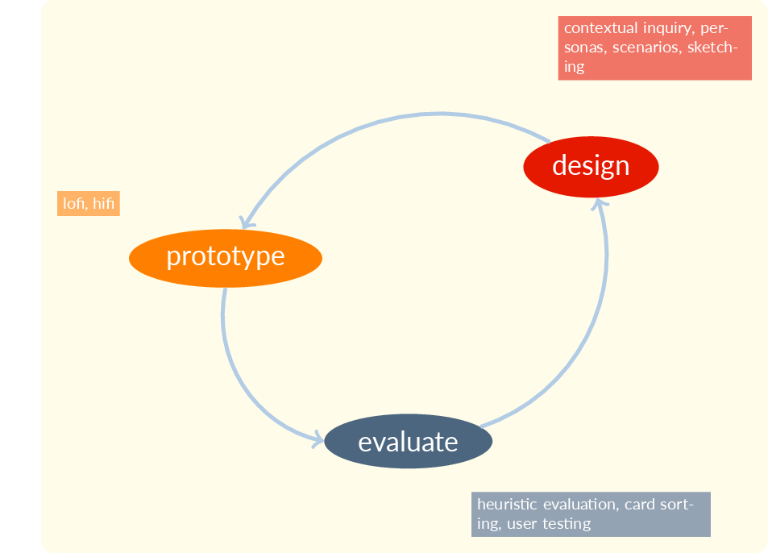
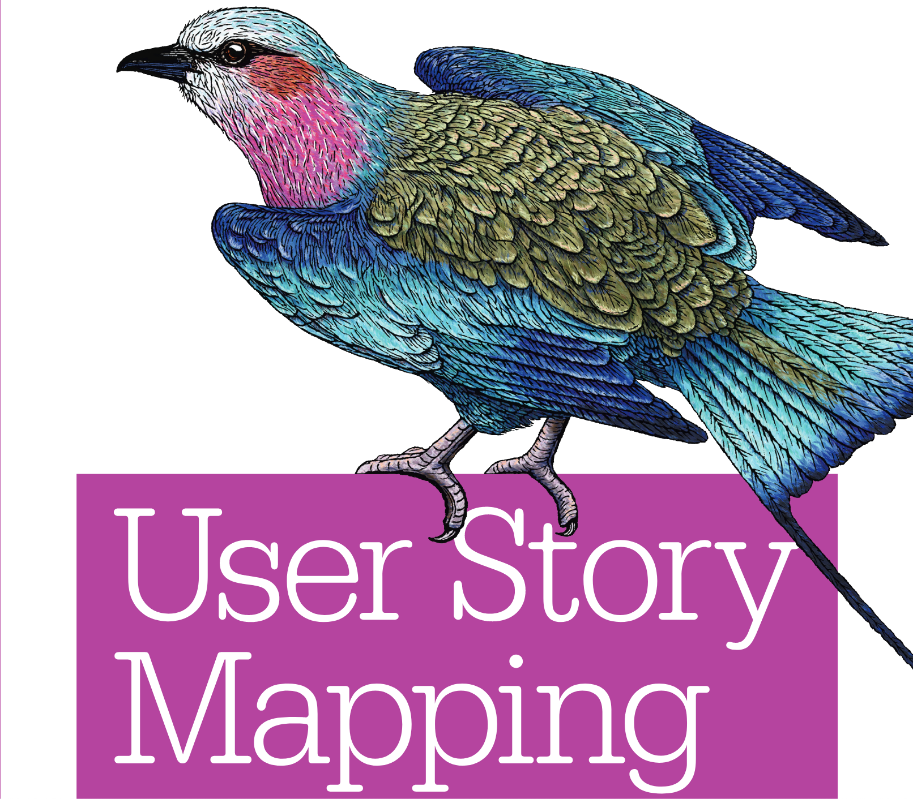

# Some intro points
- Don't discount our undergrads and MS students for research
- They are driven and good communicators, as we shall see
- We need to communicate a bit about what they do to see why
- We have some obvious common ground to look at, as well as coming up with new ground

# Some of our UX facilities

## IX Lab

::: {.notes}
More info at [https://ixlab.ischool.utexas.edu/](https://ixlab.ischool.utexas.edu/)
:::

## Immersive Lab

::: {.notes}
More info at [https://immersivehuman.ischool.utexas.edu/](https://immersivehuman.ischool.utexas.edu/)
:::

# What we preach

## Iterative Software Development Process

::: {.notes}
A typical graduate of the UX design program needs to be able to integrate into an iterative workflow like this, where they may have a deliverable design every week. The small boxes here show some of the activities of each phase of the iterative development process.
:::

## Foundations (Vertices) and Career Paths

::: {.notes}
We urge students to identify where they are and where they want to be with respect to the three vertices of this triangle, psych, coding, and graphics, and to strengthen themselves in these areas according to their aspirations. Someone who is more into coding may aspire to be a ux engineer, for example, while someone who divides their efforts equally between the three may aspire to be a ui designer.
:::
:::

# What we teach

::: {.notes}
Following are some of the activities we teach UX designers to do. I (Mick) personally emphasize the need for speed in action and slowness in thought. There are repeatable processes that can be polished so that your cycle time is faster than your rivals. You need to learn to do these activities quickly.

On the other hand, thought is hard, solitary, and slow. You need to practice slow thought to enhance your creativity.
:::

## Story Mapping

::: {.notes}
Admittedly, I just threw this in because I like the bird on the cover of this book which we use for story mapping.
:::

## Story Mapping

::: {.notes}
This is an illustration from @Patton2014a, the book shown in the previous slide. Our actual story maps are generally done on FigJam and don't reduce well to a slide, but this overview does, I think, work well on a slide.
:::

## Crazy Eights

::: {.notes}
Crazy Eights, also called eight square prototyping, invites the designer to rapidly make eight screens for a digital artifact. The emphasis is on speed, so that you generate a lot of alternatives in a short time.
:::

## Maintaining Sketchbooks

::: {.notes}
I insist that students maintain a sketchboook. This is actually a photograph of a sketchbook of Frida Kahlo's, which I took when visiting her home in Mexico City that had been turned into a museum.
:::

## Sketchbook "Good Design" Example

::: {.notes}
I ask students to put examples of good design they encounter into their sketchbooks and reflect on the sketches over time. This is a sketch from a talented student who was an avid photographer and had this mini-tripod that he liked.
:::

## Designing an app for figures in a locally-exhibited painting

::: {.notes}
One exercise I recently gave students was to visit a local museum and design an app for the use of the figures in the painting you see here. This painting is called *Still you bloom in this land of no gardens* and was the featured painting of its exhibit, a self-portrait of the artist with her son.
:::

## Design thinking process

::: {.notes}
I teach the traditional design thinking process, emphasizing different phases in different classes.
:::

## Storyboards in the Design Thinking Process

::: {.notes}
One phase of the design thinking process calls for storyboards of user experience. This is one from a current student.
:::

## An Inclusive Design class in action

::: {.notes}
One of our other new faculty members is Earl Huff, Jr., who is teaching an Inclusive Design class. In this photo, the students in his class are blindfolded and try to interact with the computer in that state. Of course, simulations of blindness are a controversial practice because they don't fully capture the experience of blindness, but they are helpful to designers within their limitations.
:::

## We rely on UX literature, such as {.smaller}

::: {.container}
:::: {.col}
- @Norman2013
- @Norman2005
- @Arnheim1974
- @Baker2017
- @Bannon2018
- @Becker2020
- @Bertin2011
- @Buxton2007
- @Chi1997
::::
:::: {.col}
- @Cockton2016
- @Cooper2014
- @Dodson2006
- @Friedman1996
- @Gaver2004
- @Goodman2012
- @Greever2020
- @Holtzblatt2005
::::
:::: {.col}
- @Krug2005
- @Ladner2015
- @Lazar2017
- @Lidwell2010
- @Mace1991
- @Mccloud2006
- @Shinohara2016
::::
:::

::: {.notes}
I tried to assemble a bit of a bibliography, so that you would get an idea of where we're coming from, but I filled up this slide by the time I got to the Ms! I threw in a couple of Don Norman books and a work by a collaborator of mine to the list, but there is plenty more in the M to Z space!
:::

# Opportunities

##

::: {.container}
:::: {.col}
*Low Hanging Fruit*

Recommender systems face a lot of obstacles; B&H is an exemplar
::::
:::: {.col}
{width=60%}
::::
:::

::: {.notes}
Here's an example from Home Depot, which I visited a few days ago. I was impressed by the fact that the person who helped me used two mobile devices, a phone and what looked like a phone but may have been more specialized. He turned me on to this app which recommended a rug when I wanted fluted dowel pins. Of course, the vagaries of sponsorship constrain what we can do with recommender systems.

I should add that the best retail app I have found belongs to B&H. Even if you don't purchase many electronic devices, it is a pleasure to do so with the B&H app and even more a pleasure if you're addicted to these items as I am. I think all retailers should study B&H's app, although I will admit that Home Depot has features that B&H lacks, such as the row and bay number of the item.
:::

##

::: {.container}
:::: {.col}
*A Success Story*

Complementary recommendations
::::
:::: {.col}
{width=60%}
::::
:::

::: {.notes}
So often, recommender systems do a pretty good job of evaluating similarity, but rarely complementarity. This picture exemplifies a big win for Home Depot in that glue and a drill bit were recommended to a fluted dowel pin purchaser! Most apps of my experience are too primitive to make such recommendations.
:::

## Research opportunities from OARS

(from Xiquan Cui's OARS workshop)

::: {.notes}
I looked at Xiquan Cui's recent SigKDD workshop for some inspiration and see that, in four of the six areas of the call for papers, we have common ground!
:::

## Q&A

::: {.notes}
- What's missing in students you recruit?
- What are the topics you wished we would cover to educate students?
- What are the trends you see coming in the near term that new hires could help with?
:::

# References

::: {#refs}
:::

---

::: {.r-fit-text}
END
:::

# Colophon

This slideshow was produced using `quarto`

Fonts are *League Gothic* and *Lato*

