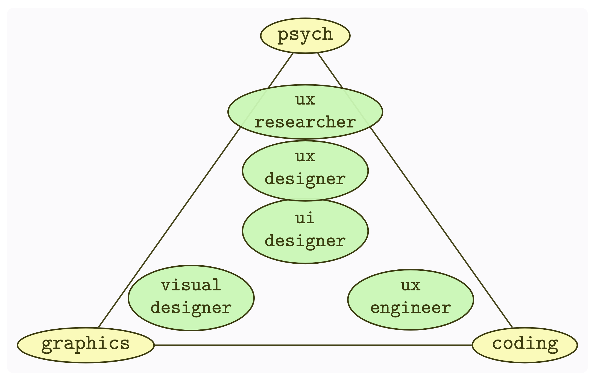
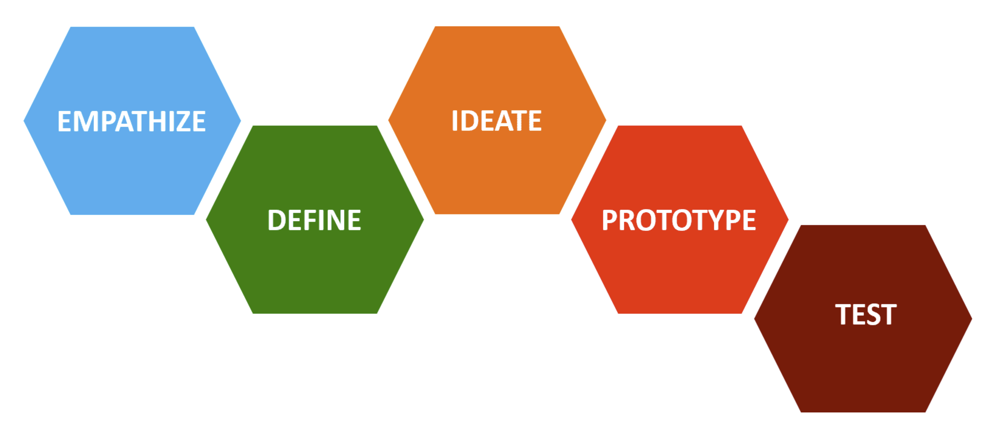

# Some intro points
- Don't discount our undergrads and MS students for research
- They are driven and good communicators, as we shall see
- We need to communicate a bit about what they do to see why
- We have some obvious common ground to look at, as well as coming up with new ground

# Some of our UX facilities

## IX Lab

## Immersive Lab

# What we preach

## Iterative Software Development Process

## Foundations (Vertices) and Career Paths

# What we teach

## Story Mapping

## Story Mapping

## Crazy Eights

## Maintaining Sketchbooks

## Sketchbook "Good Design" Example

## Designing an app for figures in a locally-exhibited painting

## Design thinking process

## Storyboards in the Design Thinking Process

## An Inclusive Design class in action

## We rely on UX literature, such as {.smaller}

::: {.container}
:::: {.col}
- @Norman2013
- @Norman2005
- @Arnheim1974
- @Baker2017
- @Bannon2018
- @Becker2020
- @Bertin2011
- @Buxton2007
- @Chi1997
::::
:::: {.col}
- @Cockton2016
- @Cooper2014
- @Dodson2006
- @Friedman1996
- @Gaver2004
- @Goodman2012
- @Greever2020
- @Holtzblatt2005
::::
:::: {.col}
- @Krug2005
- @Ladner2015
- @Lazar2017
- @Lidwell2010
- @Mace1991
- @Mccloud2006
- @Shinohara2016
::::
:::

# Opportunities

##

::: {.container}
:::: {.col}
*Low Hanging Fruit*

Recommender systems face a lot of obstacles; B&H is an exemplar
::::
:::: {.col}
{width=60%}
::::
:::

::: {.notes}
:::

##

::: {.container}
:::: {.col}
*A Success Story*

Complementary recommendations
::::
:::: {.col}
{width=60%}
::::
:::

::: {.notes}
:::

## Research opportunities from OARS

(from Xiquan Cui's OARS workshop)

## Q&A

# References

::: {#refs}
:::

---

::: {.r-fit-text}
END
:::

# Colophon

This slideshow was produced using `quarto`

Fonts are *League Gothic* and *Lato*

