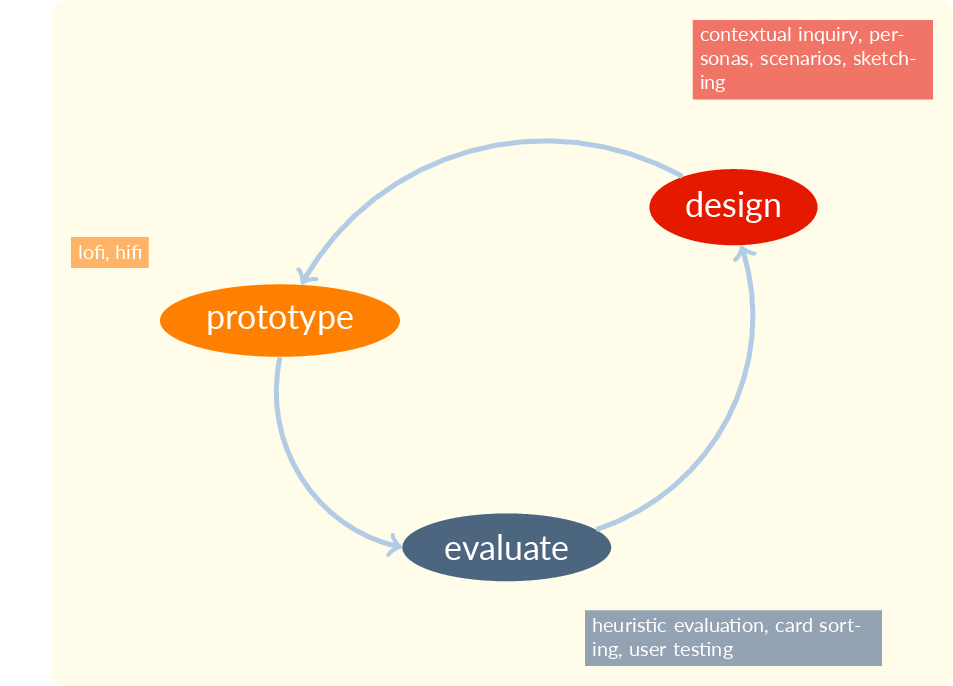

::: {.r-fit-text}
Week ONE
:::

---

::: {.r-fit-text}
How to Start?
:::

---

::: {.r-fit-text}
Read the syllabus?
:::

(eventually we'll hafta, but it's a boring way to start)

---

::: {.r-fit-text}
Go around the room saying our names?
:::

(eventually we'll hafta, but better if we're energized)

---

::: {.r-fit-text}
Get the juices flowing!
:::

# [Why?]{.r-fit-text}

---

I think it's better to start with an exercise that reminds us of what we do, no matter how proficient we are at it.

I need to know something about you and this is a very revealing exercise.

# [EDIPT]{.r-fit-text}

::: {.notes}
What the heck does that mean? (Empathize, Define, Ideate, Prototype, Test)
:::

---

- Empathize
- Define
- Ideate
- Prototype
- Test

::: {.notes}
That's one view of the design thinking process. I'd like you to engage in that process today.
:::

[‹watch video›]{.r-fit-text}

# [Now do what they did!]{.r-fit-text}

# [Materials]{.r-fit-text}

- three pages (actually two pieces of paper, one is double-sided)
- some index cards (about 6)
- some colored sharpies (at least 2)
- a pen or pencil

# [Form Pairs]{.r-fit-text}

- form a pair or trio (but preferably a pair) with someone like you (that's for today)

# [Protocol]{.r-fit-text}

- Empathize (interview)
- Define (list of needs)
- Ideate (storyboard sheet)
- Prototype (cards)

# [‹interview›]{.r-fit-text}

- break into pairs so everyone gets a chance to be interviewer and interviewee
- interview is about supporting new year's resolutions (or something you think up)
- if you're a trio go 2-on-1 or 1-on-2 either way

# [‹make a list of needs›]{.r-fit-text}

- analyze the interview
- be sure to think about what they meant, not just what they said
- think about how you could have gotten more from the interview

# [‹storyboard›]{.r-fit-text}

- draw four panels of cartoons on the ideate page
- show a successful interaction with an app
- don't worry about the app details
- concentrate on the user experience&mdash;what did the user feel?

#

# [‹prototype›]{.r-fit-text}

- now use the index cards
- draw a few main app screens
- focus on making it easy for the user
- think about the circumstances of use

## test
- we're skipping the test phase due to time constraints
- but keep your cards so you can test later
- it's never too early to test
- but testing is the focus of a different course

## our focus: prototype
{fig-alt="iterative cycle: design, prototype, evaluate"}

# [what did we learn?]{.r-fit-text}

- give me your insights about each phase and write them in your sketchbook
- phases were
  - empathize (interview)
  - define (list)
  - ideate (storyboard)
  - prototype (cards)

::: {.notes}

I casually mention on this slide that you should write something in your sketchbook! If you don't keep a sketchbook, consider these questions: Are you a designer? Do you aspire to be a designer? I refer you to @Pink2005, which is a book asking people to learn from designers. One of the recommendations in the book is to keep a sketchbook. In the sketchbook, you write and sketch but you don't paste in elements like printouts of digitally created art. Instead, you develop your eye-hand coordination by doing manual sketching and writing. At least two fifths of a typical designer's time is spent at the whiteboard, so this activity can support a lot of your work.

:::

# [‹intros›]{.r-fit-text}

# [‹syllabus›]{.r-fit-text}

# [‹canvas›]{.r-fit-text}

::: {.notes}
I've put a daunting amount of reading on Canvas. I
typically expect grad students to pace themselves on
reading, so I'm not going to say too much about it
except that most of it can be read piecemeal. The
exception is @Baker2017, which is a novel about UX in a
world with zombies. I think she wrote it that way to
keep your interest up, but the fact is that it is a
single continuous story that you should probably read
through in a linear manner. That's not the case for a
lot of the other books that can, for example, be
consulted when you're working on a particular kind of
milestone.

I should add that the librarian told me that I'm only allowed to put three chapters of any book on Canvas, so I did that with all the books. You can find some of them on the library website and you may want to buy some, although a few of them are absurdly expensive. I can not advocate that you go to annas-archive and download the books for free, partially because it may be illegal to do so. The courts ruled at one time that you had to deprive someone of ownership for an act to be considered theft. That hasn't stopped the music and publishing industries from labeling downloading as theft, though, and they have enjoyed some handsome out of court settlements over file sharing. Another reason you may disapprove of annas-archive (as well as scihub) is that it is hosted in Russia, not the most popular country right now. Further, you may feel that the academic publishing industry is not a bunch of parasitic gangsters and instead feel that they fairly compensate authors for their work. You may not feel that universities should *cut out the middleman* and take over academic publishing. For all these reasons, I do not endorse annas-archive and only mention it for the sake of raising issues about publishing.

A few of the books are the topics of lectures, namely @Patton2014a, @Greever2020, @Buxton2007, @Becker2020, and @Stackowiak2020. You may want to prioritize these in your reading.
:::

# Accessibility

[https://mickmcquaid.com/accessibility/01understanding](https://mickmcquaid.com/accessibility/01understanding)

[https://mickmcquaid.com/accessibility/02context](https://mickmcquaid.com/accessibility/02context)

[https://mickmcquaid.com/accessibility/03uiFacilitatorsBarriers](https://mickmcquaid.com/accessibility/03uiFacilitatorsBarriers)

[https://mickmcquaid.com/accessibility/04assistiveTech](https://mickmcquaid.com/accessibility/04assistiveTech)

[https://mickmcquaid.com/accessibility/05bestPractices](https://mickmcquaid.com/accessibility/05bestPractices)

# [END]{.r-fit-text}

# References

::: {#refs}
:::

# Colophon

This slideshow was produced using `quarto`

Fonts are *Roboto*, *Roboto Light*, and *VictorMono Nerd Font*

