# [Week FIVE]{.r-fit-text}

# But first ... some news

##

## Ferrari Luce (loo-chay)
- First all-electric Ferrari ([https://www.ferrari.com/en-US/auto/ferrari-luce](https://www.ferrari.com/en-US/auto/ferrari-luce))
- Designed by Jony Ive's firm, LoveFrom
- Jony Ive designed a thing called the iPhone. Have you heard of it?
- The Luce is orthogonal to Ive's Apple designs, bristling with physical knobs, buttons, and switches
- My recent BMW loaner, by contrast, is all smooth glass panels
- I had to look at everything I wanted to interact with---not so with the Luce
- Hopefully the Luce design will trickle down to the rest of the industry, as the Ive Apple designs did

# But first ... Design systems

## [〈pause for design system video〉]{.r-fit-text}

::: {.notes}
source (hayley hughes of AirBnB)
[https://youtu.be/mq984Mc9UVA](https://youtu.be/mq984Mc9UVA)

source (charli marie prangley)
[https://youtu.be/mCULNu6-Ts0](https://youtu.be/mCULNu6-Ts0)

source (diana mounter of github)
[https://youtu.be/2Lc8q9EQZuY](https://youtu.be/2Lc8q9EQZuY)
:::

## Takeaways
- People use different terms
- People use the term *design system* in different ways, all the wayfrom style guide to component libraries to basis for entire company (e.g., AirBnB)
- GitHub posits rules, constraints, and principles
  - example: color
  - rule: pass color contrast ratio of 4:5:1
  - constraint: number of colors in palette
  - principle: color used in a meaningful way

## Takeaways, continued
- GitHub started with color, typography, spacing, components, layouts
- GitHub added interaction models, voice and tone, words, grammar and mechanics
- GitHub uses [https://primer.style/](https://primer.style/)
- GitHub uses BEM-style notation [https://en.bem.info/](https://en.bem.info/)
- Material Design is aspirational for GitHub

## Other examples
- [IBM Design Language](https://www.ibm.com/design/language/)
- [IBM Carbon Design System](https://carbondesignsystem.com/)
- [Atlassian Design System](https://atlassian.design/)
- [Firefox](https://acorn.firefox.com/latest/acorn-aRSAh0Sp)
- [Salesforce](https://www.lightningdesignsystem.com/) (the original use of the term)

##
::: {.container}
:::: {.col}
AirBnB hired Pixar to create their storyboards to reflect AirBnB's values as part of their value-based design system
::::
:::: {.col}
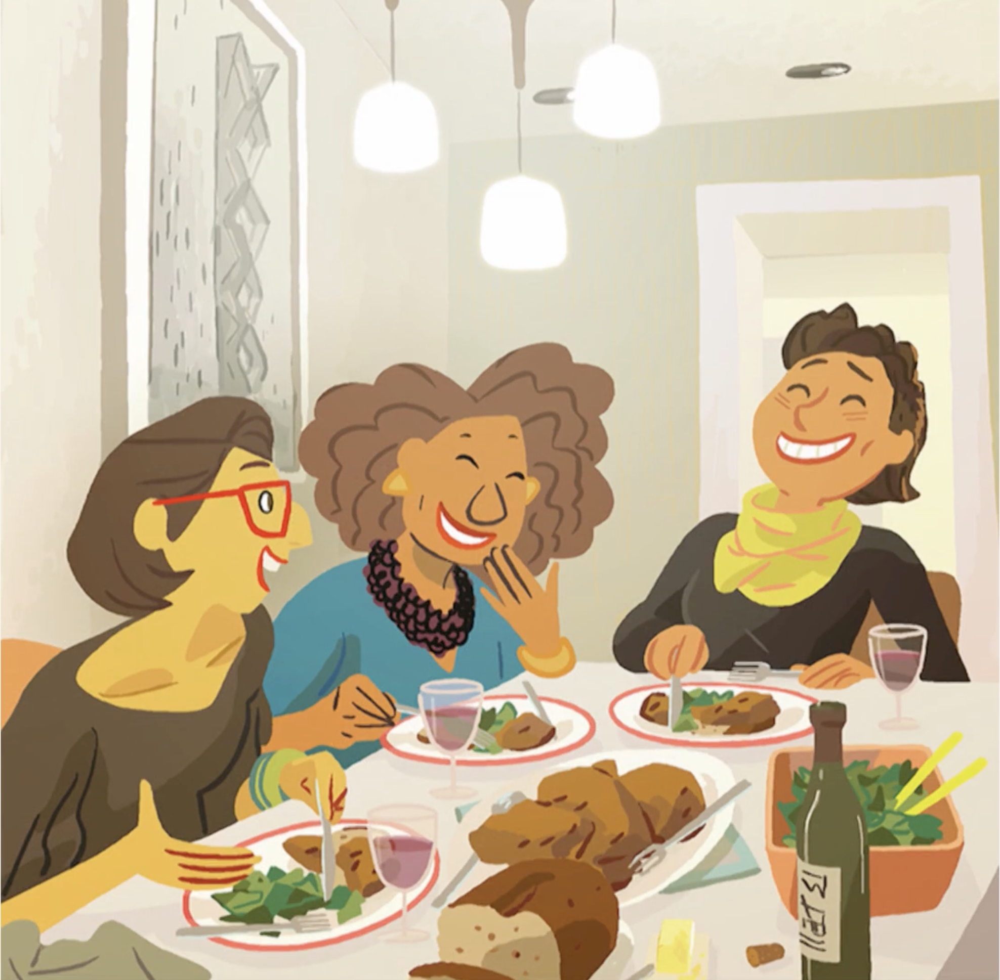
::::
:::

::: {.notes}
This is a still from Hayley Hughes' presentation of a value-based design system for AirBnB at [https://youtu.be/mq984Mc9UVA](https://youtu.be/mq984Mc9UVA)
:::

## AirBnB storyboard
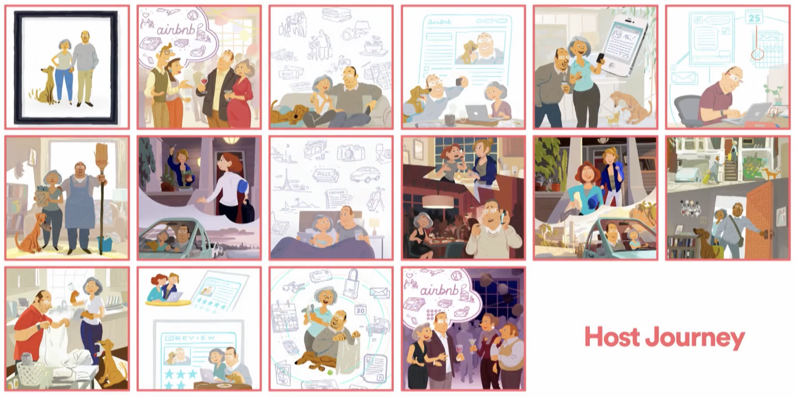

::: {.notes}
This is a still from Hayley Hughes' presentation of a value-based design system for AirBnB at [https://youtu.be/mq984Mc9UVA](https://youtu.be/mq984Mc9UVA)
:::

# But first ... Animation

## Animation Storyboards
- Val Head video [https://youtu.be/Itsg48crOjM](https://youtu.be/Itsg48crOjM)
- [Val Head interview](https://valhead.com/2016/12/08/sketching-interface-animations-an-interview-with-eva-lotta-lamm/)
- Trigger
- Action
- Quality

## Animation Storyboards
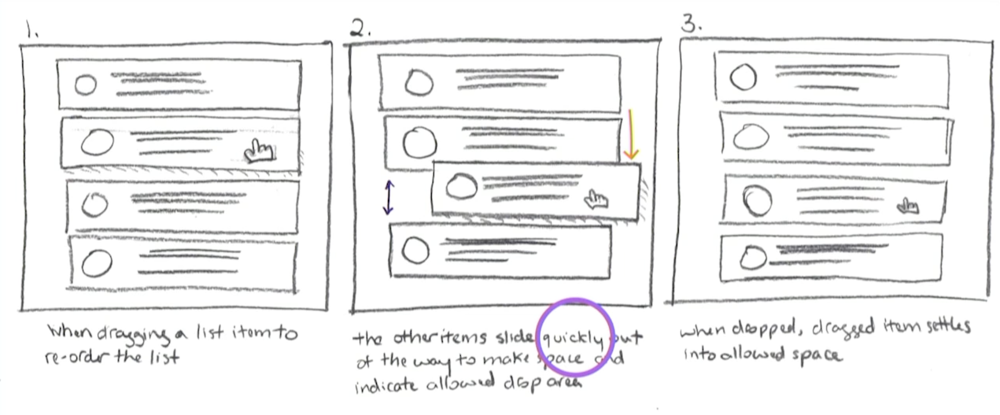

## Animation Storyboard User Input Symbols
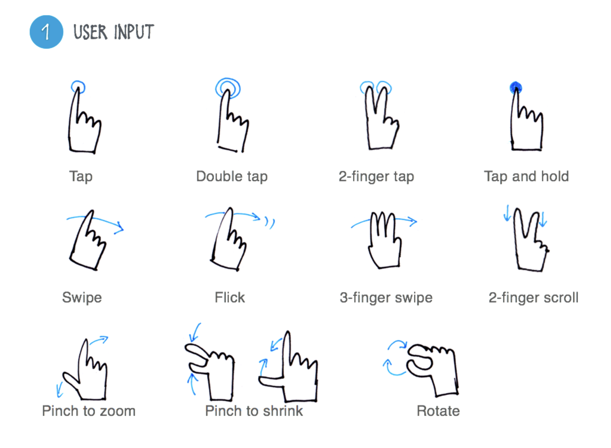

## Animation Storyboard Action Symbols

## Animation Storyboard Quality Symbols
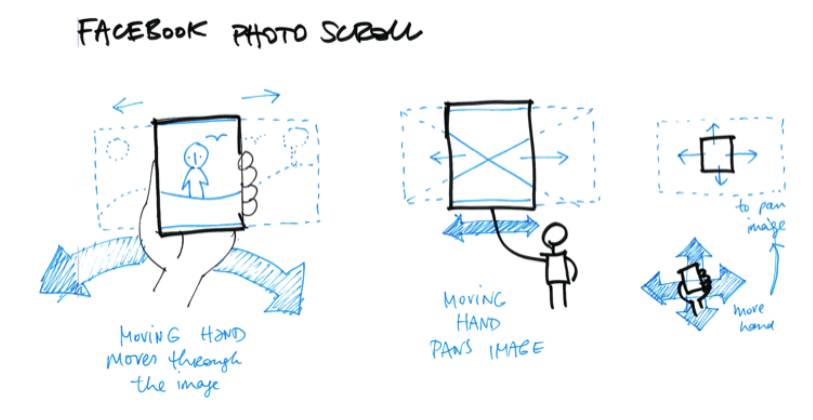

## Animation Storyboard Example
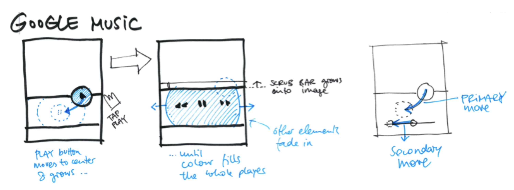

## Animation Motion Comps
- aka Animatics
- Video of how animation works
- Very high fidelity

## Problem: Animate this! (Remember this?)
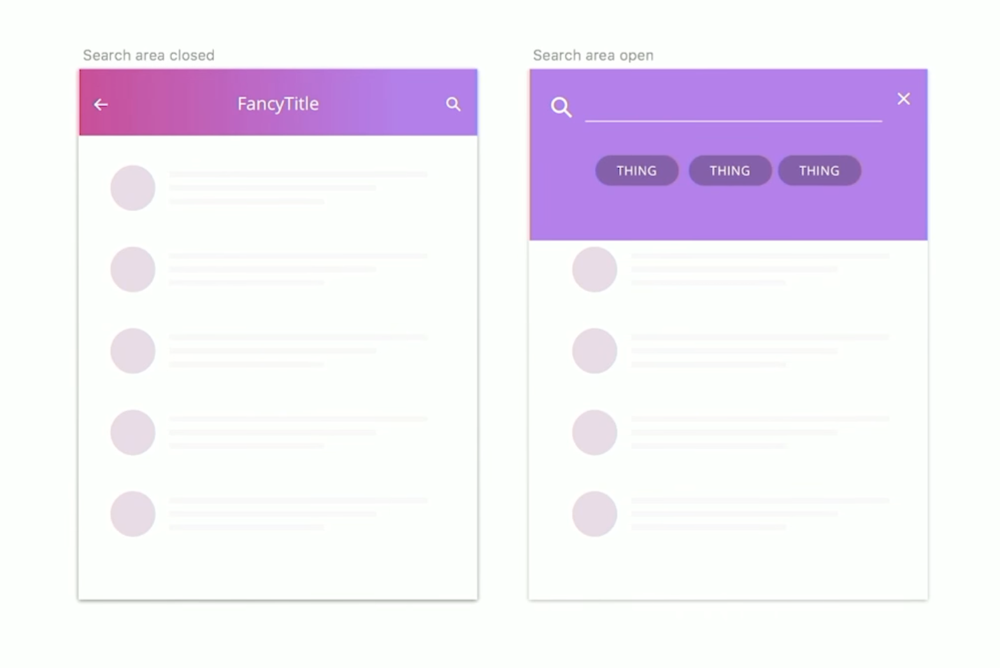

::: {.notes}
You could hand this to the developer and say "Animate this transition!" Instead, Val Head illustrates a motion comp of the transition in her video at [https://youtu.be/Itsg48crOjM](https://youtu.be/Itsg48crOjM).
:::

## Animation: Interactive Prototypes
- Allows the user to experience the trigger and the effect
- Gives the *feel* of the timing, not just the *look*
- Establishes context (e.g., bouncy, playful bank app)
- Following is archived but still available:
  - Intuit example [https://designsystem.quickbooks.com](https://designsystem.quickbooks.com) (go to Foundations > Motion)

# lofi

## All you need is here

# Ideation

## Day one of this course
- We used a storyboard sheet to ideate
- But we could consider the interview and brainstorming the list of needs as part of the ideate process---they certainly lead up to it
- In fact, we can do anything that will help us come up with ideas!
- [IDEO](https://www.designkit.org/methods) suggests a three step process: inspiration, ideation, implementation
- Under Ideate, they suggest many activities, including journey mapping, HMW, and rapid prototyping; we'll examine HMW

# HMW (how might we?)

## [〈pause for how might we video〉]{.r-fit-text}

::: {.notes}

source
[https://youtu.be/51SX9CpFBnc](https://youtu.be/51SX9CpFBnc)
:::

## IDEO Inspiration Examples
- [https://www.designkit.org/methods.html](https://www.designkit.org/methods.html)
- Brainstorm
- Interview
- How Might We

## The How Might We step
- Rephrase insight statements from previous step as questions by adding "How might we" at the beginning
- Look for design opportunities from these questions
- Make each question broad enough to allow a number of solutions, but narrow enough to be actionable

# Diverging and Converging

*The best way to have an idea is to have lots of ideas.*

::: {style="text-align: right"}
--- Linus Pauling
:::

## Why diverge then converge?
- You will not come up with a creative solution if you don't diverge
- You will not meet the deadline if you don't converge
- You must set a time limit for both processes

## How to diverge and converge
1. Ideate!
2. Implement ideas!

## A view from @Becker2020
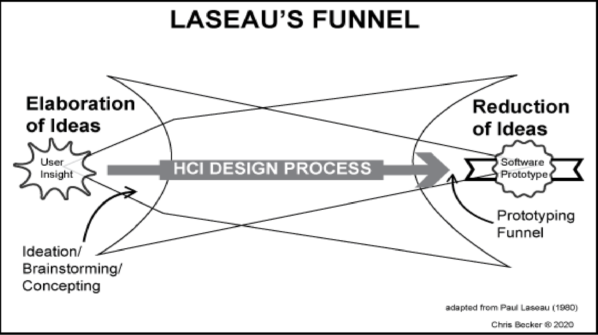

## A way to converge from @Becker2020
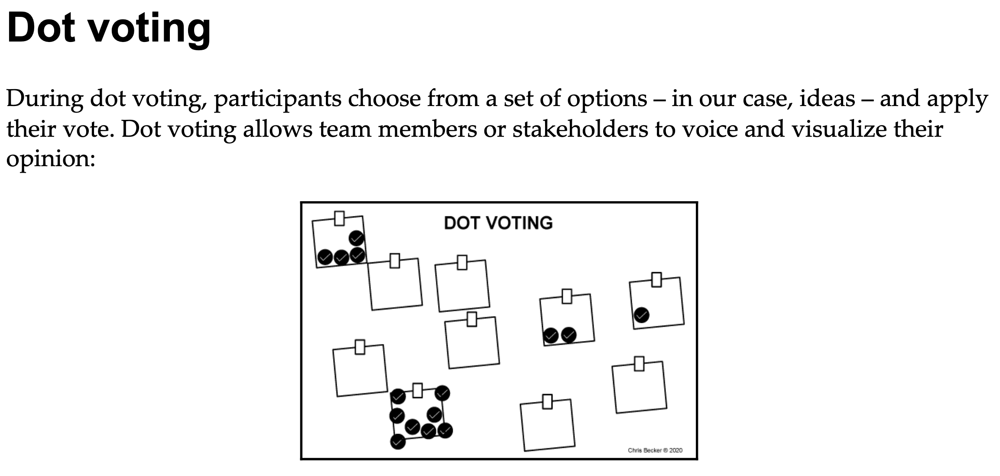

# Prototyping Levels

## lofi from @Buxton2007
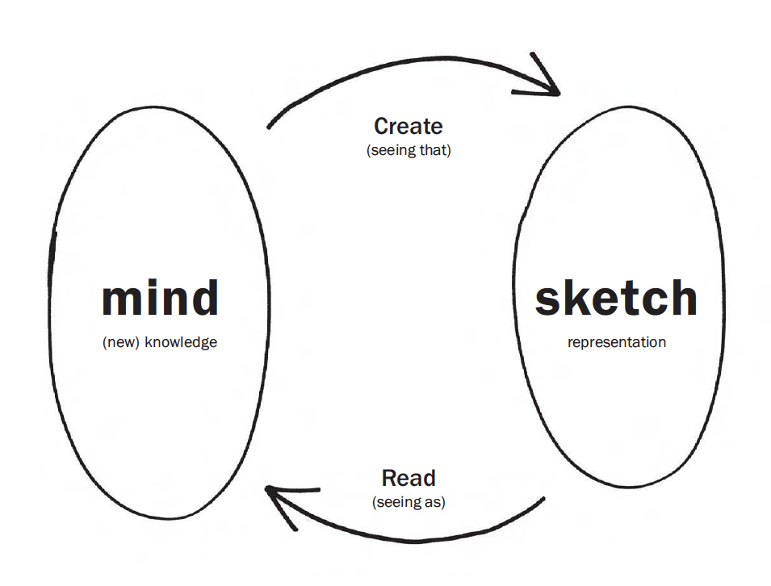

::: {.notes}
The “conversation” between the sketch (right bubble) and the mind (left
bubble). A sketch is created from current knowledge (top arrow). Reading,
or interpreting the resulting representation (bottom arrow), creates new
knowledge. The creation results from what @Goldschmidt1991 calls “seeing
that” reasoning, and the extraction of new knowledge results from what
she calls “seeing as.”
:::

##

*My drawings have been described as pre-intentionalist, meaning that they were finished before the
ideas for them had occurred to me. I shall not argue the point.*

::: {style="text-align: right"}
--- James Thurber
:::

## Sketching capabilities from @Buxton2007
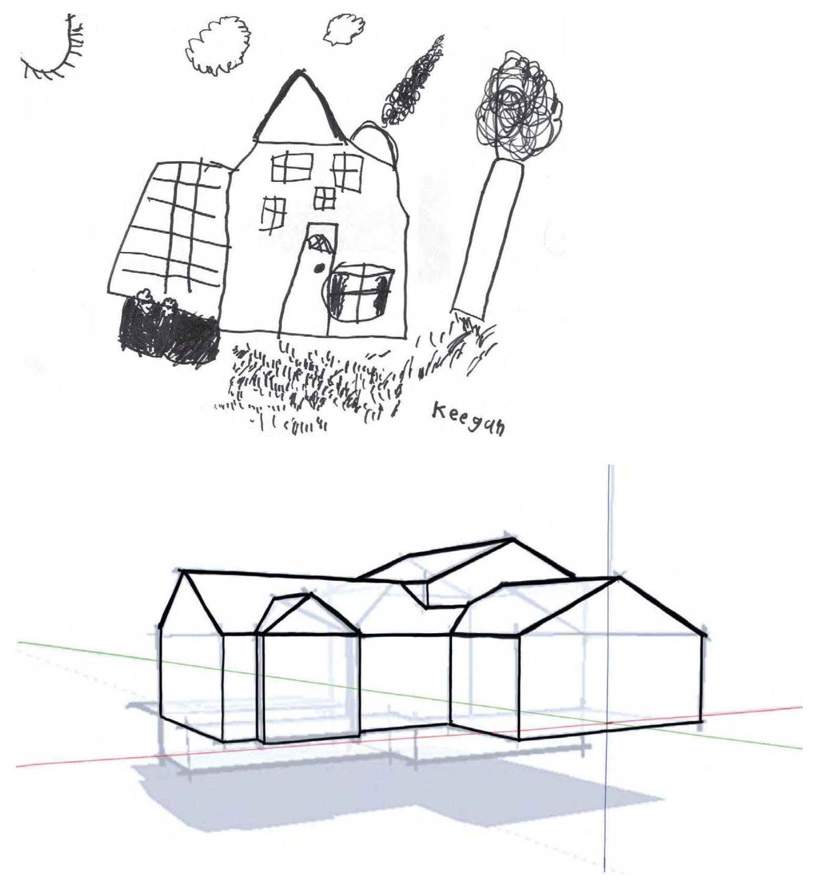

## lofi and hifi from @Buxton2007

## [Buxton Collection](https://www.microsoft.com/buxtoncollection)
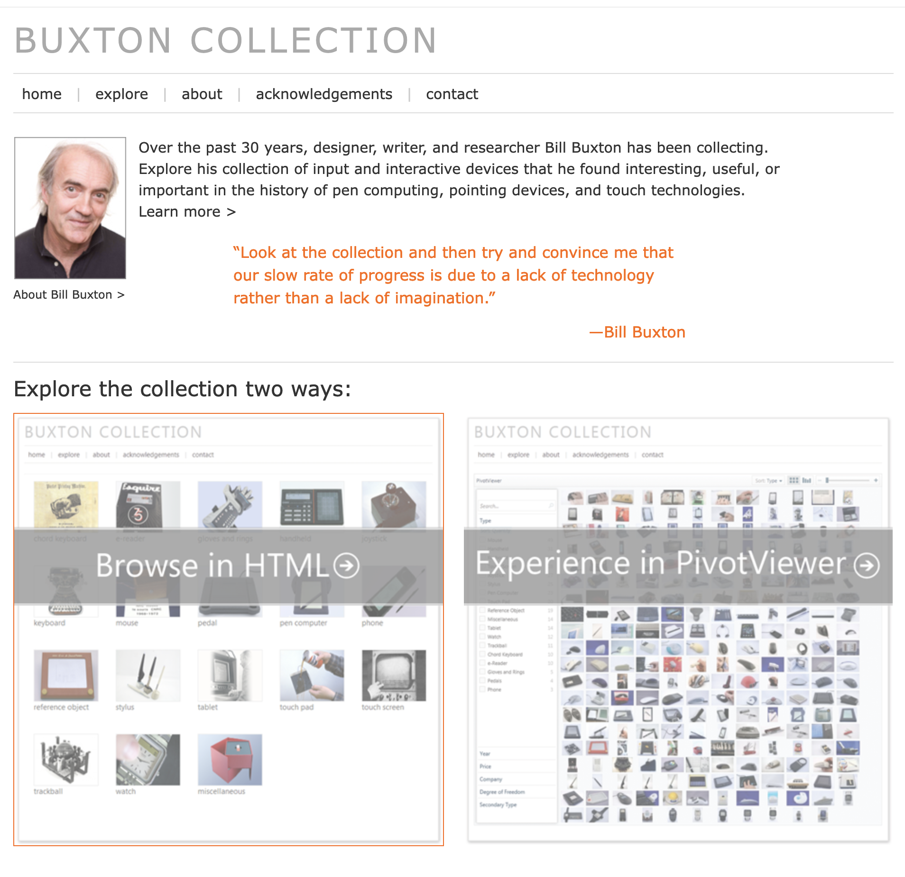

## Sometimes less is more: Femme

# System diagramming

## @Becker2020 view
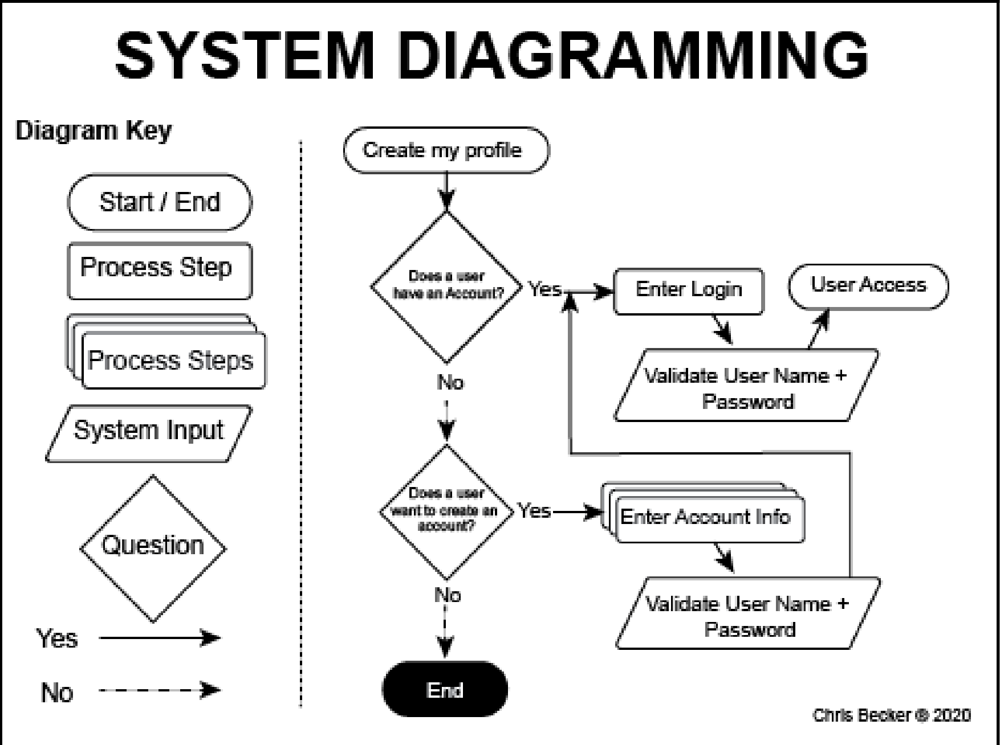

## Issues with system diagramming
- By the way, it's usually called flowcharting
- Goes in and out of fashion
- Main issue is that there is no standard symbol set
- Therefore any flowchart can mean anything
- Many developers are schooled in UML, may resist anything else
- UML has roughly nine very specific diagram types, standardized worldwide

# Story about learning (time permitting)
- The time, the place, the people, and the skills
- aka The time, the place, and the people
- concerns Daud Sahil (sahil means guide or leader in Hindi)

# [END]{.r-fit-text}

# References

::: {#refs}
:::

# Colophon

This slideshow was produced using `quarto`

Fonts are *Roboto*, *Roboto Light*, and *VictorMono Nerd Font*

