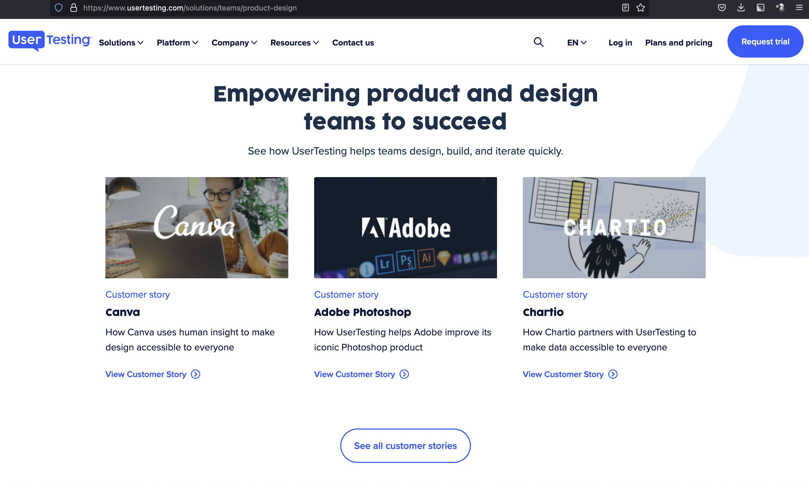
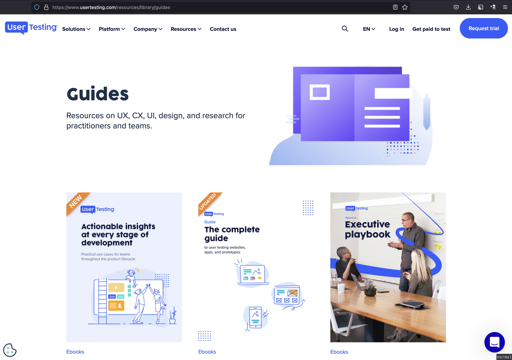
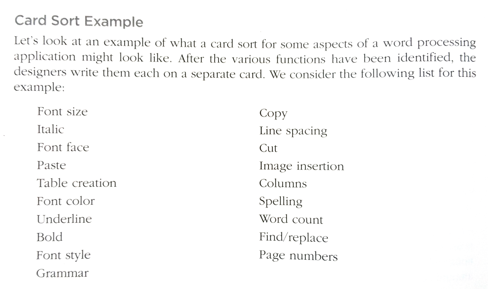
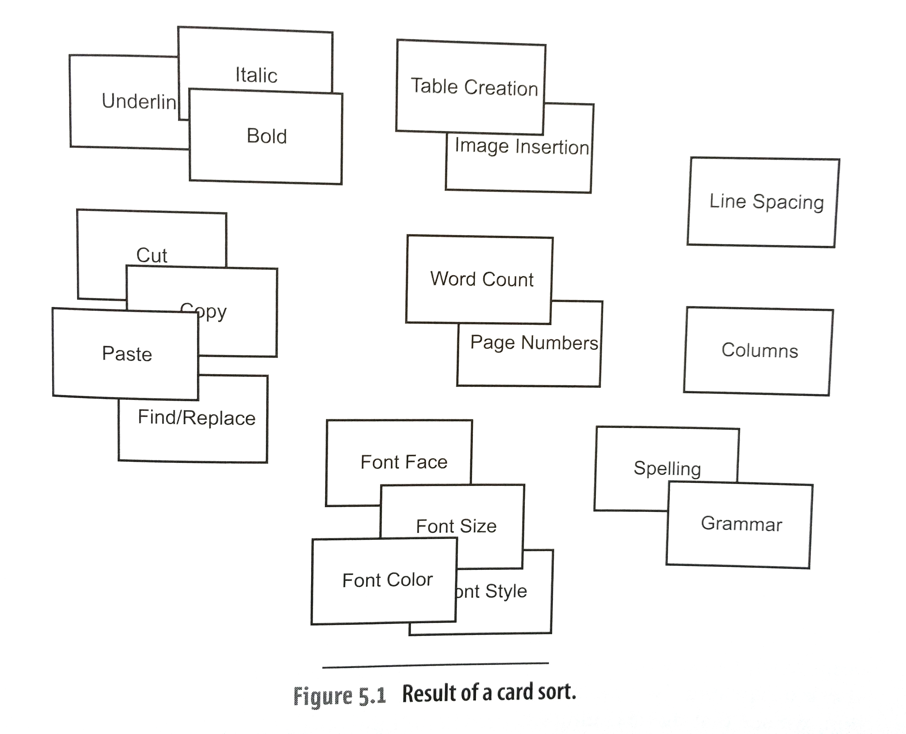
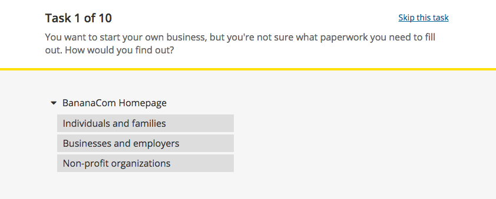
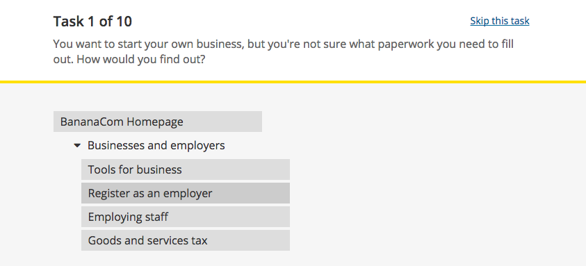
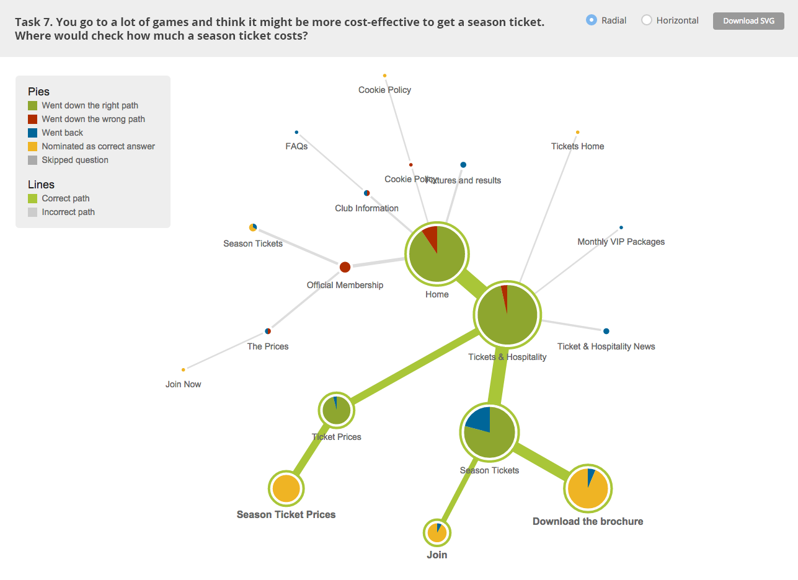
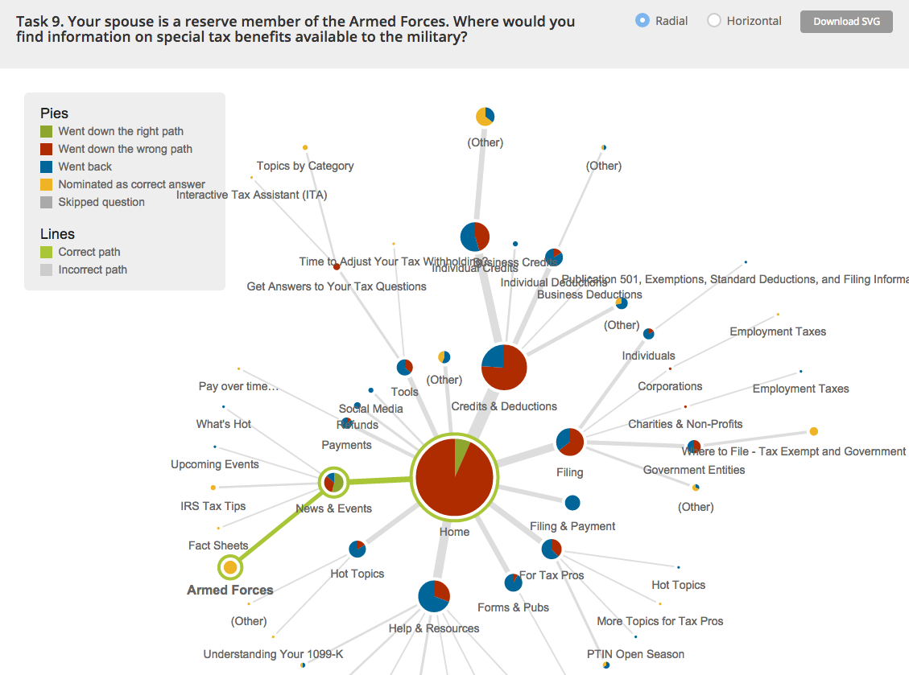
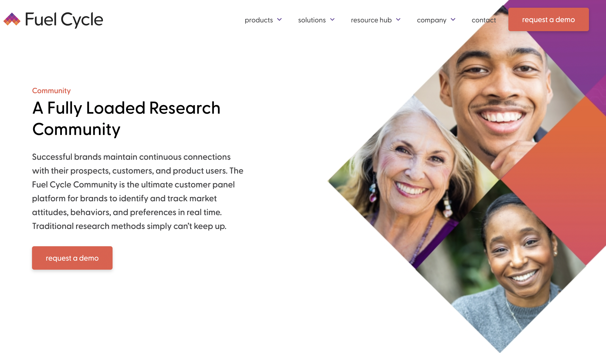

# [Week ELEVEN]{.r-fit-text}

# UserTesting Dot Com

I've applied for an academic program that will allow you to conduct one test on three users for free

::: {.notes}
I applied for this academic program:
[https://www.usertesting.com/company/programs-initiatives/education-partner-program](https://www.usertesting.com/company/programs-initiatives/education-partner-program)
:::

## UserTesting Testimonials

## UserTesting Guides

## Supported Testing
- Tasks
- Five-second test
- Verbal response
- Written response
- Multiple choice
- Rating scale
- Card sort
- Tree test

## Five second test
The five second test function will show the URL listed in the Starting URL field to your contributors for five seconds only. Afterward, we'll ask them three questions to recall their impressions and understanding of the page. (requires Google Chrome browser)

- What do you remember?
- What can you do on this site?
- Who's this site for?

## Card sorting example

## Card sorting example

## Tree testing with TreeJack

::: {.notes}
[https://www.optimalworkshop.com/learn/101s/tree-testing/](https://www.optimalworkshop.com/learn/101s/tree-testing/)
:::

## Tree testing input

## More tree testing input

## Tree testing output

## More tree testing output

## Still more tree testing output

# FuelCycle
*... claims to be an all-in-one solution for user research ...*

##

## User research according to FuelCycle
*Five steps*

::: {.notes}
This comes from the following URL
[https://fuelcycle.com/blog/what-is-user-research/](https://fuelcycle.com/blog/what-is-user-research/)
:::

## 1. Objectives

- Identify the knowledge gaps that need to be filled
- Identify the problems that need to be solved
- Specify over-all research goals

## 2. Hypotheses

- Identify what you understand about users
- Speculate outcomes

## 3. Methods

- Based on time and manpower, select the proper research methods
- Identify resources needed

## 4. Conduct

- Gather the research data utilizing the selected methods
- Thoroughly and accurately record the results

## 5. Synthesize

- Analyze the research outcomes and findings
- Use the analysis to fill in the knowledge gaps, prove or disprove our hypotheses, and recommend opportunities for UX design efforts.

# [END]{.r-fit-text}

# Colophon

This slideshow was produced using `quarto`

Fonts are *Roboto*, *Roboto Light*, and *Victor Mono Nerd Font*

