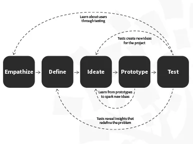
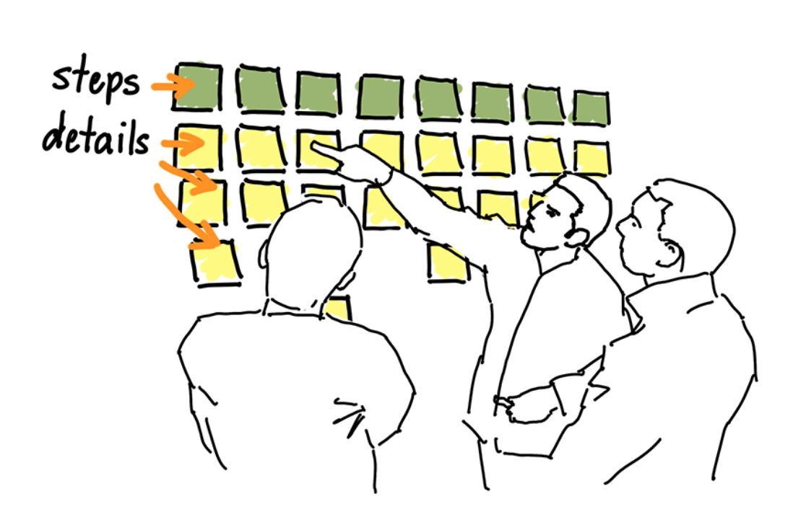
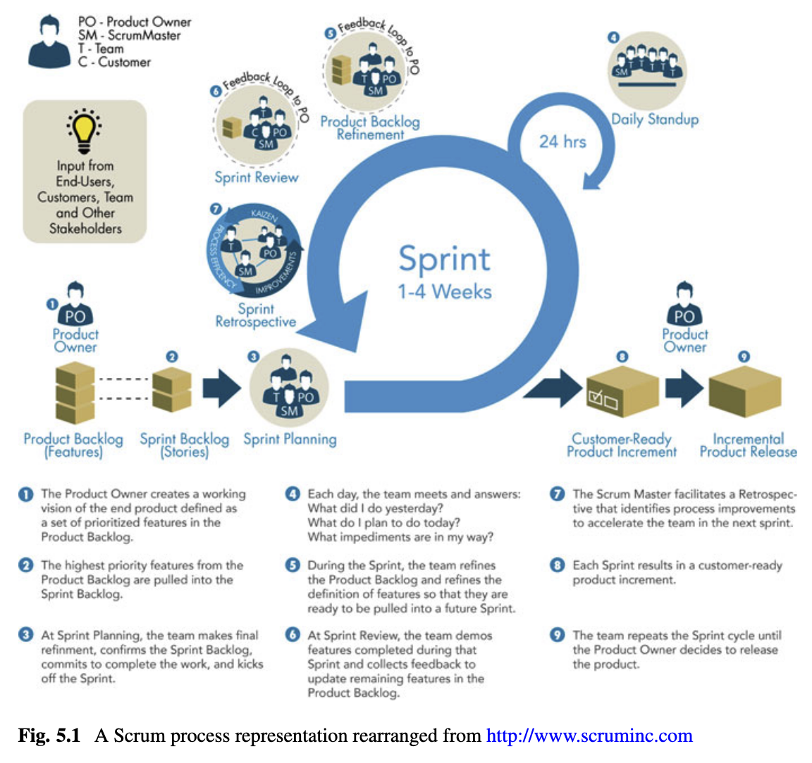
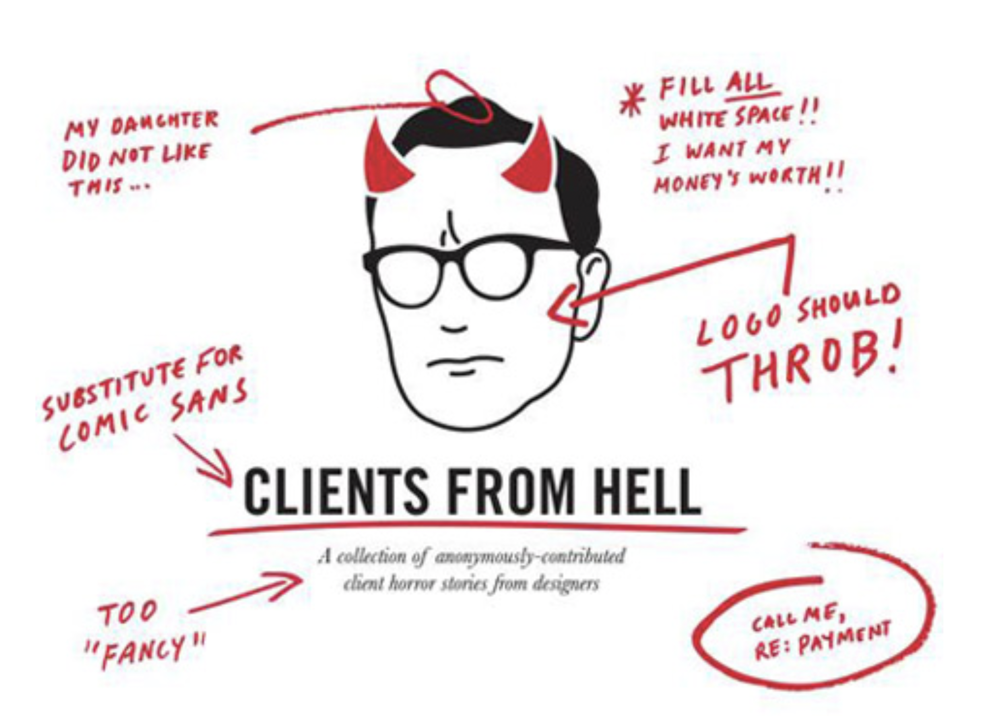
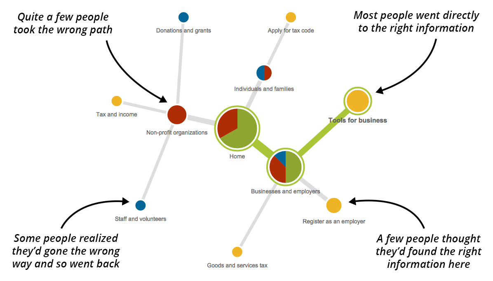
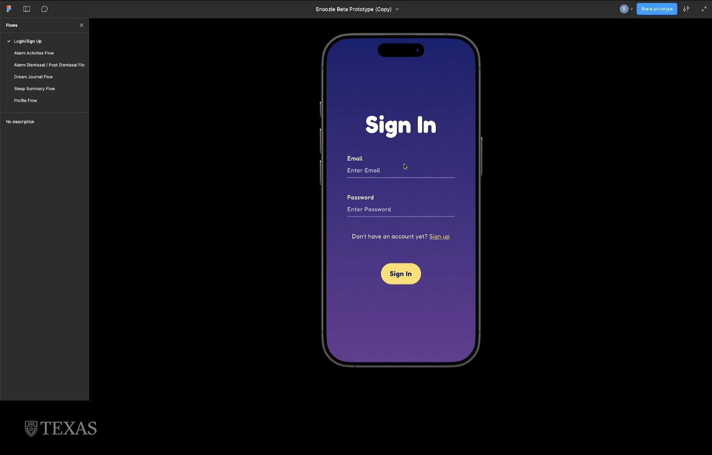
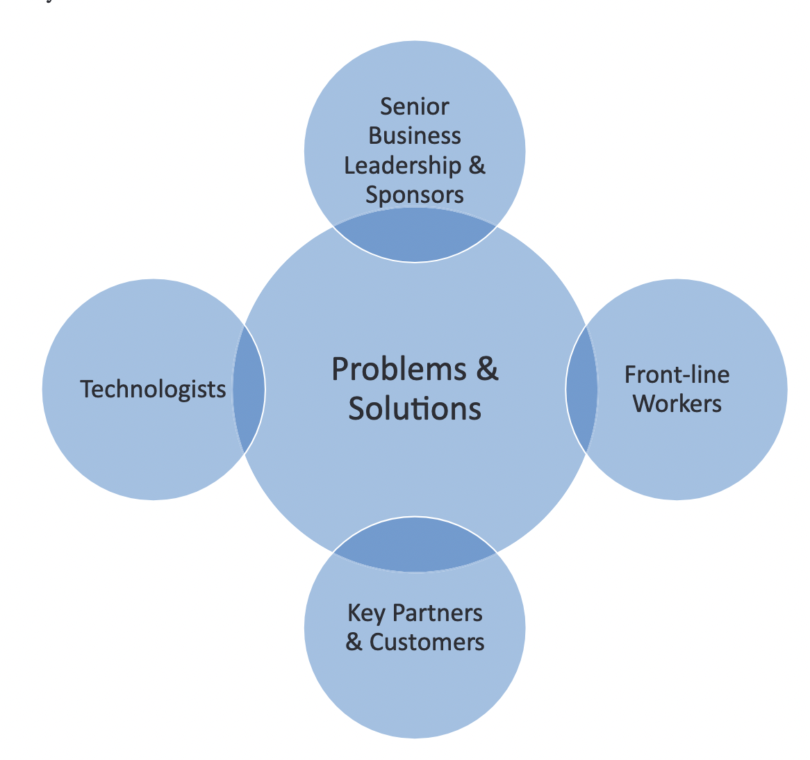

::: {.r-fit-text}
Week FOURTEEN
:::

# Design Thinking (Day One)

# Design Principles (Day Two)

- [Google Material 3](https://m3.material.io/)
- [Apple HIG](https://developer.apple.com/design/human-interface-guidelines)
- [Microsoft Fluent 2 Design Principles](https://fluent2.microsoft.design/design-principles)
- [Microsoft Inclusive Design](https://inclusive.microsoft.design/)

# Mood boards (Day Three)

# Story Mapping (Day Four)
@Patton2014a

# How Might We Stmts & Lofi (Day Five)
@Becker2020

# Prototyping Elements (Day Six)

# Agile (Day Seven)

# Clients (Day Eight)
@Greever2020

# Micro Interactions and Pair Designing (Day Nine)

# Formative & Summative Testing (Day Ten)

# More Testing (Day Eleven)

# Work in Progress (Day Twelve)

# Leading a Prototyping Workshop (Day Thirteen)
@Stackowiak2020

# Throughout the Course

- Constraints imposed by working with developers
- Projects that show work under constraints
- Issues of communication with developers
- Issues with blurred "chain of command"
- Note a current article in *Interactions* about this---@Kolko2025

# [END]{.r-fit-text}

# References

::: {#refs}
:::

# Colophon

This slideshow was produced using `quarto`

Fonts are *Roboto*, *Roboto Light*, and *Victor Mono Nerd Font*

