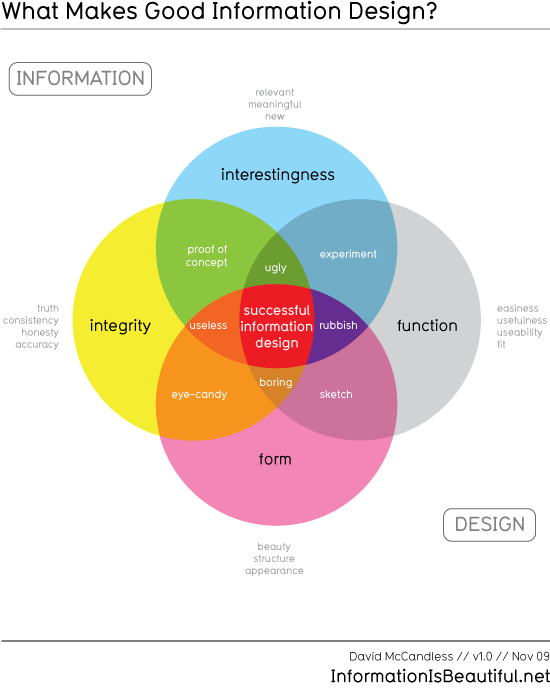
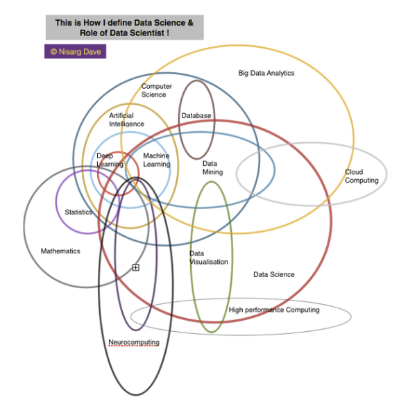
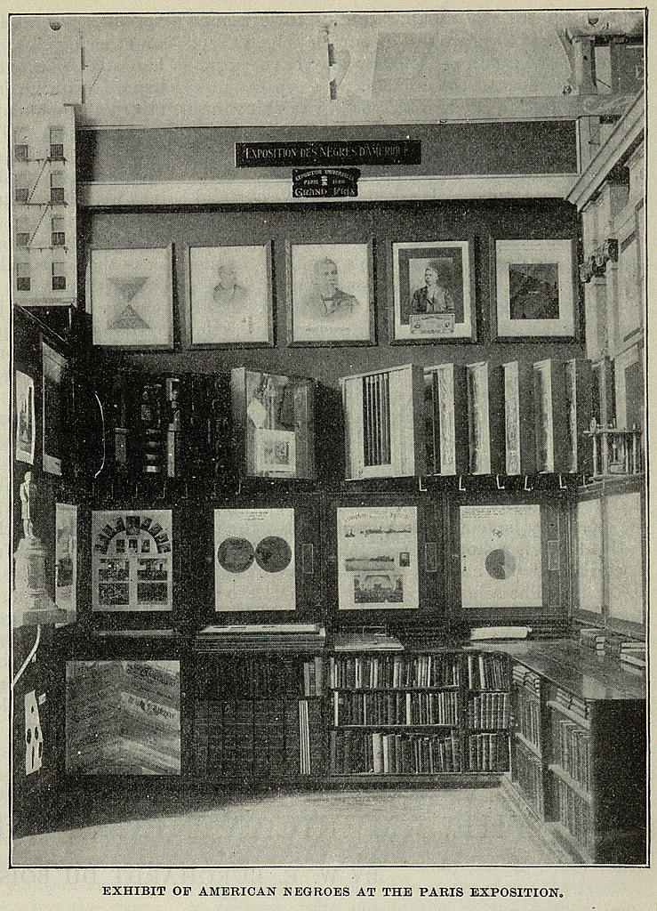
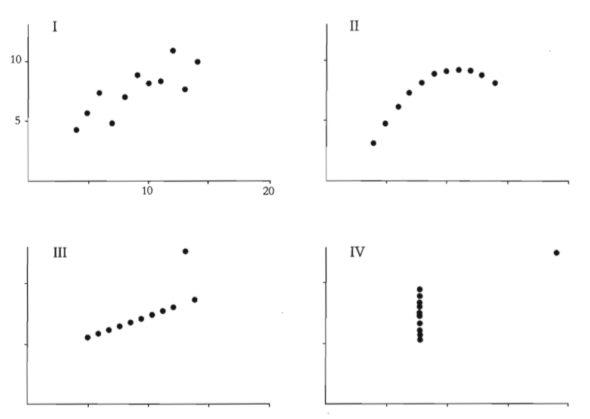
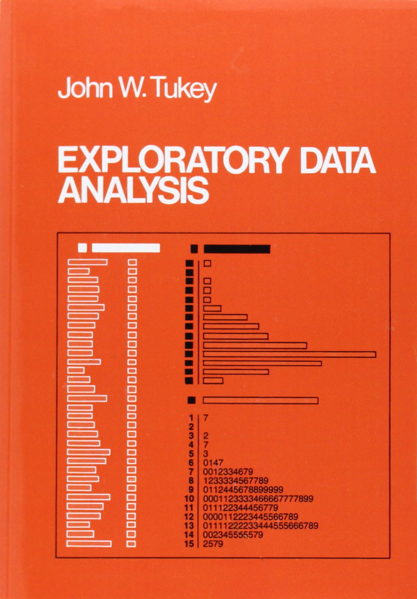
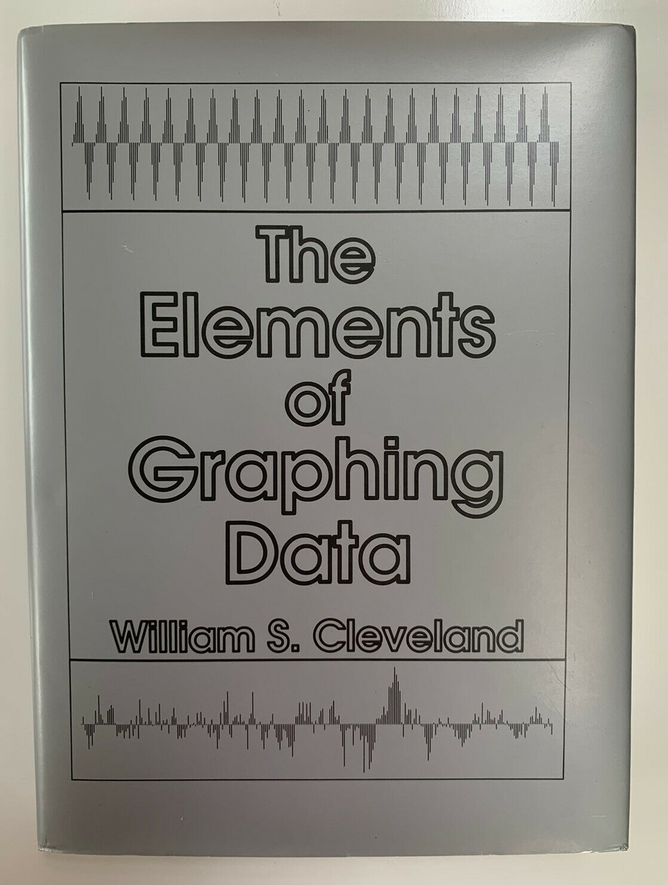
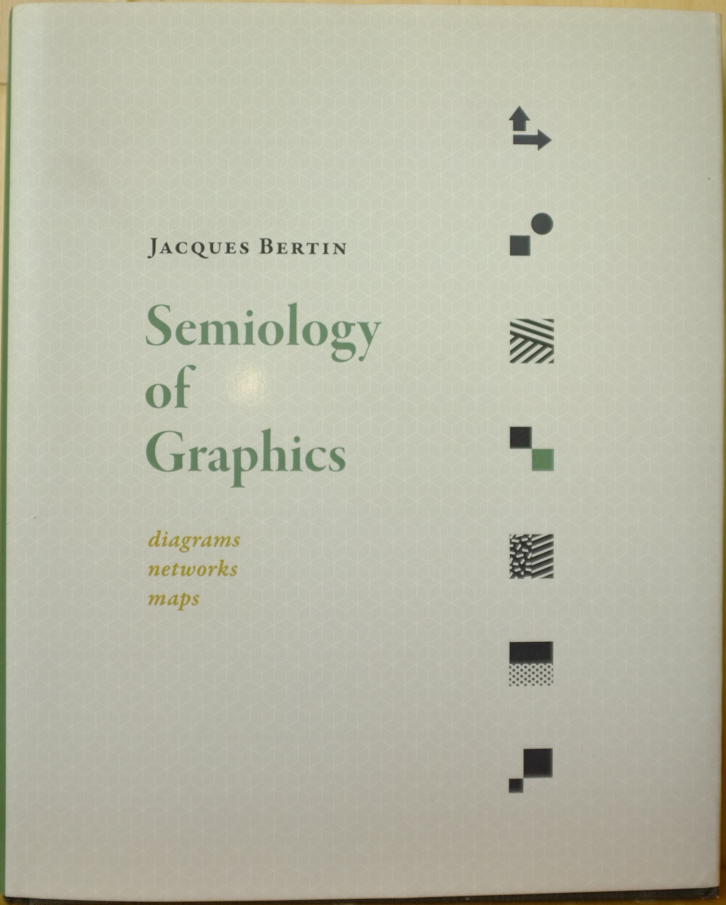
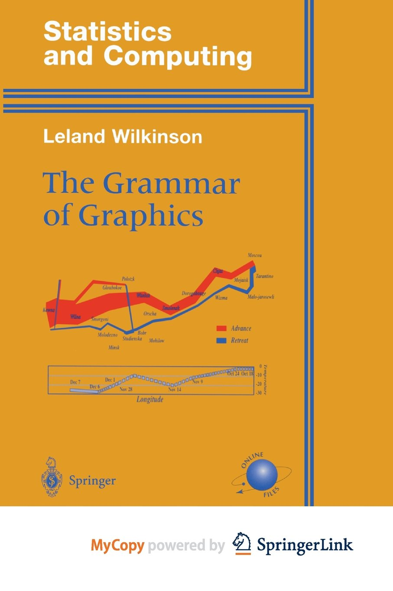
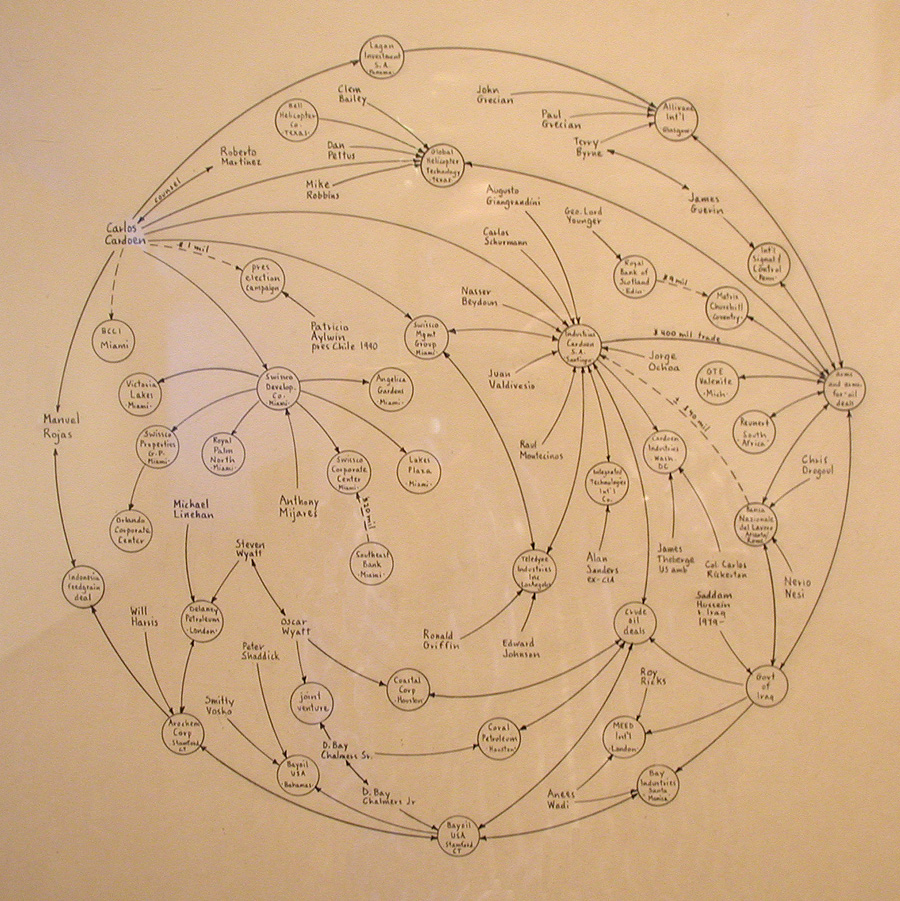

# abstract
<small>
In this talk, I will describe data visualization from three perspectives: historical, theoretical, and software implementation.
I will review the history of data visualization,
starting with Enlightenment practitioners and concluding with today's data scientists.
I will review some theories of data visualization,
emphasizing Jacques Bertin, Leland Wilkinson, and Hadley Wickham.
I will review the software history of data visualization,
emphasizing the software used by data scientists today.
Finally, I will mention the main venues for data visualization today in popular media and scientific literature.
After the talk, I will ask attendees to create a quick data visualization using Tableau.
</small>

# But first ...

## How should we talk about viz?
- catalog?
- definitions?
- history?
- theory?
- implementations?

# Catalog is popular
- show some successful visualizations
- try to group them according to some random visible attribute

## Catalog example: cartogram

::: notes
Source: [https://worldmapper.org](https://worldmapper.org)

This is an appealing cartogram designed by Mark E. J. Newman. It shows area of countries distorted to be proportional to population. Newman created a popular coffee table book of these in 2006. One was featured on the cover of the NY Times. They are clearly targeted at a general, but somewhat geoliterate, audience.
:::

## Another: a chord diagram of programming languages
{ width=55% }

::: notes
Source: TIOBE Index (Nov 2019)

TIOBE produces a great many visualizations about the popularity of programming languages in various contexts. This particular one reminds us that the most performant language for scientific programming is still C, but that scientists prefer to program in R when performance is not an issue. Of course, I needed to have some external knowledge to make that inference from the displayed information. This at least tells us that a visualization is for a particular audience. Note the abbreviation LOC, a tip-off that the intended audience is software developers.
:::

##

::: {.container}
:::::: {.col}
Coiled bar chart of CO2 emissions
::::::
:::::: {.col}

::::::
:::

::: notes
Source: forgotten

This one works well on the printed page, but not so well on screen. It's a coiled bar chart, an excellent space-saving device, although it should probably be adapted to the display medium. The point is to show more bars than would be possible in a horizontal or vertical layout.
:::

## Bad visualizations in the catalog

::: notes
Source: many sources online

No catalog is complete without examples of bad visualization. Usually the presenter invites the audience to explain what is wrong. I try to limit such examples in my presentations because it is so easy to get things wrong and so hard to get things right. The exemplary *bad visualization* usually tells us very little except to organize our thinking into categories like color, area, metaphors, and, in this case, arithmetic.
:::

# Definitions

## Is this a data visualization?
{ width=42\% }

::: notes
Source: forgotten

When considering definitions of data visualization, I like to present a few images that represent a gray area between data visualization and related images. This one certainly provides information in a graphical format, but students usually resist calling it a data visualization. It may stimulate your thought processes to think about why.
:::

##

::: {.container}
:::::: {.col}
The world's tallest tree and two humans for scale
::::::
:::::: {.col}
{ width=55% }
::::::
:::

## Venn diagrams of data viz 1

::: notes
Source: [https://informationisbeautiful.net](https://informationisbeautiful.net)

Another way to define data viz is to put its components into a Venn diagram and try to figure out what it means to subtract each component.
:::

## Venn diagrams of data viz 2

::: notes
Source: [https://informationisbeautiful.net](https://informationisbeautiful.net)

David McCandless does a lot of visualizations, including many Venn diagrams with clues about data viz. This one is problematic, though. For example, it is tautological to say that information design without interestingness is boring.
:::

## Venn diagrams of data viz 3

::: notes
Source: Nisarg Dave

Another approach is to display Venn diagrams of the relationship of data visualization to other concepts. These abound on blogs and usually conflict with each other and, sometimes, with themselves.
:::

# History

## Pre-history:
Wait for Michael Friendly's and Denis York's book on the subject.

## Enlightenment

## Florence Nightingale

::: notes
Source: [https://commons.wikimedia.org/wiki/File:Nightingale-mortality.jpg](https://commons.wikimedia.org/wiki/File:Nightingale-mortality.jpg)
:::

## William Playfair

{ width=90% }

::: notes

Source: By William Playfair - Derivative of File:Playfair TimeSeries.png William Playfair&#039;s Time Series of Exports and Imports of Denmark and Norway, Public Domain, [https://commons.wikimedia.org/w/index.php?curid=12674977](https://commons.wikimedia.org/w/index.php?curid=12674977)

:::

## W.E.B. DuBois

{ width=50\% }

::: notes

W.E.B. DuBois drew this picture by hand and displayed it at the Exposition universelle in Paris in 1900. It shows a comparison of urban and rural population of African Americans in Goergia and was part of a series created by DuBois to showcase the progress of African Americans since Emancipation.

Source: [https://www.loc.gov/resource/ppmsca.33873/](https://www.loc.gov/resource/ppmsca.33873/)

:::

##

::: {.container}
:::::: {.col}
Context of preceding viz: photo of WEB DuBois exhibit, including diagrams, photos, and books
::::::
:::::: {.col}

::::::
:::

::: notes
The preceding picture was exhibited by WEB DuBois as part of this overall exhibit at the Paris Exposition mentioned previously.
:::

## Visualization in the 1950s: SAGE

::: notes
The US Government financed a gigantic interactive visualization system in the 1950s, called SAGE. It was devoted to detecting and visualization Russian missiles and bombers and distinguishing them from civilian airplanes and bird flocks.

The budget for SAGE was enormous and vast numbers of scientists of that era were enlisted in the effort. Yet it was secretive and little was ever published about the lessons learned from the project. Decades later, anthropologists interviewed some of the surviving scientists and pieced together what little is widely known about the project.

Believe it or not, each SAGE console had a built-in ashtray and cigarette lighter to relieve the stress of the operators, who had to be apprehensive of every blip on their screens.
:::

## Exploratory Data Analysis 1970s and 80s

- John W. Tukey
- William Cleveland
- Edward Tufte

::: notes

I'll speak briefly about each of these people in turn, but first ...

:::

## Anscombe's Quartet

::: notes

Here you see four data sets, identical in their summary statistics.

:::

## Anscombe's Quartet Visualized

{ width=80% }

::: notes

But how different they are when visualized, showing the power of outliers and nonlinear patterns to trick summary statistics and linear models.

:::

##

::: {.container}
:::::: {.col}
Cover of Tukey's 1977 book, *Exploratory Data Analysis*
::::::
:::::: {.col}

::::::
:::

##

::: {.container}
:::::: {.col}
Cover of Tufte's 1983 book, *Visual Display of Quantitative Information*
::::::
:::::: {.col}

::::::
:::

##

::: {.container}
:::::: {.col}
Dust Jacket of Cleveland's 1985 book, *Elements of Graphing Data*
::::::
:::::: {.col}

::::::
:::

## Information Visualization 1990s and early 2000s

- and its relationship to scientific visualization

##

::: notes
Source: Mick McQuaid's own conceptualization

In the late 1980s, scientists wanted grants to buy expensive Silicon Graphics computers to do interactive visualization. Lots of them got together at a seminal conference and posited the terms *Information Visualization* and *Scientific Visualization* for what they were doing. They wrote to the National Science Foundation that both groups needed high-speed graphics-intensive computers to do *interactive* visualization, as distinct from static graphics or other arrangements of information, such as tables. This picture is my interpretation of the relationships between the concepts in their seminal paper.

Their concepts were extremely popular in the 1990s and only ended when graphics cards, intended to play games such as Quake, became so cheap (around 1998) that high-speed, graphics-intensive computers were no longer out of reach of most scientists.
:::

## Network Science early 2000s

::: notes
Source: Lada Adamic

Network science earned public prominence in the early 2000s with visualizations like this one, which was featured on the front page of the NY Times. It shows the links between blue and red blogs and, in particular, shows that there are very few links from red to blue and vice versa. Closer examination shows that the red blogs are more polarized than the blue blogs by standard measures used in network science.
:::

## Web-based popular visualization early 2000s
- Processing
- D3
- New York Times

::: notes
I (Mick) interviewed a data visualization specialist at the NY Times in the mid-2000s who said that the Times had gained a great deal of sophistication about data visualization since going online. He claimed that new tools, such as Processing, a Java add-on, and D3, originally a JavaScript add-on, were making it possible to produce more sophisticated data visualizations at the same time as the NY Times audience was growing more sophisticated in its data visualization tastes.
:::

##

::: {.container}
:::::: {.col}
Visual Analytics, 2005&mdash;

Book cover of *Illuminating the Path* (2005)
::::::
:::::: {.col}

::::::
:::

::: notes
In the aftermath of September 11th, the US government decided to analyze intelligence failures and one of many efforts resulted in this book and a national spending program on visualization integrated into a comprehensive analytics platform. We're still seeing the echoes of this historic development today under the name visual analytics.
:::

# Theory

##

::: {.container}
:::::: {.col}
Cover of Jacques Bertin's book, *Semiology of Graphics*
::::::
:::::: {.col}

::::::
:::

##

::: {.container}
:::::: {.col}
Cover of Leland Wilkinson's book, *Grammar of Graphics*
::::::
:::::: {.col}

::::::
:::

##

::: {.container}
:::::: {.col}
Cover of Hadley WIckham's book, *ggplot2*
::::::
:::::: {.col}

::::::
:::

## Others
- Martin Wattenberg and Fernanda Viegas
- Jeffrey Heer

# Software

## What is the most popular software?

>- Wrong!
>- It is pen and paper!
>- Most visualizations have been hand-drawn
>- Next most popular is Photoshop, Illustrator, Draw, Paint, Procreate ...

##

::: {.container}
:::::: {.col}
Mark Lombardi's handdrawn visualizations have been exhibited in art museums
::::::
:::::: {.col}

::::::
:::

##

::: {.container}
:::::: {.col}
One of many attempts to automate Lombardi's visualizations
::::::
:::::: {.col}

::::::
:::

##

R running in the RStudio IDE

##

Python running in the RStudio IDE

## Tableau

::: notes

Tableau, founded by Pat Hanrahan, inspired the current generation of popular dataviz software. Pretty much every other package, such as PowerBI, Oracle OBIEE, and SAS Visual Analytics, are based on Tableau. Therefore we'll try Tableau next to see what the current crop of these tools looks like.
:::

## Others
- Tableau imitators, such as ...
- Oracle OBIEE
- Microsoft PowerBI
- SAS Visual Analytics

# END {.r-fit-text}

# COLOPHON

This slideshow was produced with reveal.js using the moon theme.

`pandoc` converted the source markdown to html.

The source is at the same URL as the presentation. Just say `index.md` instead of `index.html`

URL: [https://mickmcquaid.com/whirlwind](https://mickmcquaid.com/whirlwind)

email: mickmcquaid@gmail.com
